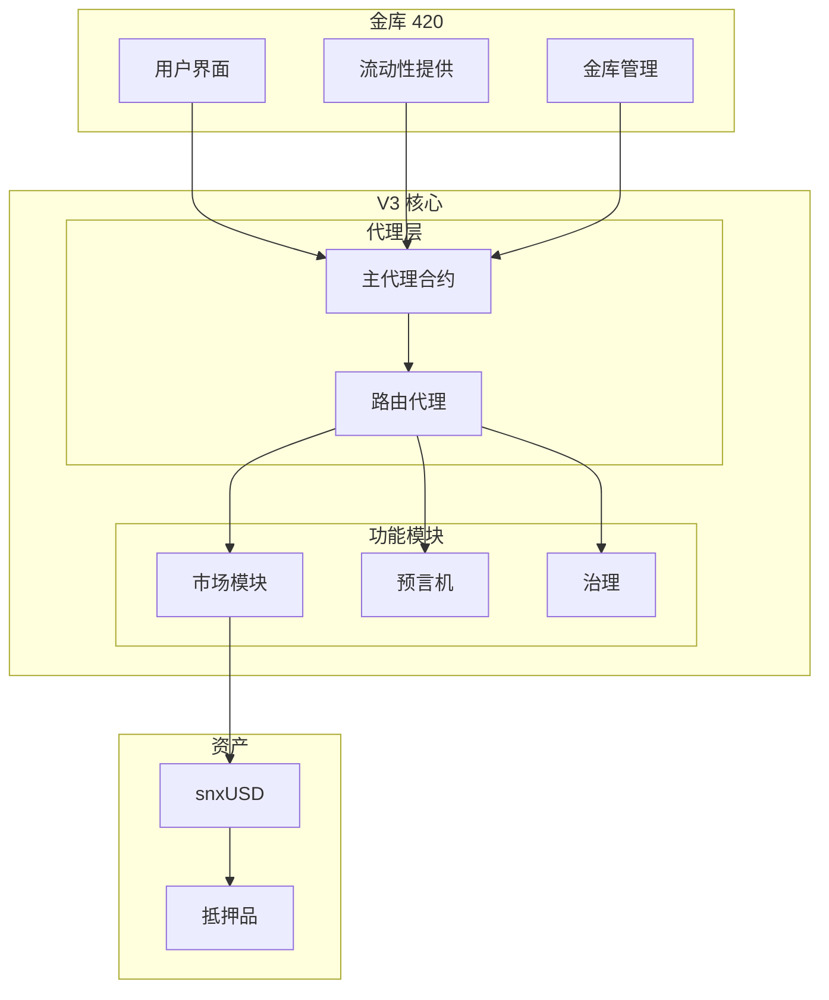
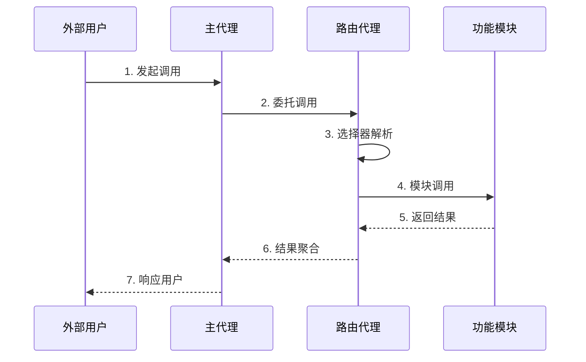
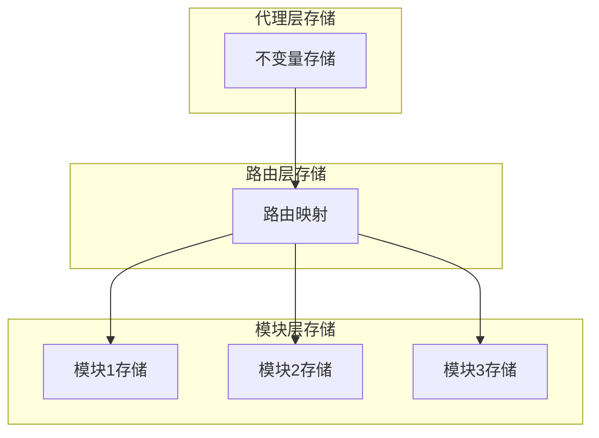

# Synthetix V3 架构概览

## 系统架构图

## 核心组件说明

### 代理层系统
- **主代理合约(MainProxy)**: 系统的统一入口点，负责代理所有外部调用
- **路由代理(Router)**: 核心路由逻辑，将调用分发到各个功能模块
  - 模块注册与管理
  - 函数选择器路由
  - 存储布局协调

### 金库(Vault)系统
- **用户界面(UI)**: 提供用户交互界面，包括存款、提款等操作
- **流动性提供(LP)**: 管理流动性提供者的存款和奖励
- **金库管理(VM)**: 负责金库参数配置和风险管理

### 功能模块系统
- **市场模块(Markets)**: 包含现货、永续等不同市场的具体实现
- **预言机(Oracle)**: 提供价格数据和其他市场数据
- **治理(Gov)**: 负责系统参数调整和升级决策

### 资产系统
- **snxUSD**: 系统稳定币，用于交易结算
- **抵押品**: 支持的抵押资产，用于铸造 snxUSD

## 系统特点

1. **模块化设计**
   - 各个组件高度解耦
   - 便于升级和维护
   - 支持灵活扩展

2. **代理架构**
   - 使用路由代理统一管理调用
   - 支持合约升级
   - 确保系统安全性
   - 优化存储布局
   - 简化调用路径

3. **多层次风险管理**
   - 金库层面的风险控制
   - 市场层面的风险参数
   - 系统层面的治理管控

4. **流动性优化**
   - LP 激励机制
   - 多样化的抵押品支持
   - 高效的价格发现机制

## 调用流程

## 存储架构

