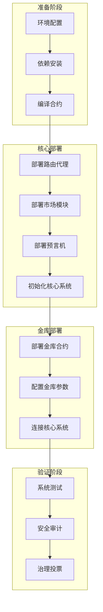

# Synthetix V3 部署流程分析

## 部署流程图



## 部署步骤详解

### 1. 准备阶段

- **环境配置**
  ```bash
  # 安装 foundry
  curl -L https://foundry.paradigm.xyz | bash
  foundryup
  
  # 设置环境变量
  export INFURA_KEY=your_key
  ```

- **依赖安装**
  ```bash
  yarn install
  yarn upgrade-contracts
  yarn dedupe
  ```

- **编译合约**
  ```bash
  yarn hardhat compile --force
  ```

### 2. 核心系统部署

1. **路由代理部署**
   - 部署代理合约
   - 设置初始参数
   - 配置访问权限

2. **市场模块部署**
   - 部署各类市场合约
   - 配置市场参数
   - 连接路由代理

3. **预言机部署**
   - 部署预言机合约
   - 配置数据源
   - 设置更新周期

### 3. 金库系统部署

1. **合约部署**
   - 部署金库合约
   - 设置初始参数
   - 配置权限系统

2. **参数配置**
   - 设置风险参数
   - 配置收益分配
   - 设置限额

3. **系统连接**
   - 连接路由代理
   - 配置市场访问
   - 设置预言机

### 4. 验证与上线

1. **系统测试**
   - 单元测试
   - 集成测试
   - 压力测试

2. **安全审计**
   - 代码审计
   - 漏洞扫描
   - 安全评估

3. **治理流程**
   - 提案投票
   - 参数确认
   - 正式上线

## 部署检查清单

1. **前置检查**
   - [ ] 环境变量配置完整
   - [ ] 依赖版本正确
   - [ ] 编译无错误

2. **部署检查**
   - [ ] 合约地址记录
   - [ ] 参数配置正确
   - [ ] 权限设置完整

3. **验证检查**
   - [ ] 功能测试通过
   - [ ] 安全审计完成
   - [ ] 治理投票通过

## 应急预案

1. **部署失败**
   - 回滚机制
   - 备份方案
   - 问题诊断

2. **参数错误**
   - 紧急暂停
   - 参数重置
   - 影响评估

3. **系统异常**
   - 应急响应
   - 修复流程
   - 复盘总结 