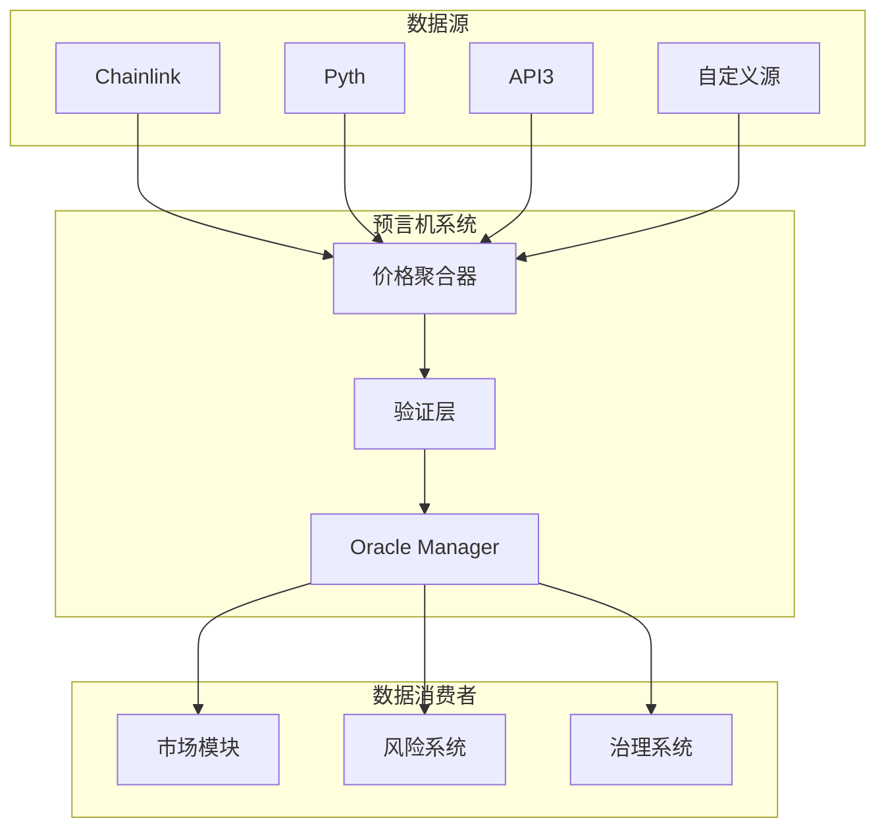
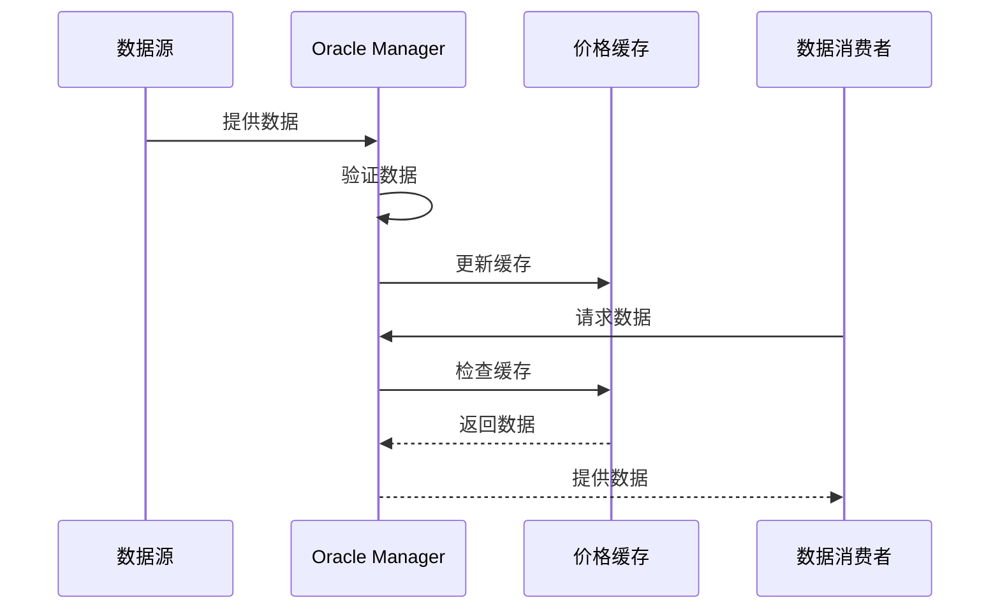
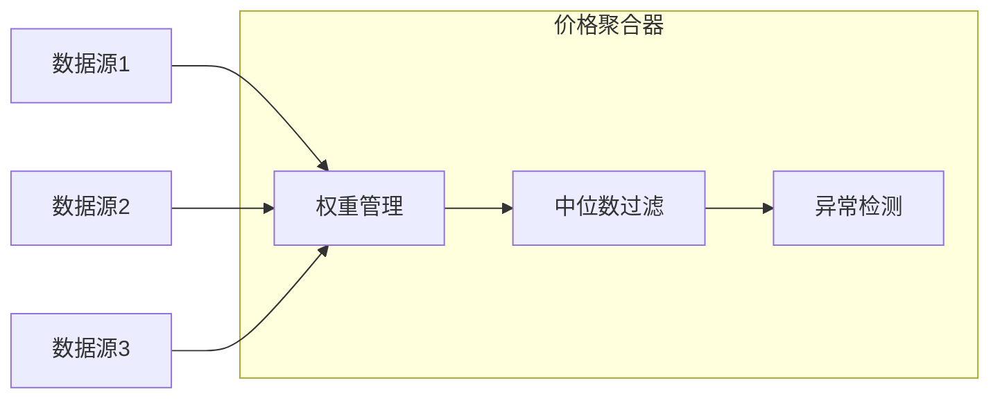
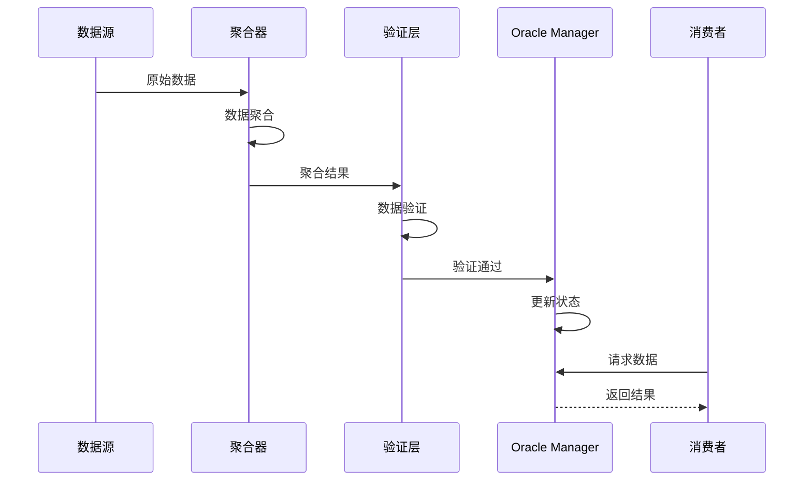
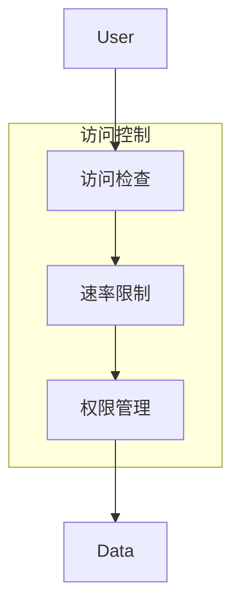
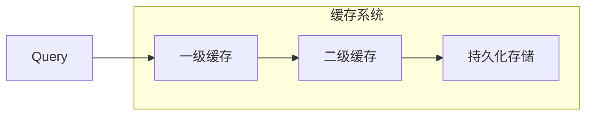
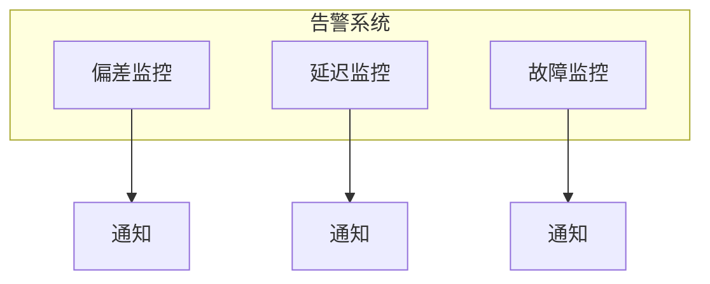

# Synthetix V3 预言机系统分析

## 预言机架构

## 核心组件

### 1. Oracle Manager

- **功能职责**
  - 数据源管理
  - 价格更新控制
  - 访问权限管理
  - 数据质量保证

### 2. 价格聚合器

- **聚合策略**
  - 加权平均
  - 中位数过滤
  - 异常值剔除
  - 时间加权

### 3. 验证层

- **验证机制**
  - 数据有效性检查
  - 时间戳验证
  - 签名验证
  - 阈值检查

## 数据流程

## 安全机制

### 1. 数据保护

- **防篡改措施**
  - 多重签名
  - 时间锁定
  - 阈值验证

- **异常处理**
  - 价格偏差检测
  - 更新频率控制
  - 备份机制

### 2. 访问控制

## 性能优化

### 1. 缓存策略

- **多级缓存**
  - 内存缓存
  - 状态缓存
  - 持久化存储

### 2. Gas 优化

- **更新策略**
  - 批量更新
  - 延迟写入
  - 按需更新

## 监控与维护

### 1. 系统监控

- **监控指标**
  - 数据延迟
  - 更新频率
  - 价格偏差
  - 系统负载

### 2. 告警机制

## 与其他模块的集成

### 1. 市场集成

- **价格供给**
  - 实时价格更新
  - 历史价格查询
  - 价格预测支持

### 2. 风险管理

- **风险控制**
  - 价格波动监控
  - 清算触发支持
  - 风险评估数据

### 3. 治理支持

- **参数管理**
  - 预言机参数调整
  - 数据源管理
  - 权限配置 