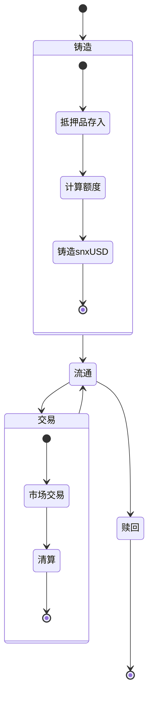

# snxUSD 机制分析

## snxUSD 生命周期

## 核心机制

### 1. 铸造机制

- **抵押率要求**
  - 最低抵押率设定
  - 目标抵押率维护
  - 动态调整机制

- **铸造限制**
  - 全局债务上限
  - 个人铸造上限
  - 市场容量限制

### 2. 稳定机制

- **价格稳定**
  - 抵押品组合管理
  - 清算机制触发
  - 套利机会

- **供需平衡**
  - 铸造费率调节
  - 赎回费率调节
  - 激励机制设计

### 3. 清算机制

- **触发条件**
  - 抵押率阈值
  - 价格波动监控
  - 市场条件判断

- **清算流程**
  - 清算人选择
  - 清算奖励分配
  - 债务处理方式

## 风险控制

1. **系统性风险**
   - 抵押品价格暴跌
   - 市场流动性枯竭
   - 系统性清算风险

2. **操作风险**
   - 合约漏洞
   - 预言机失效
   - 参数配置错误

3. **市场风险**
   - 价格波动
   - 流动性不足
   - 套利风险

## 优化方向

1. **效率提升**
   - 优化铸造流程
   - 提高清算效率
   - 改进价格发现

2. **安全加强**
   - 多重预言机
   - 应急机制
   - 风险预警

3. **用户体验**
   - 简化操作流程
   - 降低门槛
   - 提供工具支持

## 与其他组件的关系

1. **与金库的关系**
   - 提供流动性
   - 管理抵押品
   - 执行清算

2. **与市场的关系**
   - 价格发现
   - 交易媒介
   - 清算支持

3. **与治理的关系**
   - 参数调整
   - 风险控制
   - 升级决策 