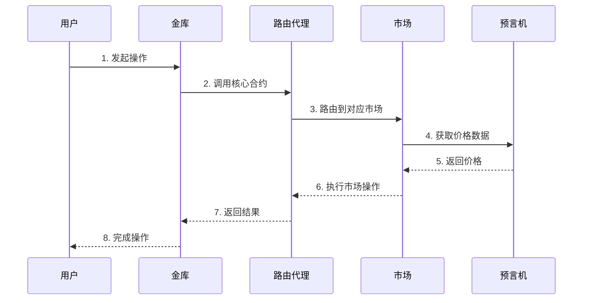

# 金库与核心代码交互分析

## 交互流程图

## 关键交互点分析

### 1. 金库到路由代理

金库系统通过以下方式与核心系统交互:

- **初始化连接**
  - 验证路由代理地址
  - 建立合约调用权限
  - 设置交互参数

- **状态同步**
  - 定期同步市场数据
  - 更新金库参数
  - 处理异常情况

### 2. 路由代理到市场

路由代理负责:

- **请求分发**
  - 识别目标市场
  - 验证调用权限
  - 转发操作请求

- **结果聚合**
  - 收集市场响应
  - 处理错误情况
  - 返回统一格式

### 3. 市场到预言机

市场模块需要:

- **价格查询**
  - 获取实时价格
  - 验证价格有效性
  - 应用价格更新

- **数据验证**
  - 检查数据时效性
  - 验证数据来源
  - 处理数据异常

## 交互安全机制

1. **权限控制**
   - 角色基础访问控制
   - 操作权限分级
   - 紧急暂停机制

2. **数据验证**
   - 输入参数检查
   - 状态一致性验证
   - 结果合理性校验

3. **错误处理**
   - 异常情况捕获
   - 回滚机制
   - 日志记录

## 优化建议

1. **性能优化**
   - 批量处理请求
   - 缓存常用数据
   - 优化调用路径

2. **可靠性提升**
   - 增加重试机制
   - 完善监控系统
   - 优化错误处理

3. **扩展性改进**
   - 标准化接口
   - 模块化设计
   - 预留扩展点 