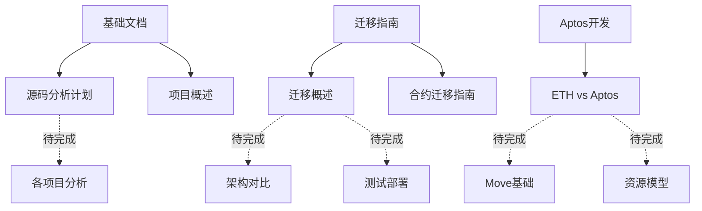

# Triplex Protocol 开发文档索引

## 已完成文档

### 基础文档
- [README.md](./README.md) - 项目概述和文档导航
- [源码分析计划](../TriplexWorkSpace/todolist.md) - 源码分析计划和项目索引

### 迁移指南
- [ETH到Aptos迁移概述](./migration/overview.md) - 迁移背景、原因和挑战
- [合约迁移指南](./migration/contract-migration.md) - Solidity到Move的代码迁移详细指南

### Aptos开发资源
- [Aptos与以太坊开发差异](./aptos/eth-vs-aptos.md) - 两个区块链平台的详细对比

## 下一步计划

1. **完成架构对比文档**
   - 创建 `migration/architecture-comparison.md`
   - 详细对比Synthetix V3和Triplex的架构差异
   - 包含核心组件架构图和数据流图

2. **完成测试和部署流程文档**
   - 创建 `migration/testing-deployment.md`
   - 说明在Aptos上的测试策略和方法
   - 包含部署流程和管理方法

3. **完成Move编程基础文档**
   - 创建 `aptos/move-basics.md`
   - 提供Move语言的基础语法和概念
   - 包含常见模式和最佳实践

4. **完成Aptos资源模型文档**
   - 创建 `aptos/resource-model.md`
   - 深入解释Aptos的资源模型
   - 包含资源设计模式和能力系统

## 核心模块文档计划

按照优先级，我们将创建以下核心模块文档：

1. **核心协议**
   - 创建 `modules/core.md`
   - 分析核心协议的实现和设计
   - 资源模型和接口设计

2. **流动性池**
   - 创建 `modules/liquidity.md`
   - 分析流动性池的实现和优化
   - AMM机制和激励模型

3. **预言机集成**
   - 创建 `modules/oracles.md`
   - 分析预言机的集成方式
   - 价格数据处理和验证机制

4. **保险库系统**
   - 创建 `modules/vaults.md`
   - 分析保险库的实现和管理
   - 抵押和收益分配机制

5. **自动化系统**
   - 创建 `modules/keepers.md`
   - 分析自动化维护系统
   - 清算和更新机制

## API文档计划

接下来我们将创建以下API文档：

1. **SDK使用指南**
   - 创建 `api/sdk-guide.md`
   - 与Aptos交互的SDK使用方法
   - 常见操作和示例代码

2. **API参考**
   - 创建 `api/reference.md`
   - 核心API接口和参数说明
   - 错误处理和响应格式

3. **示例应用**
   - 创建 `api/examples.md`
   - 完整的示例应用和交互示例
   - 集成最佳实践

## 开发工具和实用程序计划

最后，我们将创建以下工具文档：

1. **开发工具**
   - 创建 `tools/dev-tools.md`
   - 开发环境设置和工具介绍
   - 调试和测试工具

2. **调试技巧**
   - 创建 `tools/debugging.md`
   - Move和Aptos调试方法和技巧
   - 常见问题排查

3. **监控和分析**
   - 创建 `tools/monitoring.md`
   - 系统性能监控和分析
   - 健康检查和警报设置 