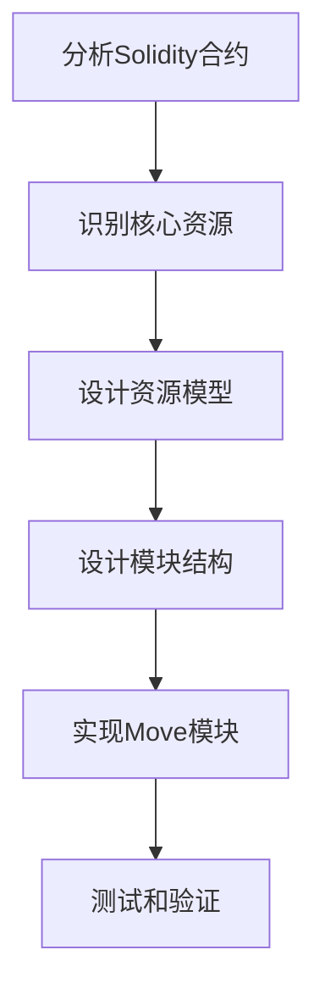

# Solidity到Move的合约迁移指南

本指南提供从Solidity到Move的代码迁移详细说明，包含具体示例和最佳实践。

## 迁移思路

将以太坊上的Solidity合约迁移到Aptos上的Move模块不仅仅是代码翻译，而是需要重新思考应用架构，充分利用Move语言和Aptos区块链的特性。



### 迁移前准备

1. **深入理解原合约**
   - 功能和业务逻辑
   - 数据结构和状态管理
   - 访问控制和权限

2. **识别核心资源**
   - 哪些是关键资产或状态
   - 资产的所有权和转移规则
   - 数据依赖关系

3. **熟悉Move范式**
   - 资源模型vs账户模型
   - 模块化设计
   - 能力系统

## 基本数据类型对应关系

| Solidity类型 | Move类型 | 注意事项 |
|--------------|----------|---------|
| uint8, uint16 | u8, u16 | Move有固定大小的整数类型 |
| uint32, uint64 | u32, u64 | 使用适当的大小类型 |
| uint128, uint256 | u128, u256 | u256是Aptos扩展 |
| int8, int16, etc. | 无内置有符号类型 | 需自行实现有符号逻辑 |
| address | address | 固定大小，但用法不同 |
| bool | bool | 用法相似 |
| string | vector<u8> | Move没有原生字符串类型 |
| bytes, bytes32 | vector<u8> | 动态或固定大小的字节数组 |
| mapping | 表结构或向量 | 需重新设计映射结构 |
| struct | struct | Move的结构体有能力约束 |
| enum | 常量或自定义类型 | Move没有原生枚举类型 |

## 合约核心组件迁移

### 1. 状态变量迁移到资源

**Solidity合约中的状态变量**:
```solidity
contract TokenContract {
    string public name;
    string public symbol;
    uint8 public decimals;
    uint256 public totalSupply;
    mapping(address => uint256) public balances;
    mapping(address => mapping(address => uint256)) public allowances;
    
    address public owner;
}
```

**转换为Move资源**:
```move
module token {
    struct TokenInfo has key {
        name: vector<u8>,
        symbol: vector<u8>,
        decimals: u8,
        total_supply: u128,
    }
    
    struct Balance has key {
        value: u64,
    }
    
    struct Allowance has key {
        amount: u64,
    }
    
    struct OwnerCapability has key {
        // 空结构，只用于表示所有权
    }
}
```

**关键区别**:
- 状态被分解为多个资源类型
- 映射转为每个账户下的资源
- 使用能力标记控制资源使用方式

### 2. 函数迁移到模块函数

**Solidity函数**:
```solidity
function transfer(address to, uint256 amount) public returns (bool) {
    require(balances[msg.sender] >= amount, "Insufficient balance");
    balances[msg.sender] -= amount;
    balances[to] += amount;
    emit Transfer(msg.sender, to, amount);
    return true;
}
```

**Move函数**:
```move
public fun transfer(from: &signer, to: address, amount: u64) acquires Balance {
    let from_addr = std::signer::address_of(from);
    
    // 检查余额
    assert!(exists<Balance>(from_addr), 1); // 错误码1: 发送者无余额资源
    let from_balance = borrow_global_mut<Balance>(from_addr);
    assert!(from_balance.value >= amount, 2); // 错误码2: 余额不足
    
    // 减少发送者余额
    from_balance.value = from_balance.value - amount;
    
    // 增加接收者余额
    if (!exists<Balance>(to)) {
        move_to(to, Balance { value: 0 });
    };
    let to_balance = borrow_global_mut<Balance>(to);
    to_balance.value = to_balance.value + amount;
    
    // 触发事件
    event::emit_event(
        Transfer { 
            from: from_addr, 
            to, 
            amount 
        }
    );
}
```

**关键区别**:
- 显式的签名者参数替代msg.sender
- 使用acquires标记访问的全局资源
- 使用断言替代require
- 显式检查资源存在性
- 使用全局存储操作

### 3. 事件迁移

**Solidity事件**:
```solidity
event Transfer(address indexed from, address indexed to, uint256 value);

function transfer(address to, uint256 amount) public returns (bool) {
    // ... 转账逻辑 ...
    emit Transfer(msg.sender, to, amount);
    return true;
}
```

**Move事件**:
```move
struct TransferEvent has drop, store {
    from: address,
    to: address,
    amount: u64,
}

struct EventHandle has key {
    transfer_events: event::EventHandle<TransferEvent>,
}

public fun initialize_events(account: &signer) {
    move_to(account, EventHandle {
        transfer_events: event::new_event_handle<TransferEvent>(account),
    });
}

public fun transfer(from: &signer, to: address, amount: u64) acquires Balance, EventHandle {
    // ... 转账逻辑 ...
    
    // 触发事件
    let from_addr = std::signer::address_of(from);
    let events = borrow_global_mut<EventHandle>(from_addr);
    event::emit_event(
        &mut events.transfer_events,
        TransferEvent { from: from_addr, to, amount }
    );
}
```

**关键区别**:
- 需要显式创建事件句柄
- 事件定义为结构体
- 事件句柄存储在账户资源中
- 事件发送需要事件句柄引用

### 4. 访问控制迁移

**Solidity访问控制**:
```solidity
contract Ownable {
    address public owner;
    
    constructor() {
        owner = msg.sender;
    }
    
    modifier onlyOwner() {
        require(owner == msg.sender, "Not owner");
        _;
    }
    
    function transferOwnership(address newOwner) public onlyOwner {
        require(newOwner != address(0), "Zero address");
        owner = newOwner;
    }
}
```

**Move访问控制**:
```move
module ownable {
    struct OwnerCapability has key, store {
        // 空结构，仅作为能力证明
    }
    
    public fun initialize(account: &signer) {
        // 只能初始化一次
        assert!(!exists<OwnerCapability>(std::signer::address_of(account)), 1);
        move_to(account, OwnerCapability {});
    }
    
    public fun assert_owner(account: &signer) acquires OwnerCapability {
        let addr = std::signer::address_of(account);
        assert!(exists<OwnerCapability>(addr), 2);
    }
    
    public fun transfer_ownership(
        owner: &signer, 
        new_owner: &signer
    ) acquires OwnerCapability {
        // 验证当前所有者
        assert_owner(owner);
        
        // 转移所有权
        let old_owner_addr = std::signer::address_of(owner);
        let new_owner_addr = std::signer::address_of(new_owner);
        
        let cap = move_from<OwnerCapability>(old_owner_addr);
        move_to(new_owner, cap);
    }
}
```

**关键区别**:
- 使用能力资源代替简单的地址比较
- 没有修饰符，使用辅助函数验证权限
- 显式移动所有权资源

### 5. 代理合约迁移

**Solidity代理模式**:
```solidity
contract Proxy {
    address public implementation;
    address public admin;
    
    constructor(address _implementation) {
        implementation = _implementation;
        admin = msg.sender;
    }
    
    function upgradeTo(address newImplementation) public {
        require(msg.sender == admin, "Only admin");
        implementation = newImplementation;
    }
    
    fallback() external payable {
        address impl = implementation;
        assembly {
            // 委托调用到实现合约
            let ptr := mload(0x40)
            calldatacopy(ptr, 0, calldatasize())
            let result := delegatecall(gas(), impl, ptr, calldatasize(), 0, 0)
            let size := returndatasize()
            returndatacopy(ptr, 0, size)
            
            switch result
            case 0 { revert(ptr, size) }
            default { return(ptr, size) }
        }
    }
}
```

**Move中的模块升级**:
```move
module upgradeable {
    use std::signer;
    
    struct UpgradeCapability has key, store {
        // 空结构，仅作为升级权限证明
    }
    
    public fun initialize(account: &signer) {
        move_to(account, UpgradeCapability {});
    }
    
    public fun assert_upgrade_capability(account: &signer) acquires UpgradeCapability {
        let addr = signer::address_of(account);
        assert!(exists<UpgradeCapability>(addr), 1);
    }
    
    // Move支持直接模块升级，不需要代理模式
    // 此函数在真实场景中不需要实现，由Aptos框架处理
    public fun upgrade_module(account: &signer, module_bytes: vector<u8>) acquires UpgradeCapability {
        assert_upgrade_capability(account);
        // 在真实场景中，使用Move VM提供的升级机制
        // 这里仅作为示例
    }
}
```

**关键区别**:
- Move原生支持模块升级，不需要代理模式
- 使用能力资源控制升级权限
- 没有fallback和委托调用机制
- 资源结构需要保持兼容性

## 常见模式迁移示例

### 1. ERC20 Token迁移

**Solidity ERC20**:
```solidity
contract ERC20 {
    string public name;
    string public symbol;
    uint8 public decimals;
    uint256 public totalSupply;
    
    mapping(address => uint256) public balanceOf;
    mapping(address => mapping(address => uint256)) public allowance;
    
    event Transfer(address indexed from, address indexed to, uint256 value);
    event Approval(address indexed owner, address indexed spender, uint256 value);
    
    constructor(string memory _name, string memory _symbol, uint8 _decimals) {
        name = _name;
        symbol = _symbol;
        decimals = _decimals;
    }
    
    function transfer(address to, uint256 amount) public returns (bool) {
        require(balanceOf[msg.sender] >= amount, "Insufficient balance");
        balanceOf[msg.sender] -= amount;
        balanceOf[to] += amount;
        emit Transfer(msg.sender, to, amount);
        return true;
    }
    
    function approve(address spender, uint256 amount) public returns (bool) {
        allowance[msg.sender][spender] = amount;
        emit Approval(msg.sender, spender, amount);
        return true;
    }
    
    function transferFrom(address from, address to, uint256 amount) public returns (bool) {
        require(allowance[from][msg.sender] >= amount, "Insufficient allowance");
        require(balanceOf[from] >= amount, "Insufficient balance");
        
        allowance[from][msg.sender] -= amount;
        balanceOf[from] -= amount;
        balanceOf[to] += amount;
        
        emit Transfer(from, to, amount);
        return true;
    }
}
```

**Move代币模块**:
```move
module coin {
    use std::string;
    use std::signer;
    use std::event;
    
    struct CoinInfo has key {
        name: string::String,
        symbol: string::String,
        decimals: u8,
        total_supply: u128,
    }
    
    struct CoinStore has key {
        balance: u64,
    }
    
    struct Allowance has key {
        spender: address,
        amount: u64,
    }
    
    struct AllowanceStore has key {
        allowances: vector<Allowance>,
    }
    
    struct TransferEvent has drop, store {
        from: address,
        to: address,
        amount: u64,
    }
    
    struct ApprovalEvent has drop, store {
        owner: address,
        spender: address,
        amount: u64,
    }
    
    struct EventHandles has key {
        transfer_events: event::EventHandle<TransferEvent>,
        approval_events: event::EventHandle<ApprovalEvent>,
    }
    
    public fun initialize(
        account: &signer, 
        name: string::String, 
        symbol: string::String, 
        decimals: u8
    ) {
        let addr = signer::address_of(account);
        
        move_to(account, CoinInfo {
            name,
            symbol,
            decimals,
            total_supply: 0,
        });
        
        move_to(account, EventHandles {
            transfer_events: event::new_event_handle<TransferEvent>(account),
            approval_events: event::new_event_handle<ApprovalEvent>(account),
        });
    }
    
    public fun transfer(from: &signer, to: address, amount: u64) acquires CoinStore, EventHandles {
        let from_addr = signer::address_of(from);
        
        // 确保发送者有CoinStore
        assert!(exists<CoinStore>(from_addr), 1);
        
        let from_store = borrow_global_mut<CoinStore>(from_addr);
        assert!(from_store.balance >= amount, 2);
        
        // 减少发送者余额
        from_store.balance = from_store.balance - amount;
        
        // 确保接收者有CoinStore
        if (!exists<CoinStore>(to)) {
            let to_signer = account::create_signer_for_test(to); // 注意：仅用于测试
            move_to(&to_signer, CoinStore { balance: 0 });
        };
        
        // 增加接收者余额
        let to_store = borrow_global_mut<CoinStore>(to);
        to_store.balance = to_store.balance + amount;
        
        // 触发转账事件
        let handles = borrow_global_mut<EventHandles>(from_addr);
        event::emit_event(
            &mut handles.transfer_events,
            TransferEvent { from: from_addr, to, amount }
        );
    }
    
    public fun approve(
        owner: &signer, 
        spender: address, 
        amount: u64
    ) acquires AllowanceStore, EventHandles {
        let owner_addr = signer::address_of(owner);
        
        // 确保所有者有AllowanceStore
        if (!exists<AllowanceStore>(owner_addr)) {
            move_to(owner, AllowanceStore { allowances: vector::empty() });
        };
        
        let allowance_store = borrow_global_mut<AllowanceStore>(owner_addr);
        
        // 查找或创建授权
        let i = 0;
        let found = false;
        while (i < vector::length(&allowance_store.allowances)) {
            let allowance = vector::borrow_mut(&mut allowance_store.allowances, i);
            if (allowance.spender == spender) {
                allowance.amount = amount;
                found = true;
                break;
            };
            i = i + 1;
        };
        
        if (!found) {
            vector::push_back(&mut allowance_store.allowances, Allowance { spender, amount });
        };
        
        // 触发授权事件
        let handles = borrow_global_mut<EventHandles>(owner_addr);
        event::emit_event(
            &mut handles.approval_events,
            ApprovalEvent { owner: owner_addr, spender, amount }
        );
    }
    
    public fun transfer_from(
        spender: &signer, 
        owner: address, 
        to: address, 
        amount: u64
    ) acquires AllowanceStore, CoinStore, EventHandles {
        let spender_addr = signer::address_of(spender);
        
        // 检查授权
        assert!(exists<AllowanceStore>(owner), 3);
        let allowance_store = borrow_global_mut<AllowanceStore>(owner);
        
        let i = 0;
        let found = false;
        while (i < vector::length(&allowance_store.allowances)) {
            let allowance = vector::borrow_mut(&mut allowance_store.allowances, i);
            if (allowance.spender == spender_addr) {
                assert!(allowance.amount >= amount, 4);
                allowance.amount = allowance.amount - amount;
                found = true;
                break;
            };
            i = i + 1;
        };
        
        assert!(found, 5);
        
        // 检查余额
        assert!(exists<CoinStore>(owner), 6);
        let owner_store = borrow_global_mut<CoinStore>(owner);
        assert!(owner_store.balance >= amount, 7);
        
        // 转账
        owner_store.balance = owner_store.balance - amount;
        
        if (!exists<CoinStore>(to)) {
            let to_signer = account::create_signer_for_test(to); // 注意：仅用于测试
            move_to(&to_signer, CoinStore { balance: 0 });
        };
        
        let to_store = borrow_global_mut<CoinStore>(to);
        to_store.balance = to_store.balance + amount;
        
        // 触发事件
        let handles = borrow_global_mut<EventHandles>(owner);
        event::emit_event(
            &mut handles.transfer_events,
            TransferEvent { from: owner, to, amount }
        );
    }
}
```

**主要调整**:
- 将映射转换为每个账户下的资源
- 使用向量存储授权关系
- 显式处理资源的创建和访问
- 使用事件句柄发送事件
- 添加明确的错误代码

### 2. 跨模块调用

**Solidity合约间调用**:
```solidity
contract TokenA {
    function transfer(address to, uint256 amount) public returns (bool) {
        // 转账逻辑
        return true;
    }
}

contract TokenUser {
    TokenA public tokenA;
    
    constructor(address _tokenA) {
        tokenA = TokenA(_tokenA);
    }
    
    function useToken(address to, uint256 amount) public {
        // 调用另一个合约
        bool success = tokenA.transfer(to, amount);
        require(success, "Transfer failed");
    }
}
```

**Move模块间调用**:
```move
module token_a {
    public fun transfer(from: &signer, to: address, amount: u64): bool acquires Balance {
        // 转账逻辑
        true
    }
}

module token_user {
    use token_a;
    
    public fun use_token(account: &signer, to: address, amount: u64) {
        // 直接调用另一个模块的函数
        let success = token_a::transfer(account, to, amount);
        assert!(success, 1);
    }
}
```

**主要调整**:
- 不需要合约地址引用
- 直接通过模块名调用函数
- 参数中传递签名者而非依赖msg.sender

## 高级迁移模式

### 1. 时间锁和区块高度

**Solidity时间锁**:
```solidity
contract TimeLock {
    mapping(bytes32 => uint256) public lockTime;
    
    function lock(bytes32 key, uint256 time) public {
        lockTime[key] = block.timestamp + time;
    }
    
    function isUnlocked(bytes32 key) public view returns (bool) {
        return block.timestamp >= lockTime[key];
    }
}
```

**Move时间锁**:
```move
module timelock {
    use aptos_framework::timestamp;
    
    struct LockRecord has key {
        locks: vector<Lock>,
    }
    
    struct Lock has store {
        key: vector<u8>,
        unlock_time: u64,
    }
    
    public fun lock(
        account: &signer, 
        key: vector<u8>, 
        lock_duration: u64
    ) acquires LockRecord {
        let addr = std::signer::address_of(account);
        let current_time = timestamp::now_microseconds();
        let unlock_time = current_time + lock_duration;
        
        if (!exists<LockRecord>(addr)) {
            move_to(account, LockRecord { locks: vector::empty() });
        };
        
        let record = borrow_global_mut<LockRecord>(addr);
        vector::push_back(&mut record.locks, Lock { key, unlock_time });
    }
    
    public fun is_unlocked(
        account: address, 
        key: vector<u8>
    ): bool acquires LockRecord {
        let current_time = timestamp::now_microseconds();
        
        if (!exists<LockRecord>(account)) {
            return true
        };
        
        let record = borrow_global<LockRecord>(account);
        let i = 0;
        let len = vector::length(&record.locks);
        
        while (i < len) {
            let lock = vector::borrow(&record.locks, i);
            if (lock.key == key) {
                return current_time >= lock.unlock_time
            };
            i = i + 1;
        };
        
        true // 如果没找到锁记录，视为已解锁
    }
}
```

### 2. 权限控制和角色管理

**Solidity角色管理**:
```solidity
contract RoleBasedAccess {
    mapping(bytes32 => mapping(address => bool)) private _roles;
    
    bytes32 public constant ADMIN_ROLE = keccak256("ADMIN");
    bytes32 public constant MINTER_ROLE = keccak256("MINTER");
    
    constructor() {
        _roles[ADMIN_ROLE][msg.sender] = true;
    }
    
    function hasRole(bytes32 role, address account) public view returns (bool) {
        return _roles[role][account];
    }
    
    function grantRole(bytes32 role, address account) public {
        require(hasRole(ADMIN_ROLE, msg.sender), "Caller is not admin");
        _roles[role][account] = true;
    }
    
    function revokeRole(bytes32 role, address account) public {
        require(hasRole(ADMIN_ROLE, msg.sender), "Caller is not admin");
        _roles[role][account] = false;
    }
}
```

**Move角色管理**:
```move
module role_access {
    use std::signer;
    use std::vector;
    use std::string;
    
    // 角色资源
    struct Role has key {
        name: vector<u8>,
    }
    
    // 管理员能力资源
    struct AdminCapability has key, store {}
    
    // 铸币能力资源
    struct MinterCapability has key, store {}
    
    // 角色存储
    struct RoleStore has key {
        roles: vector<vector<u8>>,
    }
    
    const ADMIN_ROLE: vector<u8> = b"ADMIN";
    const MINTER_ROLE: vector<u8> = b"MINTER";
    
    public fun initialize(admin: &signer) {
        // 授予管理员角色
        move_to(admin, AdminCapability {});
        
        // 初始化角色存储
        if (!exists<RoleStore>(signer::address_of(admin))) {
            move_to(admin, RoleStore { roles: vector::empty() });
        };
        
        // 添加管理员角色
        let role_store = borrow_global_mut<RoleStore>(signer::address_of(admin));
        vector::push_back(&mut role_store.roles, ADMIN_ROLE);
    }
    
    public fun has_admin_role(account: address): bool {
        exists<AdminCapability>(account)
    }
    
    public fun has_minter_role(account: address): bool {
        exists<MinterCapability>(account)
    }
    
    public fun grant_minter_role(
        admin: &signer, 
        account: &signer
    ) {
        // 检查管理员权限
        assert!(has_admin_role(signer::address_of(admin)), 1);
        
        // 授予铸币角色
        move_to(account, MinterCapability {});
        
        // 更新角色存储
        let account_addr = signer::address_of(account);
        if (!exists<RoleStore>(account_addr)) {
            move_to(account, RoleStore { roles: vector::empty() });
        };
        
        let role_store = borrow_global_mut<RoleStore>(account_addr);
        vector::push_back(&mut role_store.roles, MINTER_ROLE);
    }
    
    public fun revoke_minter_role(
        admin: &signer, 
        account: address
    ) acquires MinterCapability, RoleStore {
        // 检查管理员权限
        assert!(has_admin_role(signer::address_of(admin)), 1);
        
        // 检查账户是否有铸币角色
        assert!(has_minter_role(account), 2);
        
        // 移除铸币能力
        let _cap = move_from<MinterCapability>(account);
        // let _cap 会在函数结束时自动销毁
        
        // 更新角色存储
        let role_store = borrow_global_mut<RoleStore>(account);
        let (found, index) = vector::index_of(&role_store.roles, &MINTER_ROLE);
        if (found) {
            vector::remove(&mut role_store.roles, index);
        };
    }
}
```

## 优化建议

### 1. 善用资源模型

- **资源解耦**: 将不同功能的资源分开定义
- **能力约束**: 合理设置资源能力，限制其使用范围
- **显式所有权**: 清晰表达资源所有权和转移规则

### 2. 并行执行优化

- **资源访问模式**: 设计良好的资源访问模式，避免冲突
- **数据分片**: 将高频访问数据分散存储，减少冲突
- **状态预先声明**: 使用acquires标记提前声明资源访问

### 3. 错误处理优化

- **明确错误码**: 使用数字错误码替代字符串错误消息
- **断言包装**: 创建辅助函数进行常见断言检查
- **错误文档**: 清晰记录每个错误码的含义

### 4. 存储效率

- **精简数据结构**: 避免存储冗余数据
- **懒加载**: 只在需要时创建资源
- **数据清理**: 不再需要的数据应该及时移除

## 迁移检查清单

完成合约迁移后，使用以下清单进行检查：

1. **功能完整性**
   - [ ] 所有业务功能都已实现
   - [ ] 访问控制机制正确
   - [ ] 事件发送机制完善

2. **资源安全**
   - [ ] 资源能力约束合理
   - [ ] 资源创建和销毁路径安全
   - [ ] 没有资源复制或丢失风险

3. **性能优化**
   - [ ] 并行执行友好设计
   - [ ] 存储结构高效
   - [ ] 避免不必要的循环和计算

4. **安全检查**
   - [ ] 整数溢出防护
   - [ ] 正确的错误处理
   - [ ] 权限检查全面

5. **测试覆盖**
   - [ ] 单元测试全面
   - [ ] 边界条件测试
   - [ ] 集成测试完善

## 下一步学习

- [Aptos与以太坊开发差异](../aptos/eth-vs-aptos.md)
- [Move编程基础](../aptos/move-basics.md)
- [Aptos资源模型](../aptos/resource-model.md)
- [测试和部署流程](./testing-deployment.md) 