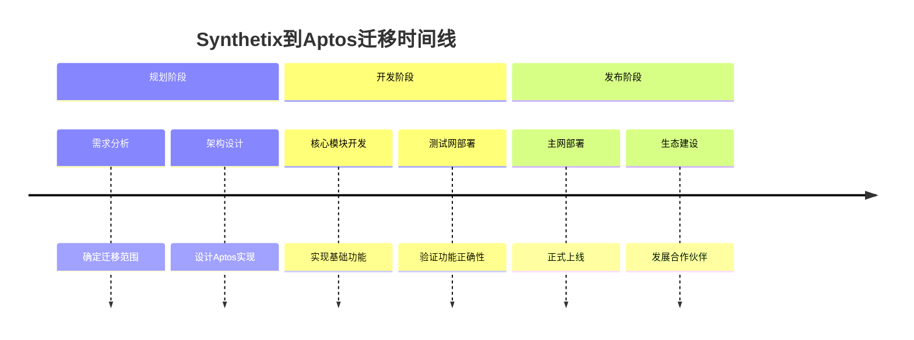
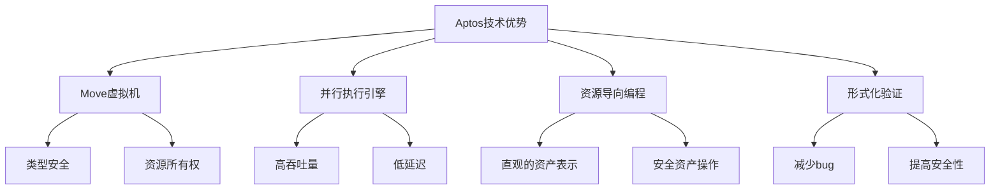
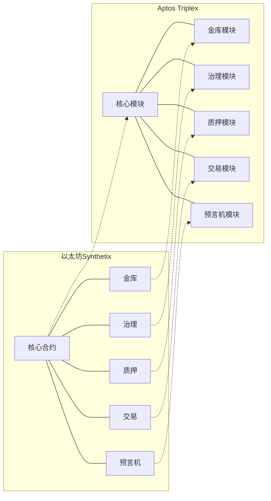
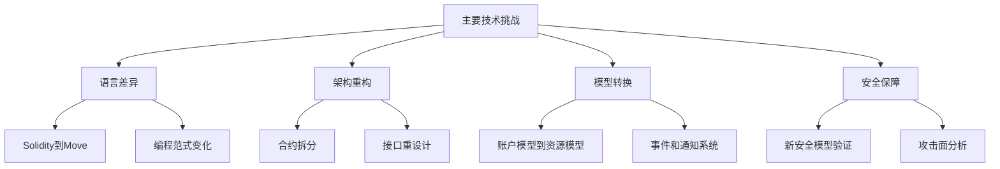
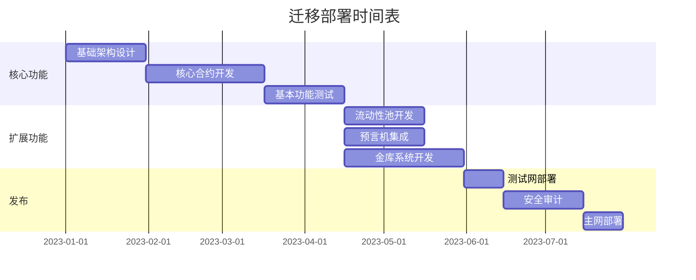

# ETH到Aptos迁移概述

## 迁移背景

Synthetix作为以太坊上知名的合成资产协议，在多年运营中积累了丰富的经验，同时也面临以太坊区块链的一些固有限制。Triplex Protocol旨在将Synthetix的核心功能迁移到Aptos区块链，以利用其创新的架构和性能优势。

## 为什么选择Aptos？

### 1. 技术优势

- **Move语言**: 专为数字资产设计的编程语言，提供更强的安全保证
- **并行执行**: BlockSTM引擎支持交易并行执行，提高吞吐量
- **资源模型**: 资源导向的编程模型，更适合表示和操作金融资产
- **形式化验证**: 支持形式化验证，减少安全漏洞

### 2. 经济优势

- **更低的交易费用**: Aptos的高效架构降低了交易成本
- **更好的用户体验**: 更快的确认时间和更低的延迟
- **更大的可扩展性**: 支持更多用户和更高交易量
- **新市场机会**: 接触Aptos生态系统的新用户群体

## 迁移范围

1. **核心协议**: 合成资产的铸造、销毁和管理
2. **金库系统**: 资产抵押和收益生成
3. **流动性池**: 资产交易和流动性提供
4. **预言机集成**: 价格数据提供和验证
5. **治理机制**: 协议参数管理和升级

## 主要挑战

### 1. 技术挑战

- **语言迁移**: 从Solidity到Move语言的转换
- **架构重构**: 适应Aptos的资源模型和交易结构
- **安全验证**: 确保迁移过程中不引入新的安全漏洞
- **性能优化**: 充分利用Aptos的并行执行能力

### 2. 业务挑战

- **用户迁移**: 引导现有用户迁移到新平台
- **流动性建设**: 在新生态系统中建立足够的流动性
- **社区建设**: 在Aptos生态系统中发展活跃的社区
- **合作伙伴关系**: 与Aptos生态中的其他项目建立合作

## 迁移策略

### 1. 阶段性部署

1. **概念验证**: 部署简化版本验证核心功能
2. **功能完善**: 逐步添加更多功能和模块
3. **完全迁移**: 实现完整功能集并迁移用户和资产

### 2. 双链策略

- **初期共存**: 以太坊和Aptos版本并行运行
- **跨链桥接**: 提供资产在两个链之间的流动性
- **激励迁移**: 通过奖励鼓励用户迁移到Aptos版本

## 期望成果

- **更低的成本**: 用户交易费用显著降低
- **更高的性能**: 系统吞吐量和响应速度提升
- **更好的可扩展性**: 支持更多用户和更复杂的功能
- **更强的安全性**: 利用Move语言的安全特性
- **更广的生态**: 与Aptos生态系统深度集成

## 后续步骤

查看以下文档了解更多详细信息：
- [架构对比](./architecture-comparison.md) - Ethereum与Aptos架构的详细对比
- [合约迁移指南](./contract-migration.md) - 从Solidity到Move的代码迁移指南
- [测试和部署流程](./testing-deployment.md) - Aptos上的测试和部署实践 