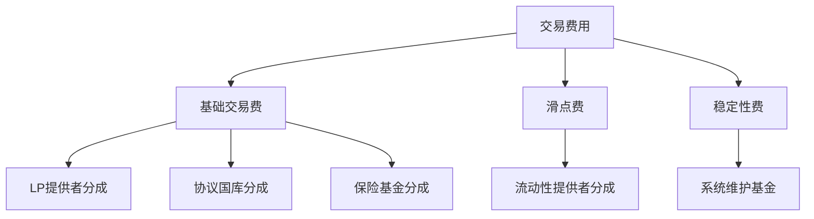
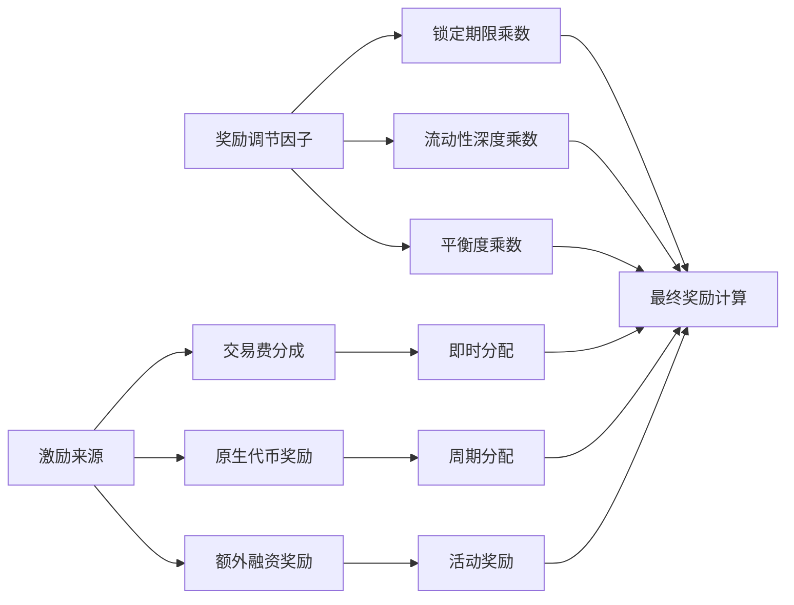
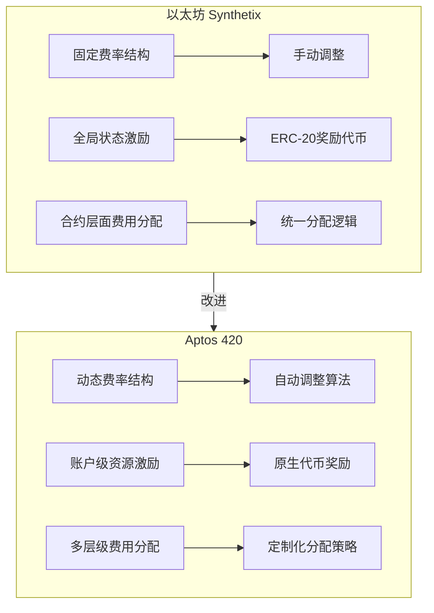
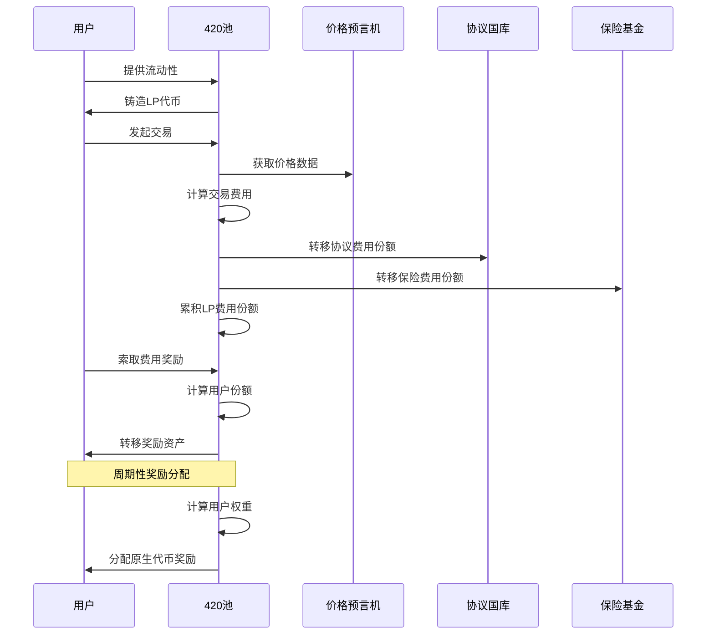

# 420 流动性池 - 收费和激励机制分析

## 概述

收费和激励机制是 420 流动性池的核心组成部分，直接影响协议的可持续性和用户参与度。本文档深入分析 420 流动性池的收费结构、分配逻辑和激励机制实现，揭示其如何激励流动性提供并维持协议的长期发展。

## 收费机制设计

### 收费类型和结构

420 流动性池实施了多层次的收费结构，适应不同交易类型和用户行为：



收费类型的具体实现：

```move
/// 费用配置结构
struct FeeConfig has key, store {
    // 基础交易费率 (以基点表示，10000 = 100%)
    base_fee_rate: u64,
    // 协议费率分成比例
    protocol_fee_share: u64,
    // 保险基金分成比例
    insurance_fund_share: u64,
    // LP提供者分成比例 (剩余部分)
    // lp_share = 10000 - protocol_fee_share - insurance_fund_share
    
    // 滑点费率系数
    slippage_fee_coefficient: u64,
    // 稳定性费率
    stability_fee_rate: u64,
    // 最小费用金额
    min_fee_amount: u64
}
```

### 费用计算流程

420 池在不同交易环节应用不同的费用计算方法：

```move
/// 计算交易费用
fun calculate_swap_fee(
    pool_id: u64,
    asset_in: AssetType,
    asset_out: AssetType,
    amount_in: u64
) acquires PoolState, FeeConfig, PriceData: SwapFeeResult {
    let fee_config = borrow_global<FeeConfig>(@triplex_420);
    let pool_state = borrow_global<PoolState>(@triplex_420);
    let price_data = borrow_global<PriceData>(@triplex_420);
    
    // 获取资产价格
    let asset_in_price = *table::borrow(&price_data.asset_prices, asset_in);
    
    // 计算基础交易费
    let base_fee_amount = (amount_in * fee_config.base_fee_rate) / FEE_PRECISION;
    
    // 计算滑点费用 (基于资产池不平衡程度)
    let imbalance_factor = calculate_pool_imbalance(pool_id, asset_in, asset_out);
    let slippage_fee = (amount_in * imbalance_factor * fee_config.slippage_fee_coefficient) / (FEE_PRECISION * FEE_PRECISION);
    
    // 计算稳定性费 (基于资产波动性)
    let volatility_factor = get_asset_volatility_factor(asset_in);
    let stability_fee = (amount_in * volatility_factor * fee_config.stability_fee_rate) / (FEE_PRECISION * FEE_PRECISION);
    
    // 计算总费用
    let total_fee = base_fee_amount + slippage_fee + stability_fee;
    
    // 确保总费用不低于最小费用
    if (total_fee < fee_config.min_fee_amount) {
        total_fee = fee_config.min_fee_amount;
    };
    
    // 计算各部分费用分配
    let protocol_fee = (total_fee * fee_config.protocol_fee_share) / FEE_PRECISION;
    let insurance_fee = (total_fee * fee_config.insurance_fund_share) / FEE_PRECISION;
    let lp_fee = total_fee - protocol_fee - insurance_fee;
    
    // 返回费用计算结果
    SwapFeeResult {
        total_fee,
        base_fee: base_fee_amount,
        slippage_fee,
        stability_fee,
        protocol_fee,
        insurance_fee,
        lp_fee
    }
}
```

### 池不平衡度计算

池不平衡度是一个重要的费用调节因子，确保流动性均衡：

```move
/// 计算池不平衡度
fun calculate_pool_imbalance(
    pool_id: u64,
    asset_in: AssetType,
    asset_out: AssetType
) acquires PoolState, PriceData: u64 {
    let pool_state = borrow_global<PoolState>(@triplex_420);
    let price_data = borrow_global<PriceData>(@triplex_420);
    
    // 获取资产余额和价格
    let balance_in = *table::borrow(&pool_state.asset_balances, asset_in);
    let balance_out = *table::borrow(&pool_state.asset_balances, asset_out);
    let price_in = *table::borrow(&price_data.asset_prices, asset_in);
    let price_out = *table::borrow(&price_data.asset_prices, asset_out);
    
    // 计算资产价值
    let value_in = (balance_in as u128) * (price_in as u128);
    let value_out = (balance_out as u128) * (price_out as u128);
    
    // 计算理想比例 (基于池配置)
    let ideal_ratio = get_ideal_asset_ratio(pool_id, asset_in, asset_out);
    
    // 计算当前比例
    let current_ratio = if (value_out == 0) {
        MAX_IMBALANCE_FACTOR
    } else {
        (value_in * FEE_PRECISION) / value_out
    };
    
    // 计算不平衡度
    let imbalance_factor = if (current_ratio > ideal_ratio) {
        ((current_ratio - ideal_ratio) * IMBALANCE_MULTIPLIER) / ideal_ratio
    } else {
        ((ideal_ratio - current_ratio) * IMBALANCE_MULTIPLIER) / ideal_ratio
    };
    
    // 确保不超过最大不平衡因子
    if (imbalance_factor > MAX_IMBALANCE_FACTOR) {
        imbalance_factor = MAX_IMBALANCE_FACTOR;
    };
    
    (imbalance_factor as u64)
}
```

### 费用分配和记账

交易产生的费用会根据预设比例分配给不同的接收方：

```move
/// 分配交易费用
fun distribute_swap_fees(
    pool_id: u64,
    asset_type: AssetType,
    fee_result: SwapFeeResult
) acquires PoolState, ProtocolFeeReceiver, InsuranceFund {
    // 更新池中的LP费用累计
    let pool_state = borrow_global_mut<PoolState>(@triplex_420);
    let current_lp_fees = table::borrow_mut(&mut pool_state.accumulated_lp_fees, asset_type);
    *current_lp_fees = *current_lp_fees + fee_result.lp_fee;
    
    // 转移协议费用到协议国库
    if (fee_result.protocol_fee > 0) {
        let protocol_fee_receiver = borrow_global_mut<ProtocolFeeReceiver>(@triplex_420);
        let protocol_fees = table::borrow_mut(&mut protocol_fee_receiver.accumulated_fees, asset_type);
        *protocol_fees = *protocol_fees + fee_result.protocol_fee;
    };
    
    // 转移保险基金费用
    if (fee_result.insurance_fee > 0) {
        let insurance_fund = borrow_global_mut<InsuranceFund>(@triplex_420);
        let insurance_fees = table::borrow_mut(&mut insurance_fund.accumulated_fees, asset_type);
        *insurance_fees = *insurance_fees + fee_result.insurance_fee;
    };
    
    // 发出费用分配事件
    event::emit(FeeDistributionEvent {
        pool_id,
        asset_type,
        lp_fee: fee_result.lp_fee,
        protocol_fee: fee_result.protocol_fee,
        insurance_fee: fee_result.insurance_fee,
        timestamp: timestamp::now_seconds()
    });
}
```

## 激励机制实现

### 基本激励模型

420 流动性池的激励机制包括多层次奖励结构，使用关键绩效指标调整奖励：



### 原生代币奖励分配

原生代币奖励按周期分配给流动性提供者，基于其贡献比例：

```move
/// 分发周期奖励
public entry fun distribute_rewards(
    admin: &signer,
    pool_id: u64,
    reward_amount: u64
) acquires RewardConfig, PoolState, LiquidityProvider {
    let admin_addr = signer::address_of(admin);
    
    // 验证管理员权限
    let reward_config = borrow_global<RewardConfig>(@triplex_420);
    assert!(admin_addr == reward_config.admin, ERROR_PERMISSION_DENIED);
    
    // 获取池总流动性
    let pool_state = borrow_global<PoolState>(@triplex_420);
    let total_liquidity = pool_state.total_liquidity;
    assert!(total_liquidity > 0, ERROR_NO_LIQUIDITY);
    
    // 获取所有流动性提供者
    let liquidity_providers = get_all_liquidity_providers(pool_id);
    
    // 计算每个提供者的权重和总权重
    let provider_weights = calculate_provider_weights(pool_id, &liquidity_providers);
    let total_weight = calculate_total_weight(&provider_weights);
    
    // 分配奖励
    distribute_rewards_by_weight(
        pool_id, 
        reward_amount, 
        &liquidity_providers, 
        &provider_weights, 
        total_weight
    );
    
    // 更新分配时间戳
    update_last_distribution_time(pool_id);
    
    // 发出奖励分配事件
    event::emit(RewardDistributionEvent {
        pool_id,
        total_reward: reward_amount,
        provider_count: vector::length(&liquidity_providers),
        total_weight,
        timestamp: timestamp::now_seconds()
    });
}
```

### 权重计算与奖励乘数

奖励权重基于流动性数量、锁定期和资产平衡度等因素计算：

```move
/// 计算流动性提供者权重
fun calculate_provider_weights(
    pool_id: u64,
    providers: &vector<address>
) acquires LiquidityProvider, RewardConfig: vector<ProviderWeight> {
    let reward_config = borrow_global<RewardConfig>(@triplex_420);
    let len = vector::length(providers);
    let i = 0;
    let provider_weights = vector::empty<ProviderWeight>();
    
    while (i < len) {
        let provider_addr = *vector::borrow(providers, i);
        
        if (exists<LiquidityProvider>(provider_addr)) {
            let provider = borrow_global<LiquidityProvider>(provider_addr);
            
            // 基础权重 = 流动性数量
            let base_weight = provider.liquidity_amount;
            
            // 应用锁定乘数
            let lock_multiplier = if (provider.is_locked) {
                // 获取对应锁定期的乘数
                let lock_period = provider.lock_end_time - provider.first_deposit_time;
                get_lock_reward_multiplier(lock_period, &reward_config.reward_multipliers)
            } else {
                BASE_MULTIPLIER // 默认乘数 (100 = 1x)
            };
            
            // 应用流动性深度乘数
            let depth_multiplier = calculate_depth_multiplier(provider.liquidity_amount);
            
            // 应用资产平衡度乘数
            let balance_multiplier = calculate_balance_multiplier(provider_addr, pool_id);
            
            // 计算最终权重
            let final_weight = base_weight * lock_multiplier * depth_multiplier * balance_multiplier / (BASE_MULTIPLIER * BASE_MULTIPLIER * BASE_MULTIPLIER);
            
            vector::push_back(&mut provider_weights, ProviderWeight {
                provider: provider_addr,
                weight: final_weight
            });
        };
        
        i = i + 1;
    };
    
    provider_weights
}
```

### 费用收益索取

流动性提供者可以随时索取其在池中积累的费用收益：

```move
/// 索取交易费奖励
public entry fun claim_fee_rewards(
    user: &signer,
    pool_id: u64
) acquires PoolState, LiquidityProvider {
    let user_addr = signer::address_of(user);
    
    // 验证用户是流动性提供者
    assert!(exists<LiquidityProvider>(user_addr), ERROR_NOT_LIQUIDITY_PROVIDER);
    let liquidity_provider = borrow_global_mut<LiquidityProvider>(user_addr);
    
    // 计算可索取的费用
    let claimable_fees = calculate_claimable_fees(user_addr, pool_id);
    
    // 转移费用到用户账户
    transfer_fees_to_user(user_addr, claimable_fees);
    
    // 更新最后索取时间
    liquidity_provider.last_fee_claim_time = timestamp::now_seconds();
    
    // 发出索取事件
    event::emit(FeeClaimEvent {
        user: user_addr,
        pool_id,
        claimed_fees: claimable_fees,
        timestamp: timestamp::now_seconds()
    });
}
```

### 可索取费用计算

费用分配基于用户的流动性份额比例：

```move
/// 计算用户可索取的费用
fun calculate_claimable_fees(
    user_addr: address,
    pool_id: u64
) acquires PoolState, LiquidityProvider: vector<AssetAmount> {
    let pool_state = borrow_global<PoolState>(@triplex_420);
    let liquidity_provider = borrow_global<LiquidityProvider>(user_addr);
    
    // 用户上次索取后的累积费用
    let last_claim_time = liquidity_provider.last_fee_claim_time;
    
    // 用户流动性占比
    let user_share = (liquidity_provider.liquidity_amount as u128) * FEE_PRECISION / (pool_state.total_liquidity as u128);
    
    // 获取所有支持的资产类型
    let supported_assets = get_supported_assets(pool_id);
    let claimable_fees = vector::empty<AssetAmount>();
    
    let i = 0;
    let len = vector::length(&supported_assets);
    
    while (i < len) {
        let asset_type = *vector::borrow(&supported_assets, i);
        
        // 获取该资产的总累积费用
        let total_accumulated_fees = *table::borrow(&pool_state.accumulated_lp_fees, asset_type);
        
        // 获取用户上次索取时的累积费用
        let last_claimed_fees = *table::borrow(&liquidity_provider.last_claimed_fees, asset_type);
        
        // 计算此次可索取的费用
        let fee_accumulated_since_last_claim = total_accumulated_fees - last_claimed_fees;
        let user_fee_share = ((fee_accumulated_since_last_claim as u128) * user_share / FEE_PRECISION) as u64;
        
        if (user_fee_share > 0) {
            vector::push_back(&mut claimable_fees, AssetAmount {
                asset_type,
                amount: user_fee_share
            });
        };
        
        i = i + 1;
    };
    
    claimable_fees
}
```

## 激励调节机制

### 动态费率调整

随着池状态变化，费率会动态调整以优化市场行为：

```move
/// 动态调整费率
public entry fun adjust_fee_rates(
    admin: &signer
) acquires FeeConfig, PoolState, PriceData {
    let admin_addr = signer::address_of(admin);
    
    // 验证管理员权限
    let fee_config = borrow_global_mut<FeeConfig>(@triplex_420);
    assert!(admin_addr == @triplex_420, ERROR_PERMISSION_DENIED);
    
    // 获取当前池状态指标
    let total_tvl = calculate_total_tvl();
    let volume_24h = get_24h_volume();
    let volatility = calculate_market_volatility();
    
    // 根据市场状况调整基础费率
    let new_base_fee_rate = calculate_optimal_base_fee(
        fee_config.base_fee_rate,
        total_tvl,
        volume_24h,
        volatility
    );
    
    // 根据池不平衡度调整滑点费率系数
    let imbalance_level = calculate_overall_imbalance();
    let new_slippage_coefficient = calculate_optimal_slippage_fee(
        fee_config.slippage_fee_coefficient,
        imbalance_level
    );
    
    // 更新费率配置
    fee_config.base_fee_rate = new_base_fee_rate;
    fee_config.slippage_fee_coefficient = new_slippage_coefficient;
    
    // 发出费率调整事件
    event::emit(FeeAdjustmentEvent {
        old_base_fee_rate: fee_config.base_fee_rate,
        new_base_fee_rate,
        old_slippage_coefficient: fee_config.slippage_fee_coefficient,
        new_slippage_coefficient,
        adjustment_reason: get_adjustment_reason(total_tvl, volume_24h, volatility, imbalance_level),
        timestamp: timestamp::now_seconds()
    });
}
```

### 激励计划调整

激励计划也会根据池的使用情况和市场需求进行调整：

```move
/// 更新激励计划
public entry fun update_reward_schedule(
    admin: &signer,
    pool_id: u64,
    new_reward_rate: u64,
    new_reward_duration: u64
) acquires RewardConfig {
    let admin_addr = signer::address_of(admin);
    
    // 验证管理员权限
    let reward_config = borrow_global_mut<RewardConfig>(@triplex_420);
    assert!(admin_addr == reward_config.admin, ERROR_PERMISSION_DENIED);
    
    // 保存旧配置用于事件
    let old_rate = reward_config.reward_rate;
    let old_duration = reward_config.reward_duration;
    
    // 更新奖励配置
    reward_config.reward_rate = new_reward_rate;
    reward_config.reward_duration = new_reward_duration;
    
    // 发出计划更新事件
    event::emit(RewardScheduleUpdateEvent {
        pool_id,
        old_rate,
        new_rate: new_reward_rate,
        old_duration,
        new_duration: new_reward_duration,
        timestamp: timestamp::now_seconds()
    });
}
```

## 与 Triplex 核心协议的集成

### 奖励代币分发

420 池可以接收和分发 Triplex 核心协议的原生代币作为额外奖励：

```move
/// 从协议获取并分发奖励代币
public entry fun distribute_protocol_tokens(
    admin: &signer,
    pool_id: u64,
    amount: u64
) acquires PoolState, LiquidityProvider {
    let admin_addr = signer::address_of(admin);
    
    // 验证管理员权限
    assert!(admin_addr == @triplex_420, ERROR_PERMISSION_DENIED);
    
    // 从协议获取奖励代币
    let reward_tokens = triplex::rewards::claim_pool_rewards(pool_id, amount);
    
    // 分发给流动性提供者
    distribute_protocol_reward_tokens(pool_id, reward_tokens);
    
    // 发出分发事件
    event::emit(ProtocolRewardDistributionEvent {
        pool_id,
        amount,
        timestamp: timestamp::now_seconds()
    });
}
```

### 协议治理奖励

流动性提供者可以通过参与治理获得额外奖励：

```move
/// 计算治理参与奖励
fun calculate_governance_rewards(
    user_addr: address,
    pool_id: u64
) acquires LiquidityProvider, GovernanceStats: u64 {
    if (!exists<LiquidityProvider>(user_addr) || !exists<GovernanceStats>(user_addr)) {
        return 0
    };
    
    let liquidity_provider = borrow_global<LiquidityProvider>(user_addr);
    let governance_stats = borrow_global<GovernanceStats>(user_addr);
    
    // 基础权重 = 流动性数量
    let base_weight = liquidity_provider.liquidity_amount;
    
    // 治理参与系数 (基于投票和提案参与)
    let governance_factor = (governance_stats.vote_count * VOTE_WEIGHT + 
                            governance_stats.proposal_count * PROPOSAL_WEIGHT) / 
                            GOVERNANCE_FACTOR_PRECISION;
    
    // 计算奖励
    let reward = (base_weight * governance_factor) / GOVERNANCE_FACTOR_PRECISION;
    
    reward
}
```

## 收费和激励机制比较

420 流动性池的收费和激励机制与以太坊上的 Synthetix 相比有几个关键改进：



| 功能点 | Synthetix (以太坊) | Triplex 420 (Aptos) |
|--------|-------------------|---------------------|
| 费率调整 | 治理投票固定调整 | 算法动态自适应 |
| 奖励分配 | 全局快照计算 | 账户级资源高效计算 |
| 锁定机制 | 合约级时间锁 | 资源模型灵活锁定 |
| 激励定制 | 统一奖励计划 | 多因子条件激励 |
| 计算效率 | 高gas消耗 | 资源并行优化 |

## 收费和激励流程

整体收费和激励流程可视化：



## 结论

420 流动性池的收费和激励机制通过精心设计的动态费率结构和多层次奖励系统，有效平衡了流动性提供者的回报与协议可持续发展的需要。Move 语言的资源模型和原生代币功能为这些机制提供了高效、安全的实现基础，使其相比以太坊实现具有明显优势。

收费结构的动态调整能力和基于多因子的激励分配使得池能够适应不同市场状况，同时通过透明的费用分配和便捷的收益索取机制，为用户提供了清晰的价值主张，有效促进了流动性的持续提供和池的健康运行。 