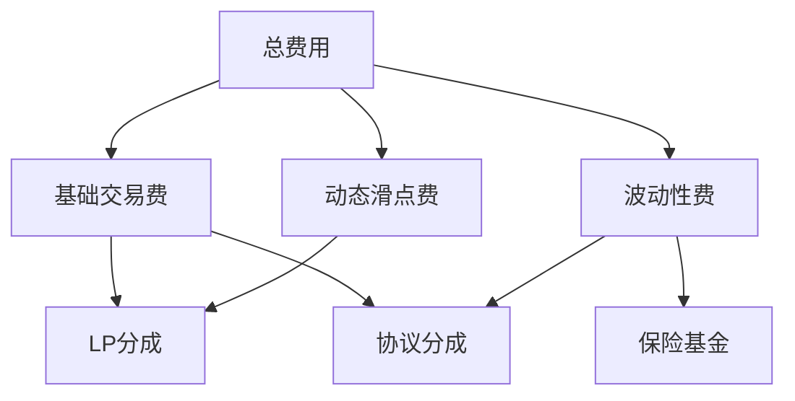

# 420 流动性池 - 费用计算机制详解

## 1. 概述

费用计算是420流动性池的核心功能之一，它直接影响池的经济模型、盈利能力和用户体验。本文档深入分析420流动性池的费用计算机制，包括费用结构、计算方法、收集过程和分配策略。

## 2. 费用结构设计

### 2.1 费用类型

420流动性池实现了三层费用结构：

1. **基础交易费** - 所有交易的标准费用
2. **动态滑点费** - 基于池不平衡程度动态调整的费用
3. **波动性费** - 针对高波动性资产的额外费用



### 2.2 费率层级

系统定义了多个费率层级，适用于不同类型的资产对：

```move
/// 费率层级定义
const FEE_TIER_LOW: u8 = 0;    // 低费率 (0.05%)
const FEE_TIER_MEDIUM: u8 = 1; // 中等费率 (0.3%)
const FEE_TIER_HIGH: u8 = 2;   // 高费率 (1%)
const FEE_TIER_STABLE: u8 = 3; // 稳定币对费率 (0.01%)
const FEE_TIER_DYNAMIC: u8 = 4; // 动态费率 (0.1% - 2%)

/// 费率基点映射
fun get_fee_bps(fee_tier: u8): u16 {
    if (fee_tier == FEE_TIER_LOW) {
        5 // 0.05%
    } else if (fee_tier == FEE_TIER_MEDIUM) {
        30 // 0.3%
    } else if (fee_tier == FEE_TIER_HIGH) {
        100 // 1%
    } else if (fee_tier == FEE_TIER_STABLE) {
        1 // 0.01%
    } else if (fee_tier == FEE_TIER_DYNAMIC) {
        // 动态费率会在其他地方计算
        0
    } else {
        abort error::invalid_argument(ERROR_INVALID_FEE_TIER)
    }
}
```

## 3. 基础交易费计算

### 3.1 固定费率计算

对于使用固定费率的池，基础交易费计算如下：

```move
/// 计算基础交易费
fun calculate_base_fee(
    input_amount: u64,
    fee_tier: u8
): u64 {
    let fee_bps = get_fee_bps(fee_tier);
    (input_amount * (fee_bps as u64)) / 10000
}
```

### 3.2 动态费率计算

对于使用动态费率的池，系统会根据多个因素动态调整费率：

```move
/// 计算动态费率
fun calculate_dynamic_fee_bps(
    pool: &Pool<X, Y>
): u16 {
    // 基础费率
    let base_fee_bps: u16 = 10; // 0.1%
    
    // 根据池不平衡程度调整
    let x_normalized = normalize_amount(pool.x_reserve, get_decimals<X>());
    let y_normalized = normalize_amount(pool.y_reserve, get_decimals<Y>());
    
    let imbalance_ratio = if (x_normalized > y_normalized) {
        x_normalized / y_normalized
    } else {
        y_normalized / x_normalized
    };
    
    // 计算不平衡调整值（最高增加1%）
    let imbalance_adjustment = math::min(
        ((imbalance_ratio - 1) * 100) as u16, 
        100
    );
    
    // 根据波动性调整
    let volatility_adjustment = calculate_volatility_adjustment<X, Y>();
    
    // 综合调整（上限2%）
    math::min(base_fee_bps + imbalance_adjustment + volatility_adjustment, 200)
}
```

## 4. 动态滑点费计算

### 4.1 滑点费计算方法

滑点费基于交易对池中资产比例的影响程度计算：

```move
/// 计算滑点费
fun calculate_slippage_fee<X, Y>(
    input_amount: u64,
    x_reserve: u64,
    y_reserve: u64,
    direction: bool
): u64 {
    // 计算交易前的k值
    let initial_k = x_reserve * y_reserve;
    
    // 计算交易后的新储备量
    let (new_x_reserve, new_y_reserve) = if (direction) {
        // X -> Y交易
        let y_out = calculate_output_amount(input_amount, x_reserve, y_reserve, 0);
        (x_reserve + input_amount, y_reserve - y_out)
    } else {
        // Y -> X交易
        let x_out = calculate_output_amount(input_amount, y_reserve, x_reserve, 0);
        (x_reserve - x_out, y_reserve + input_amount)
    };
    
    // 计算交易后的k值
    let new_k = new_x_reserve * new_y_reserve;
    
    // 计算k值变化率
    let k_ratio = (new_k * 10000) / initial_k;
    
    // 滑点费率 = k值下降百分比 / 2
    let slippage_fee_rate = if (k_ratio < 10000) {
        (10000 - k_ratio) / 2
    } else {
        0
    };
    
    // 计算滑点费
    (input_amount * slippage_fee_rate) / 10000
}
```

### 4.2 滑点费率限制

为防止过高的滑点费，系统设置了滑点费率上限：

```move
// 滑点费率上限
const MAX_SLIPPAGE_FEE_RATE: u64 = 500; // 5%

// 应用滑点费率上限
fun apply_slippage_fee_cap(
    slippage_fee: u64,
    input_amount: u64
): u64 {
    math::min(
        slippage_fee,
        (input_amount * MAX_SLIPPAGE_FEE_RATE) / 10000
    )
}
```

## 5. 波动性费计算

### 5.1 波动性评估

系统通过监控资产价格波动来评估波动性：

```move
/// 计算波动性指标
fun calculate_volatility<X>(
): u64 acquires PriceHistory {
    let price_history = borrow_global<PriceHistory<X>>(module_address());
    
    // 获取价格数据
    let prices = &price_history.prices;
    let length = vector::length(prices);
    
    // 需要至少2个价格点
    if (length < 2) {
        return 0
    };
    
    // 计算标准差
    let sum = 0;
    let sum_squares = 0;
    
    let i = 0;
    while (i < length) {
        let price = *vector::borrow(prices, i);
        sum = sum + price;
        sum_squares = sum_squares + price * price;
        i = i + 1;
    };
    
    let mean = sum / length;
    let variance = (sum_squares / length) - (mean * mean);
    let std_dev = math::sqrt(variance);
    
    // 标准差除以均值，得到变异系数
    (std_dev * 10000) / mean
}
```

### 5.2 波动性费计算

基于波动性指标计算额外的波动性费：

```move
/// 计算波动性费
fun calculate_volatility_fee<X, Y>(
    input_amount: u64
): u64 acquires PriceHistory {
    // 获取输入资产的波动性
    let volatility_x = calculate_volatility<X>();
    
    // 波动性阈值
    const VOLATILITY_THRESHOLD: u64 = 500; // 5%
    const MAX_VOLATILITY_FEE_RATE: u64 = 100; // 1%
    
    // 如果波动性低于阈值，不收取额外费用
    if (volatility_x <= VOLATILITY_THRESHOLD) {
        return 0
    };
    
    // 计算波动性费率
    let volatility_fee_rate = math::min(
        ((volatility_x - VOLATILITY_THRESHOLD) * MAX_VOLATILITY_FEE_RATE) / VOLATILITY_THRESHOLD,
        MAX_VOLATILITY_FEE_RATE
    );
    
    // 计算波动性费
    (input_amount * volatility_fee_rate) / 10000
}
```

## 6. 费用收集与分配

### 6.1 费用收集

交易执行时，系统会收集各类费用并更新池状态：

```move
/// 收集交易费用
fun collect_fees<X, Y>(
    pool: &mut Pool<X, Y>,
    input_amount: u64,
    direction: bool
) {
    // 计算基础交易费
    let base_fee = if (pool.fee_tier == FEE_TIER_DYNAMIC) {
        let dynamic_fee_bps = calculate_dynamic_fee_bps(pool);
        (input_amount * (dynamic_fee_bps as u64)) / 10000
    } else {
        calculate_base_fee(input_amount, pool.fee_tier)
    };
    
    // 计算滑点费
    let slippage_fee = calculate_slippage_fee<X, Y>(
        input_amount,
        pool.x_reserve,
        pool.y_reserve,
        direction
    );
    
    // 应用滑点费上限
    slippage_fee = apply_slippage_fee_cap(slippage_fee, input_amount);
    
    // 计算波动性费
    let volatility_fee = calculate_volatility_fee<X, Y>(input_amount);
    
    // 计算总费用
    let total_fee = base_fee + slippage_fee + volatility_fee;
    
    // 更新池的费用收集统计
    if (direction) {
        // X -> Y 交易
        pool.collected_fees_x = pool.collected_fees_x + total_fee;
        pool.base_fees_x = pool.base_fees_x + base_fee;
        pool.slippage_fees_x = pool.slippage_fees_x + slippage_fee;
        pool.volatility_fees_x = pool.volatility_fees_x + volatility_fee;
    } else {
        // Y -> X 交易
        pool.collected_fees_y = pool.collected_fees_y + total_fee;
        pool.base_fees_y = pool.base_fees_y + base_fee;
        pool.slippage_fees_y = pool.slippage_fees_y + slippage_fee;
        pool.volatility_fees_y = pool.volatility_fees_y + volatility_fee;
    };
    
    // 更新费用分配信息
    update_fee_distribution<X, Y>(pool);
}
```

### 6.2 费用分配

收集的费用会按照预定策略分配给不同的接收方：

```move
/// 更新费用分配信息
fun update_fee_distribution<X, Y>(
    pool: &mut Pool<X, Y>
) {
    // 协议费率
    let protocol_fee_percent = pool.protocol_fee_percent;
    
    // 保险基金费率（主要来自波动性费）
    let insurance_fund_percent = 50; // 波动性费的50%
    
    // 更新协议费计数
    let protocol_fee_x = (pool.base_fees_x * (protocol_fee_percent as u64)) / 100;
    let protocol_fee_y = (pool.base_fees_y * (protocol_fee_percent as u64)) / 100;
    
    pool.protocol_fees_x = protocol_fee_x;
    pool.protocol_fees_y = protocol_fee_y;
    
    // 更新保险基金费用
    let insurance_fee_x = (pool.volatility_fees_x * insurance_fund_percent) / 100;
    let insurance_fee_y = (pool.volatility_fees_y * insurance_fund_percent) / 100;
    
    pool.insurance_fees_x = insurance_fee_x;
    pool.insurance_fees_y = insurance_fee_y;
    
    // 计算LP可分配费用
    pool.lp_fees_x = pool.collected_fees_x - protocol_fee_x - insurance_fee_x;
    pool.lp_fees_y = pool.collected_fees_y - protocol_fee_y - insurance_fee_y;
    
    // 更新每单位流动性的累积费用
    if (pool.total_liquidity > 0) {
        pool.accumulated_fee_x_per_share = pool.accumulated_fee_x_per_share + 
            ((pool.lp_fees_x * FEE_PRECISION) / pool.total_liquidity);
        pool.accumulated_fee_y_per_share = pool.accumulated_fee_y_per_share + 
            ((pool.lp_fees_y * FEE_PRECISION) / pool.total_liquidity);
    };
    
    // 重置基础费用计数器
    pool.base_fees_x = 0;
    pool.base_fees_y = 0;
    pool.slippage_fees_x = 0;
    pool.slippage_fees_y = 0;
    pool.volatility_fees_x = 0;
    pool.volatility_fees_y = 0;
}
```

### 6.3 协议费用提取

管理员可以提取协议费用：

```move
/// 提取协议费用
public entry fun withdraw_protocol_fees<X, Y>(
    admin: &signer,
    recipient: address
) acquires Pool, PoolConfig {
    let admin_addr = signer::address_of(admin);
    
    // 验证管理员权限
    let pool_config = borrow_global<PoolConfig>(module_address());
    assert!(admin_addr == pool_config.admin, ERROR_UNAUTHORIZED);
    
    // 获取池状态
    let pool = borrow_global_mut<Pool<X, Y>>(module_address());
    
    // 提取X资产协议费
    if (pool.protocol_fees_x > 0) {
        let x_amount = pool.protocol_fees_x;
        pool.protocol_fees_x = 0;
        
        // 转移X资产
        coin::transfer<X>(
            &get_pool_signer(),
            recipient,
            x_amount
        );
    };
    
    // 提取Y资产协议费
    if (pool.protocol_fees_y > 0) {
        let y_amount = pool.protocol_fees_y;
        pool.protocol_fees_y = 0;
        
        // 转移Y资产
        coin::transfer<Y>(
            &get_pool_signer(),
            recipient,
            y_amount
        );
    };
}
```

### 6.4 流动性提供者费用领取

流动性提供者可以领取累积的费用：

```move
/// 计算LP应得费用
fun calculate_lp_fees<X, Y>(
    position: &LiquidityPosition,
    pool: &Pool<X, Y>
): (u64, u64) {
    // 获取当前累积费用
    let current_fee_x_per_share = pool.accumulated_fee_x_per_share;
    let current_fee_y_per_share = pool.accumulated_fee_y_per_share;
    
    // 计算未领取的费用
    let fee_x = (position.amount * (current_fee_x_per_share - position.fee_x_checkpoint)) / FEE_PRECISION;
    let fee_y = (position.amount * (current_fee_y_per_share - position.fee_y_checkpoint)) / FEE_PRECISION;
    
    (fee_x, fee_y)
}

/// 领取LP费用
public entry fun claim_lp_fees<X, Y>(
    user: &signer
) acquires Pool, LiquidityPosition {
    let user_addr = signer::address_of(user);
    
    // 确保用户有LP头寸
    assert!(exists<LiquidityPosition<X, Y>>(user_addr), ERROR_NO_LIQUIDITY_POSITION);
    
    // 获取池和头寸
    let pool = borrow_global_mut<Pool<X, Y>>(module_address());
    let position = borrow_global_mut<LiquidityPosition<X, Y>>(user_addr);
    
    // 计算应得费用
    let (fee_x, fee_y) = calculate_lp_fees<X, Y>(position, pool);
    
    // 更新费用检查点
    position.fee_x_checkpoint = pool.accumulated_fee_x_per_share;
    position.fee_y_checkpoint = pool.accumulated_fee_y_per_share;
    
    // 转移费用给用户
    if (fee_x > 0) {
        coin::transfer<X>(
            &get_pool_signer(),
            user_addr,
            fee_x
        );
    };
    
    if (fee_y > 0) {
        coin::transfer<Y>(
            &get_pool_signer(),
            user_addr,
            fee_y
        );
    };
    
    // 触发费用领取事件
    event::emit_event(
        &mut pool.fee_claim_events,
        FeeClaimEvent {
            user: user_addr,
            fee_x,
            fee_y,
            timestamp: timestamp::now_seconds(),
        }
    );
}
```

## 7. 费用参数管理

### 7.1 设置协议费率

管理员可以调整协议费率：

```move
/// 设置协议费率
public entry fun set_protocol_fee_percent(
    admin: &signer,
    percent: u8
) acquires PoolConfig {
    let admin_addr = signer::address_of(admin);
    
    // 验证管理员权限
    let pool_config = borrow_global_mut<PoolConfig>(module_address());
    assert!(admin_addr == pool_config.admin, ERROR_UNAUTHORIZED);
    
    // 验证费率合理性
    assert!(percent <= 50, ERROR_INVALID_FEE_PERCENT); // 最高50%
    
    // 设置新的协议费率
    pool_config.protocol_fee_percent = percent;
    
    // 触发费率变更事件
    event::emit(
        ProtocolFeeChangeEvent {
            old_percent: pool_config.protocol_fee_percent,
            new_percent: percent,
            timestamp: timestamp::now_seconds()
        }
    );
}
```

### 7.2 更新费率层级

池管理员可以更新特定池的费率层级：

```move
/// 更新费率层级
public entry fun update_fee_tier<X, Y>(
    admin: &signer,
    new_fee_tier: u8
) acquires Pool, PoolConfig {
    let admin_addr = signer::address_of(admin);
    
    // 验证管理员权限
    let pool_config = borrow_global<PoolConfig>(module_address());
    assert!(admin_addr == pool_config.admin, ERROR_UNAUTHORIZED);
    
    // 验证费率层级有效
    assert!(
        new_fee_tier == FEE_TIER_LOW || 
        new_fee_tier == FEE_TIER_MEDIUM ||
        new_fee_tier == FEE_TIER_HIGH ||
        new_fee_tier == FEE_TIER_STABLE ||
        new_fee_tier == FEE_TIER_DYNAMIC,
        ERROR_INVALID_FEE_TIER
    );
    
    // 更新池的费率层级
    let pool = borrow_global_mut<Pool<X, Y>>(module_address());
    let old_fee_tier = pool.fee_tier;
    pool.fee_tier = new_fee_tier;
    
    // 触发费率层级变更事件
    event::emit_event(
        &mut pool.config_update_events,
        FeeTierUpdateEvent {
            old_fee_tier,
            new_fee_tier,
            timestamp: timestamp::now_seconds(),
        }
    );
}
```

## 8. 费用统计与分析

### 8.1 费用统计数据结构

系统维护详细的费用统计信息：

```move
/// 费用统计
struct FeeStats has key {
    // 总交易量
    total_volume_x: u64,
    total_volume_y: u64,
    
    // 总基础费用
    total_base_fees_x: u64,
    total_base_fees_y: u64,
    
    // 总滑点费
    total_slippage_fees_x: u64,
    total_slippage_fees_y: u64,
    
    // 总波动性费
    total_volatility_fees_x: u64,
    total_volatility_fees_y: u64,
    
    // 协议收入
    total_protocol_fees_x: u64,
    total_protocol_fees_y: u64,
    
    // 保险基金
    total_insurance_fees_x: u64,
    total_insurance_fees_y: u64,
    
    // LP收入
    total_lp_fees_x: u64,
    total_lp_fees_y: u64,
    
    // 历史费率数据
    fee_tier_history: vector<FeeTierHistory>,
}

/// 费率历史记录
struct FeeTierHistory has store, drop {
    // 费率层级
    fee_tier: u8,
    // 开始时间
    start_time: u64,
    // 结束时间
    end_time: u64,
    // 期间交易量
    volume_x: u64,
    volume_y: u64,
    // 期间收取的费用
    fees_x: u64,
    fees_y: u64,
}
```

### 8.2 费用效率分析

系统提供费用效率分析功能：

```move
/// 计算费用效率指标
fun calculate_fee_efficiency<X, Y>(): u64 acquires FeeStats {
    let fee_stats = borrow_global<FeeStats>(module_address());
    
    // 计算总交易量
    let total_volume = fee_stats.total_volume_x + fee_stats.total_volume_y;
    
    // 计算总费用
    let total_fees = 
        fee_stats.total_base_fees_x + fee_stats.total_base_fees_y +
        fee_stats.total_slippage_fees_x + fee_stats.total_slippage_fees_y +
        fee_stats.total_volatility_fees_x + fee_stats.total_volatility_fees_y;
    
    // 计算平均费率 (bps)
    if (total_volume > 0) {
        (total_fees * 10000) / total_volume
    } else {
        0
    }
}
```

## 9. 与以太坊实现的比较

Move语言在费用机制实现上相比Solidity有一些独特优势：

| 特性 | 以太坊 (Solidity) | Aptos (Move) |
|------|-----------------|--------------|
| 费用精度 | 有限制 | 更高精度 |
| 计算效率 | 受Gas限制 | 更高效 |
| 状态管理 | 全局状态 | 资源型状态 |
| 安全性 | 需显式检查 | 资源模型保障 |
| 升级能力 | 复杂 | 原生支持 |

## 10. 结论

420流动性池的费用计算机制通过多层次费用结构、动态调整和精细分配，实现了多方面的平衡：

1. 为流动性提供者创造稳定收益
2. 为协议积累可持续发展资金
3. 为系统风险提供保障机制
4. 根据市场状况动态优化费率

该机制充分利用了Move语言的资源模型和计算效率，相比以太坊上的同类实现具有明显优势。未来的优化方向包括：

1. 引入更复杂的动态费率模型
2. 实现基于用户行为的个性化费率
3. 开发更先进的波动性评估方法
4. 完善费用统计和分析工具 