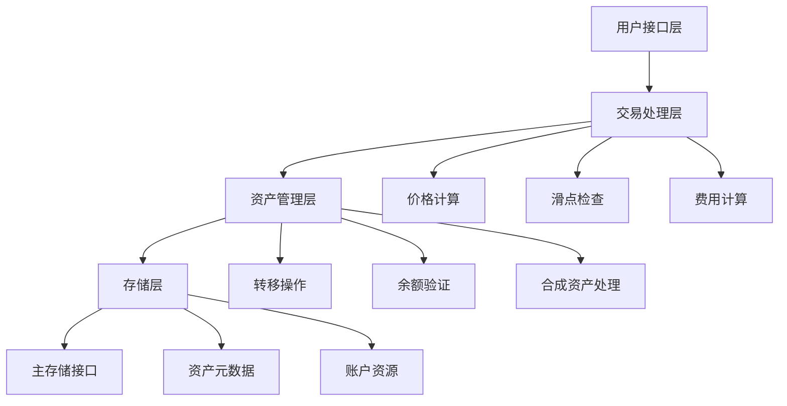

# 420 流动性池 - 资产转移实现细节

## 1. 概述

本文档详细分析420流动性池中资产转移机制的底层实现，重点关注在交易执行过程中如何安全高效地处理资产流转。420流动性池的资产转移机制建立在Aptos区块链的Move语言资源模型基础上，通过精心设计的交互流程确保所有资产操作的安全性和原子性。

## 2. 技术架构

资产转移在420流动性池中的技术架构主要包含以下几个层次：



### 2.1 核心组件

资产转移过程涉及以下核心组件：

1. **Pool资源** - 存储池的状态和配置
2. **FungibleAsset接口** - Aptos原生资产接口
3. **PrimaryFungibleStore** - 用户资产的主存储
4. **资产转移函数** - 处理资产的转入和转出
5. **合成资产接口** - 处理特殊的合成资产类型

## 3. 资产转入池的实现

### 3.1 基本流程

当用户进行交易时，首先需要将输入资产转移到流动性池。这个过程的代码实现如下：

```move
fun transfer_asset_to_pool<X>(
    user: &signer,
    amount: u64
) acquires PoolRegistry {
    let pool_addr = module_address();
    let user_addr = signer::address_of(user);
    
    // 获取资产元数据
    let asset_metadata = get_asset_metadata<X>();
    
    // 从用户提取资产
    let asset = primary_fungible_store::withdraw(
        user,
        asset_metadata,
        amount
    );
    
    // 确保池有相应的资产存储
    primary_fungible_store::ensure_primary_store_exists(
        pool_addr,
        asset_metadata
    );
    
    // 将资产存入池
    primary_fungible_store::deposit(
        pool_addr,
        asset
    );
    
    // 更新池状态
    update_pool_state<X>(amount, true);
}
```

### 3.2 安全检查

在转移资产到池之前，系统会执行多项安全检查：

1. **余额验证** - 确保用户有足够的资产
   ```move
   let user_balance = primary_fungible_store::balance(
       user_addr,
       asset_metadata
   );
   assert!(user_balance >= amount, ERROR_INSUFFICIENT_BALANCE);
   ```

2. **权限验证** - 确保只有资产所有者可以转移
   ```move
   // Move语言确保只有签名者才能提取其资产
   let asset = primary_fungible_store::withdraw(
       user, // 必须是资产所有者
       asset_metadata,
       amount
   );
   ```

3. **资产类型验证** - 确保资产类型符合池要求
   ```move
   assert!(
       is_supported_asset<X>(),
       ERROR_UNSUPPORTED_ASSET
   );
   ```

## 4. 资产转出池的实现

### 4.1 基本流程

交易执行后，系统需要将输出资产从池转移到用户。这一过程的代码实现如下：

```move
fun transfer_asset_from_pool<Y>(
    user_addr: address,
    amount: u64
) acquires PoolRegistry {
    let pool_addr = module_address();
    
    // 获取资产元数据
    let asset_metadata = get_asset_metadata<Y>();
    
    // 确保用户有相应的资产存储
    primary_fungible_store::ensure_primary_store_exists(
        user_addr,
        asset_metadata
    );
    
    // 从池中提取资产
    let asset = primary_fungible_store::withdraw(
        &get_pool_signer(),
        asset_metadata,
        amount
    );
    
    // 将资产存入用户账户
    primary_fungible_store::deposit(
        user_addr,
        asset
    );
    
    // 更新池状态
    update_pool_state<Y>(amount, false);
}
```

### 4.2 权限控制

从池中提取资产需要特殊的权限控制：

```move
// 获取池签名者
fun get_pool_signer(): signer {
    // 使用能力系统获取池签名者
    let capability = borrow_global<PoolCapability>(module_address());
    account::create_signer_with_capability(&capability.signer_cap)
}
```

## 5. 合成资产的特殊处理

### 5.1 合成资产铸造

对于合成资产，420流动性池实现了特殊的处理逻辑：

```move
fun handle_synthetic_asset<X, Y>(
    trader_addr: address,
    direction: bool,
    amount: u64
) {
    if (direction && is_synthetic<Y>()) {
        // 当用户买入合成资产Y时
        // 不从池中转移，而是直接铸造
        synthetic_asset::mint_to(
            trader_addr,
            get_asset_metadata<Y>(),
            amount
        );
    } else if (!direction && is_synthetic<X>()) {
        // 当用户买入合成资产X时
        synthetic_asset::mint_to(
            trader_addr,
            get_asset_metadata<X>(),
            amount
        );
    }
}
```

### 5.2 合成资产销毁

当用户卖出合成资产时，系统会执行销毁操作：

```move
fun handle_synthetic_asset_burn<X, Y>(
    trader: &signer,
    direction: bool,
    amount: u64
) {
    if (direction && is_synthetic<X>()) {
        // 当用户卖出合成资产X时
        let asset = primary_fungible_store::withdraw(
            trader,
            get_asset_metadata<X>(),
            amount
        );
        synthetic_asset::burn(asset);
    } else if (!direction && is_synthetic<Y>()) {
        // 当用户卖出合成资产Y时
        let asset = primary_fungible_store::withdraw(
            trader,
            get_asset_metadata<Y>(),
            amount
        );
        synthetic_asset::burn(asset);
    }
}
```

## 6. 与金库系统集成

### 6.1 从金库提取资产

对于使用金库的用户，系统支持直接从金库提取资产进行交易：

```move
fun withdraw_from_vault<X>(
    trader: &signer,
    vault_object: Object<Vault>,
    amount: u64
): FungibleAsset {
    // 从金库中提取资产
    vault::withdraw(
        vault_object,
        amount,
        module_address(), // 转移目标为池
        trader // 必须是金库所有者
    )
}
```

### 6.2 将资产存入金库

交易结束后，输出资产可以直接存入用户的金库：

```move
fun deposit_to_vault<Y>(
    vault_object: Object<Vault>,
    asset: FungibleAsset
) {
    let vault_object_addr = object::object_address(&vault_object);
    
    // 确保金库接受这种资产类型
    let asset_metadata = fungible_asset::metadata_from_asset(&asset);
    assert!(
        vault::asset_metadata(vault_object) == asset_metadata,
        ERROR_INVALID_VAULT_ASSET
    );
    
    // 存入金库
    vault::deposit(vault_object, asset);
}
```

## 7. 资产转移的优化策略

### 7.1 批量处理

为提高效率，系统支持批量资产转移操作：

```move
fun batch_transfer(
    user: &signer,
    assets: vector<BatchTransferItem>
) {
    let length = vector::length(&assets);
    let i = 0;
    
    while (i < length) {
        let item = vector::borrow(&assets, i);
        
        if (item.is_deposit) {
            // 存款操作
            primary_fungible_store::deposit(
                item.target,
                item.asset.clone()
            );
        } else {
            // 提款操作
            primary_fungible_store::withdraw(
                user,
                item.metadata,
                item.amount
            );
        };
        
        i = i + 1;
    };
}
```

### 7.2 延迟更新

对于某些场景，系统使用延迟更新机制以减少存储操作：

```move
fun lazy_update_pool_state<X, Y>() acquires PoolState {
    let pool_state = borrow_global_mut<PoolState>(module_address());
    
    if (pool_state.last_update_time + UPDATE_INTERVAL < timestamp::now_seconds()) {
        // 执行完整状态更新
        update_pool_state_full<X, Y>();
        pool_state.last_update_time = timestamp::now_seconds();
    }
}
```

## 8. 资产转移的事件追踪

为了提高透明度和可审计性，系统为每个资产转移操作触发相应的事件：

```move
struct AssetTransferEvent has drop, store {
    // 转移发起方
    sender: address,
    // 接收方
    receiver: address,
    // 资产类型
    asset_type: String,
    // 转移金额
    amount: u64,
    // 转移方向 (进入池/离开池)
    direction: bool,
    // 时间戳
    timestamp: u64
}

fun emit_transfer_event(
    sender: address,
    receiver: address,
    asset_type: String,
    amount: u64,
    direction: bool
) {
    event::emit(
        AssetTransferEvent {
            sender,
            receiver,
            asset_type,
            amount,
            direction,
            timestamp: timestamp::now_seconds()
        }
    );
}
```

## 9. 故障处理和恢复机制

### 9.1 交易验证失败处理

如果在资产转移过程中发生验证失败，系统会回滚整个交易：

```move
// Move语言自动处理交易回滚，确保原子性
// 在验证失败时，所有状态变更都会被撤销
assert!(output_amount >= min_output_amount, ERROR_SLIPPAGE_TOLERANCE_EXCEEDED);
```

### 9.2 应急暂停机制

在极端情况下，系统支持紧急暂停资产转移功能：

```move
fun pause_asset_transfers(
    admin: &signer
) acquires PoolConfig {
    let admin_addr = signer::address_of(admin);
    let pool_config = borrow_global_mut<PoolConfig>(module_address());
    
    // 验证管理员权限
    assert!(admin_addr == pool_config.admin, ERROR_UNAUTHORIZED);
    
    // 暂停所有资产转移
    pool_config.status = POOL_STATUS_PAUSED;
    
    // 触发暂停事件
    event::emit(
        PoolStatusChangeEvent {
            new_status: POOL_STATUS_PAUSED,
            timestamp: timestamp::now_seconds()
        }
    );
}
```

## 10. 资产转移的安全保障

### 10.1 Move语言的资源模型保障

Move语言的资源模型为资产转移提供了天然的安全保障：

1. **线性类型系统** - 确保资产不会被复制或隐式丢弃
2. **所有权验证** - 只有资产所有者可以转移资产
3. **原子操作** - 交易要么完全成功，要么完全失败

### 10.2 特定安全措施

除了语言层面的保障，420流动性池还实现了额外的安全措施：

1. **访问控制列表** - 限制可以执行某些敏感操作的账户
2. **速率限制** - 防止短时间内过度提取资产
3. **状态一致性检查** - 确保池状态与实际资产平衡一致

```move
fun check_rate_limit<X>(
    amount: u64
) acquires RateLimiter {
    let rate_limiter = borrow_global_mut<RateLimiter>(module_address());
    let current_time = timestamp::now_seconds();
    
    // 重置计数器（如果到了新的时间窗口）
    if (current_time > rate_limiter.window_end) {
        rate_limiter.current_usage = 0;
        rate_limiter.window_end = current_time + RATE_LIMIT_WINDOW;
    };
    
    // 检查是否超过限制
    assert!(
        rate_limiter.current_usage + amount <= rate_limiter.max_limit,
        ERROR_RATE_LIMIT_EXCEEDED
    );
    
    // 更新使用量
    rate_limiter.current_usage = rate_limiter.current_usage + amount;
}
```

## 11. 与以太坊实现的对比

Aptos上的资产转移与以太坊上的实现有显著差异：

| 特性 | 以太坊 (ERC-20) | Aptos (Move) |
|------|-----------------|--------------|
| 资产模型 | 映射 (balanceOf) | 资源型 |
| 转移机制 | 修改状态变量 | 移动资源 |
| 权限模型 | 显式检查 | 所有权内置 |
| 原子性 | 需手动实现 | 语言保证 |
| 并发处理 | 不支持 | 支持 |

## 12. 结论

420流动性池中的资产转移机制充分利用了Aptos区块链和Move语言的特性，实现了高效、安全的资产流转。通过精心设计的接口和完善的安全措施，该机制确保了在各种交易场景下资产的安全和完整性。

未来的优化方向包括：
1. 进一步提高批量操作的效率
2. 实现更精细的资产分析和风险控制
3. 扩展与更多外部系统的集成接口
4. 优化存储模型以降低资源消耗 