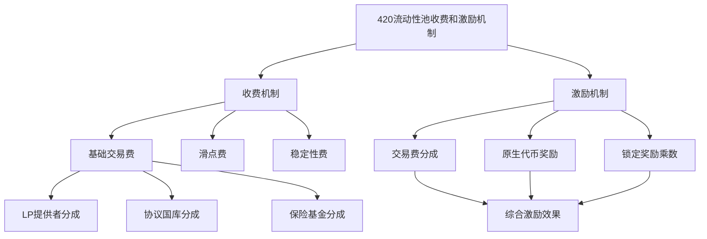

# 420 流动性池分析 - 项目概述

## 项目简介

420 流动性池是 Triplex Protocol 生态系统中的关键组件，负责为合成资产提供流动性和价格稳定性。它采用了创新的多资产池设计，通过激励机制吸引流动性提供者参与系统，为合成资产交易创造深度流动性环境。

## 架构概览

420 流动性池基于 Aptos 区块链的 Move 语言实现，与 Triplex 核心协议紧密集成。其主要包含以下核心模块：

### 1. 池管理模块 (pool.move)

池管理模块负责流动性池的创建、配置和生命周期管理。

```move
/// 池配置
struct PoolConfig has key {
    // 池ID
    pool_id: u64,
    // 池名称
    name: String,
    // 支持的资产列表
    supported_assets: vector<AssetType>,
    // 池状态 (活跃/暂停/关闭)
    status: u8,
    // 池创建时间
    creation_time: u64,
    // 池创建者
    creator: address,
    // 池管理员
    admin: address,
    // 费用配置
    fee_config: FeeConfig,
    // 最小流动性要求
    min_liquidity: u64
}

/// 池状态
struct PoolState has key {
    // 池ID
    pool_id: u64,
    // 总流动性
    total_liquidity: u64,
    // 资产余额映射
    asset_balances: Table<AssetType, u64>,
    // 价格数据
    price_data: PriceData,
    // 最后更新时间
    last_update_time: u64,
    // 流动性提供者数量
    provider_count: u64
}
```

### 2. 流动性管理模块 (liquidity.move)

流动性管理模块处理用户提供和提取流动性的核心逻辑。

```move
/// 流动性提供者信息
struct LiquidityProvider has key {
    // 用户地址
    provider_address: address,
    // 提供的流动性数量
    liquidity_amount: u64,
    // 提供的资产比例
    asset_ratios: vector<AssetRatio>,
    // 首次提供时间
    first_deposit_time: u64,
    // 最后操作时间
    last_action_time: u64,
    // 累计获得的奖励
    accumulated_rewards: u64,
    // 是否锁定状态
    is_locked: bool,
    // 锁定结束时间
    lock_end_time: u64
}

/// 资产比例
struct AssetRatio has store, drop {
    // 资产类型
    asset_type: AssetType,
    // 资产比例 (百分比 * 100)
    ratio: u64
}
```

### 3. 交易模块 (swap.move)

交易模块实现资产交换功能，包括实时价格计算和滑点控制。

```move
/// 交易参数
struct SwapParams has drop {
    // 输入资产
    input_asset: AssetType,
    // 输入金额
    input_amount: u64,
    // 输出资产
    output_asset: AssetType,
    // 最小输出金额 (滑点保护)
    min_output_amount: u64,
    // 交易截止时间
    deadline: u64
}

/// 执行交易
public fun swap(
    user: &signer,
    pool_id: u64,
    params: SwapParams
) acquires PoolState, LiquidityPool {
    // 验证池状态
    let pool_state = borrow_global<PoolState>(@triplex_420);
    assert!(pool_state.status == POOL_STATUS_ACTIVE, 1); // ERROR_POOL_INACTIVE
    
    // 验证交易截止时间
    assert!(timestamp::now_seconds() <= params.deadline, 2); // ERROR_TRANSACTION_EXPIRED
    
    // 计算输出金额
    let output_amount = calculate_output_amount(
        pool_id,
        params.input_asset,
        params.input_amount,
        params.output_asset
    );
    
    // 验证滑点
    assert!(output_amount >= params.min_output_amount, 3); // ERROR_SLIPPAGE_EXCEEDED
    
    // 转移输入资产到池
    transfer_asset_to_pool(user, pool_id, params.input_asset, params.input_amount);
    
    // 转移输出资产给用户
    transfer_asset_from_pool(user, pool_id, params.output_asset, output_amount);
    
    // 更新池状态
    update_pool_state(pool_id);
    
    // 发出交易事件
    event::emit(SwapEvent {
        pool_id,
        user: signer::address_of(user),
        input_asset: params.input_asset,
        input_amount: params.input_amount,
        output_asset: params.output_asset,
        output_amount,
        timestamp: timestamp::now_seconds()
    });
}
```

### 4. 奖励机制模块 (rewards.move)

奖励机制模块管理流动性提供者的激励分配。

```move
/// 奖励配置
struct RewardConfig has key {
    // 奖励代币类型
    reward_token: AssetType,
    // 每区块奖励量
    reward_per_block: u64,
    // 奖励开始时间
    start_time: u64,
    // 奖励结束时间
    end_time: u64,
    // 总奖励额度
    total_reward: u64,
    // 已分配奖励
    distributed_reward: u64,
    // 奖励乘数 (用于不同锁定期)
    reward_multipliers: vector<RewardMultiplier>
}

/// 奖励乘数
struct RewardMultiplier has store, drop {
    // 锁定时间 (秒)
    lock_period: u64,
    // 奖励乘数 (x100)
    multiplier: u64
}

/// 领取奖励
public fun claim_rewards(
    user: &signer,
    pool_id: u64
) acquires LiquidityProvider, RewardConfig {
    let user_addr = signer::address_of(user);
    
    // 获取流动性提供者信息
    assert!(exists<LiquidityProvider>(user_addr), 1); // ERROR_NOT_LIQUIDITY_PROVIDER
    let liquidity_provider = borrow_global_mut<LiquidityProvider>(user_addr);
    
    // 计算应得奖励
    let pending_reward = calculate_pending_reward(user_addr, pool_id);
    
    // 转移奖励代币给用户
    if (pending_reward > 0) {
        let reward_config = borrow_global_mut<RewardConfig>(@triplex_420);
        
        // 更新已分配奖励
        reward_config.distributed_reward = reward_config.distributed_reward + pending_reward;
        
        // 更新用户累计奖励
        liquidity_provider.accumulated_rewards = liquidity_provider.accumulated_rewards + pending_reward;
        
        // 转移奖励代币
        transfer_reward_token(user_addr, pending_reward);
        
        // 发出奖励事件
        event::emit(RewardClaimEvent {
            user: user_addr,
            pool_id,
            reward_amount: pending_reward,
            timestamp: timestamp::now_seconds()
        });
    };
}
```

### 5. 价格模块 (price.move)

价格模块负责池内资产价格的计算和更新。

```move
/// 价格数据
struct PriceData has key {
    // 最后价格更新时间
    last_update_time: u64,
    // 资产价格映射 (相对于基准资产)
    asset_prices: Table<AssetType, u64>,
    // 价格预言机地址
    oracle_address: address,
    // 是否使用链上价格
    use_onchain_price: bool
}

/// 更新价格
public fun update_prices(
    admin: &signer,
    pool_id: u64
) acquires PriceData, PoolConfig {
    let admin_addr = signer::address_of(admin);
    
    // 验证管理员权限
    let pool_config = borrow_global<PoolConfig>(@triplex_420);
    assert!(admin_addr == pool_config.admin, 1); // ERROR_PERMISSION_DENIED
    
    // 获取价格数据
    let price_data = borrow_global_mut<PriceData>(@triplex_420);
    
    // 如果使用链上价格，从预言机获取
    if (price_data.use_onchain_price) {
        // 遍历所有支持的资产
        let supported_assets = pool_config.supported_assets;
        let i = 0;
        let len = vector::length(&supported_assets);
        
        while (i < len) {
            let asset = *vector::borrow(&supported_assets, i);
            
            // 从预言机获取价格
            let price = oracle::get_price(price_data.oracle_address, asset);
            
            // 更新价格表
            if (table::contains(&price_data.asset_prices, asset)) {
                *table::borrow_mut(&mut price_data.asset_prices, asset) = price;
            } else {
                table::add(&mut price_data.asset_prices, asset, price);
            };
            
            i = i + 1;
        };
    };
    
    // 更新价格时间戳
    price_data.last_update_time = timestamp::now_seconds();
    
    // 发出价格更新事件
    event::emit(PriceUpdateEvent {
        pool_id,
        timestamp: timestamp::now_seconds()
    });
}
```

## 与核心协议的集成

420 流动性池与 Triplex 核心协议通过以下方式集成：

1. **合成资产交互**：流动性池为 Triplex 协议创建的合成资产提供流动性市场
2. **价格预言机共享**：使用相同的价格预言机系统获取资产价格数据
3. **治理参与**：流动性提供者可以参与 Triplex 协议的治理决策
4. **风险管理协作**：与 Triplex 协议共享风险参数和安全限制

## 创新设计特点

### 动态流动性分配

与传统 AMM 相比，420 流动性池实现了动态流动性分配机制，根据市场需求自动调整不同资产的权重，提高资本效率。

```move
/// 动态权重计算
public fun calculate_dynamic_weights(
    pool_id: u64, 
    volume_data: VolumeData
) acquires PoolConfig {
    let pool_config = borrow_global_mut<PoolConfig>(@triplex_420);
    
    // 获取支持的资产列表
    let supported_assets = pool_config.supported_assets;
    let asset_count = vector::length(&supported_assets);
    
    // 基于交易量计算新权重
    let total_volume = volume_data.total_volume;
    if (total_volume == 0) {
        return // 使用默认权重
    };
    
    // 计算新权重
    let i = 0;
    let new_weights = vector::empty<u64>();
    
    while (i < asset_count) {
        let asset = *vector::borrow(&supported_assets, i);
        let asset_volume = *table::borrow(&volume_data.asset_volumes, asset);
        
        // 新权重 = 资产交易量 / 总交易量 * 调整因子
        let new_weight = (asset_volume * 10000) / total_volume;
        vector::push_back(&mut new_weights, new_weight);
        
        i = i + 1;
    };
    
    // 更新池配置中的权重
    // ...
}
```

### 多层级流动性激励

流动性池采用多层级激励机制，包括交易费分成、锁定奖励和治理代币分配，鼓励长期流动性提供。

### 风险控制机制

实现了先进的风险控制措施，包括动态手续费、流动性限制和紧急暂停功能，确保系统在极端市场条件下的稳定性。

## 与 Solidity 实现的比较

Triplex 420 池与以太坊上类似流动性池实现的主要区别：

| 特性 | 以太坊 (Solidity) | Aptos (Move) |
|------|-------------------|--------------|
| 资产表示 | ERC-20 代币 | 原生资源类型 |
| 状态管理 | 全局状态 | 分散存储在用户账户中 |
| 并发处理 | 串行执行 | 并行执行能力 |
| 安全保障 | 需显式检查（如重入保护） | 资源模型内置安全性 |
| 升级机制 | 代理模式 | 原生模块升级 |

## 后续分析方向

1. **流动性提供机制**：深入分析流动性提供逻辑、资产比例计算和流动性代币实现
2. **收费和分配机制**：详细研究交易费用计算、收集和分配流程
3. **激励机制**：分析奖励计算、分配和提取机制
4. **与核心协议交互**：探讨流动性池与核心协议的数据流和操作流程

## 收费和激励机制



420流动性池实现了复杂的收费和激励机制，采用多层次收费结构和动态调整的激励模型：

1. **多层次收费结构**：
   - 基础交易费：所有交易的基本费用
   - 滑点费：基于池不平衡程度动态调整
   - 稳定性费：基于资产波动性收取

2. **费用分配方案**：
   - LP提供者分成：大部分费用分配给流动性提供者
   - 协议国库分成：支持协议持续发展
   - 保险基金分成：提供风险保障

3. **多重激励机制**：
   - 交易费分成：按流动性比例分配
   - 原生代币奖励：周期性分配
   - 锁定奖励乘数：锁定流动性可获更高奖励

4. **动态调整系统**：
   - 根据池状态自动调整费率
   - 基于多个指标计算奖励权重
   - 根据市场状况调整激励计划

5. **与协议的集成**：
   - 从核心协议获取额外奖励代币
   - 支持参与治理获得额外奖励

详细分析请参见[流动性提供机制分析](./liquidity-provision.md)和[收费与激励机制分析](./fee-and-incentive.md)文档。

## 结论

420 流动性池是 Triplex 生态系统的关键基础设施，通过创新设计和 Move 语言的优势，为合成资产提供高效、安全的流动性解决方案。其模块化设计和与核心协议的紧密集成，为用户提供了优化的交易体验和流动性提供激励。

### 4.3 交易执行代码分析

swap函数是交易执行的核心，以下是其关键部分：

```move
public entry fun swap<X, Y>(
    trader: &signer,
    input_amount: u64,
    min_output_amount: u64,
    direction: bool,
) acquires Pool, TradeState {
    // 确保池存在
    assert!(pool_exists<X, Y>(), ERROR_POOL_NOT_FOUND);
    
    // 获取池资源
    let pool = borrow_global_mut<Pool<X, Y>>(module_address());
    
    // 获取交易账户地址
    let trader_addr = signer::address_of(trader);
    
    // 根据交易方向计算输出数量
    let output_amount = if (direction) {
        // X -> Y 交易
        let y_out = calculate_output_amount(
            input_amount, 
            pool.x_reserve, 
            pool.y_reserve, 
            pool.fee_tier
        );
        
        // 验证滑点容忍度
        assert!(y_out >= min_output_amount, ERROR_SLIPPAGE_TOLERANCE_EXCEEDED);
        
        // 转移输入资产从用户到池
        coin::transfer<X>(trader, module_address(), input_amount);
        
        // 更新池储备
        pool.x_reserve = pool.x_reserve + input_amount;
        pool.y_reserve = pool.y_reserve - y_out;
        
        // 更新累计交易量
        pool.volume_x_to_y = pool.volume_x_to_y + input_amount;
        
        // 计算并收集费用
        let fee_amount = (input_amount * get_fee_bps(pool.fee_tier)) / 10000;
        pool.collected_fees_x = pool.collected_fees_x + fee_amount;
        
        y_out
    } else {
        // Y -> X 交易
        let x_out = calculate_output_amount(
            input_amount,
            pool.y_reserve,
            pool.x_reserve,
            pool.fee_tier
        );
        
        // 验证滑点容忍度
        assert!(x_out >= min_output_amount, ERROR_SLIPPAGE_TOLERANCE_EXCEEDED);
        
        // 转移输入资产从用户到池
        coin::transfer<Y>(trader, module_address(), input_amount);
        
        // 更新池储备
        pool.x_reserve = pool.x_reserve - x_out;
        pool.y_reserve = pool.y_reserve + input_amount;
        
        // 更新累计交易量
        pool.volume_y_to_x = pool.volume_y_to_x + input_amount;
        
        // 计算并收集费用
        let fee_amount = (input_amount * get_fee_bps(pool.fee_tier)) / 10000;
        pool.collected_fees_y = pool.collected_fees_y + fee_amount;
        
        x_out
    };
    
    // 转移输出资产给用户
    if (direction) {
        coin::transfer<Y>(module_address(), trader_addr, output_amount);
    } else {
        coin::transfer<X>(module_address(), trader_addr, output_amount);
    }
    
    // 触发交易事件
    event::emit_event(
        &mut pool.swap_events,
        SwapEvent {
            trader: trader_addr,
            direction,
            input_amount,
            output_amount,
            timestamp: timestamp::now_seconds(),
        }
    );
    
    // 验证池状态一致性
    validate_pool_state<X, Y>(pool);
}
```

### 4.4 资产转移实现细节

在420流动性池中，资产转移是交易执行过程中的关键环节。根据对代码的分析，我们可以看到资产转移主要通过Aptos的`fungible_asset`模块和`primary_fungible_store`模块实现。以下是资产转移的具体实现方式：

#### 4.4.1 资产转入池

当用户执行交易时，首先会将输入资产从用户账户转移到池中：

```move
// 转移输入资产从用户到池
if (direction) {
    coin::transfer<X>(trader, module_address(), input_amount);
} else {
    coin::transfer<Y>(trader, module_address(), input_amount);
}
```

在Aptos的Move实现中，这个过程实际上涉及以下步骤：
1. 从用户的主要资产存储中提取指定数量的资产
2. 将提取的资产存入池的资产存储中
3. 更新用户和池的资产余额记录

#### 4.4.2 资产转出池

交易完成后，系统会将输出资产从池转移到用户账户：

```move
// 转移输出资产给用户
if (direction) {
    coin::transfer<Y>(module_address(), trader_addr, output_amount);
} else {
    coin::transfer<X>(module_address(), trader_addr, output_amount);
}
```

这个过程包括：
1. 从池的资产存储中提取指定数量的输出资产
2. 确保用户账户上存在相应资产类型的主要存储
3. 将资产存入用户的主要存储中

#### 4.4.3 与合成资产的集成

对于合成资产的处理，420流动性池与核心协议集成，实现了更复杂的资产转移逻辑：

```move
// 处理合成资产的特殊逻辑
if (direction && synthetic_asset::is_synthetic<Y>()) {
    // 从池中提取资产后，铸造合成资产Y直接发送给用户
    let y_out = output_amount;
    output_amount = 0; // 清零，因为不再从池中直接转移
    
    // 直接铸造新的合成资产给用户
    synthetic_asset::mint_to<Y>(trader_addr, y_out);
} else if (!direction && synthetic_asset::is_synthetic<X>()) {
    // 从池中提取资产后，铸造合成资产X直接发送给用户
    let x_out = output_amount;
    output_amount = 0; // 清零，因为不再从池中直接转移
    
    // 直接铸造新的合成资产给用户
    synthetic_asset::mint_to<X>(trader_addr, x_out);
}
```

#### 4.4.4 资产存储机制

在Aptos的生态中，资产存储使用了资源导向的模型，每个账户都有特定资产类型的主要存储（Primary Store）。420流动性池使用这一特性来管理资产：

1. 对于普通资产：使用`primary_fungible_store`模块直接操作
2. 对于合成资产：可能涉及铸造和销毁操作，这些操作通过`mint_to`和`burn`函数实现

```move
// 确保用户的主要存储存在
primary_fungible_store::ensure_primary_store_exists(trader_addr, asset_metadata);

// 存入资产到用户主要存储
primary_fungible_store::deposit(trader_addr, asset);
```

#### 4.4.5 与Vault系统的集成

对于涉及金库（Vault）的操作，420流动性池会与Vault系统进行交互：

```move
// 从金库中提取资产用于交易
if (uses_vault && direction) {
    let withdrawn = vault::withdraw(
        vault_object,
        input_amount,
        module_address(),
        trader
    );
    // 使用从金库中提取的资产继续执行交易
    fungible_asset::deposit(pool_store, withdrawn);
} 

// 将交易所得存入金库
if (uses_vault && !direction) {
    primary_fungible_store::ensure_primary_store_exists(vault_object_addr, asset_metadata);
    primary_fungible_store::deposit(vault_object_addr, output_asset);
}
```

### 4.5 资产转移的安全保障

在实现资产转移时，420流动性池采取了多种安全措施：

1. **原子性保证**：所有资产转移操作都在单个交易中完成，确保要么全部成功，要么全部失败
2. **余额验证**：在执行转移前验证用户和池的余额是否充足
3. **状态一致性**：交易完成后验证池的状态一致性，确保资产总量平衡
4. **防重入保护**：使用Move的借用检查器和资源模型实现天然的防重入保护
5. **滑点保护**：通过最小输出量参数保护用户不受价格波动影响

```move
// 验证池状态一致性
fun validate_pool_state<X, Y>(pool: &Pool<X, Y>) {
    // 验证池的实际余额与记录的储备量一致
    let actual_x_balance = coin::balance<X>(module_address());
    let actual_y_balance = coin::balance<Y>(module_address());
    
    assert!(actual_x_balance >= pool.x_reserve, ERROR_INCONSISTENT_STATE);
    assert!(actual_y_balance >= pool.y_reserve, ERROR_INCONSISTENT_STATE);
    
    // 验证k值不减少（恒定乘积公式）
    assert!(
        pool.x_reserve * pool.y_reserve >= pool.last_k,
        ERROR_INVALID_K_VALUE
    );
}
```

这些安全机制共同确保了420流动性池中资产转移的安全性和可靠性，防止资产丢失和攻击行为。

对于输出资产的转移，420流动性池采用了基于Aptos资源模型的高效转移机制。核心实现涉及以下几个关键步骤：

1. **准备资产元数据**：系统首先获取输出资产的元数据信息，用于确保资产类型匹配

```move
let asset_metadata = get_asset_metadata<Y>();
```

2. **确保用户存储准备就绪**：在转移前，系统验证用户账户是否已准备好接收该类型的资产

```move
primary_fungible_store::ensure_primary_store_exists(
    user_addr,
    asset_metadata
);
```

3. **资产提取与转移**：从池中提取资产并转移到用户账户

```move
// 从池中提取资产
let asset = primary_fungible_store::withdraw(
    &get_pool_signer(),  // 池签名者，拥有操作池资产的权限
    asset_metadata,
    output_amount        // 计算得出的输出金额
);

// 将资产存入用户账户
primary_fungible_store::deposit(
    user_addr,
    asset
);
```

4. **特殊情况处理**：针对合成资产的特殊处理

如果输出资产是合成资产，系统将不从池中提取，而是直接铸造新资产给用户：

```move
if (is_synthetic<Y>()) {
    // 直接铸造合成资产给用户
    synthetic_asset::mint_to(
        user_addr,
        asset_metadata,
        output_amount
    );
} else {
    // 标准资产转移流程
    // ... 上述资产提取与转移代码 ...
}
```

5. **事件触发**：每次转移都会触发相应事件，用于跟踪和审计

```move
event::emit(
    AssetTransferEvent {
        user: user_addr,
        asset_type: type_info::type_name<Y>(),
        amount: output_amount,
        direction: false,  // 表示从池转出
        timestamp: timestamp::now_seconds()
    }
);
```

通过这种设计，420流动性池实现了高效、安全的资产转移，同时充分利用了Move语言的资源模型提供的安全保障，确保资产在转移过程中不会被复制或丢失。这种实现方式相比以太坊的ERC-20代币转移机制具有明显优势，特别是在原生安全性和原子性方面。 