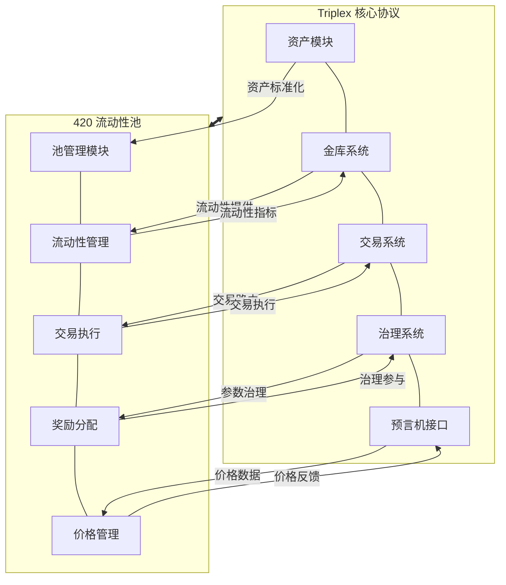
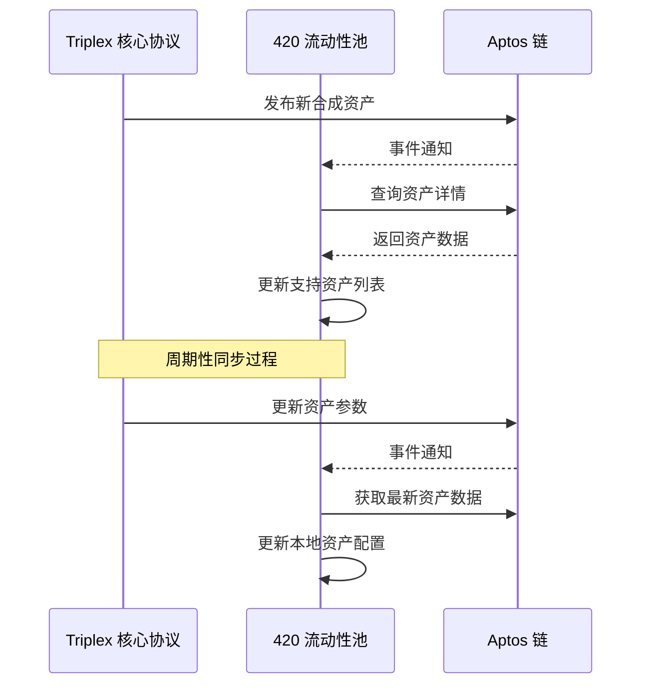
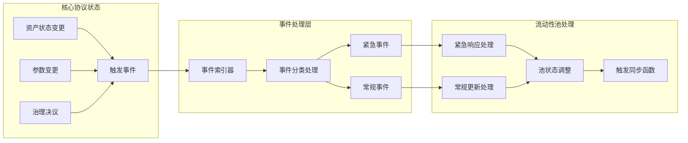
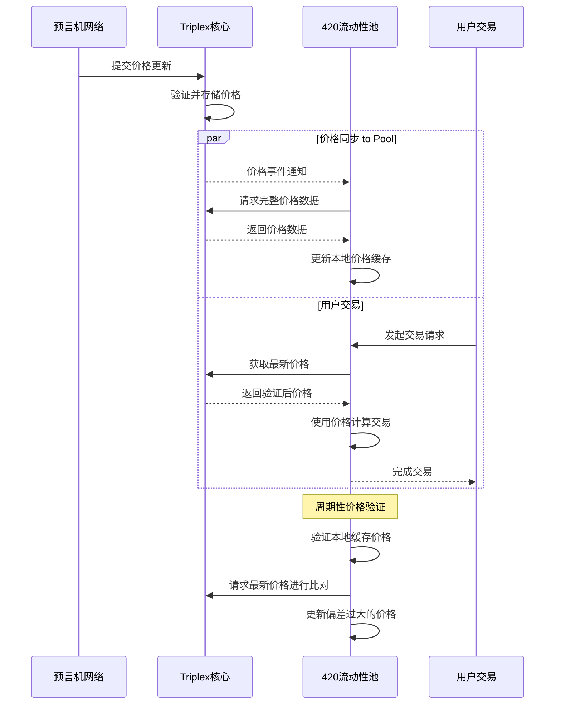
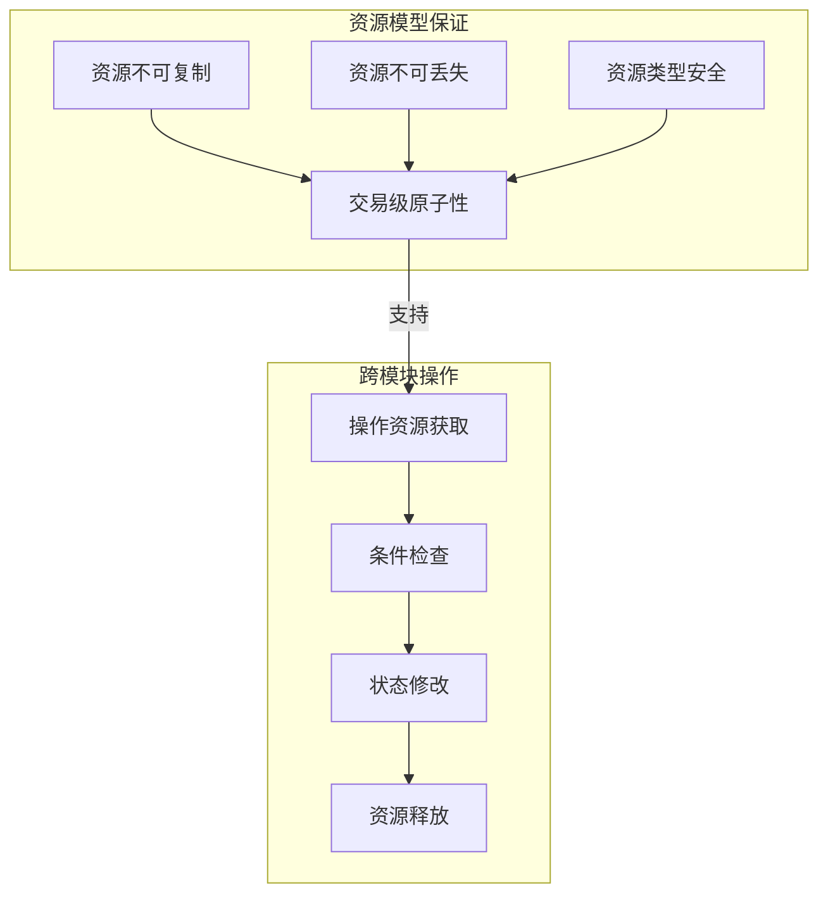
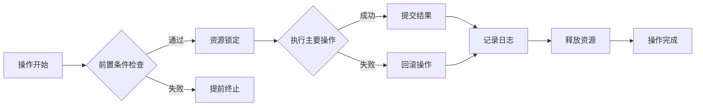
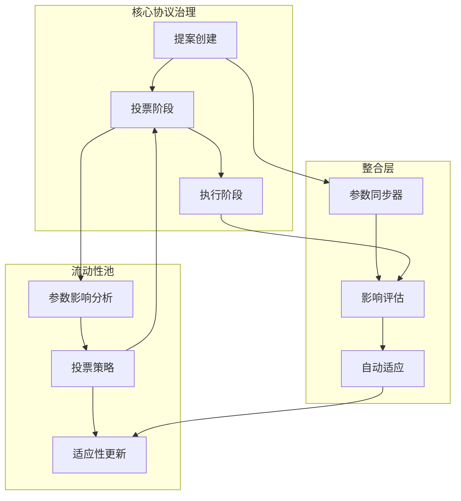
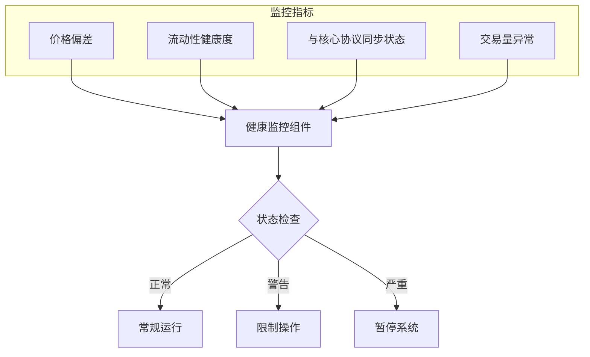
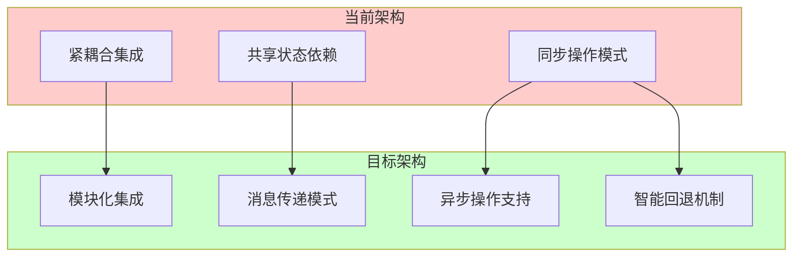

# 420 流动性池 - 与 Triplex 核心协议的交互分析

## 概述

420 流动性池作为 Triplex 生态系统的关键基础设施，与核心协议之间存在复杂而紧密的交互关系。本文档深入分析这些交互机制，揭示流动性池如何与核心协议协同工作，确保系统的稳定性、安全性和高效性。

## 系统架构概览



## 数据同步机制

### 资产数据同步

420 流动性池与 Triplex 核心协议之间的资产数据同步是通过资源型数据模型和事件订阅实现的：



资产同步的核心实现：

```move
/// 同步资产数据
public entry fun sync_asset_data(
    admin: &signer
) acquires PoolConfig {
    let admin_addr = signer::address_of(admin);
    let pool_config = borrow_global_mut<PoolConfig>(@triplex_420);
    
    // 验证管理员权限
    assert!(admin_addr == pool_config.admin, ERROR_PERMISSION_DENIED);
    
    // 从核心协议获取最新支持的资产列表
    let core_assets = triplex::assets::get_supported_assets();
    
    // 筛选符合池条件的资产
    let filtered_assets = vector::empty<AssetType>();
    let i = 0;
    let len = vector::length(&core_assets);
    
    while (i < len) {
        let asset = *vector::borrow(&core_assets, i);
        
        // 检查资产是否符合池要求
        if (is_asset_eligible_for_pool(asset)) {
            vector::push_back(&mut filtered_assets, asset);
        };
        
        i = i + 1;
    };
    
    // 更新池支持的资产列表
    pool_config.supported_assets = filtered_assets;
    
    // 发出资产同步事件
    event::emit(AssetSyncEvent {
        pool_id: pool_config.pool_id,
        asset_count: vector::length(&filtered_assets),
        timestamp: timestamp::now_seconds()
    });
}
```

### 参数同步与更新

系统参数同步采用了双向通信模式，确保核心协议和流动性池之间的参数始终保持一致：

```move
/// 同步系统参数
public entry fun sync_system_params(
    admin: &signer
) acquires PoolConfig, FeeConfig {
    let admin_addr = signer::address_of(admin);
    let pool_config = borrow_global<PoolConfig>(@triplex_420);
    
    // 验证管理员权限
    assert!(admin_addr == pool_config.admin, ERROR_PERMISSION_DENIED);
    
    // 获取核心协议参数
    let core_params = triplex::params::get_global_params();
    
    // 更新本地参数
    let fee_config = borrow_global_mut<FeeConfig>(@triplex_420);
    
    // 应用核心协议的全局限制
    if (core_params.max_fee_rate < fee_config.base_fee_rate) {
        fee_config.base_fee_rate = core_params.max_fee_rate;
    };
    
    // 同步协议费用分成比例
    fee_config.protocol_fee_share = core_params.protocol_fee_share;
    
    // 同步保险基金分成比例
    fee_config.insurance_fund_share = core_params.insurance_fund_share;
    
    // 发出参数同步事件
    event::emit(ParamSyncEvent {
        pool_id: pool_config.pool_id,
        sync_time: timestamp::now_seconds()
    });
}
```

### 状态通知机制



## 价格预言机集成

420 流动性池与 Triplex 核心协议共享相同的价格预言机系统，这种集成确保了整个生态系统的价格一致性：

### 预言机访问接口

```move
/// 预言机集成模块
module triplex_420::oracle_integration {
    use std::error;
    use std::signer;
    use aptos_framework::timestamp;
    use triplex::oracle::{Self, PriceData, PriceFeed};
    
    // 错误码
    const ERROR_STALE_PRICE: u64 = 1;
    const ERROR_INVALID_PRICE: u64 = 2;
    const ERROR_PERMISSION_DENIED: u64 = 3;
    
    /// 获取资产价格 (带验证)
    public fun get_validated_price(
        asset_type: AssetType
    ): u64 acquires OracleConfig {
        let oracle_config = borrow_global<OracleConfig>(@triplex_420);
        
        // 从核心协议获取价格
        let price_data = triplex::oracle::get_price_data(asset_type);
        
        // 验证价格时效性
        let current_time = timestamp::now_seconds();
        let price_timestamp = price_data.last_update_time;
        
        assert!(
            current_time - price_timestamp <= oracle_config.max_price_age,
            error::invalid_state(ERROR_STALE_PRICE)
        );
        
        // 验证价格有效性
        assert!(
            price_data.price > 0,
            error::invalid_state(ERROR_INVALID_PRICE)
        );
        
        price_data.price
    }
    
    /// 预言机配置
    struct OracleConfig has key {
        oracle_address: address,
        max_price_age: u64,
        price_deviation_threshold: u64,
        is_fallback_enabled: bool,
        fallback_prices: Table<AssetType, u64>
    }
}
```

### 价格数据流动



### 价格偏差处理

```move
/// 验证并处理价格偏差
public fun handle_price_deviation() acquires PoolState, OracleConfig {
    let pool_state = borrow_global_mut<PoolState>(@triplex_420);
    let oracle_config = borrow_global<OracleConfig>(@triplex_420);
    
    // 获取池支持的所有资产
    let supported_assets = get_supported_assets();
    
    let i = 0;
    let len = vector::length(&supported_assets);
    let has_significant_deviation = false;
    
    while (i < len) {
        let asset = *vector::borrow(&supported_assets, i);
        
        // 获取池本地价格
        let local_price = *table::borrow(&pool_state.asset_prices, asset);
        
        // 从核心协议获取最新价格
        let core_price = triplex::oracle::get_price(asset);
        
        // 计算偏差比例
        let deviation = if (local_price > core_price) {
            ((local_price - core_price) * 10000) / local_price
        } else {
            ((core_price - local_price) * 10000) / core_price
        };
        
        // 检查偏差是否超过阈值
        if (deviation > oracle_config.price_deviation_threshold) {
            // 更新本地价格
            *table::borrow_mut(&mut pool_state.asset_prices, asset) = core_price;
            has_significant_deviation = true;
            
            // 记录价格更新事件
            event::emit(PriceDeviationEvent {
                asset,
                old_price: local_price,
                new_price: core_price,
                deviation,
                timestamp: timestamp::now_seconds()
            });
        };
        
        i = i + 1;
    };
    
    // 如果存在显著偏差，暂停敏感操作
    if (has_significant_deviation && oracle_config.auto_safety_measures) {
        pause_sensitive_operations();
    };
}
```

## 跨模块操作的原子性保证

### 资源型编程模式

Move 语言的资源模型为跨模块操作提供了天然的原子性保证：



### 批处理交易模式

复杂的跨模块操作采用批处理模式，确保全部操作要么成功要么失败：

```move
/// 批量处理跨模块操作
public entry fun batch_process_operations(
    admin: &signer,
    operations: vector<OperationType>
) acquires PoolState, CoreIntegration {
    let admin_addr = signer::address_of(admin);
    
    // 验证权限
    assert_has_permission(admin_addr);
    
    // 获取核心集成资源
    let core_integration = borrow_global_mut<CoreIntegration>(@triplex_420);
    
    // 创建批次ID
    let batch_id = core_integration.next_batch_id;
    core_integration.next_batch_id = batch_id + 1;
    
    // 注册批次开始
    triplex::batch::register_batch_start(batch_id);
    
    // 处理所有操作
    let i = 0;
    let len = vector::length(&operations);
    
    while (i < len) {
        let operation = *vector::borrow(&operations, i);
        
        // 根据操作类型执行对应的处理
        match operation {
            OperationType::SyncAssets => sync_assets_internal(batch_id),
            OperationType::UpdateFees => update_fees_internal(batch_id),
            OperationType::SyncPrices => sync_prices_internal(batch_id),
            OperationType::DistributeRewards => distribute_rewards_internal(batch_id),
            OperationType::UpdateParams => update_params_internal(batch_id)
        };
        
        i = i + 1;
    };
    
    // 提交批次完成
    triplex::batch::register_batch_complete(batch_id);
    
    // 发出批处理完成事件
    event::emit(BatchProcessEvent {
        batch_id,
        operation_count: len,
        timestamp: timestamp::now_seconds()
    });
}
```

### 错误处理与恢复机制



核心代码实现：

```move
/// 交易系统与核心协议集成
public fun execute_integrated_swap(
    user: &signer,
    params: SwapParams
) acquires PoolState, CoreIntegration {
    let user_addr = signer::address_of(user);
    
    // 获取集成状态
    let core_integration = borrow_global<CoreIntegration>(@triplex_420);
    assert!(core_integration.integration_active, ERROR_INTEGRATION_INACTIVE);
    
    // 步骤1: 锁定操作状态（确保原子性）
    start_atomic_operation(OPERATION_SWAP);
    
    // 步骤2: 验证用户状态
    let is_user_valid = triplex::user::validate_user_status(user_addr);
    assert!(is_user_valid, ERROR_USER_INVALID);
    
    // 步骤3: 验证预言机价格
    let input_price = get_validated_price(params.input_asset);
    let output_price = get_validated_price(params.output_asset);
    
    // 步骤4: 执行本地交易逻辑
    let result = execute_swap_internal(user, params, input_price, output_price);
    
    // 步骤5: 与核心协议同步
    triplex::trading::register_trade(
        user_addr,
        params.input_asset,
        params.input_amount,
        params.output_asset,
        result.output_amount
    );
    
    // 步骤6: 更新流动性指标
    update_liquidity_metrics(params.input_asset, params.output_asset);
    
    // 步骤7: 结束原子操作
    end_atomic_operation(OPERATION_SWAP);
    
    // 步骤8: 发出集成交易事件
    event::emit(IntegratedSwapEvent {
        user: user_addr,
        input_asset: params.input_asset,
        input_amount: params.input_amount,
        output_asset: params.output_asset,
        output_amount: result.output_amount,
        timestamp: timestamp::now_seconds()
    });
}
```

## 升级和治理互操作性

### 参数治理机制

420 流动性池参与 Triplex 核心协议的参数治理过程，实现系统级协调：



### 协议升级协调

```move
/// 处理协议升级
public entry fun handle_protocol_upgrade(
    admin: &signer,
    upgrade_info: UpgradeInfo
) acquires PoolConfig, CoreIntegration {
    let admin_addr = signer::address_of(admin);
    let pool_config = borrow_global<PoolConfig>(@triplex_420);
    
    // 验证管理员权限
    assert!(admin_addr == pool_config.admin, ERROR_PERMISSION_DENIED);
    
    // 解析升级信息
    let core_version = upgrade_info.core_version;
    let required_pool_version = upgrade_info.required_pool_version;
    let current_pool_version = pool_config.version;
    
    // 验证版本兼容性
    assert!(
        current_pool_version >= required_pool_version,
        ERROR_VERSION_INCOMPATIBLE
    );
    
    // 获取集成状态
    let core_integration = borrow_global_mut<CoreIntegration>(@triplex_420);
    
    // 更新集成参数
    core_integration.integrated_core_version = core_version;
    core_integration.last_upgrade_time = timestamp::now_seconds();
    
    // 根据需要更新集成模式
    if (upgrade_info.integration_mode != core_integration.current_integration_mode) {
        update_integration_mode(upgrade_info.integration_mode);
    };
    
    // 发出升级处理事件
    event::emit(ProtocolUpgradeEvent {
        core_version,
        pool_version: current_pool_version,
        integration_mode: core_integration.current_integration_mode,
        timestamp: timestamp::now_seconds()
    });
}
```

### 治理参与机制

流动性提供者可以通过 420 池参与 Triplex 核心协议的治理决策：

```move
/// 代表池流动性提供者参与治理投票
public entry fun participate_in_governance(
    admin: &signer,
    proposal_id: u64,
    vote: bool,
    voting_power_percentage: u64
) acquires PoolConfig, PoolState {
    let admin_addr = signer::address_of(admin);
    let pool_config = borrow_global<PoolConfig>(@triplex_420);
    
    // 验证管理员权限
    assert!(admin_addr == pool_config.admin, ERROR_PERMISSION_DENIED);
    
    // 验证投票力量百分比 (0-100)
    assert!(
        voting_power_percentage <= 100,
        ERROR_INVALID_VOTING_POWER
    );
    
    // 计算可用投票权
    let pool_state = borrow_global<PoolState>(@triplex_420);
    let total_voting_power = calculate_pool_voting_power(pool_state.total_liquidity);
    let applied_voting_power = (total_voting_power * voting_power_percentage) / 100;
    
    // 提交投票到核心协议
    triplex::governance::cast_vote_with_power(
        admin,
        proposal_id,
        vote,
        applied_voting_power
    );
    
    // 记录投票事件
    event::emit(GovernanceVoteEvent {
        proposal_id,
        vote,
        applied_voting_power,
        voting_power_percentage,
        timestamp: timestamp::now_seconds()
    });
}
```

## 健康监控与应急响应

### 系统状态监控



### 应急响应机制

```move
/// 系统健康监控
public entry fun monitor_system_health(
    keeper: &signer
) acquires PoolState, CoreIntegration, HealthConfig {
    let keeper_addr = signer::address_of(keeper);
    
    // 验证Keeper权限
    assert_keeper_permission(keeper_addr);
    
    // 获取健康配置
    let health_config = borrow_global<HealthConfig>(@triplex_420);
    
    // 执行健康检查
    let health_result = run_health_checks();
    
    // 根据健康状况采取行动
    if (health_result.status == HEALTH_STATUS_CRITICAL) {
        // 紧急暂停系统
        pause_system_operations();
        
        // 通知核心协议
        triplex::emergency::report_integrated_system_issue(
            MODULE_ID_420_POOL,
            health_result.status,
            health_result.issue_code
        );
        
        // 发出紧急事件
        event::emit(EmergencyActionEvent {
            status: health_result.status,
            issue_code: health_result.issue_code,
            action: EMERGENCY_ACTION_PAUSE,
            timestamp: timestamp::now_seconds()
        });
    } else if (health_result.status == HEALTH_STATUS_WARNING) {
        // 限制敏感操作
        restrict_sensitive_operations(health_result.issue_code);
        
        // 发出警告事件
        event::emit(SystemWarningEvent {
            status: health_result.status,
            issue_code: health_result.issue_code,
            timestamp: timestamp::now_seconds()
        });
    } else {
        // 系统健康，恢复任何限制（如果之前有）
        if (!health_config.is_system_fully_operational) {
            restore_system_operations();
        };
    };
    
    // 更新最后检查时间
    health_config.last_health_check = timestamp::now_seconds();
}
```

## 系统集成效益与挑战

### 集成优势

Triplex 核心协议与 420 流动性池的紧密集成带来了多方面的系统效益：

1. **统一的价格机制**：共享预言机系统确保整个生态系统价格一致性
2. **流动性聚合**：提高合成资产市场的深度和效率
3. **协调的风险管理**：统一的风险参数和监控有助于系统稳定性
4. **无缝用户体验**：简化用户在不同协议组件间的交互
5. **资源优化**：避免重复实现相同功能，降低系统复杂性

### 集成挑战

同时，这种紧密集成也带来一些技术挑战：

1. **耦合风险**：组件间紧密依赖可能导致故障传播
2. **版本兼容性**：升级协调要求严格的版本管理
3. **状态一致性**：在分布式执行环境中保持状态一致
4. **性能平衡**：交叉模块操作增加了计算复杂性
5. **安全边界**：模块间交互增加了攻击面

## 未来优化方向

### 集成性能优化

```move
/// 批量价格更新优化
public fun optimize_price_updates(
    assets: vector<AssetType>
) acquires PoolState {
    let pool_state = borrow_global_mut<PoolState>(@triplex_420);
    
    // 获取当前时间戳
    let current_time = timestamp::now_seconds();
    
    // 一次性从核心协议获取多个价格
    let price_batch = triplex::oracle::get_prices_batch(assets);
    
    // 批量更新本地价格
    let i = 0;
    let len = vector::length(&assets);
    
    while (i < len) {
        let asset = *vector::borrow(&assets, i);
        let price = *vector::borrow(&price_batch, i);
        
        // 更新价格表
        *table::borrow_mut(&mut pool_state.asset_prices, asset) = price;
        
        i = i + 1;
    };
    
    // 单次更新时间戳
    pool_state.price_last_update = current_time;
    
    // 单次事件发送
    event::emit(BatchPriceUpdateEvent {
        asset_count: len,
        timestamp: current_time
    });
}
```

### 集成架构演进



## 结论

420 流动性池与 Triplex 核心协议的交互机制代表了基于 Move 语言和资源模型的高度集成系统。通过精心设计的数据同步、价格集成、跨模块原子性和治理互操作性，两个组件形成了紧密协作的整体，支撑起 Triplex 生态系统高效、安全的运行。

尽管面临集成带来的技术挑战，Move 语言的资源导向编程模型和 Aptos 区块链的并行执行特性为这种复杂系统提供了坚实的基础。通过持续优化集成架构和性能，Triplex 生态系统将不断提升可扩展性、安全性和用户体验，为合成资产市场提供更有效的流动性解决方案。 