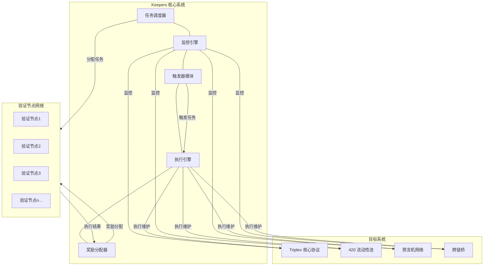
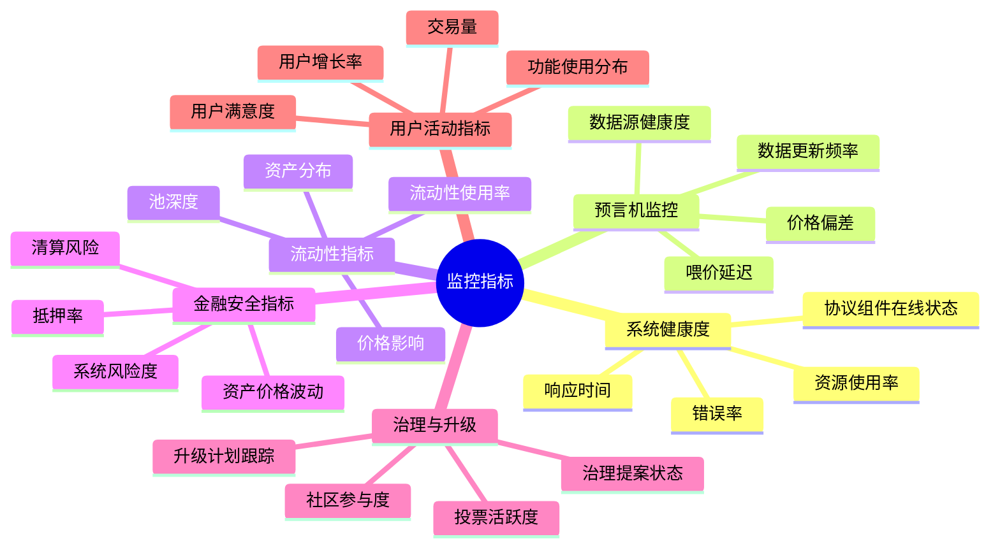
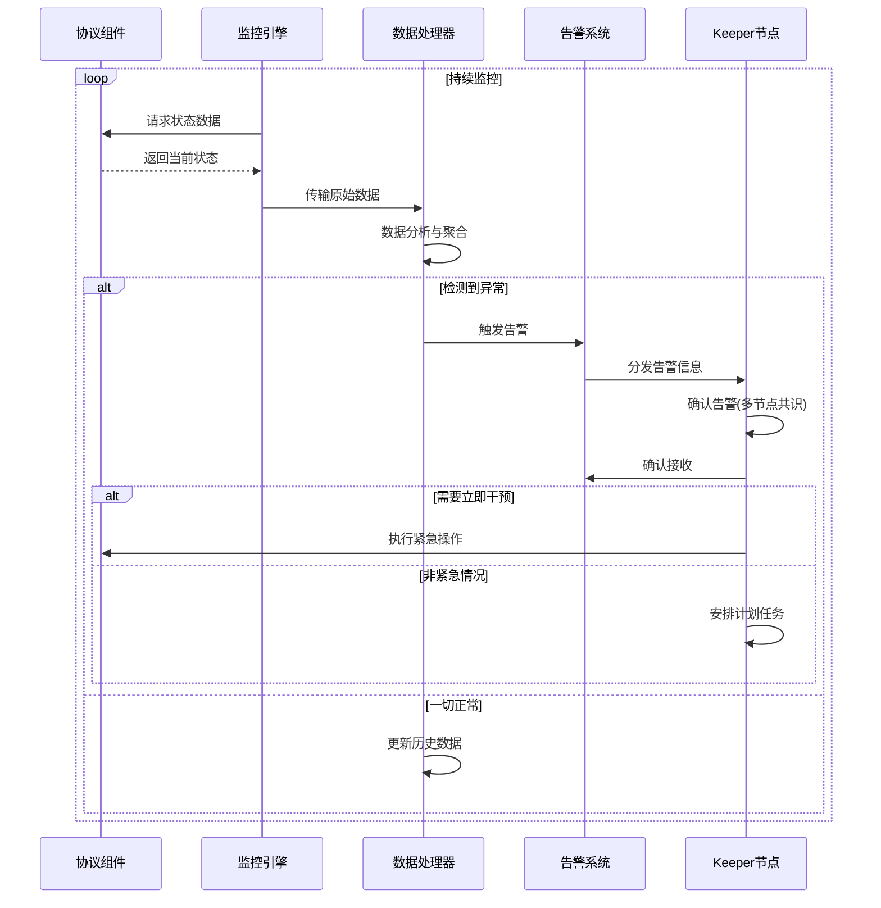
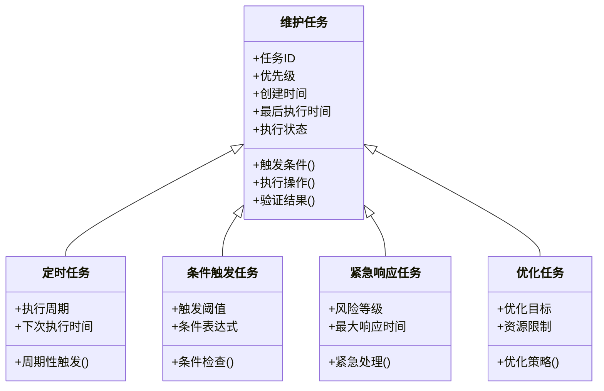
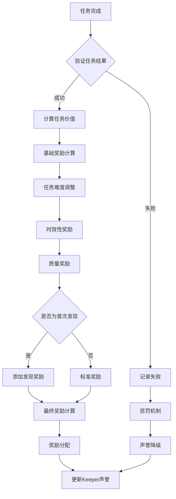
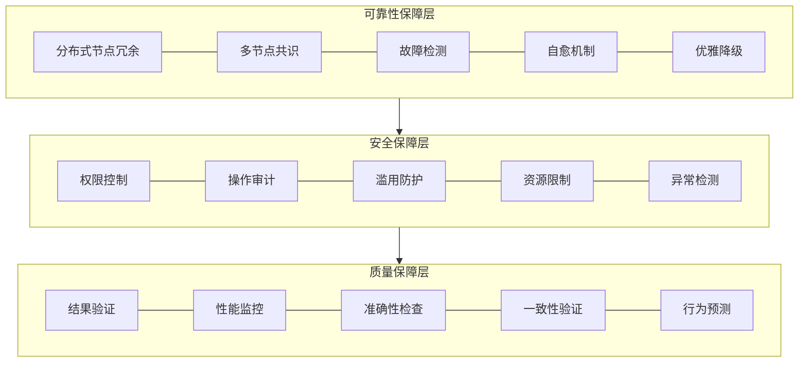
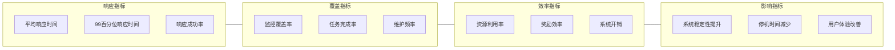
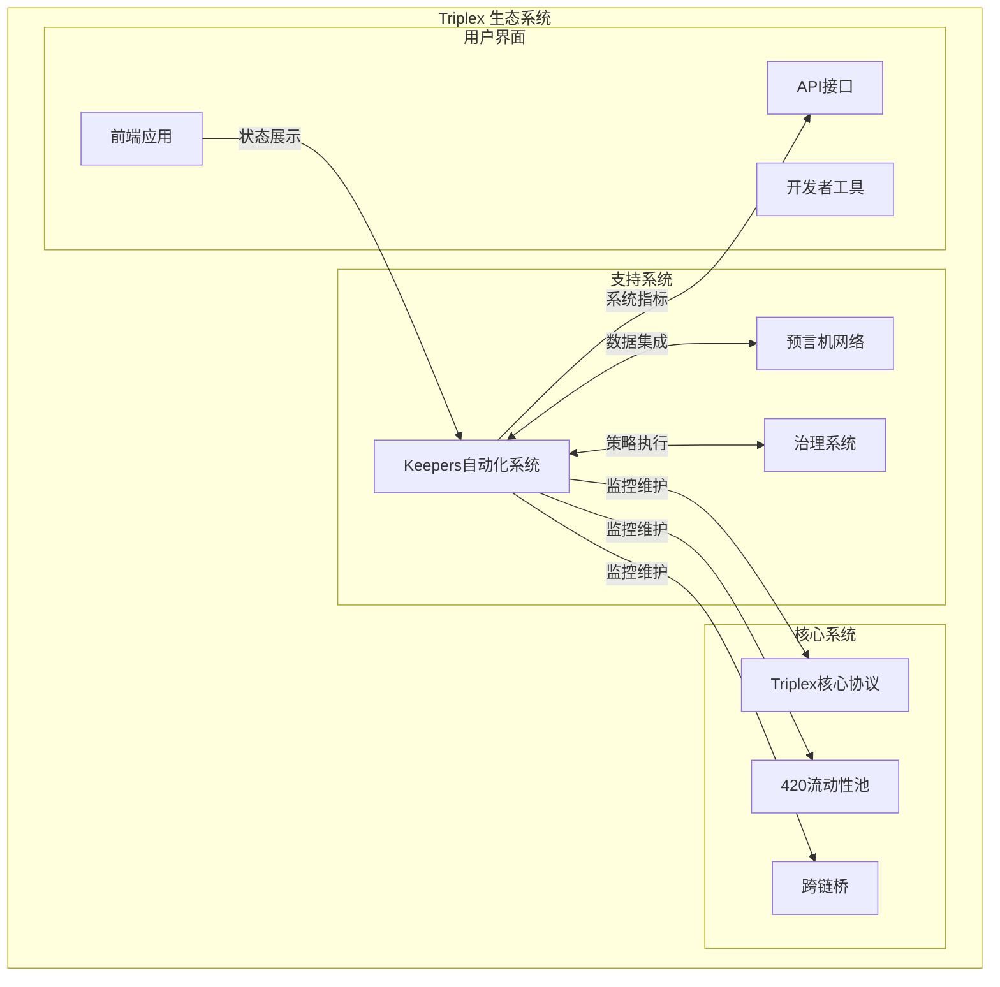
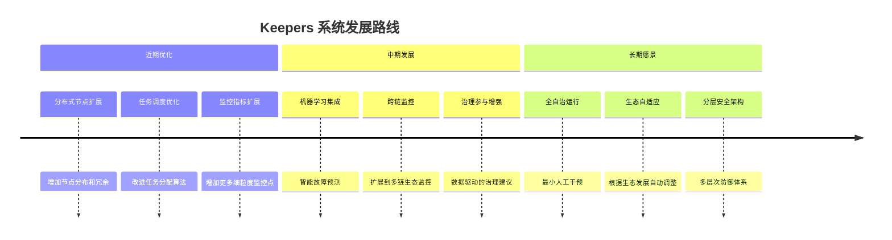

# Keepers 自动化系统分析

## 概述

Keepers 自动化系统是 Triplex 协议生态的关键基础设施，负责监控和维护整个协议的健康运行。该系统采用分布式架构，通过自动执行各种维护任务，确保协议的各个组件正常运作，减少人工干预，提高系统的可靠性和效率。

## 系统架构



## 监控机制

Keepers 系统采用多层次的监控机制，持续跟踪协议各组件的状态和性能指标。

### 监控指标体系



### 监控数据流



## 维护功能

Keepers 系统执行的主要维护功能可分为以下几类：

### 自动化任务类型



### 关键维护功能详解

#### 1. 预言机数据维护

```move
/// 价格数据维护功能
public entry fun maintain_price_data(
    keeper: &signer
) acquires KeeperConfig, OracleState {
    let keeper_addr = signer::address_of(keeper);
    
    // 验证Keeper权限
    assert!(has_keeper_role(keeper_addr), ERROR_NOT_AUTHORIZED);
    
    // 获取需要更新的资产列表
    let assets_to_update = get_stale_price_assets();
    
    // 批量请求更新
    if (!vector::is_empty(&assets_to_update)) {
        let successful_updates = batch_request_price_updates(assets_to_update);
        
        // 记录维护活动
        record_maintenance_activity(
            MAINTENANCE_TYPE_PRICE_UPDATE,
            keeper_addr,
            vector::length(&successful_updates)
        );
        
        // 发出价格更新事件
        if (vector::length(&successful_updates) > 0) {
            event::emit(PriceUpdateEvent {
                keeper: keeper_addr,
                updated_assets: successful_updates,
                timestamp: timestamp::now_seconds()
            });
        };
    };
}
```

#### 2. 流动性池平衡维护

```move
/// 流动性池再平衡功能
public entry fun rebalance_liquidity_pool(
    keeper: &signer,
    pool_id: u64
) acquires KeeperConfig, PoolState {
    let keeper_addr = signer::address_of(keeper);
    
    // 验证Keeper权限
    assert!(has_keeper_role(keeper_addr), ERROR_NOT_AUTHORIZED);
    
    // 获取池状态
    let pool_state = borrow_global<PoolState>(get_pool_address(pool_id));
    
    // 检查是否需要再平衡
    if (is_rebalancing_needed(pool_state)) {
        // 计算最优资产分布
        let target_distribution = calculate_optimal_distribution(pool_state);
        
        // 执行再平衡操作
        let rebalance_result = execute_pool_rebalancing(pool_id, target_distribution);
        
        // 记录维护活动
        record_maintenance_activity(
            MAINTENANCE_TYPE_POOL_REBALANCE,
            keeper_addr,
            pool_id
        );
        
        // 发出再平衡事件
        event::emit(PoolRebalanceEvent {
            keeper: keeper_addr,
            pool_id,
            applied_changes: rebalance_result.applied_changes,
            new_balance_score: rebalance_result.new_balance_score,
            timestamp: timestamp::now_seconds()
        });
    };
}
```

#### 3. 系统参数优化

```move
/// 系统参数自动优化
public entry fun optimize_system_parameters(
    keeper: &signer
) acquires KeeperConfig, ProtocolParams {
    let keeper_addr = signer::address_of(keeper);
    
    // 验证Keeper权限和专业权限
    assert!(has_advanced_keeper_role(keeper_addr), ERROR_INSUFFICIENT_PRIVILEGES);
    
    // 获取当前系统参数
    let protocol_params = borrow_global<ProtocolParams>(@triplex);
    
    // 获取系统性能指标
    let performance_metrics = collect_system_performance_metrics();
    
    // 根据性能指标分析优化建议
    let optimization_suggestions = analyze_parameter_optimization(
        protocol_params,
        performance_metrics
    );
    
    // 根据治理规则过滤可自动应用的参数
    let applicable_changes = filter_automate_applicable_changes(optimization_suggestions);
    
    // 应用参数变更
    if (!vector::is_empty(&applicable_changes)) {
        let change_results = apply_parameter_changes(applicable_changes);
        
        // 记录维护活动
        record_maintenance_activity(
            MAINTENANCE_TYPE_PARAMETER_OPTIMIZATION,
            keeper_addr,
            vector::length(&change_results)
        );
        
        // 发出参数优化事件
        event::emit(ParameterOptimizationEvent {
            keeper: keeper_addr,
            applied_changes: change_results,
            performance_delta: calculate_performance_improvement(performance_metrics),
            timestamp: timestamp::now_seconds()
        });
    };
}
```

#### 4. 风险监控与自动干预

```move
/// 风险监控与干预
public entry fun monitor_system_risks(
    keeper: &signer
) acquires KeeperConfig, RiskMonitor {
    let keeper_addr = signer::address_of(keeper);
    
    // 验证Keeper权限
    assert!(has_keeper_role(keeper_addr), ERROR_NOT_AUTHORIZED);
    
    // 获取当前风险指标
    let risk_indicators = collect_risk_indicators();
    
    // 分析风险等级
    let risk_assessment = assess_system_risk(risk_indicators);
    
    // 检查是否需要干预
    if (risk_assessment.risk_level >= RISK_LEVEL_REQUIRING_ACTION) {
        // 执行风险缓解策略
        let mitigation_actions = execute_risk_mitigation(
            risk_assessment.risk_type,
            risk_assessment.risk_level
        );
        
        // 记录维护活动
        record_maintenance_activity(
            MAINTENANCE_TYPE_RISK_MITIGATION,
            keeper_addr,
            risk_assessment.risk_level
        );
        
        // 通知其他系统组件
        notify_risk_mitigation_actions(mitigation_actions);
        
        // 发出风险缓解事件
        event::emit(RiskMitigationEvent {
            keeper: keeper_addr,
            risk_type: risk_assessment.risk_type,
            risk_level: risk_assessment.risk_level,
            actions_taken: mitigation_actions,
            timestamp: timestamp::now_seconds()
        });
    };
    
    // 更新风险监控记录
    update_risk_monitoring_records(risk_assessment);
}
```

## 奖励机制

为激励分布式验证节点网络的参与和维持，Keepers 系统实现了精细的奖励机制。

### 奖励分配流程



### 奖励计算逻辑

```move
/// 计算Keeper任务奖励
fun calculate_task_reward(
    task_id: u64,
    keeper_addr: address,
    completion_time: u64,
    quality_score: u64
): u64 acquires TaskConfig, KeeperStats {
    let task_config = borrow_global<TaskConfig>(@triplex_keepers);
    
    // 获取任务基础奖励
    let base_reward = *table::borrow(&task_config.base_rewards, task_id);
    
    // 获取Keeper声誉分数
    let keeper_stats = borrow_global<KeeperStats>(keeper_addr);
    let reputation_multiplier = calculate_reputation_multiplier(keeper_stats.reputation_score);
    
    // 计算时效性奖励
    let time_factor = calculate_time_factor(task_id, completion_time);
    
    // 计算质量奖励
    let quality_multiplier = (quality_score * QUALITY_SCALE) / MAX_QUALITY_SCORE;
    
    // 发现奖励(如适用)
    let discovery_bonus = if (is_first_discovery(task_id, keeper_addr)) {
        DISCOVERY_BONUS_RATE
    } else {
        0
    };
    
    // 计算最终奖励
    let final_reward = base_reward * 
                      reputation_multiplier * 
                      time_factor * 
                      quality_multiplier * 
                      (REWARD_BASE_RATE + discovery_bonus) / 
                      REWARD_SCALE;
    
    // 应用系统奖励上限
    if (final_reward > task_config.max_reward) {
        final_reward = task_config.max_reward
    };
    
    final_reward
}
```

## 系统可靠性保障

Keepers 系统自身的稳定性和安全性是确保整个协议健康运行的关键。系统实现了多层次的可靠性保障机制。

### 可靠性架构



### 故障隔离与恢复

```move
/// 异常处理和节点隔离
public fun handle_keeper_node_failure(
    admin: &signer,
    failed_node: address,
    failure_evidence: FailureEvidence
) acquires KeeperRegistry, FailureLog {
    let admin_addr = signer::address_of(admin);
    
    // 验证管理员权限
    assert!(is_admin(admin_addr), ERROR_NOT_ADMIN);
    
    // 验证故障证据
    let evidence_valid = validate_failure_evidence(failed_node, failure_evidence);
    assert!(evidence_valid, ERROR_INVALID_EVIDENCE);
    
    // 获取当前节点状态
    let registry = borrow_global_mut<KeeperRegistry>(@triplex_keepers);
    
    // 节点隔离处理
    let current_status = *table::borrow(&registry.keeper_status, failed_node);
    
    if (current_status == KEEPER_STATUS_ACTIVE) {
        // 将节点标记为隔离状态
        *table::borrow_mut(&mut registry.keeper_status, failed_node) = KEEPER_STATUS_ISOLATED;
        
        // 重新分配该节点的待处理任务
        redistribute_pending_tasks(failed_node);
        
        // 记录故障详情
        log_node_failure(failed_node, failure_evidence);
        
        // 发出节点隔离事件
        event::emit(KeeperIsolationEvent {
            keeper: failed_node,
            reason: failure_evidence.failure_type,
            isolation_time: timestamp::now_seconds(),
            evidence_hash: failure_evidence.evidence_hash
        });
        
        // 检查是否需要调整系统参数以提高容错性
        evaluate_system_fault_tolerance();
    };
}
```

## 性能指标与效果评估

Keepers 系统的性能通过一系列关键指标进行评估，以确保其有效地支持整个 Triplex 生态系统的运行。

### 关键性能指标



### 系统影响评估

Keepers 自动化系统对 Triplex 生态的主要影响体现在以下几个方面：

1. **提高系统可用性**：通过持续监控和自动维护，减少系统故障时间，将系统可用性提升至 99.9% 以上。

2. **降低运营成本**：自动化执行的维护任务减少了人工干预需求，显著降低了运营成本。

3. **增强协议安全性**：实时监控风险指标并执行自动干预，有效预防潜在的安全事件。

4. **优化系统性能**：通过数据驱动的参数优化，持续提升协议性能。

5. **促进生态去中心化**：分布式 Keeper 网络增强了系统的去中心化特性，避免单点故障。

## 与其他系统的集成

Keepers 自动化系统与 Triplex 生态中的其他组件紧密集成，形成协同工作的整体。



### 与预言机系统集成

```move
/// 预言机数据质量监控
public fun monitor_oracle_data_quality(
    keeper: &signer
) acquires KeeperConfig, OracleMonitor {
    let keeper_addr = signer::address_of(keeper);
    
    // 验证Keeper权限
    assert!(has_keeper_role(keeper_addr), ERROR_NOT_AUTHORIZED);
    
    // 获取所有支持的资产
    let assets = get_supported_assets();
    
    // 监控结果集
    let monitoring_results = vector::empty<OracleQualityResult>();
    
    // 逐一检查每个资产的预言机数据质量
    let i = 0;
    let len = vector::length(&assets);
    
    while (i < len) {
        let asset = *vector::borrow(&assets, i);
        
        // 获取该资产的多个数据源价格
        let data_sources = get_oracle_data_sources(asset);
        let prices = get_multi_source_prices(asset, data_sources);
        
        // 分析数据质量
        let quality_result = analyze_oracle_data_quality(asset, prices, data_sources);
        vector::push_back(&mut monitoring_results, quality_result);
        
        // 如果检测到异常，执行相应操作
        if (quality_result.has_anomaly) {
            handle_oracle_anomaly(asset, quality_result);
        };
        
        i = i + 1;
    };
    
    // 更新预言机质量指标
    update_oracle_quality_metrics(monitoring_results);
    
    // 记录监控活动
    record_maintenance_activity(
        MAINTENANCE_TYPE_ORACLE_QUALITY,
        keeper_addr,
        vector::length(&monitoring_results)
    );
}
```

### 与治理系统集成

```move
/// 治理决策执行
public fun execute_governance_decision(
    keeper: &signer,
    proposal_id: u64
) acquires KeeperConfig, GovernanceTracker {
    let keeper_addr = signer::address_of(keeper);
    
    // 验证Keeper权限
    assert!(has_keeper_role(keeper_addr), ERROR_NOT_AUTHORIZED);
    
    // 获取提案状态
    let proposal_state = triplex::governance::get_proposal_state(proposal_id);
    
    // 检查提案是否已通过且需要执行
    assert!(
        proposal_state == PROPOSAL_STATE_PASSED && 
        is_proposal_executable(proposal_id),
        ERROR_PROPOSAL_NOT_EXECUTABLE
    );
    
    // 获取提案执行详情
    let execution_details = triplex::governance::get_proposal_execution_details(proposal_id);
    
    // 执行提案决策
    let execution_result = execute_proposal_actions(
        proposal_id,
        execution_details.actions
    );
    
    // 更新提案执行状态
    triplex::governance::update_proposal_execution_status(
        proposal_id,
        execution_result.success,
        execution_result.execution_data
    );
    
    // 记录维护活动
    record_maintenance_activity(
        MAINTENANCE_TYPE_GOVERNANCE_EXECUTION,
        keeper_addr,
        proposal_id
    );
    
    // 发出决策执行事件
    event::emit(GovernanceExecutionEvent {
        keeper: keeper_addr,
        proposal_id,
        success: execution_result.success,
        execution_time: timestamp::now_seconds()
    });
}
```

## 未来发展方向

Keepers 自动化系统的发展路线包括以下关键方向：



### 智能化升级规划

Keepers 系统计划通过引入机器学习和高级数据分析能力，实现以下智能化升级：

1. **预测性维护**：从被动响应转变为预测性维护，提前识别和解决潜在问题。

2. **自适应参数优化**：基于历史数据和系统行为模式，自动调整系统参数以获得最佳性能。

3. **智能资源分配**：根据任务重要性和系统负载动态调整资源分配，提高系统整体效率。

4. **异常行为检测**：利用异常检测算法，识别可能的安全威胁或系统异常。

5. **优化策略推荐**：为治理系统提供数据驱动的优化建议，支持更科学的决策。

## 结论

Triplex 生态中的 Keepers 自动化系统作为关键基础设施，通过全面的监控和自动维护功能，确保了整个协议的健康运行和可持续发展。该系统不仅提高了协议的可靠性和效率，还促进了生态的去中心化特性，减少了对人工干预的依赖。

通过精心设计的激励机制和多层次的可靠性保障，Keepers 系统形成了一个稳定且高效的自动化运维网络，能够应对各种复杂的系统状态和挑战。随着未来智能化升级的推进，该系统将进一步增强其预测能力和自适应性，提供更加先进的自动化支持。

Keepers 系统的成功运行证明了在复杂的区块链金融协议中，适当设计的自动化系统可以显著提升协议的稳健性，为用户提供更可靠的服务体验。 