# Triplex Protocol 源码分析计划

此文档列出了对 Triplex Protocol 工作空间中各个项目源码的分析计划。每个项目的源码分析将被组织到单独的文件夹中，并包含详细的代码结构、功能解析和迁移意义分析。

## 源码分析方法

为了确保深入理解 Triplex Protocol 的实现细节和架构设计，我们采用以下源码分析方法：

### 源码阅读原则

1. **必须阅读源码** - 所有分析必须基于对实际源代码的直接阅读，而非文档或二手资料
2. **遵循必读文件清单** - 每个项目都标注了必读文件，这些文件是理解该项目架构和核心功能的关键
3. **从核心到外围** - 先阅读核心模块源码，再扩展到周边功能模块
4. **关注接口和数据结构** - 重点分析关键接口定义和数据结构设计
5. **对比原实现** - 对于迁移项目，必须对比以太坊原实现与Aptos新实现的差异

### 架构分析要点

1. **模块依赖关系** - 通过源码分析各模块间的依赖关系
2. **代码组织方式** - 源码目录结构和文件组织反映了设计思想
3. **接口定义模式** - 分析接口设计模式和约定
4. **状态管理机制** - 基于源码理解状态如何存储和管理
5. **安全模型实现** - 从源码角度分析安全机制的实现

### 文档输出规范

每个项目的分析文档必须：
1. 提供准确的源码路径引用
2. 包含关键函数和数据结构的代码片段
3. 使用源码中的命名约定和术语
4. 呈现源码级别的调用流程和数据流图
5. 标注从源码发现的优化空间和潜在问题

### 图表规范

所有项目文档必须使用Mermaid图表进行可视化展示，包括但不限于：

1. **架构图** - 使用Mermaid流程图展示项目架构
   ```mermaid
   graph TD
       A[模块A] --> B[模块B]
       A --> C[模块C]
       B --> D[模块D]
       C --> D
   ```

2. **时序图** - 使用Mermaid时序图展示函数调用流程
   ```mermaid
   sequenceDiagram
       参与者A->>参与者B: 函数调用
       参与者B->>参与者C: 处理数据
       参与者C-->>参与者B: 返回结果
       参与者B-->>参与者A: 响应
   ```

3. **状态图** - 使用Mermaid状态图展示状态转换
   ```mermaid
   stateDiagram-v2
       [*] --> 状态A
       状态A --> 状态B: 事件1
       状态B --> 状态C: 事件2
       状态C --> [*]
   ```

4. **类图** - 使用Mermaid类图展示数据结构和关系
   ```mermaid
   classDiagram
       类A --|> 类B: 继承
       类A --* 类C: 组合
       类B --o 类D: 聚合
       类E --> 类F: 关联
   ```

5. **实体关系图** - 使用Mermaid ER图展示数据模型
   ```mermaid
   erDiagram
       实体A ||--o{ 实体B : 关系
       实体B }|..|{ 实体C : 关系
   ```

每个图表必须：
- 包含清晰的标题和描述
- 基于实际源码分析结果绘制
- 使用中文标注重要节点和关系
- 保持简洁而有信息量
- 与文本分析内容相互补充

## 分析目标

1. 理解每个项目的源码结构和核心功能
2. 分析各个组件在 Synthetix 从以太坊迁移到 Aptos 过程中的作用
3. 总结 Move 语言实现与 Solidity 实现的主要区别
4. 记录关键接口和数据结构的设计模式
5. 识别优化机会和潜在问题

## 分析计划

### 核心协议项目

#### 1. triplex
- **文件夹**: `/source-analysis/triplex/`
- **源码路径**: `/triplex/`
- **优先级**: 最高
- **必读文件**:
  - `/triplex/sources/main.move` - 主合约入口
  - `/triplex/sources/config.move` - 配置管理
  - `/triplex/sources/market.move` - 市场相关逻辑
- **内容**:
  - 合成资产系统实现分析
  - 用户账户管理机制
  - 金库系统设计
  - 预言机集成方式
  - 从 Solidity 到 Move 的迁移策略

#### 2. 420 (流动性池)
- **文件夹**: `/source-analysis/420/`
- **源码路径**: `/420/`
- **优先级**: 高
- **必读文件**:
  - `/420/sources/pool.move` - 流动性池实现
  - `/420/sources/router.move` - 交易路由
  - `/420/sources/incentives.move` - 激励机制
- **内容**:
  - AMM池实现分析
  - 交易路由系统
  - 流动性激励机制
  - 与以太坊版本的区别
  - Move资源模型在流动性池中的应用

#### 3. keepers (自动化维护系统)
- **文件夹**: `/source-analysis/keepers/`
- **源码路径**: `/keepers/`
- **优先级**: 高
- **必读文件**:
  - `/keepers/sources/keeper.move` - 自动化维护核心逻辑
  - `/keepers/sources/liquidation.move` - 清算相关逻辑
  - `/keepers/sources/oracle_updater.move` - 预言机更新
- **内容**:
  - 自动化任务管理系统
  - 清算服务实现
  - 预言机更新机制
  - 监控系统设计
  - 与以太坊Keeper系统的比较

### 基础设施项目

#### 4. synthetix-vaults
- **文件夹**: `/source-analysis/synthetix-vaults/`
- **源码路径**: `/synthetix-vaults/`
- **优先级**: 中高
- **必读文件**:
  - `/synthetix-vaults/sources/vault.move` - 金库实现
  - `/synthetix-vaults/sources/collateral.move` - 抵押品管理
  - `/synthetix-vaults/sources/rewards.move` - 收益分配
- **内容**:
  - 金库合约架构
  - 抵押机制实现
  - 收益分配算法
  - Move资源优势应用
  - 与以太坊版本的区别

#### 5. synthetix-assets
- **文件夹**: `/source-analysis/synthetix-assets/`
- **源码路径**: `/synthetix-assets/`
- **优先级**: 中高
- **必读文件**:
  - `/synthetix-assets/sources/asset.move` - 资产标准实现
  - `/synthetix-assets/sources/minting.move` - 铸造机制
  - `/synthetix-assets/sources/token_adapter.move` - 代币适配器
- **内容**:
  - 资产标准设计
  - 资产铸造和销毁机制
  - Aptos代币标准适配
  - 与ERC20/721标准的区别
  - 资产迁移策略

#### 6. pyth-examples
- **文件夹**: `/source-analysis/pyth-examples/`
- **源码路径**: `/pyth-examples/`
- **优先级**: 中
- **必读文件**:
  - `/pyth-examples/sources/oracle.move` - 预言机实现
  - `/pyth-examples/sources/price_feed.move` - 价格数据处理
  - `/pyth-examples/sources/security.move` - 安全措施
- **内容**:
  - Pyth预言机集成方法
  - 价格数据处理机制
  - Aptos上的预言机实现
  - 与以太坊Chainlink的对比
  - 数据验证和安全措施

### 接口和交互项目

#### 7. TriplexFrontend
- **文件夹**: `/source-analysis/TriplexFrontend/`
- **源码路径**: `/TriplexFrontend/`
- **优先级**: 中
- **必读文件**:
  - `/TriplexFrontend/src/App.tsx` - 应用入口
  - `/TriplexFrontend/src/components/` - 核心组件
  - `/TriplexFrontend/src/api/aptos.ts` - Aptos网络交互
- **内容**:
  - 前端架构设计
  - 与Aptos网络交互机制
  - 用户界面组件
  - 状态管理和数据流
  - 与以太坊DApp架构的区别

#### 8. liquidity-ui
- **文件夹**: `/source-analysis/liquidity-ui/`
- **源码路径**: `/liquidity-ui/`
- **优先级**: 中
- **必读文件**:
  - `/liquidity-ui/src/App.tsx` - 应用入口
  - `/liquidity-ui/src/pages/Pool.tsx` - 流动性池页面
  - `/liquidity-ui/src/hooks/useAptos.ts` - Aptos交互钩子
- **内容**:
  - 流动性管理界面
  - 交易操作流程
  - 数据可视化实现
  - 对用户体验的优化
  - 与主要DEX界面的对比

### 参考实现项目

#### 9. synthetix-v3
- **文件夹**: `/source-analysis/synthetix-v3/`
- **源码路径**: `/synthetix-v3/`
- **优先级**: 中
- **必读文件**:
  - `/synthetix-v3/contracts/core/` - 核心合约
  - `/synthetix-v3/contracts/modules/` - 功能模块
  - `/synthetix-v3/contracts/interfaces/` - 接口定义
- **内容**:
  - 原始以太坊实现分析
  - 核心合约结构
  - 主要功能设计
  - 作为参考的关键点
  - 迁移过程中的挑战

#### 10. TriplexContract
- **文件夹**: `/source-analysis/TriplexContract/`
- **源码路径**: `/TriplexContract/`
- **优先级**: 中
- **必读文件**:
  - `/TriplexContract/contracts/Bridge.sol` - 跨链桥合约
  - `/TriplexContract/contracts/MessageRelay.sol` - 消息传递
  - `/TriplexContract/contracts/Security.sol` - 安全措施
- **内容**:
  - 跨链合约设计
  - 与Aptos的互操作性
  - 跨链消息传递机制
  - 安全考量
  - 与其他跨链解决方案的比较

### 辅助项目

#### 11. snx-api
- **文件夹**: `/source-analysis/snx-api/`
- **源码路径**: `/snx-api/`
- **优先级**: 低
- **必读文件**:
  - `/snx-api/src/index.ts` - API入口
  - `/snx-api/src/routes/` - API路由定义
  - `/snx-api/src/services/blockchain.ts` - 区块链交互服务
- **内容**:
  - API架构分析
  - 数据获取和处理
  - 与区块链交互方式
  - 缓存和性能优化
  - 安全措施

#### 12. synthetix-deployments
- **文件夹**: `/source-analysis/synthetix-deployments/`
- **源码路径**: `/synthetix-deployments/`
- **优先级**: 低
- **必读文件**:
  - `/synthetix-deployments/scripts/deploy.ts` - 部署脚本
  - `/synthetix-deployments/config/` - 环境配置
  - `/synthetix-deployments/tasks/upgrade.ts` - 升级任务
- **内容**:
  - 部署配置系统
  - 环境管理策略
  - 升级流程
  - 自动化部署设计
  - 地址和参数管理

### Aptos开发工具

#### 13. aptos-cli
- **文件夹**: `/source-analysis/aptos-cli/`
- **源码路径**: `/aptos-cli/`
- **优先级**: 中
- **必读文件**:
  - `/aptos-cli/src/main.rs` - CLI入口
  - `/aptos-cli/src/common/` - 通用功能
  - `/aptos-cli/src/move/` - Move命令实现
- **内容**:
  - 命令行工具架构
  - 主要功能分析
  - 部署和交互机制
  - 开发工作流集成
  - 与其他区块链CLI工具的比较

#### 14. aptos-core
- **文件夹**: `/source-analysis/aptos-core/`
- **源码路径**: `/aptos-core/`
- **优先级**: 中高
- **必读文件**:
  - `/aptos-core/consensus/` - 共识机制实现
  - `/aptos-core/storage/` - 存储系统
  - `/aptos-core/aptos-node/` - 节点实现
- **内容**:
  - 核心架构分析
  - 共识机制实现
  - 交易处理流程
  - 存储系统设计
  - 与以太坊架构的主要区别

#### 15. aptos-framework
- **文件夹**: `/source-analysis/aptos-framework/`
- **源码路径**: `/aptos-framework/`
- **优先级**: 高
- **必读文件**:
  - `/aptos-framework/aptos-framework/sources/account.move` - 账户管理
  - `/aptos-framework/aptos-framework/sources/coin.move` - 代币标准
  - `/aptos-framework/aptos-token/sources/token.move` - NFT实现
- **内容**:
  - 框架模块结构
  - 核心资源和能力设计
  - 标准库功能分析
  - Move语言特性应用
  - 与Solidity框架的对比

#### 16. aptos-ts-sdk
- **文件夹**: `/source-analysis/aptos-ts-sdk/`
- **源码路径**: `/aptos-ts-sdk/`
- **优先级**: 中
- **必读文件**:
  - `/aptos-ts-sdk/src/index.ts` - SDK入口
  - `/aptos-ts-sdk/src/aptos_client.ts` - 客户端实现
  - `/aptos-ts-sdk/src/transaction_builder/` - 交易构建器
- **内容**:
  - SDK架构设计
  - API接口分析
  - 交易构建和签名机制
  - 前端集成方式
  - 与以太坊SDK的对比

### 文档和治理项目

#### 17. SIPs
- **文件夹**: `/source-analysis/SIPs/`
- **源码路径**: `/SIPs/`
- **优先级**: 低
- **必读文件**:
  - `/SIPs/sips/` - 提案文档
  - `/SIPs/SIPS/sip-0001.md` - 第一个SIP（SIP流程）
  - `/SIPs/SIPS/` - 所有已接受的SIP
- **内容**:
  - 治理流程分析
  - 关键提案总结
  - 决策机制
  - 社区参与模式
  - 从以太坊到Aptos的治理调整

#### 18. Synthetix-Gitbook-v3
- **文件夹**: `/source-analysis/Synthetix-Gitbook-v3/`
- **源码路径**: `/Synthetix-Gitbook-v3/`
- **优先级**: 低
- **必读文件**:
  - `/Synthetix-Gitbook-v3/content/` - 主要内容
  - `/Synthetix-Gitbook-v3/content/architecture.md` - 架构文档
  - `/Synthetix-Gitbook-v3/content/migration.md` - 迁移文档
- **内容**:
  - 文档结构分析
  - 关键概念表述
  - 教程和示例
  - 与实际实现的对应关系
  - 文档迁移和更新策略

#### 19. TriplexDoc
- **文件夹**: `/source-analysis/TriplexDoc/`
- **源码路径**: `/TriplexDoc/`
- **优先级**: 低
- **必读文件**:
  - `/TriplexDoc/docs/` - 主要文档
  - `/TriplexDoc/docs/architecture/` - 架构文档
  - `/TriplexDoc/docs/guides/` - 开发指南
- **内容**:
  - 文档组织结构
  - 关键模块说明
  - 开发指南内容
  - 用户教程分析
  - 文档与代码的一致性

#### 20. synthetix-analysis
- **文件夹**: `/source-analysis/synthetix-analysis/`
- **源码路径**: `/synthetix-analysis/`
- **优先级**: 低
- **必读文件**:
  - `/synthetix-analysis/src/tools/` - 分析工具
  - `/synthetix-analysis/src/metrics/` - 性能指标
  - `/synthetix-analysis/src/security/` - 安全审计
- **内容**:
  - 分析工具功能
  - 数据收集方法
  - 性能评估指标
  - 安全审计流程
  - 系统监控设计

## 分析文件结构模板

每个项目的源码分析文件夹应包含以下文件：

### 1. README.md
```markdown
# [项目名称] 源码分析

## 概述
[项目简介和主要功能]

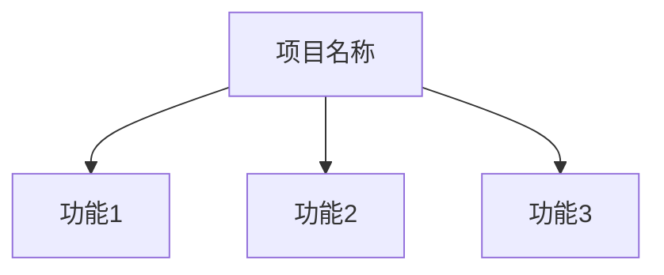

## 源码位置
- **工作区路径**: [项目在工作区中的路径]
- **仓库地址**: [项目的代码仓库地址，如果适用]

## 必读文件
[列出项目中必须阅读的关键文件及其说明]

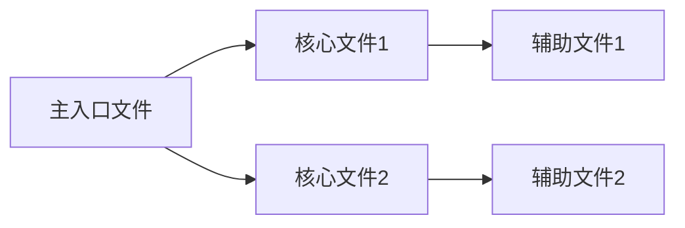

## 文件索引
- [文件列表及其说明]

## 核心功能分析
[主要功能点分析]

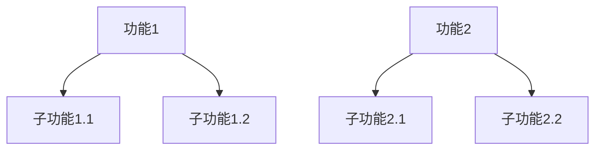

## 在迁移过程中的作用
[从以太坊到Aptos迁移中的意义]

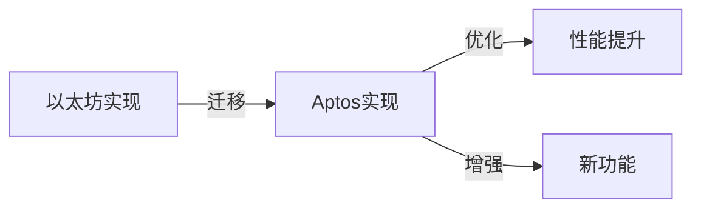
```

### 2. architecture.md
```markdown
# 架构设计

## 整体架构
[架构图和说明]

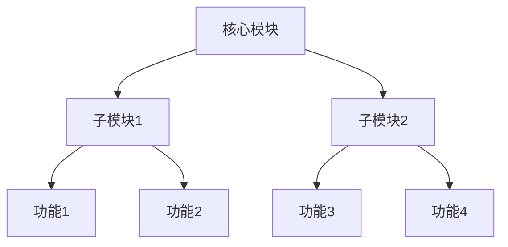

## 核心模块
[主要模块及其关系]

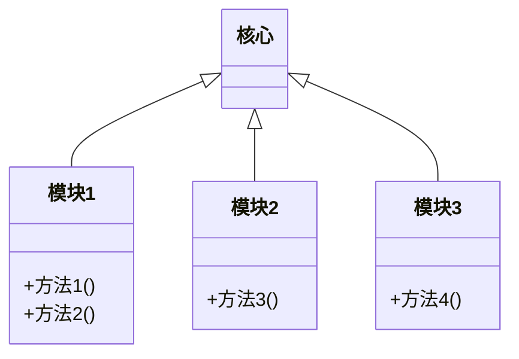

## 数据流
[数据如何流经系统]

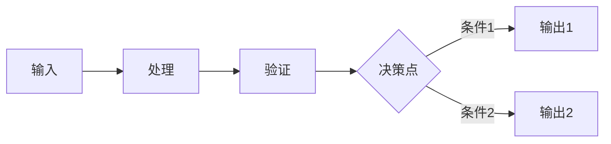

## 设计模式
[使用的主要设计模式]

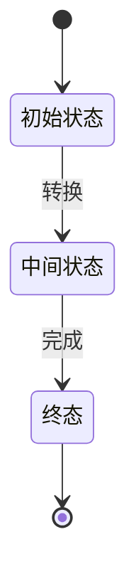

## 源码结构分析
[对源码目录结构的详细分析，关键文件和目录的作用]

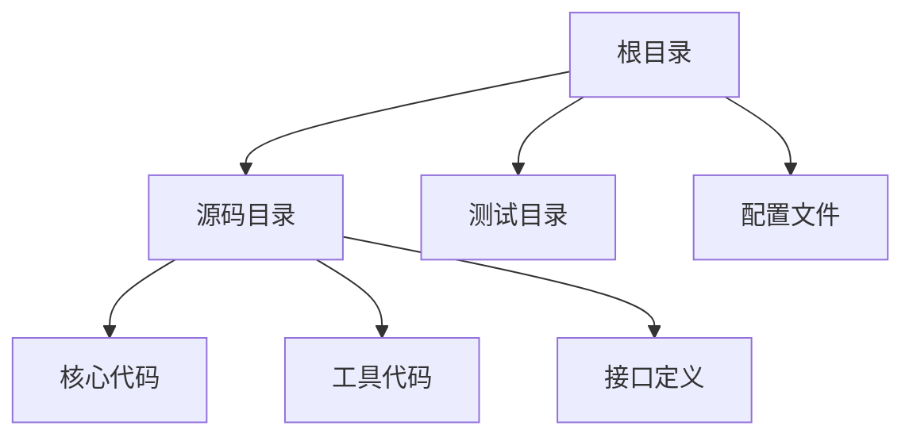
```

### 3. code-analysis/
每个关键文件的详细分析，包含：
- 代码结构
- 主要函数和接口
- 数据结构
- 实现细节
- 与其他文件的关系
- 优化空间

每个分析都应包含相关的Mermaid图表，例如：

```markdown
# [文件名] 分析

## 组件关系
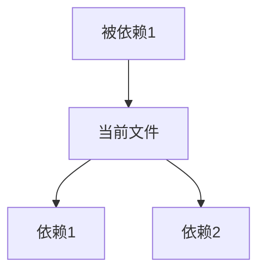

## 函数调用关系
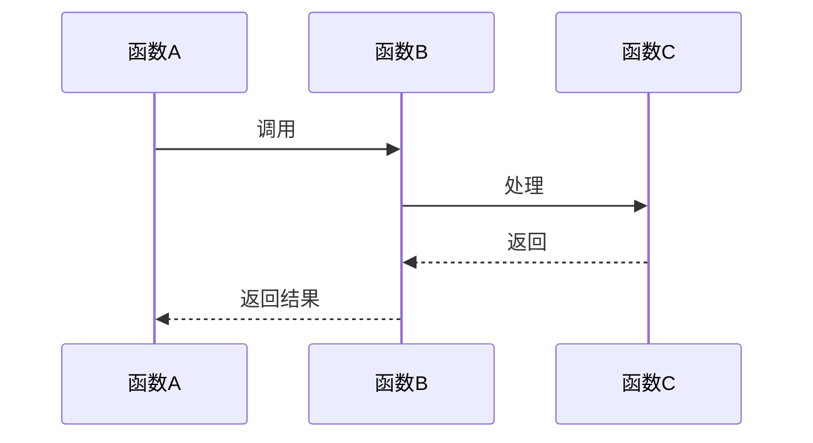

## 数据结构
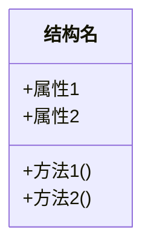
```

### 4. migration-insights.md
```markdown
# 迁移洞察

## Solidity vs Move 对比
[语言层面的差异及影响]

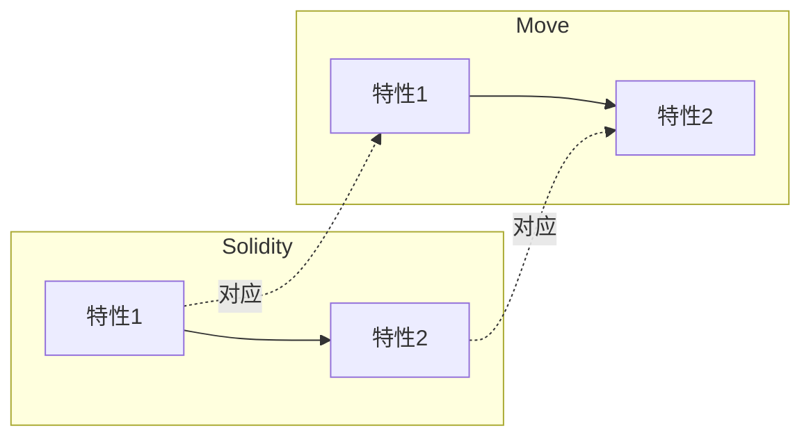

## 架构调整
[架构上的主要变化]

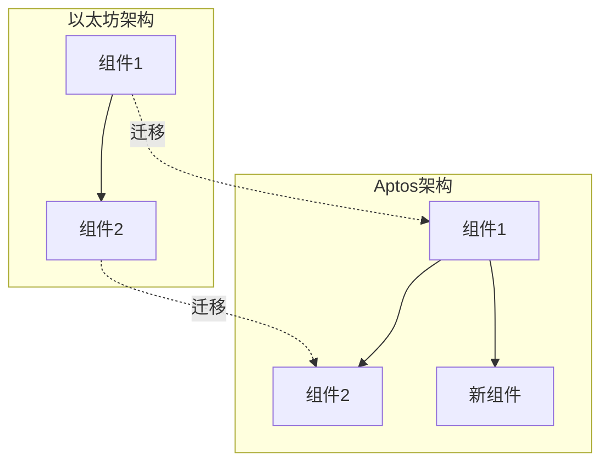

## 挑战与解决方案
[迁移过程中的主要挑战及解决方法]

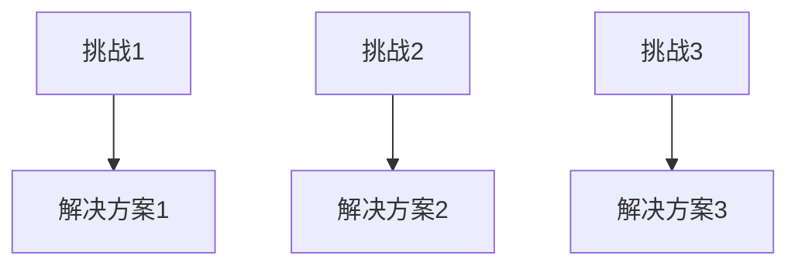

## 性能与安全改进
[迁移带来的性能和安全提升]

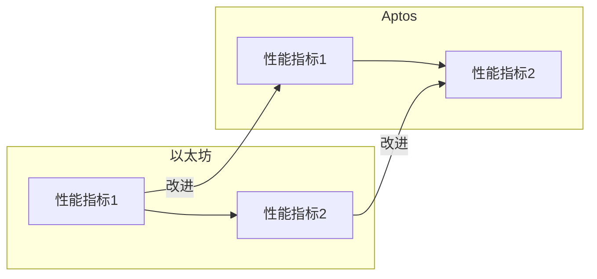

## 源码迁移对照
[原Solidity代码与Move代码的对照分析，主要改变点]

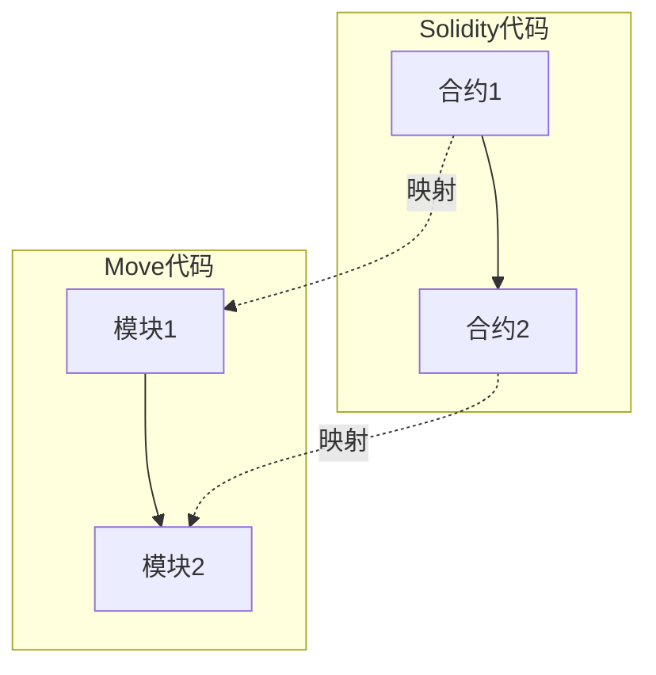
```

### 5. integration-points.md
```markdown
# 集成点分析

## 与其他组件的交互
[与系统其他部分的接口和交互]

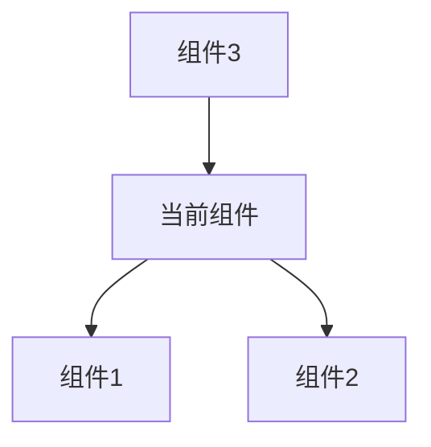

## 外部依赖
[外部系统和库的依赖]

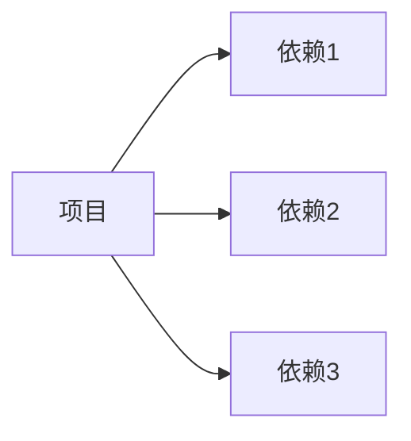

## API和接口
[提供的主要API和接口]

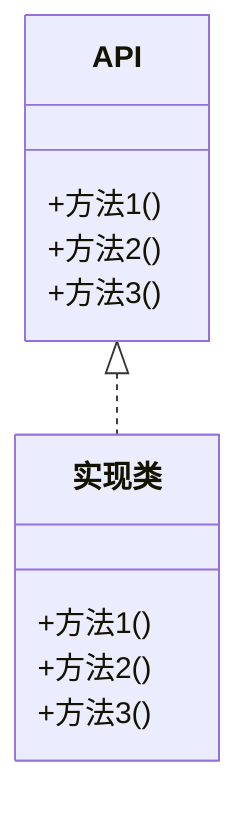

## 事件和通知
[发出的主要事件和通知机制]

```mermaid
sequenceDiagram
    组件A->>事件系统: 触发事件
    事件系统->>组件B: 通知
    事件系统->>组件C: 通知
```

## 源码集成分析
[基于源码分析的集成点详细说明]

```mermaid
graph TD
    subgraph 源文件
    A[文件1] --> B[文件2]
    end
    subgraph 外部组件
    C[组件1] --> D[组件2]
    end
    B --> C
```
```

## 执行计划

1. 先分析核心协议项目（triplex, 420, keepers）
2. 然后分析基础设施项目（synthetix-vaults, synthetix-assets, pyth-examples）
3. 接着分析接口和交互项目（TriplexFrontend, liquidity-ui）
4. 再分析参考实现项目（synthetix-v3, TriplexContract）
5. 同时分析Aptos开发工具项目（aptos-framework, aptos-core, aptos-cli, aptos-ts-sdk）
6. 最后分析辅助项目和文档治理项目

每个项目分析完成后，将创建一个汇总文档，比较不同项目之间的关系和相互依赖。

## 产出物

1. 每个项目的详细分析文档（共20个项目）
2. 迁移策略总结报告
3. Aptos与以太坊实现对比报告
4. 架构图和数据流图
5. 优化建议和最佳实践总结 