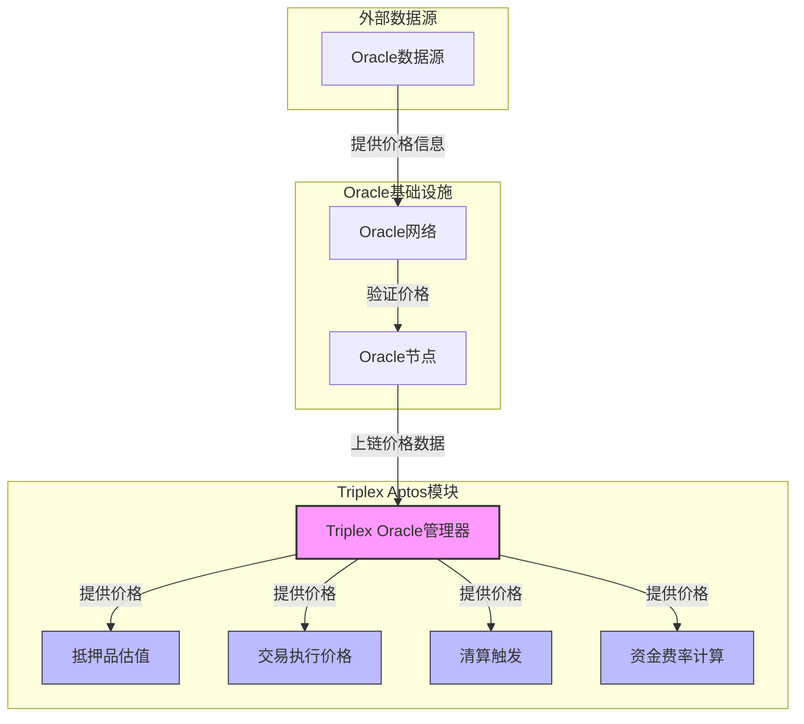
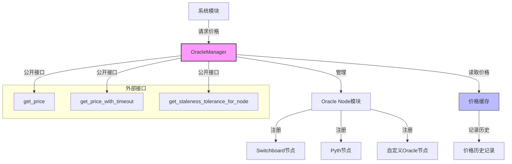
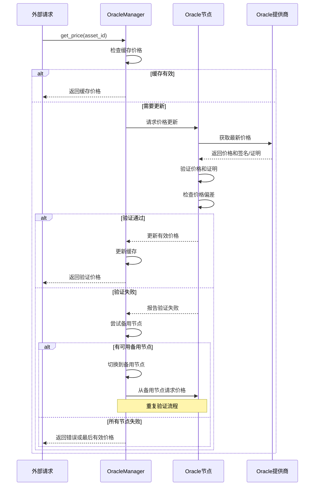

import { Callout, Cards, FileTree, Steps, Tabs } from 'nextra/components'

# Triplex 预言机系统 - Aptos 实现

<Callout type="info">
  预言机系统是 Triplex 的核心基础设施，为协议提供可靠的价格数据。系统基于 Aptos 区块链实现，采用模块化设计，支持多源数据输入，利用 Move 语言的资源安全特性确保价格数据的准确性和可靠性，为抵押品估值、清算决策、汇率计算等核心功能提供强有力支持。
</Callout>

## 系统架构

### Oracle系统架构图



### 节点架构

<Cards>
  <Cards.Card title="节点类型" href="#节点类型">
    数据源节点、聚合节点、输出节点
  </Cards.Card>
  <Cards.Card title="节点关系" href="#节点关系">
    层次结构与数据流动
  </Cards.Card>
  <Cards.Card title="处理管道" href="#处理管道">
    数据收集、处理、验证流程
  </Cards.Card>
  <Cards.Card title="数据流" href="#数据流">
    从外部到系统的数据传递
  </Cards.Card>
</Cards>

### 模块结构

<FileTree>
  <FileTree.Folder name="Oracle System" defaultOpen>
    <FileTree.Folder name="Core Modules" defaultOpen>
      <FileTree.File name="oracle_manager.move" />
      <FileTree.File name="price_feed.move" />
      <FileTree.File name="node_registry.move" />
      <FileTree.File name="node_definition.move" />
    </FileTree.Folder>
    <FileTree.Folder name="Price Feeds">
      <FileTree.File name="pyth_feed.move" />
      <FileTree.File name="switchboard_feed.move" />
      <FileTree.File name="wormhole_feed.move" />
      <FileTree.File name="custom_feed.move" />
    </FileTree.Folder>
    <FileTree.Folder name="Node Types">
      <FileTree.File name="external_node.move" />
      <FileTree.File name="aggregator_node.move" />
      <FileTree.File name="transform_node.move" />
      <FileTree.File name="circuit_breaker.move" />
    </FileTree.Folder>
  </FileTree.Folder>
</FileTree>

## Oracle Manager

### Oracle Manager 架构



<Tabs items={['配置管理', '数据处理', '安全机制']}>
  <Tabs.Tab>
    ```move
    module triplex::oracle_manager {
        use std::signer;
        use std::error;
        use aptos_std::table::{Self, Table};
        use aptos_std::type_info::{TypeInfo, type_of};
        use aptos_framework::account;
        use aptos_framework::timestamp;
        use triplex::node_definition::{Self, NodeDefinition, NodeType};
        
        /// 错误码
        const E_UNAUTHORIZED: u64 = 1;
        const E_NODE_NOT_FOUND: u64 = 2;
        const E_INVALID_NODE_TYPE: u64 = 3;
        
        /// Oracle管理器资源
        struct OracleManager has key {
            // 节点ID到节点定义的映射
            nodes: Table<u64, NodeDefinition>,
            // 代币类型到预言机节点的映射
            token_oracles: Table<TypeInfo, u64>,
            // 下一个可用的节点ID
            next_node_id: u64,
            // 管理权限
            admin: address,
            // 默认价格过期时间（秒）
            default_staleness_threshold: u64,
        }
        
        /// 初始化Oracle管理器
        public fun initialize(admin: &signer) {
            let admin_addr = signer::address_of(admin);
            
            move_to(admin, OracleManager {
                nodes: table::new<u64, NodeDefinition>(),
                token_oracles: table::new<TypeInfo, u64>(),
                next_node_id: 1,
                admin: admin_addr,
                default_staleness_threshold: 300, // 5分钟默认过期时间
            });
        }
        
        /// 注册新的预言机节点
        public fun register_node(
            account: &signer,
            node_type: u8,
            name: vector<u8>,
            description: vector<u8>,
            parameters: vector<u8>
        ): u64 acquires OracleManager {
            let account_addr = signer::address_of(account);
            let oracle = borrow_global_mut<OracleManager>(@triplex);
            
            // 验证权限
            assert!(account_addr == oracle.admin, error::permission_denied(E_UNAUTHORIZED));
            
            // 验证节点类型有效
            assert!(node_type >= 1 && node_type <= 4, error::invalid_argument(E_INVALID_NODE_TYPE));
            
            // 创建节点定义
            let node = node_definition::create_node_definition(
                node_type,
                name,
                description,
                timestamp::now_seconds()
            );
            
            // 分配新节点ID
            let node_id = oracle.next_node_id;
            oracle.next_node_id = node_id + 1;
            
            // 存储节点定义
            table::add(&mut oracle.nodes, node_id, node);
            
            // 初始化节点(根据类型初始化)
            initialize_node_by_type(node_id, node_type, parameters);
            
            node_id
        }
        
        /// 为代币类型注册预言机
        public fun register_token_oracle<CoinType>(
            admin: &signer,
            node_id: u64
        ) acquires OracleManager {
            let admin_addr = signer::address_of(admin);
            let oracle = borrow_global_mut<OracleManager>(@triplex);
            
            // 验证权限和节点存在
            assert!(admin_addr == oracle.admin, error::permission_denied(E_UNAUTHORIZED));
            assert!(table::contains(&oracle.nodes, node_id), error::not_found(E_NODE_NOT_FOUND));
            
            // 注册代币类型到预言机的映射
            let token_type = type_of<CoinType>();
            table::upsert(&mut oracle.token_oracles, token_type, node_id);
        }
    }
    ```
  </Tabs.Tab>
  
  <Tabs.Tab>
    <Steps>
      1. **数据获取**
         - 利用Aptos交易与区块链交互
         - Move中的资源安全处理
         - 异步模式与推送/拉取结合
      
      2. **数据转换**
         - Move定点数精确计算
         - 处理原子接口单位转换
         - Table高效存储与检索
    </Steps>
  </Tabs.Tab>
  
  <Tabs.Tab>
    <Cards>
      <Cards.Card title="数据验证" href="#数据验证">
        多源验证、签名验证、格式校验
      </Cards.Card>
      <Cards.Card title="异常检测" href="#异常检测">
        价格偏差检测、突变识别、时效性检查
      </Cards.Card>
      <Cards.Card title="应急机制" href="#应急机制">
        Move资源控制的熔断机制、备用节点切换、安全模式
      </Cards.Card>
    </Cards>
  </Tabs.Tab>
</Tabs>

## 价格馈送

### 价格验证流程



### 数据源集成

<Cards>
  <Cards.Card title="Switchboard" href="#switchboard">
    Aptos原生数据馈送、全链支持、高可靠性
  </Cards.Card>
  <Cards.Card title="Pyth" href="#pyth">
    跨链价格网络、低延迟、高精度、Move原生集成
  </Cards.Card>
  <Cards.Card title="Wormhole" href="#wormhole">
    跨链消息传递、价格数据跨链验证
  </Cards.Card>
  <Cards.Card title="LayerZero" href="#layerzero">
    Aptos生态集成的跨链数据桥
  </Cards.Card>
</Cards>

### 节点类型

<Tabs items={['外部馈送', '聚合节点', '转换节点', '熔断节点']}>
  <Tabs.Tab>
    <Steps>
      1. **接口集成**
         - 利用Move资源模型的安全接口
         - Table高效数据映射与存储
         - Aptos事件系统异步通知
      
      2. **状态管理**
         - Move资源确保状态不可篡改
         - 精确控制访问权限
         - 完整的审计追踪
    </Steps>
  </Tabs.Tab>
  
  <Tabs.Tab>
    <Cards>
      <Cards.Card title="TWAP" href="#twap">
        时间加权平均价格、Move定点数计算
      </Cards.Card>
      <Cards.Card title="中位数" href="#中位数">
        排序算法、离群值过滤
      </Cards.Card>
      <Cards.Card title="加权平均" href="#加权平均">
        可配置权重、信任度加权
      </Cards.Card>
    </Cards>
  </Tabs.Tab>
  
  <Tabs.Tab>
    <Steps>
      1. **数学运算**
         - Move定点数精确计算
         - Aptos标准库数学函数
         - 气体优化的计算逻辑
      
      2. **逻辑转换**
         - 阈值处理与条件判断
         - 异常检测规则
         - 资产特定转换逻辑
    </Steps>
  </Tabs.Tab>
  
  <Tabs.Tab>
    <Cards>
      <Cards.Card title="价格偏差" href="#价格偏差">
        Move资源保证的安全熔断
      </Cards.Card>
      <Cards.Card title="数据过期" href="#数据过期">
        基于资产波动性的动态过期时间
      </Cards.Card>
      <Cards.Card title="系统故障" href="#系统故障">
        降级运行、备份机制、报警系统
      </Cards.Card>
    </Cards>
  </Tabs.Tab>
</Tabs>

## 系统集成

### 协议集成

<Steps>
  1. **抵押品管理**
     - Move模块间安全交互
     - 实时健康因子监控
     - 自动清算触发
  
  2. **市场运作**
     - 公平交易价格提供
     - Aptos时间戳精确结算
     - 动态资金费率调整
  
  3. **风险管理**
     - 实时风险指标计算
     - 基于预言机数据的限额控制
     - Move资源安全模型保证风险操作安全
</Steps>

### 安全机制

<Tabs items={['数据验证', '熔断机制', '治理控制']}>
  <Tabs.Tab>
    <Steps>
      1. **多源验证**
         - 不同预言机数据交叉验证
         - 链上验证逻辑确保一致性
         - Move资源模型保证数据完整性
      
      2. **时效性**
         - Aptos时间戳精确控制
         - 资产波动性动态调整过期时间
         - 过期处理策略与风险缓解
    </Steps>
  </Tabs.Tab>
  
  <Tabs.Tab>
    <Cards>
      <Cards.Card title="价格波动" href="#价格波动">
        动态偏差阈值、波动率自适应、Move模块间安全通信
      </Cards.Card>
      <Cards.Card title="更新频率" href="#更新频率">
        Aptos区块生成优化、减少气体消耗
      </Cards.Card>
      <Cards.Card title="系统负载" href="#系统负载">
        Move存储优化、批处理操作减少交易数量
      </Cards.Card>
    </Cards>
  </Tabs.Tab>
  
  <Tabs.Tab>
    <Steps>
      1. **权限管理**
         - Move能力模式实现的访问控制
         - 基于签名者安全的管理接口
         - 多层权限与紧急处理
      
      2. **监督机制**
         - Aptos事件系统完整记录
         - 异常行为自动检测
         - Move模块验证保证操作合规
    </Steps>
  </Tabs.Tab>
</Tabs>

## 实现细节

<Callout type="warning">
  预言机系统利用 Move 语言的资源安全特性，确保价格数据的完整性和准确性，同时通过严格的访问控制保护系统免受未授权的修改。资源模型确保价格数据只能通过授权途径更新，提供了比传统智能合约更强的安全保障。
</Callout>

### Move 实现优势

```move
module triplex::price_feed {
    use std::signer;
    use std::error;
    use std::vector;
    use aptos_framework::timestamp;
    use aptos_framework::event;
    use aptos_std::table::{Self, Table};
    use aptos_std::type_info::{TypeInfo, type_of};
    
    /// 错误码
    const E_PRICE_OUTDATED: u64 = 1;
    const E_PRICE_NOT_FOUND: u64 = 2;
    const E_UNAUTHORIZED: u64 = 3;
    const E_INVALID_PRICE: u64 = 4;
    
    /// 价格数据结构
    struct PriceData has store, drop {
        // 价格值 (scaled by 10^8)
        value: u64,
        // 最后更新时间戳
        last_updated: u64,
        // 来源节点ID
        source_id: u64,
        // 精度
        decimals: u8,
        // 置信度 (0-100)
        confidence: u8,
    }
    
    /// 价格历史记录
    struct PriceHistory has store {
        // 最近价格记录
        records: vector<PriceData>,
        // 最大记录数
        max_records: u64,
    }
    
    /// 价格存储资源
    struct PriceStore has key {
        // 资产ID到价格数据的映射
        prices: Table<vector<u8>, PriceData>,
        // 代币类型到价格数据的映射
        token_prices: Table<TypeInfo, PriceData>,
        // 历史价格数据
        history: Table<vector<u8>, PriceHistory>,
        // 价格更新事件处理
        update_events: event::EventHandle<PriceUpdateEvent>,
        // 配置权限
        admin: address,
    }
    
    /// 价格更新事件
    struct PriceUpdateEvent has drop, store {
        asset_id: vector<u8>,
        old_price: u64,
        new_price: u64,
        timestamp: u64,
        source_id: u64,
    }
    
    /// 初始化价格存储
    public fun initialize(admin: &signer) {
        let admin_addr = signer::address_of(admin);
        
        move_to(admin, PriceStore {
            prices: table::new<vector<u8>, PriceData>(),
            token_prices: table::new<TypeInfo, PriceData>(),
            history: table::new<vector<u8>, PriceHistory>(),
            update_events: event::new_event_handle<PriceUpdateEvent>(admin),
            admin: admin_addr,
        });
    }
    
    /// 更新价格数据
    public fun update_price(
        account: &signer,
        asset_id: vector<u8>,
        price: u64,
        source_id: u64,
        decimals: u8,
        confidence: u8
    ) acquires PriceStore {
        let account_addr = signer::address_of(account);
        let store = borrow_global_mut<PriceStore>(@triplex);
        
        // 验证权限
        assert!(account_addr == store.admin, error::permission_denied(E_UNAUTHORIZED));
        
        // 验证价格有效性
        assert!(price > 0, error::invalid_argument(E_INVALID_PRICE));
        assert!(confidence <= 100, error::invalid_argument(E_INVALID_PRICE));
        
        let now = timestamp::now_seconds();
        let old_price = if (table::contains(&store.prices, asset_id)) {
            table::borrow(&store.prices, asset_id).value
        } else {
            0
        };
        
        // 创建新的价格数据
        let price_data = PriceData {
            value: price,
            last_updated: now,
            source_id,
            decimals,
            confidence,
        };
        
        // 更新价格
        if (table::contains(&store.prices, asset_id)) {
            *table::borrow_mut(&mut store.prices, asset_id) = price_data;
        } else {
            table::add(&mut store.prices, asset_id, price_data);
        };
        
        // 更新历史记录
        update_price_history(&mut store.history, asset_id, price_data);
        
        // 发出事件
        event::emit_event(
            &mut store.update_events,
            PriceUpdateEvent {
                asset_id,
                old_price,
                new_price: price,
                timestamp: now,
                source_id,
            }
        );
    }
    
    /// 更新代币价格
    public entry fun update_token_price<CoinType>(
        account: &signer,
        price: u64,
        source_id: u64,
        decimals: u8,
        confidence: u8
    ) acquires PriceStore {
        let account_addr = signer::address_of(account);
        let store = borrow_global_mut<PriceStore>(@triplex);
        
        // 验证权限
        assert!(account_addr == store.admin, error::permission_denied(E_UNAUTHORIZED));
        
        // 验证价格有效性
        assert!(price > 0, error::invalid_argument(E_INVALID_PRICE));
        
        let token_type = type_of<CoinType>();
        let now = timestamp::now_seconds();
        
        // 创建新的价格数据
        let price_data = PriceData {
            value: price,
            last_updated: now,
            source_id,
            decimals,
            confidence,
        };
        
        // 更新价格
        if (table::contains(&store.token_prices, token_type)) {
            *table::borrow_mut(&mut store.token_prices, token_type) = price_data;
        } else {
            table::add(&mut store.token_prices, token_type, price_data);
        };
    }
    
    /// 获取代币价格
    public fun get_token_price<CoinType>(): (u64, u64) acquires PriceStore {
        let store = borrow_global<PriceStore>(@triplex);
        let token_type = type_of<CoinType>();
        
        assert!(table::contains(&store.token_prices, token_type), error::not_found(E_PRICE_NOT_FOUND));
        
        let price_data = table::borrow(&store.token_prices, token_type);
        (price_data.value, price_data.last_updated)
    }
}
```

### 服务保障

<Cards>
  <Cards.Card title="可靠性" href="#可靠性">
    多源数据冗余、基于Move资源的节点监控、故障安全恢复
  </Cards.Card>
  <Cards.Card title="准确性" href="#准确性">
    Move强类型系统确保数据完整、异常值过滤、定点数精确计算
  </Cards.Card>
  <Cards.Card title="公平性" href="#公平性">
    链上验证确保透明性、多节点聚合防止操纵、事件系统记录全部更新
  </Cards.Card>
  <Cards.Card title="一致性" href="#一致性">
    Aptos交易原子性保证、全局状态一致性、Move资源安全模型
  </Cards.Card>
</Cards>

### 性能优化

<Steps>
  1. **响应时间**
     - Aptos高吞吐量区块链
     - Table模块O(1)查询性能
     - 多级缓存策略
  
  2. **资源效率**
     - Move紧凑数据结构
     - 按需计算避免浪费
     - 优化存储模型减少占用
  
  3. **成本控制**
     - Aptos低Gas成本
     - 批量更新减少交易数量
     - 智能缓存策略减少链上操作
</Steps>

## 数据聚合流程

### 多源数据集成

<Tabs items={['数据源接入', '聚合算法', '异常处理']}>
  <Tabs.Tab>
    ```move
    module triplex::data_source_connector {
        use std::error;
        use std::signer;
        use std::vector;
        use aptos_std::table::{Self, Table};
        use aptos_std::type_info::{Self, TypeInfo};
        use aptos_framework::timestamp;
        use aptos_framework::event::{Self, EventHandle};
        
        use triplex::node_registry;
        
        /// 错误代码
        const ENOT_AUTHORIZED: u64 = 1;
        const ESOURCE_NOT_FOUND: u64 = 2;
        const ESOURCE_ALREADY_EXISTS: u64 = 3;
        
        /// 数据源类型
        const DATA_SOURCE_CEX: u8 = 1;      // 中心化交易所
        const DATA_SOURCE_DEX: u8 = 2;      // 去中心化交易所
        const DATA_SOURCE_AGGREGATOR: u8 = 3; // 聚合器
        const DATA_SOURCE_CUSTOM: u8 = 4;   // 自定义源
        
        /// 数据源定义
        struct DataSource has store, drop, copy {
            // 数据源ID
            id: u64,
            // 数据源类型
            source_type: u8,
            // 数据源名称
            name: vector<u8>,
            // 数据源权重 (用于加权聚合)
            weight: u8,
            // 可信度分数 (根据历史表现动态调整)
            reliability_score: u64,
            // 上次更新时间
            last_update_time: u64,
            // 是否激活
            is_active: bool,
        }
        
        /// 数据源更新事件
        struct DataSourceUpdateEvent has drop, store {
            source_id: u64,
            reported_price: u64,
            timestamp: u64,
            is_included: bool,     // 此数据是否被包含在聚合中
            deviation_from_median: u64, // 与中位数的偏差 (基点)
        }
        
        /// 数据来源模块状态
        struct DataSourceConnector has key, store {
            // 数据源 (id -> DataSource)
            sources: Table<u64, DataSource>,
            // 资产到数据源映射 (asset_id -> vector<source_id>)
            asset_sources: Table<u64, vector<u64>>,
            // 类型到数据源映射 (TypeInfo -> vector<source_id>)
            type_sources: Table<TypeInfo, vector<u64>>,
            // 数据源更新事件
            update_events: EventHandle<DataSourceUpdateEvent>,
            // 数据源计数器
            source_counter: u64,
        }
        
        /// 管理能力
        struct SourceAdminCapability has key, store {}
        
        /// 初始化数据源连接器
        public entry fun initialize(admin: &signer) {
            let admin_addr = signer::address_of(admin);
            
            move_to(admin, DataSourceConnector {
                sources: table::new<u64, DataSource>(),
                asset_sources: table::new<u64, vector<u64>>(),
                type_sources: table::new<TypeInfo, vector<u64>>(),
                update_events: event::new_event_handle<DataSourceUpdateEvent>(admin),
                source_counter: 0,
            });
            
            // 授予管理能力
            move_to(admin, SourceAdminCapability {});
        }
        
        /// 注册新数据源
        public entry fun register_data_source(
            admin: &signer,
            source_type: u8,
            name: vector<u8>,
            weight: u8
        ): u64 acquires DataSourceConnector, SourceAdminCapability {
            let admin_addr = signer::address_of(admin);
            assert!(exists<SourceAdminCapability>(admin_addr), error::permission_denied(ENOT_AUTHORIZED));
            
            let connector = borrow_global_mut<DataSourceConnector>(@triplex);
            
            // 分配新数据源ID
            let source_id = connector.source_counter + 1;
            connector.source_counter = source_id;
            
            // 创建数据源
            let source = DataSource {
                id: source_id,
                source_type,
                name,
                weight,
                reliability_score: 10000, // 初始可信度100%
                last_update_time: 0,
                is_active: true,
            };
            
            // 注册数据源
            table::add(&mut connector.sources, source_id, source);
            
            source_id
        }
        
        /// 为资产添加数据源
        public entry fun add_source_for_asset<CoinType>(
            admin: &signer,
            source_id: u64
        ) acquires DataSourceConnector, SourceAdminCapability {
            let admin_addr = signer::address_of(admin);
            assert!(exists<SourceAdminCapability>(admin_addr), error::permission_denied(ENOT_AUTHORIZED));
            
            let connector = borrow_global_mut<DataSourceConnector>(@triplex);
            assert!(table::contains(&connector.sources, source_id), error::not_found(ESOURCE_NOT_FOUND));
            
            // 获取资产ID
            let asset_id = node_registry::get_asset_id_by_type<CoinType>();
            
            // 添加数据源到资产映射
            if (!table::contains(&connector.asset_sources, asset_id)) {
                table::add(&mut connector.asset_sources, asset_id, vector::empty<u64>());
            };
            
            let sources = table::borrow_mut(&mut connector.asset_sources, asset_id);
            
            // 检查数据源是否已存在
            let i = 0;
            let len = vector::length(sources);
            let already_exists = false;
            
            while (i < len) {
                if (*vector::borrow(sources, i) == source_id) {
                    already_exists = true;
                    break
                };
                i = i + 1;
            };
            
            assert!(!already_exists, error::already_exists(ESOURCE_ALREADY_EXISTS));
            vector::push_back(sources, source_id);
            
            // 添加类型映射
            let type_info = type_info::type_of<CoinType>();
            if (!table::contains(&connector.type_sources, type_info)) {
                table::add(&mut connector.type_sources, type_info, vector::empty<u64>());
            };
            
            let type_sources = table::borrow_mut(&mut connector.type_sources, type_info);
            vector::push_back(type_sources, source_id);
        }
    }
    ```
  </Tabs.Tab>
  
  <Tabs.Tab>
    <Cards>
      <Cards.Card title="加权平均算法" href="#加权平均算法">
        基于可信度的动态权重计算
      </Cards.Card>
      <Cards.Card title="中位数过滤" href="#中位数过滤">
        极值排除的稳健中位数计算
      </Cards.Card>
      <Cards.Card title="动态时间窗口" href="#动态时间窗口">
        基于波动率的自适应窗口大小
      </Cards.Card>
      <Cards.Card title="卡尔曼滤波" href="#卡尔曼滤波">
        连续价格状态预测与校正
      </Cards.Card>
    </Cards>
  </Tabs.Tab>
  
  <Tabs.Tab>
    ```move
    module triplex::price_aggregator {
        use std::error;
        use std::signer;
        use std::vector;
        use aptos_std::table::{Self, Table};
        use aptos_framework::timestamp;
        use aptos_framework::event::{Self, EventHandle};
        
        use triplex::data_source_connector::{Self, DataSource};
        use triplex::node_registry;
        
        /// 错误代码
        const EINSUFFICIENT_SOURCES: u64 = 1;
        const EPRICE_DEVIATION_TOO_LARGE: u64 = 2;
        const ESTALE_PRICES: u64 = 3;
        const ENOT_AUTHORIZED: u64 = 4;
        
        /// 聚合事件
        struct AggregationEvent has drop, store {
            asset_id: vector<u8>,
            price: u64,
            timestamp: u64,
            source_count: u8,
            confidence: u8,
        }
        
        /// 价格聚合模块状态
        struct PriceAggregator has key, store {
            // 最小数据源数量
            min_sources: u8,
            // 最大价格偏差 (基点)
            max_deviation: u64,
            // 最大价格过期时间 (秒)
            max_staleness: u64,
            // 管理员
            admin: address,
            // 聚合事件
            aggregation_events: EventHandle<AggregationEvent>,
        }
        
        /// 初始化价格聚合器
        public entry fun initialize(admin: &signer) {
            let admin_addr = signer::address_of(admin);
            
            move_to(admin, PriceAggregator {
                min_sources: 3,
                max_deviation: 500, // 5%
                max_staleness: 300, // 5分钟
                admin: admin_addr,
                aggregation_events: event::new_event_handle<AggregationEvent>(admin),
            });
        }
        
        /// 聚合价格数据
        public entry fun aggregate_price<CoinType>(): (u64, u64, u8) acquires PriceAggregator {
            let aggregator = borrow_global_mut<PriceAggregator>(@triplex);
            
            // 获取资产的所有数据源
            let asset_id = node_registry::get_asset_id_by_type<CoinType>();
            let sources = data_source_connector::get_sources_for_asset(asset_id);
            
            // 验证数据源数量
            let source_count = vector::length(&sources);
            assert!(source_count >= (aggregator.min_sources as u64), error::invalid_state(EINSUFFICIENT_SOURCES));
            
            // 收集有效价格
            let prices = vector::empty<u64>();
            let weights = vector::empty<u64>();
            let now = timestamp::now_seconds();
            
            let i = 0;
            while (i < source_count) {
                let source = *vector::borrow(&sources, i);
                let (price, timestamp, is_active) = data_source_connector::get_source_price(source);
                
                // 检查价格有效性和时效性
                if (is_active && price > 0 && (now - timestamp) <= aggregator.max_staleness) {
                    let source_data = data_source_connector::get_source_data(source);
                    vector::push_back(&mut prices, price);
                    vector::push_back(&mut weights, (source_data.weight as u64) * source_data.reliability_score);
                };
                
                i = i + 1;
            };
            
            // 验证有效数据源数量
            let valid_count = vector::length(&prices);
            assert!(valid_count >= (aggregator.min_sources as u64), error::invalid_state(EINSUFFICIENT_SOURCES));
            
            // 计算中位数 (用于过滤极值)
            let sorted_prices = copy prices;
            sort_prices(&mut sorted_prices);
            let median_price = get_median_price(&sorted_prices);
            
            // 过滤偏差过大的价格
            let filtered_prices = vector::empty<u64>();
            let filtered_weights = vector::empty<u64>();
            
            let i = 0;
            while (i < valid_count) {
                let price = *vector::borrow(&prices, i);
                let weight = *vector::borrow(&weights, i);
                
                // 计算与中位数的偏差
                let deviation = if (price > median_price) {
                    ((price - median_price) * 10000) / median_price
                } else {
                    ((median_price - price) * 10000) / median_price
                };
                
                // 仅包含偏差在允许范围内的价格
                if (deviation <= aggregator.max_deviation) {
                    vector::push_back(&mut filtered_prices, price);
                    vector::push_back(&mut filtered_weights, weight);
                };
                
                i = i + 1;
            };
            
            // 验证过滤后的数据源数量
            let filtered_count = vector::length(&filtered_prices);
            assert!(filtered_count > 0, error::invalid_state(EPRICE_DEVIATION_TOO_LARGE));
            
            // 计算加权平均价格
            let total_price_weight = 0u128;
            let total_weight = 0u128;
            
            let i = 0;
            while (i < filtered_count) {
                let price = (*vector::borrow(&filtered_prices, i) as u128);
                let weight = (*vector::borrow(&filtered_weights, i) as u128);
                
                total_price_weight = total_price_weight + price * weight;
                total_weight = total_weight + weight;
                
                i = i + 1;
            };
            
            // 计算最终价格 (保留6位小数精度)
            let final_price = if (total_weight > 0) {
                ((total_price_weight / total_weight) as u64)
            } else {
                median_price // 如果没有有效权重，使用中位数
            };
            
            (final_price, now, (filtered_count as u8))
        }
        
        /// 排序价格 (简单的冒泡排序)
        fun sort_prices(prices: &mut vector<u64>) {
            let len = vector::length(prices);
            
            let i = 0;
            while (i < len) {
                let j = 0;
                while (j < len - i - 1) {
                    let price_j = *vector::borrow(prices, j);
                    let price_next = *vector::borrow(prices, j + 1);
                    
                    if (price_j > price_next) {
                        vector::swap(prices, j, j + 1);
                    };
                    
                    j = j + 1;
                };
                
                i = i + 1;
            };
        }
        
        /// 获取中位数价格
        fun get_median_price(sorted_prices: &vector<u64>): u64 {
            let len = vector::length(sorted_prices);
            
            if (len == 0) {
                return 0
            };
            
            if (len % 2 == 1) {
                // 奇数长度，直接取中间值
                *vector::borrow(sorted_prices, len / 2)
            } else {
                // 偶数长度，取中间两个值的平均
                let mid1 = *vector::borrow(sorted_prices, len / 2 - 1);
                let mid2 = *vector::borrow(sorted_prices, len / 2);
                (mid1 + mid2) / 2
            }
        }
        
        /// 设置最小数据源数量
        public entry fun set_min_sources(
            admin: &signer,
            min_sources: u8
        ) acquires PriceAggregator {
            let admin_addr = signer::address_of(admin);
            let aggregator = borrow_global_mut<PriceAggregator>(@triplex);
            
            // 验证管理员权限
            assert!(admin_addr == aggregator.admin, error::permission_denied(ENOT_AUTHORIZED));
            assert!(min_sources >= 2, error::invalid_argument(EINSUFFICIENT_SOURCES));
            
            aggregator.min_sources = min_sources;
        }
        
        /// 设置最大价格偏差
        public entry fun set_max_deviation(
            admin: &signer,
            max_deviation: u64
        ) acquires PriceAggregator {
            let admin_addr = signer::address_of(admin);
            let aggregator = borrow_global_mut<PriceAggregator>(@triplex);
            
            // 验证管理员权限
            assert!(admin_addr == aggregator.admin, error::permission_denied(ENOT_AUTHORIZED));
            assert!(max_deviation > 0 && max_deviation <= 2000, error::invalid_argument(EPRICE_DEVIATION_TOO_LARGE));
            
            aggregator.max_deviation = max_deviation;
        }
        
        /// 设置最大过期时间
        public entry fun set_max_staleness(
            admin: &signer,
            max_staleness: u64
        ) acquires PriceAggregator {
            let admin_addr = signer::address_of(admin);
            let aggregator = borrow_global_mut<PriceAggregator>(@triplex);
            
            // 验证管理员权限
            assert!(admin_addr == aggregator.admin, error::permission_denied(ENOT_AUTHORIZED));
            assert!(max_staleness > 0, error::invalid_argument(ESTALE_PRICES));
            
            aggregator.max_staleness = max_staleness;
        }
    }
    ```
  </Tabs.Tab>
</Tabs>

### 价格更新流程

<Steps>
  1. **数据收集**
     - Move能力模式实现的授权数据提供
     - Table高效存储的来源身份验证
     - 事件系统记录的完整更新历史
     - 类型安全的异构数据源适配
  
  2. **数据验证**
     - 不变量强制的数据格式验证
     - 时间戳基于的时效性校验
     - 统计方法检测的异常值识别
     - 存储比对的重复更新防护
  
  3. **聚合计算**
     - 原子事务保证的一致性计算
     - 资源模型隔离的安全状态转换
     - Table结构支持的高效数据访问
     - 类型参数化实现的通用算法应用
  
  4. **结果应用**
     - 能力模式控制的更新权限验证
     - 事件系统透明的全链更新记录
     - 资源模型确保的线程安全更新
     - 基于不变量的状态完整性保障
</Steps>

## 安全与风险控制

### 安全机制

<Tabs items={['防攻击设计', '权限管理', '异常处理']}>
  <Tabs.Tab>
    <Cards>
      <Cards.Card title="Sybil攻击防护" href="#Sybil攻击防护">
        能力模式实现的节点身份验证
      </Cards.Card>
      <Cards.Card title="操纵防护" href="#操纵防护">
        多源数据交叉验证与统计过滤
      </Cards.Card>
      <Cards.Card title="闪电贷攻击防御" href="#闪电贷攻击防御">
        时间加权的价格平滑与反操纵机制
      </Cards.Card>
      <Cards.Card title="Oracle毒药攻击防御" href="#Oracle毒药攻击防御">
        异常值识别与自动排除算法
      </Cards.Card>
    </Cards>
  </Tabs.Tab>
  
  <Tabs.Tab>
    ```move
    module triplex::oracle_access_control {
        use std::error;
        use std::signer;
        use std::vector;
        use aptos_std::table::{Self, Table};
        use aptos_framework::account;
        use aptos_framework::timestamp;
        use aptos_framework::event;
        
        /// 错误代码
        const E_UNAUTHORIZED: u64 = 1;
        const E_ROLE_NOT_FOUND: u64 = 2;
        const E_ALREADY_AUTHORIZED: u64 = 3;
        
        /// 预定义角色
        const ROLE_ADMIN: u8 = 1;             // 系统管理员
        const ROLE_DATA_PROVIDER: u8 = 2;     // 数据提供者
        const ROLE_NODE_OPERATOR: u8 = 3;     // 节点操作员
        const ROLE_EMERGENCY_ADMIN: u8 = 4;   // 紧急管理员
        
        /// 授权事件
        struct AuthorizationEvent has drop, store {
            grantor: address,
            grantee: address,
            role: u8,
            granted: bool, // true=授权，false=撤销
            timestamp: u64,
        }
        
        /// 权限管理模块
        struct OracleAccessControl has key {
            // 角色映射 (address -> role -> bool)
            roles: Table<address, vector<u8>>,
            // 数据源授权 (address -> source_id -> bool)
            source_authorizations: Table<address, vector<u64>>,
            // 授权事件
            auth_events: event::EventHandle<AuthorizationEvent>,
            // 超级管理员
            super_admin: address,
        }
        
        /// 初始化权限模块
        public fun initialize(admin: &signer) {
            let admin_addr = signer::address_of(admin);
            
            move_to(admin, OracleAccessControl {
                roles: table::new<address, vector<u8>>(),
                source_authorizations: table::new<address, vector<u64>>(),
                auth_events: event::new_event_handle<AuthorizationEvent>(admin),
                super_admin: admin_addr,
            });
            
            // 给创建者分配管理员角色
            let roles = vector::empty<u8>();
            vector::push_back(&mut roles, ROLE_ADMIN);
            table::add(&mut borrow_global_mut<OracleAccessControl>(@triplex).roles, admin_addr, roles);
        }
        
        /// 授予角色
        public fun grant_role(
            admin: &signer,
            account: address, 
            role: u8
        ) acquires OracleAccessControl {
            let admin_addr = signer::address_of(admin);
            let access_control = borrow_global_mut<OracleAccessControl>(@triplex);
            
            // 验证授权者为管理员
            assert!(
                has_role(admin_addr, ROLE_ADMIN) || admin_addr == access_control.super_admin,
                error::permission_denied(E_UNAUTHORIZED)
            );
            
            // 验证角色有效
            assert!(role >= 1 && role <= 4, error::invalid_argument(E_ROLE_NOT_FOUND));
            
            // 添加角色
            if (!table::contains(&access_control.roles, account)) {
                table::add(&mut access_control.roles, account, vector::empty<u8>());
            };
            
            let account_roles = table::borrow_mut(&mut access_control.roles, account);
            
            // 检查角色是否已存在
            let i = 0;
            let len = vector::length(account_roles);
            let role_exists = false;
            
            while (i < len) {
                if (*vector::borrow(account_roles, i) == role) {
                    role_exists = true;
                    break
                };
                i = i + 1;
            };
            
            if (!role_exists) {
                vector::push_back(account_roles, role);
            };
            
            // 发送授权事件
            event::emit_event(
                &mut access_control.auth_events,
                AuthorizationEvent {
                    grantor: admin_addr,
                    grantee: account,
                    role,
                    granted: true,
                    timestamp: timestamp::now_seconds(),
                }
            );
        }
        
        /// 验证账户是否拥有特定角色
        public fun has_role(account: address, role: u8): bool acquires OracleAccessControl {
            let access_control = borrow_global<OracleAccessControl>(@triplex);
            
            if (!table::contains(&access_control.roles, account)) {
                return false
            };
            
            let account_roles = table::borrow(&access_control.roles, account);
            
            let i = 0;
            let len = vector::length(account_roles);
            
            while (i < len) {
                if (*vector::borrow(account_roles, i) == role) {
                    return true
                };
                i = i + 1;
            };
            
            false
        }
        
        /// 授权数据源操作权限
        public fun authorize_data_source(
            admin: &signer,
            account: address,
            source_id: u64
        ) acquires OracleAccessControl {
            let admin_addr = signer::address_of(admin);
            let access_control = borrow_global_mut<OracleAccessControl>(@triplex);
            
            // 验证授权者为管理员
            assert!(
                has_role(admin_addr, ROLE_ADMIN) || admin_addr == access_control.super_admin,
                error::permission_denied(E_UNAUTHORIZED)
            );
            
            // 验证被授权者是数据提供者
            assert!(has_role(account, ROLE_DATA_PROVIDER), error::permission_denied(E_UNAUTHORIZED));
            
            // 添加数据源授权
            if (!table::contains(&access_control.source_authorizations, account)) {
                table::add(&mut access_control.source_authorizations, account, vector::empty<u64>());
            };
            
            let source_auths = table::borrow_mut(&mut access_control.source_authorizations, account);
            
            // 检查是否已授权
            let i = 0;
            let len = vector::length(source_auths);
            let already_authorized = false;
            
            while (i < len) {
                if (*vector::borrow(source_auths, i) == source_id) {
                    already_authorized = true;
                    break
                };
                i = i + 1;
            };
            
            assert!(!already_authorized, error::already_exists(E_ALREADY_AUTHORIZED));
            vector::push_back(source_auths, source_id);
        }
        
        /// 验证账户是否可以更新特定数据源
        public fun can_update_source(account: address, source_id: u64): bool acquires OracleAccessControl {
            let access_control = borrow_global<OracleAccessControl>(@triplex);
            
            // 管理员和超级管理员可以更新任何数据源
            if (has_role(account, ROLE_ADMIN) || account == access_control.super_admin) {
                return true
            };
            
            // 紧急管理员也可以更新任何数据源
            if (has_role(account, ROLE_EMERGENCY_ADMIN)) {
                return true
            };
            
            // 数据提供者只能更新授权的数据源
            if (!has_role(account, ROLE_DATA_PROVIDER)) {
                return false
            };
            
            if (!table::contains(&access_control.source_authorizations, account)) {
                return false
            };
            
            let source_auths = table::borrow(&access_control.source_authorizations, account);
            
            let i = 0;
            let len = vector::length(source_auths);
            
            while (i < len) {
                if (*vector::borrow(source_auths, i) == source_id) {
                    return true
                };
                i = i + 1;
            };
            
            false
        }
    }
    ```
  </Tabs.Tab>
  
  <Tabs.Tab>
    <Steps>
      1. **价格偏差处理**
         - Move资源模型实现的偏差阈值控制
         - 基于Table数据结构的历史价格追踪
         - 不变量保障的触发条件安全控制
         - 原子事务保证的一致性紧急措施
      
      2. **数据源失效**
         - 能力模式控制的节点自动剔除
         - 加权算法自适应的责任分配
         - 类型安全的备份数据源切换
         - 事件系统驱动的告警与恢复流程
      
      3. **系统熔断**
         - 资源模型确保的安全熔断状态
         - 精确控制的部分功能降级机制
         - 不变量保障的自动恢复流程
         - 事件透明记录的熔断与恢复历史
    </Steps>
  </Tabs.Tab>
</Tabs>

### 风险监控

<Cards>
  <Cards.Card title="价格波动监控" href="#价格波动监控">
    基于Move事件系统的实时波动检测
  </Cards.Card>
  <Cards.Card title="数据源健康度" href="#数据源健康度">
    Table结构支持的提供者性能评估
  </Cards.Card>
  <Cards.Card title="异常模式识别" href="#异常模式识别">
    资源模型实现的历史模式分析
  </Cards.Card>
  <Cards.Card title="系统压力评估" href="#系统压力评估">
    链上状态监控与自适应负载管理
  </Cards.Card>
</Cards>

## 预言机与系统集成

### 与其他模块的集成

<Tabs items={['风险管理', '合成资产', '治理模块']}>
  <Tabs.Tab>
    <Steps>
      1. **清算触发**
         - 基于Move事件系统的价格条件触发
         - 原子事务保证的清算时机精确控制
         - 不变量强制的风险参数实时调整
         - 类型安全的多资产风险关联评估
      
      2. **风险评估**
         - 资源模型实现的多维度风险计算
         - Table高效索引的系统风险暴露追踪
         - 事件系统驱动的风险预警机制
         - 类型参数化支持的资产特性分析
      
      3. **风险缓释**
         - 能力模式控制的自动风险应对
         - 不变量保障的安全参数调整
         - 原子事务确保的一致性防护措施
         - 事件系统记录的全面风控历史
    </Steps>
  </Tabs.Tab>
  
  <Tabs.Tab>
    <Cards>
      <Cards.Card title="资产价格计算" href="#资产价格计算">
        Move精确数学库支持的价格高精度计算
      </Cards.Card>
      <Cards.Card title="铸造参数" href="#铸造参数">
        能力模式控制的价格相关铸造条件
      </Cards.Card>
      <Cards.Card title="费率计算" href="#费率计算">
        类型安全的价格波动费率动态调整
      </Cards.Card>
      <Cards.Card title="抵押要求" href="#抵押要求">
        资源模型实现的价格敏感抵押规则
      </Cards.Card>
    </Cards>
  </Tabs.Tab>
  
  <Tabs.Tab>
    <Cards>
      <Cards.Card title="参数调整" href="#参数调整">
        类型安全的预言机参数治理控制
      </Cards.Card>
      <Cards.Card title="节点管理" href="#节点管理">
        能力模式实现的节点准入治理
      </Cards.Card>
      <Cards.Card title="激励分配" href="#激励分配">
        Table高效计算的预言机奖励分配
      </Cards.Card>
      <Cards.Card title="紧急治理" href="#紧急治理">
        资源模型保障的应急决策执行
      </Cards.Card>
    </Cards>
  </Tabs.Tab>
</Tabs>

### API接口设计

```move
module triplex::oracle_api {
    use std::error;
    use std::signer;
    use aptos_std::type_info::{Self, TypeInfo};
    use aptos_framework::timestamp;
    
    use triplex::oracle_manager;
    use triplex::price_aggregator;
    use triplex::oracle_access_control;
    
    /// 错误代码
    const E_PRICE_NOT_AVAILABLE: u64 = 1;
    const E_PRICE_TOO_OLD: u64 = 2;
    
    /// 获取资产价格 (标准接口)
    public fun get_price<CoinType>(): (u64, u64, u8) {
        // 优先使用聚合价格
        price_aggregator::aggregate_price<CoinType>()
    }
    
    /// 获取资产价格，带时效性检查
    public fun get_price_with_timeout<CoinType>(max_age_seconds: u64): (u64, u64, u8) {
        let (price, last_update_time, source_count) = get_price<CoinType>();
        
        // 验证价格有效性
        assert!(price > 0, error::not_found(E_PRICE_NOT_AVAILABLE));
        
        // 验证时效性
        let now = timestamp::now_seconds();
        assert!(now - last_update_time <= max_age_seconds, error::invalid_state(E_PRICE_TOO_OLD));
        
        (price, last_update_time, source_count)
    }
    
    /// 获取USD价格对
    public fun get_usd_price<CoinType>(): u64 {
        let (price, _, _) = get_price<CoinType>();
        price
    }
    
    /// 获取相对价格 (CoinType1 / CoinType2)
    public fun get_relative_price<CoinType1, CoinType2>(): u64 {
        let (price1, _, _) = get_price<CoinType1>();
        let (price2, _, _) = get_price<CoinType2>();
        
        // 验证价格有效性
        assert!(price1 > 0 && price2 > 0, error::not_found(E_PRICE_NOT_AVAILABLE));
        
        // 计算相对价格 (保持6位小数精度)
        (price1 * 1000000) / price2
    }
    
    /// 更新资产价格 (授权接口)
    public fun update_price<CoinType>(
        updater: &signer,
        price: u64
    ) {
        let updater_addr = signer::address_of(updater);
        
        // 验证更新权限
        assert!(
            oracle_access_control::has_role(updater_addr, 2), // ROLE_DATA_PROVIDER
            error::permission_denied(1)
        );
        
        // 获取资产对应的数据源
        let source_id = oracle_manager::get_primary_source_for_coin<CoinType>();
        
        // 验证数据源更新权限
        assert!(
            oracle_access_control::can_update_source(updater_addr, source_id),
            error::permission_denied(1)
        );
        
        // 更新价格
        oracle_manager::update_source_price(source_id, price, 1);
    }
}
```

## 激励机制与治理

### 预言机激励

<Cards>
  <Cards.Card title="节点奖励" href="#节点奖励">
    Move资源模型实现的高效奖励分配
  </Cards.Card>
  <Cards.Card title="质量激励" href="#质量激励">
    Table结构支持的数据质量评估与奖励
  </Cards.Card>
  <Cards.Card title="长期绑定" href="#长期绑定">
    能力模式控制的节点长期贡献激励
  </Cards.Card>
  <Cards.Card title="惩罚机制" href="#惩罚机制">
    不变量强制的失职或作恶惩罚机制
  </Cards.Card>
</Cards>

### 治理机制

<Steps>
  1. **参数治理**
     - Move能力模式实现的参数更新权限
     - Table结构支持的参数版本与历史
     - 不变量保障的参数有效性验证
     - 事件系统透明的参数更新记录
  
  2. **节点治理**
     - 资源模型保障的节点准入与退出
     - 能力模式控制的权重与角色分配
     - 基于Table的高效节点状态管理
     - 事件系统驱动的节点表现评估
  
  3. **紧急治理**
     - 原子事务保证的快速响应机制
     - 能力模式严格控制的紧急权限
     - 多签名实现的分布式决策流程
     - 事件系统记录的完整操作审计
</Steps>

<Callout type="info">
  Triplex预言机系统充分利用了Aptos区块链的高性能和Move语言的安全特性，为协议提供可靠、安全、高效的价格数据服务。通过多层安全设计、先进的数据聚合算法和完善的治理机制，系统能够有效抵御各类攻击，为Triplex协议的稳定运行提供强有力的支持。
</Callout>
