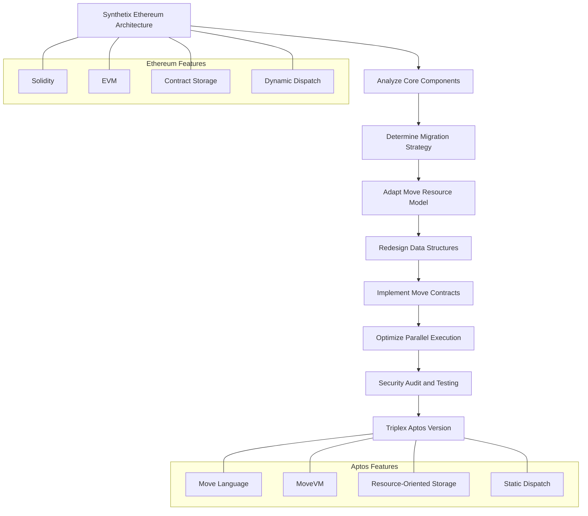

import { Callout, Cards, FileTree, Steps, Tabs } from 'nextra/components'

# Triplex Architecture Analysis

<Callout type="info">
  Triplex is a decentralized finance project that migrates the Synthetix protocol architecture to the Aptos blockchain, fully utilizing Move virtual machine's security features and performance advantages to provide synthetic assets, perpetual contracts, and other financial products.
</Callout>

## System Overview

Triplex is a decentralized finance protocol that migrates the mature Synthetix protocol from Ethereum to the Aptos blockchain, focusing on providing diverse synthetic assets and derivative trading services. By leveraging the advanced features of the Move virtual machine, Triplex achieves higher security, lower transaction costs, and better user experience.

### Core Advantages

<Cards>
  <Cards.Card title="Security" href="/architecturalanalysis/security">
    Move resource model and formal verification support enhanced security guarantees
  </Cards.Card>
  <Cards.Card title="Performance" href="/architecturalanalysis/performance">
    Aptos parallel execution engine brings higher transaction throughput
  </Cards.Card>
  <Cards.Card title="Scalability" href="/architecturalanalysis/core">
    Modular design supports flexible expansion and upgrades
  </Cards.Card>
  <Cards.Card title="Asset Diversity" href="/architecturalanalysis/synthetic">
    Rich synthetic asset types support global asset trading
  </Cards.Card>
</Cards>

## System Components

<Cards>
  <Cards.Card title="Synthetic Asset System" href="/architecturalanalysis/synthetic">
    Synthetic asset minting and trading based on Aptos blockchain
  </Cards.Card>
  <Cards.Card title="Account System" href="/architecturalanalysis/accounts">
    Account management utilizing Move resource model
  </Cards.Card>
  <Cards.Card title="Core Engine" href="/architecturalanalysis/core">
    System core logic and contracts
  </Cards.Card>
  <Cards.Card title="Governance Mechanism" href="/architecturalanalysis/governance">
    Decentralized governance process
  </Cards.Card>
  <Cards.Card title="Market System" href="/architecturalanalysis/markets">
    Trading markets and price discovery
  </Cards.Card>
  <Cards.Card title="Oracle Integration" href="/architecturalanalysis/oracle">
    Price data provision and validation
  </Cards.Card>
  <Cards.Card title="Liquidity Pool" href="/architecturalanalysis/pool">
    Resource-based liquidity management
  </Cards.Card>
  <Cards.Card title="Cross-chain Bridge" href="/architecturalanalysis/cross-chain">
    Interoperability with other blockchains
  </Cards.Card>
  <Cards.Card title="Security Mechanism" href="/architecturalanalysis/security">
    Move language security features and risk control
  </Cards.Card>
  <Cards.Card title="Performance Optimization" href="/architecturalanalysis/performance">
    System performance and scalability
  </Cards.Card>
  <Cards.Card title="Token Economics" href="/architecturalanalysis/tokenomics">
    Token design and incentive mechanisms
  </Cards.Card>
  <Cards.Card title="Development Tools" href="/architecturalanalysis/tools">
    Interfaces and developer tools
  </Cards.Card>
  <Cards.Card title="Integration Solutions" href="/architecturalanalysis/integration">
    Integration with external systems
  </Cards.Card>
</Cards>

## Migration from Ethereum to Aptos

### Migration Strategy and Process



### Architecture Changes

<Tabs items={['Design Philosophy', 'Technology Stack Changes', 'Storage Model', 'Execution Mechanism']}>
  <Tabs.Tab>
    <Steps>
      1. **Resource Security Model**
         - Transition from Ethereum's contract-centric model to Aptos's resource-centric model
         - Synthetic assets as Move resources rather than contract state variables
         - User assets stored directly in accounts rather than contract mappings
      
      2. **Modular Design**
         - Breaking down the overall architecture into functionally independent modules
         - Each module responsible for specific business logic
         - Modules interact through clear interfaces and capabilities
      
      3. **Formal Verification**
         - Core contracts equipped with formal verification specifications
         - Utilizing Move Prover for compile-time security property verification
         - Reducing runtime errors and vulnerability risks
    </Steps>
  </Tabs.Tab>
  
  <Tabs.Tab>
    <Cards>
      <Cards.Card title="Programming Language" href="/architecturalanalysis/core">
        Transition from Solidity to Move language
      </Cards.Card>
      <Cards.Card title="Virtual Machine" href="/architecturalanalysis/core">
        Transition from EVM to MoveVM
      </Cards.Card>
      <Cards.Card title="Storage Model" href="/architecturalanalysis/core">
        Transition from contract storage to resource storage
      </Cards.Card>
      <Cards.Card title="Library Support" href="/architecturalanalysis/tools">
        From web3.js/ethers.js to Aptos SDK
      </Cards.Card>
    </Cards>
  </Tabs.Tab>
  
  <Tabs.Tab>
    ```move
    // Token balance storage in Solidity
    mapping(address => uint256) private _balances;
    
    // Token balance storage in Move
    struct CoinStore<phantom CoinType> has key {
        coin: Coin<CoinType>,
        frozen: bool,
        deposit_events: EventHandle<DepositEvent>,
        withdraw_events: EventHandle<WithdrawEvent>,
    }
    ```
    
    In Solidity, token balances are stored in contract mappings, while in Move, tokens are stored directly under user accounts as resources. This storage model change brings the following advantages:
    
    1. **Clear Ownership**: Assets clearly belong to specific accounts
    2. **Security Guarantee**: Assets cannot be created or destroyed arbitrarily
    3. **Parallel Execution**: Operations on different accounts can be processed in parallel
    4. **Intuitive Interaction**: Asset operations more closely align with the real world
  </Tabs.Tab>
  
  <Tabs.Tab>
    <Cards>
      <Cards.Card title="Transaction Execution" href="/architecturalanalysis/performance">
        From sequential execution to parallel execution
      </Cards.Card>
      <Cards.Card title="Contract Calls" href="/architecturalanalysis/core">
        From dynamic dispatch to static dispatch
      </Cards.Card>
      <Cards.Card title="Access Control" href="/architecturalanalysis/security">
        From modifier pattern to capability pattern
      </Cards.Card>
      <Cards.Card title="Error Handling" href="/architecturalanalysis/core">
        From exception rollback to fine-grained error codes
      </Cards.Card>
    </Cards>
  </Tabs.Tab>
</Tabs>

## Technical Comparison

| Feature | Ethereum (Synthetix) | Aptos (Triplex) |
|------|-------------------|-----------------|
| **Programming Language** | Solidity | Move |
| **Virtual Machine** | EVM | MoveVM |
| **Account Model** | EOA and Contract Accounts | Unified Account Model |
| **Storage Model** | Contract State Storage | Account Resource Storage |
| **Execution Model** | Sequential Execution | Parallel Execution |
| **Transaction Fees** | Highly Volatile | More Stable and Predictable |
| **Security Features** | Requires Additional Defense | Built-in Resource Safety |
| **Formal Verification** | Limited Support | Move Prover Support |
| **Caller Identification** | msg.sender | &signer Reference |
| **Contract Upgrade** | Proxy Pattern | Direct Module Upgrade |
| **Concurrency** | Limited Concurrency | High Concurrency Support |
| **Token Standards** | ERC-20, ERC-721 | Fungible Asset, Digital Asset |

### Token Standard Comparison

| Solidity | Move (Aptos) | |
|----------|--------------|--|
| **Token Structure** | Each token is an independent contract | Each token is a typed Coin or FungibleAsset |
| **Token Standard** | Must comply with standards like ERC20; implementations may vary | All tokens have unified interface and implementation |
| **Balance Storage** | Balances stored in contract mappings | **Resource-oriented balance**: Balances stored as resources in user accounts. Resources cannot be arbitrarily created, ensuring token value integrity |
| **Transfer Mechanism** | Tokens can be transferred without explicit receiver permission | Except for specific cases, tokens usually require receiver's signature authorization for transfer |

## System Architecture

<FileTree>
  <FileTree.Folder name="Triplex System" defaultOpen>
    <FileTree.Folder name="Core Modules">
      <FileTree.File name="synth_core.move" />
      <FileTree.File name="markets.move" />
      <FileTree.File name="staking.move" />
    </FileTree.Folder>
    <FileTree.Folder name="Assets">
      <FileTree.File name="synthetic_assets.move" />
      <FileTree.File name="collateral.move" />
      <FileTree.File name="token.move" />
    </FileTree.Folder>
    <FileTree.Folder name="Governance">
      <FileTree.File name="dao.move" />
      <FileTree.File name="voting.move" />
      <FileTree.File name="treasury.move" />
    </FileTree.Folder>
    <FileTree.Folder name="Integration">
      <FileTree.File name="oracle.move" />
      <FileTree.File name="exchange.move" />
      <FileTree.File name="cross_chain.move" />
    </FileTree.Folder>
  </FileTree.Folder>
</FileTree>

## Main Features

<Tabs items={['Synthetic Assets', 'Trading Markets', 'Staking Mechanism', 'Governance System']}>
  <Tabs.Tab>
    <Steps>
      1. **Mint Synthetic Assets**
         - Deposit collateral resources
         - Mint synthetic assets based on price data
         - Manage collateral ratio and health factor
      
      2. **Manage Synthetic Position**
         - Adjust collateral ratio
         - Switch collateral type
         - Liquidate risk management
      
      3. **Synthetic Asset Types**
         - Stablecoin (tpxUSD)
         - Crypto assets (tpxBTC, tpxETH, etc.)
         - Traditional assets (stocks, commodities)
    </Steps>
  </Tabs.Tab>
  
  <Tabs.Tab>
    <Cards>
      <Cards.Card title="Spot Trading" href="/architecturalanalysis/markets">
        Direct trading of synthetic assets
      </Cards.Card>
      <Cards.Card title="Perpetual Contracts" href="/architecturalanalysis/markets">
        Leveraged derivative trading
      </Cards.Card>
      <Cards.Card title="Market Maker System" href="/architecturalanalysis/markets">
        Provide liquidity for profit
      </Cards.Card>
      <Cards.Card title="Order Book" href="/architecturalanalysis/markets">
        Efficiently match trading orders
      </Cards.Card>
    </Cards>
  </Tabs.Tab>
  
  <Tabs.Tab>
    ```move
    module triplex::staking {
        use std::signer;
        use aptos_framework::coin;
        use aptos_framework::timestamp;
        
        struct StakePosition has key {
            amount: u64,
            start_time: u64,
            last_claim: u64,
            unclaimed_rewards: u64,
        }
        
        struct StakingConfig has key {
            reward_rate: u64,
            min_lock_period: u64,
            early_exit_penalty: u64,
        }
        
        public fun stake(account: &signer, amount: u64) {
            // Staking implementation logic
        }
        
        public fun unstake(account: &signer, amount: u64): u64 {
            // Unstaking logic
        }
        
        public fun claim_rewards(account: &signer): u64 {
            // Claim rewards logic
        }
    }
    ```
  </Tabs.Tab>
  
  <Tabs.Tab>
    <Callout type="info">
      Triplex uses a decentralized autonomous organization (DAO) mode for governance, where users holding XPL tokens can participate in proposal voting to decide system parameters, fee allocation, and upgrade plans.
    </Callout>
    
    <Steps>
      1. **Proposal Process**
         - Create governance proposal
         - Community discussion period
         - Vote and pass
         - Implementation execution
      
      2. **Voting Weight**
         - Based on token holding
         - Consider lock duration
         - Representative mechanism
      
      3. **Multi-signature Execution**
         - Key parameter changes
         - Emergency operation authorization
         - Upgrade control
    </Steps>
  </Tabs.Tab>
</Tabs>

## Move vs EVM Virtual Machine Comparison

| EVM (Ethereum Virtual Machine)  | Move VM (Move Virtual Machine)                                          |                                                                                                                    |
| ------------------------------- | ---------------------------------------------------------------------- | ------------------------------------------------------------------------------------------------------------------ |
| **Data Storage**                | Data stored in smart contract storage space                  | Data distributed in smart contracts, user accounts, and objects                                                 |
| **Parallel Execution**             | Limited due to shared storage space             | Flexible separated storage design supports higher parallel execution                                              |
| **VM and Language Integration** | EVM and smart contract language (like Solidity) are separate | VM layer and Move language seamlessly integrated, network native functions directly implemented in Rust and executable in Move |
| **Key Network Operations** | Complex network operations implementation   | Key operations like validator set management implemented natively in Move, supporting direct execution     |
| **Function Call Mechanism**            | Dynamic dispatch allows arbitrary contract calls            | Static dispatch focuses on security and predictable behavior                                          |
| **Type Safety**            | Contract type provides certain type safety                         | Move's module structure and generics provide strong type safety                                                      |
| **Transaction Safety**          | Use nonce to ensure transaction order and safety                       | Use sequence number to ensure transaction order and safety                                                         |
| **Authentication Storage**       | Smart contract storage provides authentication                      | Utilize Move resource model for authenticated storage                                                             |
| **Object Accessibility**        | Objects not globally accessible, limited by smart contract scope    | Ensure objects globally accessible                                                        |

## Security Considerations

<Callout type="warning">
  Triplex system utilizes Move language's resource model and formal verification advantages to provide higher security guarantees, while implementing multi-layer risk control measures.
</Callout>

### Security Mechanism

<Cards>
  <Cards.Card title="Resource Safety" href="/architecturalanalysis/security">
    Move resources cannot be copied or lost
  </Cards.Card>
  <Cards.Card title="Formal Verification" href="/architecturalanalysis/security">
    Move Prover mathematical proof
  </Cards.Card>
  <Cards.Card title="Permission Control" href="/architecturalanalysis/security">
    Fine-grained access management
  </Cards.Card>
  <Cards.Card title="Emergency Response" href="/architecturalanalysis/security">
    Risk monitoring and emergency mechanism
  </Cards.Card>
  <Cards.Card title="Static Analysis" href="/architecturalanalysis/security">
    Compile-time type safety check
  </Cards.Card>
  <Cards.Card title="Error Handling" href="/architecturalanalysis/security">
    Precise error codes and handling
  </Cards.Card>
  <Cards.Card title="Reentrancy Prevention" href="/architecturalanalysis/security">
    Resource model naturally defends against reentrancy attacks
  </Cards.Card>
  <Cards.Card title="Time Lock" href="/architecturalanalysis/security">
    Time locking mechanism for critical operations
  </Cards.Card>
</Cards>

## Performance Advantages

<Tabs items={['Parallel Execution', 'Storage Optimization', 'Transaction Fees']}>
  <Tabs.Tab>
    <Steps>
      1. **Transaction Parallelization**
         - Based on conflict-free Block-STM technology
         - Natural isolation of resource model
         - Address prefix recognition reduces conflicts
      
      2. **Execution Acceleration**
         - Static dispatch reduces runtime parsing
         - Native operations improve calculation performance
         - Efficient validator design
      
      3. **Throughput Improvement**
         - High concurrency support for synthetic asset trading
         - Multiple account operations processed simultaneously
         - Event system asynchronous processing
    </Steps>
  </Tabs.Tab>
  
  <Tabs.Tab>
    <Cards>
      <Cards.Card title="Resource Isolation" href="/architecturalanalysis/performance">
        Account-level resource storage
      </Cards.Card>
      <Cards.Card title="Table Structure" href="/architecturalanalysis/performance">
        Efficient Table support complex indexing
      </Cards.Card>
      <Cards.Card title="Event System" href="/architecturalanalysis/performance">
        Efficient event recording and querying
      </Cards.Card>
      <Cards.Card title="State Compression" href="/architecturalanalysis/performance">
        Compact encoding reduces storage overhead
      </Cards.Card>
    </Cards>
  </Tabs.Tab>
  
  <Tabs.Tab>
    <Callout type="info">
      The transaction fee model of the Aptos blockchain is more stable and predictable compared to Ethereum, allowing Triplex to provide more competitive transaction costs.
    </Callout>
    
    - **Fixed Calculation Model**: Transaction fees based on deterministic resource usage calculation
    - **Low Volatility**: Fees relatively stable, not affected by network congestion
    - **Batch Optimization**: Support merging multiple operations to reduce total fees
    - **Fine Control**: Developer can optimize code to minimize fees
    - **User Friendly**: Predictable fee increases user experience
  </Tabs.Tab>
</Tabs>

## Developer Resources

<Cards>
  <Cards.Card title="Code Repository" href="https://github.com/aptos-labs/aptos-core">
    Aptos core code and documentation
  </Cards.Card>
  <Cards.Card title="Move Tutorial" href="https://aptos.dev/move/move-book/SUMMARY">
    Move language learning resources
  </Cards.Card>
  <Cards.Card title="Migration Guide" href="https://aptos.dev/build/get-started/ethereum-cheatsheet">
    Ethereum to Aptos migration guide
  </Cards.Card>
  <Cards.Card title="Development Tools" href="/architecturalanalysis/tools">
    IDE, CLI, and SDK
  </Cards.Card>
</Cards>

<Callout type="info">
  Triplex protocol migrates Synthetix core functions to the Aptos blockchain, not only retains the mature synthetic asset mechanism, but also utilizes Move language's unique advantages to provide safer and more efficient on-chain financial services. System design fully considers technical differences between two platforms, ensuring smooth migration while achieving performance and security improvements.
</Callout>
