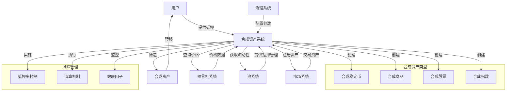

import { Callout, Cards, FileTree, Steps, Tabs } from 'nextra/components'

# Triplex 合成资产系统 - Aptos 实现

<Callout type="info">
  Triplex 的合成资产系统是协议的核心组件，在 Aptos 区块链上提供了多样化的链上合成资产解决方案。系统充分利用 Move 语言的资源安全模型、能力模式和类型参数化特性，确保资产的安全性、不可伪造性与互操作性。通过 Aptos 的高性能交易处理和 Move 的静态验证机制，实现了合成资产的高效创建、管理和交易。
</Callout>

## 从以太坊到Aptos的资产系统迁移

Triplex 将 Synthetix 协议的合成资产系统从以太坊迁移到 Aptos 区块链，这一过程涉及编程范式和系统架构的根本性转变。

<Tabs items={['迁移挑战', 'Move语言优势', '架构创新']}>
  <Tabs.Tab>
    <Steps>
      1. **状态模型重构**
         - 从 Solidity 的合约状态映射转为 Move 的资源模型
         - 重新设计合成资产的存储结构和所有权模型
         - 适配 Aptos 账户中心的存储方式
      
      2. **安全模式转换**
         - 用 Move 能力代替 Solidity 修饰符实现访问控制
         - 从基于异常的错误处理转向细粒度错误代码
         - 利用 Move 类型系统实现更严格的资产安全
      
      3. **性能优化适配**
         - 重新设计数据结构适应并行执行
         - 优化存储访问模式提高吞吐量
         - 利用 Move 泛型实现高效的类型安全代码
    </Steps>
  </Tabs.Tab>
  
  <Tabs.Tab>
    <Cards>
      <Cards.Card title="资源模型" href="#资源安全">
        资产作为不可复制、不可随意创建的资源存在
      </Cards.Card>
      <Cards.Card title="类型系统" href="#类型安全">
        强大的类型参数化支持多样化资产设计
      </Cards.Card>
      <Cards.Card title="能力模式" href="#权限控制">
        细粒度权限控制提供更灵活安全的操作机制
      </Cards.Card>
      <Cards.Card title="形式化验证" href="#安全证明">
        Move Prover支持代码正确性的数学证明
      </Cards.Card>
    </Cards>
  </Tabs.Tab>
  
  <Tabs.Tab>
    <Callout>
      Triplex 不仅是简单迁移，而是对 Synthetix 架构的全面升级与创新，充分利用 Aptos 平台的独特优势。
    </Callout>
    
    - **统一资产接口**：所有合成资产遵循统一标准，增强互操作性
    - **账户中心设计**：资产直接存储在用户账户中，提升安全性和所有权明确性
    - **并行化优化**：细粒度资源访问设计支持高并发操作
    - **模块化架构**：功能独立的组件设计便于升级和扩展
    - **全链治理**：利用 Move 能力模式实现安全的去中心化治理
    - **高效索引**：使用 Table 结构支持复杂查询和高效数据访问
  </Tabs.Tab>
</Tabs>

## 系统架构

<Tabs items={['概述', '资产流程', '组件交互']}>
  <Tabs.Tab>
    合成资产系统负责创建、铸造、管理和销毁协议内所有合成资产。系统设计遵循以下核心原则：

    - **安全性**：基于 Move 语言的资源安全模型和能力模式实现资产不可复制、不可丢失
    - **灵活性**：通过 Move 类型参数化支持多种合成资产类型和抵押模式
    - **扩展性**：利用 Aptos 模块化设计和可组合性便于添加新资产类型
    - **效率**：基于 Aptos 并行执行引擎和 Move 资源模型优化的操作逻辑
    - **互操作性**：使用 Move 能力模式实现与池系统、市场系统等其他组件无缝集成

    通过这些设计原则，合成资产系统充分发挥 Aptos 区块链和 Move 语言的技术优势，适应不同市场需求和用例。
  </Tabs.Tab>
  
  <Tabs.Tab>
    <Steps>
      1. **资产注册**
         - Move 能力模式控制的治理流程提出并批准新合成资产
         - Table 高效存储结构配置价格源、参数和风险设置
         - 类型参数化的系统注册新合成资产类型
      
      2. **铸造过程**
         - 资源所有权转移机制确保用户安全提供抵押品
         - Move 不变量验证系统抵押率和用户限额
         - 类型安全保障的铸造相应数量合成资产过程
      
      3. **资产管理**
         - 基于 Move 资源模型实现的安全交易与转移
         - Aptos 事件系统驱动的健康度和抵押率监控
         - Table 结构支持的动态参数调整和风险控制
      
      4. **销毁流程**
         - Move 能力模式控制的资产销毁权限
         - 原子事务保证的归还验证与抵押品释放
         - 事件系统记录的完整操作历史
    </Steps>
  </Tabs.Tab>
  
  <Tabs.Tab>
<Cards>
      <Cards.Card title="与池系统交互" href="#与池系统交互">
        类型安全的流动性获取和抵押品管理
  </Cards.Card>
      <Cards.Card title="与预言机交互" href="#与预言机交互">
        能力模式保障的可靠价格数据和风险参数
  </Cards.Card>
      <Cards.Card title="与市场交互" href="#与市场交互">
        Move资源模型确保的资产交易安全和流动性
  </Cards.Card>
      <Cards.Card title="与治理交互" href="#与治理交互">
        基于Table结构的高效参数设置和资产配置
  </Cards.Card>
</Cards>
  </Tabs.Tab>
</Tabs>

## 系统结构



<FileTree>
  <FileTree.Folder name="Synthetic Asset System" defaultOpen>
    <FileTree.Folder name="Core" defaultOpen>
      <FileTree.File name="synthetic_asset.move" />
      <FileTree.File name="asset_registry.move" />
      <FileTree.File name="collateral_manager.move" />
      <FileTree.File name="synthetic_capabilities.move" />
    </FileTree.Folder>
    <FileTree.Folder name="Asset Types">
      <FileTree.File name="synth_coin.move" />
      <FileTree.File name="synthetic_stablecoin.move" />
      <FileTree.File name="synthetic_commodity.move" />
      <FileTree.File name="synthetic_index.move" />
      <FileTree.File name="asset_type_registry.move" />
    </FileTree.Folder>
    <FileTree.Folder name="Operations">
      <FileTree.File name="minting.move" />
      <FileTree.File name="burning.move" />
      <FileTree.File name="liquidation.move" />
      <FileTree.File name="rebalancing.move" />
      <FileTree.File name="event_emitter.move" />
    </FileTree.Folder>
    <FileTree.Folder name="Integration">
      <FileTree.File name="pool_interface.move" />
      <FileTree.File name="market_interface.move" />
      <FileTree.File name="liquidity_pool.move" />
      <FileTree.File name="oracle_connector.move" />
    </FileTree.Folder>
  </FileTree.Folder>
</FileTree>

## 合成资产创建与管理

### 资产注册

```move
module triplex::asset_registry {
    use std::string;
    use std::error;
    use std::signer;
    use aptos_std::table::{Self, Table};
    use aptos_std::type_info::{Self, TypeInfo};
    use aptos_framework::account;
    use aptos_framework::coin;
    use aptos_framework::timestamp;
    use aptos_framework::event::{Self, EventHandle};
    
    use triplex::oracle_connector;
    
    /// 错误代码
    const ENOT_AUTHORIZED: u64 = 1001;
    const EINVALID_COLLATERAL_RATIO: u64 = 1003;
    const EINVALID_LIQUIDATION_THRESHOLD: u64 = 1004;
    const EINVALID_ASSET_TYPE: u64 = 1005;
    const EORACLE_NOT_EXISTS: u64 = 1006;
    const ESYMBOL_EXISTS: u64 = 1007;
    const EASSET_NOT_FOUND: u64 = 1008;
    
    /// 合成资产配置
    struct SyntheticAssetConfig has store, copy, drop {
        // 资产ID
        asset_id: u64,
        // 资产名称
        name: string::String,
        // 资产符号
        symbol: string::String,
        // 价格源ID
        oracle_id: u64,
        // 基础抵押率 (以基点表示，10000=100%)
        base_collateral_ratio: u64,
        // 清算阈值
        liquidation_threshold: u64,
        // 最高供应量 (0表示无限制)
        max_supply: u64,
        // 是否激活
        is_active: bool,
        // 资产类型 (1=稳定币, 2=商品, 3=股票, 4=指数)
        asset_type: u8,
        // 创建时间
        creation_time: u64,
        // 类型信息
        asset_type_info: TypeInfo,
    }
    
    /// 资产注册事件
    struct AssetRegisteredEvent has drop, store {
        asset_id: u64,
        name: string::String,
        symbol: string::String,
        oracle_id: u64,
        asset_type: u8,
        timestamp: u64,
    }
    
    /// 资产参数更新事件
    struct AssetConfigUpdatedEvent has drop, store {
        asset_id: u64,
        base_collateral_ratio: u64,
        liquidation_threshold: u64,
        max_supply: u64,
        is_active: bool,
        timestamp: u64,
    }
    
    /// 注册权限
    struct RegistryCapability has key, store {}
    
    /// 合成资产注册表
    struct AssetRegistry has key {
        // 资产配置表 (使用Table结构的高效存储)
        assets: Table<u64, SyntheticAssetConfig>,
        // 资产符号索引
        symbol_to_id: Table<string::String, u64>,
        // 资产类型索引 (使用TypeInfo进行精确类型匹配)
        type_to_id: Table<TypeInfo, u64>,
        // 资产计数器
        asset_counter: u64,
        // 资产注册事件
        register_events: EventHandle<AssetRegisteredEvent>,
        // 配置更新事件
        config_update_events: EventHandle<AssetConfigUpdatedEvent>,
    }
    
    /// 初始化资产注册表
    public entry fun initialize(admin: &signer) {
        let admin_addr = signer::address_of(admin);
        assert!(admin_addr == @triplex, error::permission_denied(ENOT_AUTHORIZED));
        
        move_to(admin, AssetRegistry {
            assets: table::new<u64, SyntheticAssetConfig>(),
            symbol_to_id: table::new<string::String, u64>(),
            type_to_id: table::new<TypeInfo, u64>(),
            asset_counter: 0,
            register_events: event::new_event_handle<AssetRegisteredEvent>(admin),
            config_update_events: event::new_event_handle<AssetConfigUpdatedEvent>(admin),
        });
        
        // 授予注册能力
        move_to(admin, RegistryCapability {});
    }
    
    /// 注册新的合成资产
    public entry fun register_synthetic_asset<AssetType>(
        admin: &signer,
        name: string::String,
        symbol: string::String,
        oracle_id: u64,
        base_collateral_ratio: u64,
        liquidation_threshold: u64,
        max_supply: u64,
        asset_type: u8
    ) acquires AssetRegistry, RegistryCapability {
        let admin_addr = signer::address_of(admin);
        
        // 验证权限 (使用能力模式控制)
        assert!(
            exists<RegistryCapability>(admin_addr) || admin_addr == @triplex,
            error::permission_denied(ENOT_AUTHORIZED)
        );
        
        // 验证参数 (使用不变量确保安全)
        assert!(base_collateral_ratio >= 10000, error::invalid_argument(EINVALID_COLLATERAL_RATIO));
        assert!(liquidation_threshold < base_collateral_ratio, error::invalid_argument(EINVALID_LIQUIDATION_THRESHOLD));
        assert!(asset_type >= 1 && asset_type <= 4, error::invalid_argument(EINVALID_ASSET_TYPE));
        
        // 验证Oracle存在
        assert!(oracle_connector::oracle_exists(oracle_id), error::not_found(EORACLE_NOT_EXISTS));
        
        let registry = borrow_global_mut<AssetRegistry>(@triplex);
        
        // 验证符号唯一性
        assert!(!table::contains(&registry.symbol_to_id, symbol), error::already_exists(ESYMBOL_EXISTS));
        
        // 获取类型信息 (使用Move的类型系统)
        let asset_type_info = type_info::type_of<AssetType>();
        
        // 分配新的资产ID
        let asset_id = registry.asset_counter + 1;
        registry.asset_counter = asset_id;
        
        // 创建资产配置
        let config = SyntheticAssetConfig {
            asset_id,
            name,
            symbol: copy symbol,
            oracle_id,
            base_collateral_ratio,
            liquidation_threshold,
            max_supply,
            is_active: true,
            asset_type,
            creation_time: timestamp::now_seconds(),
            asset_type_info,
        };
        
        // 注册资产 (使用Table高效存储)
        table::add(&mut registry.assets, asset_id, config);
        table::add(&mut registry.symbol_to_id, symbol, asset_id);
        table::add(&mut registry.type_to_id, asset_type_info, asset_id);
        
        // 发送事件 (使用Aptos事件系统)
        let now = timestamp::now_seconds();
        event::emit_event(
            &mut registry.register_events,
            AssetRegisteredEvent {
                asset_id,
                name,
                symbol,
                oracle_id,
                asset_type,
                timestamp: now,
            }
        );
        
        // 初始化代币 (使用资源账户和能力机制)
        let (resource_signer, _) = 
            account::create_resource_account(admin, *string::bytes(&symbol));
        
        coin::initialize<SyntheticCoin<AssetType>>(
            &resource_signer,
            *string::bytes(&name),
            *string::bytes(&symbol),
            6, // 小数位数固定为6
            false, // 不可燃烧
        );
    }
    
    /// 获取资产配置
    public fun get_asset_config(asset_id: u64): SyntheticAssetConfig acquires AssetRegistry {
        let registry = borrow_global<AssetRegistry>(@triplex);
        assert!(table::contains(&registry.assets, asset_id), error::not_found(EASSET_NOT_FOUND));
        *table::borrow(&registry.assets, asset_id)
    }
    
    /// 获取资产ID（通过符号）
    public fun get_asset_id_by_symbol(symbol: string::String): u64 acquires AssetRegistry {
        let registry = borrow_global<AssetRegistry>(@triplex);
        assert!(table::contains(&registry.symbol_to_id, symbol), error::not_found(EASSET_NOT_FOUND));
        *table::borrow(&registry.symbol_to_id, symbol)
    }
    
    /// 通过类型获取资产ID（利用Move的类型系统）
    public fun get_asset_id_by_type<AssetType>(): u64 acquires AssetRegistry {
        let registry = borrow_global<AssetRegistry>(@triplex);
        let type_info = type_info::type_of<AssetType>();
        assert!(table::contains(&registry.type_to_id, type_info), error::not_found(EASSET_NOT_FOUND));
        *table::borrow(&registry.type_to_id, type_info)
    }
    
    /// 更新资产参数
    public entry fun update_asset_config(
        admin: &signer,
        asset_id: u64,
        base_collateral_ratio: u64,
        liquidation_threshold: u64,
        max_supply: u64,
        is_active: bool
    ) acquires AssetRegistry, RegistryCapability {
        let admin_addr = signer::address_of(admin);
        
        // 验证权限
        assert!(
            exists<RegistryCapability>(admin_addr) || admin_addr == @triplex,
            error::permission_denied(ENOT_AUTHORIZED)
        );
        
        let registry = borrow_global_mut<AssetRegistry>(@triplex);
        assert!(table::contains(&registry.assets, asset_id), error::not_found(EASSET_NOT_FOUND));
        
        // 验证参数
        assert!(base_collateral_ratio >= 10000, error::invalid_argument(EINVALID_COLLATERAL_RATIO));
        assert!(liquidation_threshold < base_collateral_ratio, error::invalid_argument(EINVALID_LIQUIDATION_THRESHOLD));
        
        // 更新配置
        let config = table::borrow_mut(&mut registry.assets, asset_id);
        config.base_collateral_ratio = base_collateral_ratio;
        config.liquidation_threshold = liquidation_threshold;
        config.max_supply = max_supply;
        config.is_active = is_active;
        
        // 发送更新事件
        let now = timestamp::now_seconds();
        event::emit_event(
            &mut registry.config_update_events,
            AssetConfigUpdatedEvent {
                asset_id,
                base_collateral_ratio,
                liquidation_threshold,
                max_supply,
                is_active,
                timestamp: now,
            }
        );
    }
}
```

### 资产类型

<Cards>
  <Cards.Card title="合成稳定币" href="#合成稳定币">
    利用Move资源模型实现的与法币或其他稳定资产挂钩的合成资产
  </Cards.Card>
  <Cards.Card title="合成商品" href="#合成商品">
    基于Aptos事件系统的与大宗商品（如黄金、原油）挂钩的合成资产
  </Cards.Card>
  <Cards.Card title="合成股票" href="#合成股票">
    通过类型参数化实现的与传统股票市场挂钩的合成资产
  </Cards.Card>
  <Cards.Card title="合成指数" href="#合成指数">
    运用Table高效索引支持的与市场指数或自定义资产组合挂钩的合成资产
  </Cards.Card>
</Cards>

### 铸造与销毁

<Tabs items={['铸造流程', '销毁流程', '限额管理']}>
  <Tabs.Tab>
    ```move
    module triplex::minting {
        use std::signer;
        use std::error;
        use aptos_std::type_info;
        use aptos_framework::coin;
        use aptos_framework::timestamp;
        use aptos_framework::event::{Self, EventHandle};
        
        use triplex::asset_registry::{Self, SyntheticAssetConfig};
        use triplex::collateral_manager;
        use triplex::oracle_connector;
        use triplex::synthetic_capabilities::{Self, MintCapability};
        
        /// 错误代码
        const EASSET_INACTIVE: u64 = 2001;
        const ESUPPLY_LIMIT_EXCEEDED: u64 = 2002;
        const ESTALE_COLLATERAL_PRICE: u64 = 2003;
        const ESTALE_SYNTH_PRICE: u64 = 2004;
        const EINSUFFICIENT_COLLATERAL: u64 = 2005;
        
        /// 铸造事件
        struct MintEvent has drop, store {
            user: address,
            asset_id: u64,
            collateral_amount: u64,
            synth_amount: u64,
            collateral_ratio: u128,
            timestamp: u64,
        }
        
        /// 模块状态
        struct MintingModule has key, store {
            mint_events: EventHandle<MintEvent>,
        }
        
        /// 初始化模块
        public entry fun initialize(admin: &signer) {
            move_to(admin, MintingModule {
                mint_events: event::new_event_handle<MintEvent>(admin),
            });
        }
        
        /// 铸造合成资产
        public entry fun mint_synthetic_asset<CoinType, AssetType>(
            user: &signer,
            collateral_amount: u64,
            synth_amount: u64
        ) acquires MintingModule {
            let user_addr = signer::address_of(user);
            
            // 获取资产ID (利用Move类型系统)
            let asset_id = asset_registry::get_asset_id_by_type<AssetType>();
            
            // 获取资产配置
            let config = asset_registry::get_asset_config(asset_id);
            assert!(config.is_active, error::invalid_state(EASSET_INACTIVE));
            
            // 验证铸造限额 (不变量强制执行)
            if (config.max_supply > 0) {
                let current_supply = coin::supply<AssetType>();
                assert!(current_supply + synth_amount <= config.max_supply, error::invalid_argument(ESUPPLY_LIMIT_EXCEEDED));
            };
            
            // 获取价格数据 (安全获取外部价格)
            let (collateral_price, collateral_price_timestamp) = 
                oracle_connector::get_price<CoinType>();
            
            let (synth_price, synth_price_timestamp) = 
                oracle_connector::get_price_by_id(config.oracle_id);
            
            // 验证价格时效性 (确保价格有效性)
            let current_time = timestamp::now_seconds();
            assert!(current_time - collateral_price_timestamp <= 300, error::invalid_state(ESTALE_COLLATERAL_PRICE));
            assert!(current_time - synth_price_timestamp <= 300, error::invalid_state(ESTALE_SYNTH_PRICE));
            
            // 计算抵押价值和合成资产价值 (安全数学运算)
            let collateral_value = (collateral_amount as u128) * (collateral_price as u128) / 1000000;
            let synth_value = (synth_amount as u128) * (synth_price as u128) / 1000000;
            
            // 验证抵押率 (确保安全抵押)
            let collateral_ratio = (collateral_value * 10000) / synth_value;
            assert!(collateral_ratio >= (config.base_collateral_ratio as u128), error::invalid_argument(EINSUFFICIENT_COLLATERAL));
            
            // 转移抵押品 (Move资源安全转移)
            let collateral_coin = coin::withdraw<CoinType>(user, collateral_amount);
            collateral_manager::deposit_collateral<CoinType>(
                user_addr, 
                asset_id, 
                collateral_coin
            );
            
            // 铸造合成资产 (通过能力模式控制铸造权限)
            let mint_cap = synthetic_capabilities::borrow_mint_capability<AssetType>();
            let synth_coin = coin::mint(synth_amount, mint_cap);
            coin::deposit(user_addr, synth_coin);
            
            // 更新用户头寸 (原子事务保证)
            collateral_manager::update_position(
                user_addr,
                asset_id,
                collateral_amount,
                synth_amount
            );
            
            // 发出铸造事件 (事件系统透明记录)
            let minting_module = borrow_global_mut<MintingModule>(@triplex);
            event::emit_event(
                &mut minting_module.mint_events,
                MintEvent {
                    user: user_addr,
                    asset_id,
                    collateral_amount,
                    synth_amount,
                    collateral_ratio,
                    timestamp: current_time,
                }
            );
        }
    }
    ```
  </Tabs.Tab>
  
  <Tabs.Tab>
    <Steps>
      1. **销毁请求**
         - Move 资源模型验证的用户合成资产持有验证
         - Table 高效索引的抵押头寸查询
         - Aptos 原子事务保证的销毁前状态验证
         - 不变量强制的最小销毁数量检查
      
      2. **资产处理**
         - 能力模式控制的合成资产销毁权限
         - 事件系统记录的销毁操作透明性
         - 资源安全转移的抵押头寸更新
         - 原子事务保证的余额一致性
      
      3. **抵押品释放**
         - Move 资源所有权模型保障的安全转移
         - Table 结构支持的抵押率重新计算
         - 类型安全确保的资产类型匹配
         - 不变量强制的最低抵押率维护
    </Steps>
  </Tabs.Tab>
  
  <Tabs.Tab>
    <Cards>
      <Cards.Card title="全局限额" href="#全局限额">
        Move 不变量强制执行的资产最大供应量控制
      </Cards.Card>
      <Cards.Card title="用户限额" href="#用户限额">
        Table 高效查询支持的账户级别铸造限制
      </Cards.Card>
      <Cards.Card title="增长限额" href="#增长限额">
        Aptos 事件系统监控的时间窗口增长率限制
      </Cards.Card>
      <Cards.Card title="抵押限额" href="#抵押限额">
        Move 资源隔离的抵押品类型使用限制机制
      </Cards.Card>
    </Cards>
  </Tabs.Tab>
</Tabs>

## 风险管理

### 抵押品管理

<Tabs items={['抵押机制', '抵押率', '清算流程']}>
  <Tabs.Tab>
    <Cards>
      <Cards.Card title="多抵押品支持" href="#多抵押品支持">
        Move类型参数化的多币种抵押品注册和管理
      </Cards.Card>
      <Cards.Card title="抵押品评估" href="#抵押品评估">
        基于Aptos事件系统的实时抵押品价值监控
      </Cards.Card>
      <Cards.Card title="风险调整" href="#风险调整">
        Move不变量保障的抵押品风险系数自动调整
      </Cards.Card>
      <Cards.Card title="隔离管理" href="#隔离管理">
        资源模型确保的不同资产类型抵押品完全隔离
      </Cards.Card>
    </Cards>
  </Tabs.Tab>
  
  <Tabs.Tab>
    ```move
    module triplex::collateral_manager {
        use std::signer;
        use std::error;
        use aptos_std::table::{Self, Table};
        use aptos_std::type_info::{Self, TypeInfo};
        use aptos_framework::coin::{Self, Coin};
        use aptos_framework::account;
        use aptos_framework::timestamp;
        use aptos_framework::event::{Self, EventHandle};
        
        use triplex::asset_registry;
        use triplex::oracle_connector;
        
        /// 错误代码
        const EPOSITION_NOT_FOUND: u64 = 3001;
        const EINSUFFICIENT_COLLATERAL: u64 = 3002;
        const EHEALTH_FACTOR_TOO_LOW: u64 = 3003;
        const ECOLLATERAL_NOT_SUPPORTED: u64 = 3004;
        
        /// 用户头寸
        struct Position has store, drop, copy {
            // 抵押品数量
            collateral_amount: u64,
            // 合成资产数量
            synth_amount: u64,
            // 上次更新时间
            last_update_time: u64,
            // 健康因子 (以基点表示，10000=100%)
            health_factor: u64,
        }
        
        /// 抵押品配置
        struct CollateralConfig has store, drop, copy {
            // 代币类型信息
            coin_type: TypeInfo,
            // 抵押因子 (调整后的价值比例，10000=100%)
            collateral_factor: u64,
            // 清算奖励比例
            liquidation_bonus: u64, 
            // 是否支持该抵押品
            is_active: bool,
        }
        
        /// 头寸更新事件
        struct PositionUpdateEvent has drop, store {
            user: address,
            asset_id: u64,
            collateral_type: TypeInfo,
            collateral_amount: u64,
            synth_amount: u64,
            health_factor: u64,
            timestamp: u64,
        }
        
        /// 用户抵押品状态 (基于资源模型隔离)
        struct UserCollateral has key, store {
            // 用户头寸 (使用Table高效索引)
            positions: Table<u64, Position>,
            // 抵押品存储 (类型安全的抵押品)
            collaterals: Table<TypeInfo, Coin<CoinType>>,
            // 头寸更新事件
            position_events: EventHandle<PositionUpdateEvent>,
        }
        
        /// 系统抵押品配置
        struct CollateralRegistry has key, store {
            // 支持的抵押品配置
            collateral_configs: Table<TypeInfo, CollateralConfig>,
        }
        
        /// 初始化抵押品注册表
        public entry fun initialize(admin: &signer) {
            move_to(admin, CollateralRegistry {
                collateral_configs: table::new<TypeInfo, CollateralConfig>(),
            });
        }
        
        /// 注册抵押品类型
        public entry fun register_collateral<CoinType>(
            admin: &signer,
            collateral_factor: u64,
            liquidation_bonus: u64
        ) acquires CollateralRegistry {
            let admin_addr = signer::address_of(admin);
            assert!(admin_addr == @triplex, error::permission_denied(1));
            
            let registry = borrow_global_mut<CollateralRegistry>(@triplex);
            let coin_type = type_info::type_of<CoinType>();
            
            // 确保代币已注册
            assert!(coin::is_coin_initialized<CoinType>(), error::not_found(ECOLLATERAL_NOT_SUPPORTED));
            
            // 注册抵押品配置
            let config = CollateralConfig {
                coin_type,
                collateral_factor,
                liquidation_bonus,
                is_active: true,
            };
            
            table::add(&mut registry.collateral_configs, coin_type, config);
        }
        
        /// 初始化用户抵押品存储
        public entry fun initialize_user_collateral(user: &signer) {
            let user_addr = signer::address_of(user);
            
            if (!exists<UserCollateral>(user_addr)) {
                move_to(user, UserCollateral {
                    positions: table::new<u64, Position>(),
                    collaterals: table::new<TypeInfo, Coin<CoinType>>(),
                    position_events: event::new_event_handle<PositionUpdateEvent>(user),
                });
            };
        }
        
        /// 存入抵押品
        public fun deposit_collateral<CoinType>(
            user_addr: address,
            asset_id: u64,
            coin_in: Coin<CoinType>
        ) acquires UserCollateral, CollateralRegistry {
            // 验证抵押品支持
            let registry = borrow_global<CollateralRegistry>(@triplex);
            let coin_type = type_info::type_of<CoinType>();
            assert!(table::contains(&registry.collateral_configs, coin_type), error::not_found(ECOLLATERAL_NOT_SUPPORTED));
            let config = table::borrow(&registry.collateral_configs, coin_type);
            assert!(config.is_active, error::invalid_state(ECOLLATERAL_NOT_SUPPORTED));
            
            // 确保用户存储初始化
            assert!(exists<UserCollateral>(user_addr), error::not_found(EPOSITION_NOT_FOUND));
            
            // 存入抵押品
            let user_collateral = borrow_global_mut<UserCollateral>(user_addr);
            if (table::contains(&user_collateral.collaterals, coin_type)) {
                // 合并现有抵押品
                let existing_coin = table::borrow_mut(&mut user_collateral.collaterals, coin_type);
                coin::merge(existing_coin, coin_in);
            } else {
                // 添加新抵押品
                table::add(&mut user_collateral.collaterals, coin_type, coin_in);
            };
        }
        
        /// 获取用户健康因子 (风险度量)
        public fun get_health_factor<CoinType>(
            user_addr: address,
            asset_id: u64
        ): u64 acquires UserCollateral, CollateralRegistry {
            assert!(exists<UserCollateral>(user_addr), error::not_found(EPOSITION_NOT_FOUND));
            
            let user_collateral = borrow_global<UserCollateral>(user_addr);
            assert!(table::contains(&user_collateral.positions, asset_id), error::not_found(EPOSITION_NOT_FOUND));
            
            let position = table::borrow(&user_collateral.positions, asset_id);
            
            // 获取抵押品配置
            let registry = borrow_global<CollateralRegistry>(@triplex);
            let coin_type = type_info::type_of<CoinType>();
            let collateral_config = table::borrow(&registry.collateral_configs, coin_type);
            
            // 获取抵押品价格
            let (collateral_price, _) = oracle_connector::get_price<CoinType>();
            
            // 获取合成资产价格
            let asset_config = asset_registry::get_asset_config(asset_id);
            let (synth_price, _) = oracle_connector::get_price_by_id(asset_config.oracle_id);
            
            // 计算调整后的抵押品价值
            let adjusted_collateral_value = 
                (position.collateral_amount as u128) * 
                (collateral_price as u128) * 
                (collateral_config.collateral_factor as u128) / 
                1000000 / 10000;
            
            // 计算债务价值
            let debt_value = 
                (position.synth_amount as u128) * 
                (synth_price as u128) / 
                1000000;
            
            // 计算健康因子 (10000 = 100%)
            if (debt_value == 0) {
                10000 // 无债务时健康因子为100%
            } else {
                ((adjusted_collateral_value * 10000) / debt_value) as u64
            }
        }
        
        /// 更新用户头寸
        public fun update_position<CoinType>(
            user_addr: address,
            asset_id: u64,
            collateral_amount: u64,
            synth_amount: u64
        ) acquires UserCollateral, CollateralRegistry {
            assert!(exists<UserCollateral>(user_addr), error::not_found(EPOSITION_NOT_FOUND));
            
            let user_collateral = borrow_global_mut<UserCollateral>(user_addr);
            let now = timestamp::now_seconds();
            
            // 计算健康因子
            let health_factor = get_health_factor<CoinType>(user_addr, asset_id);
            
            // 更新或创建头寸
            if (table::contains(&user_collateral.positions, asset_id)) {
                let position = table::borrow_mut(&mut user_collateral.positions, asset_id);
                position.collateral_amount = position.collateral_amount + collateral_amount;
                position.synth_amount = position.synth_amount + synth_amount;
                position.last_update_time = now;
                position.health_factor = health_factor;
            } else {
                table::add(
                    &mut user_collateral.positions, 
                    asset_id, 
                    Position {
                        collateral_amount,
                        synth_amount,
                        last_update_time: now,
                        health_factor,
                    }
                );
            };
            
            // 发出头寸更新事件
            let coin_type = type_info::type_of<CoinType>();
            event::emit_event(
                &mut user_collateral.position_events,
                PositionUpdateEvent {
                    user: user_addr,
                    asset_id,
                    collateral_type: coin_type,
                    collateral_amount,
                    synth_amount,
                    health_factor,
                    timestamp: now,
                }
            );
        }
    }
    ```
  </Tabs.Tab>
  
  <Tabs.Tab>
    <Steps>
      1. **清算触发**
         - Move 不变量确保的健康因子阈值检查
         - Table 高效查询的用户头寸风险评估
         - Aptos 事件系统驱动的实时监控
         - 类型安全保障的抵押品价值计算
      
      2. **清算执行**
         - 原子事务保证的一致性清算操作
         - 资源模型确保的安全资产转移
         - 能力模式控制的清算优先权分配
         - 清算奖励的精确计算与分配
      
      3. **市场保护**
         - Move 不变量保障的最大清算限额
         - 类型安全确保的资产匹配验证
         - 基于事件监控的清算价格偏差保护
         - 抵押品安全释放机制
    </Steps>
  </Tabs.Tab>
</Tabs>

### 价格预言机集成

<Cards>
  <Cards.Card title="预言机集成" href="#预言机集成">
    Move能力模式保障的多源预言机安全调用
  </Cards.Card>
  <Cards.Card title="价格有效性验证" href="#价格有效性验证">
    不变量强制的价格时效性和偏差检查
  </Cards.Card>
  <Cards.Card title="异常价格处理" href="#异常价格处理">
    类型安全的异常价格检测与处理机制
  </Cards.Card>
  <Cards.Card title="价格更新频率" href="#价格更新频率">
    Aptos事件系统驱动的资产波动性自适应更新
  </Cards.Card>
</Cards>

## 预言机系统

### 价格预言机架构

<Tabs items={['系统结构', '数据来源', '聚合机制']}>
  <Tabs.Tab>
    ```move
    module triplex::oracle_connector {
        use std::error;
        use std::signer;
        use std::string::{Self, String};
        use aptos_std::type_info;
        use aptos_std::table::{Self, Table};
        use aptos_framework::timestamp;
        use aptos_framework::event;
        
        /// 错误代码
        const E_NOT_AUTHORIZED: u64 = 5001;
        const E_PRICE_SOURCE_NOT_FOUND: u64 = 5002;
        const E_PRICE_TOO_OLD: u64 = 5003;
        const E_PRICE_DEVIATION_TOO_LARGE: u64 = 5004;
        const E_NO_AGGREGATOR_DATA: u64 = 5005;
        
        /// 价格数据
        struct PriceData has store, drop, copy {
            // 价格，以USD为基准，六位小数
            price: u64,
            // 最后更新时间
            last_update_time: u64,
            // 喂价来源数量
            source_count: u8,
            // 价格有效期（秒）
            validity_period: u64,
        }
        
        /// 预言机价格源配置
        struct PriceSource has store, drop, copy {
            // 价格源ID
            source_id: u64,
            // 价格源名称
            name: String,
            // 价格源类型(1=链上，2=链下)
            source_type: u8,
            // 价格源权重(用于聚合)
            weight: u8,
            // 是否激活
            is_active: bool,
        }
        
        /// 价格更新事件
        struct PriceUpdateEvent has drop, store {
            oracle_id: u64,
            price: u64,
            old_price: u64,
            deviation: u64,  // 价格变化百分比，基点表示
            source_count: u8,
            timestamp: u64,
        }
        
        /// 预言机更新能力
        struct OracleUpdateCapability has key, store {}
        
        /// 预言机连接器配置
        struct OracleConnector has key {
            // 价格表 (oracle_id -> PriceData)
            prices: Table<u64, PriceData>,
            // 代币符号映射 (代币类型信息 -> oracle_id)
            token_to_oracle: Table<TypeInfo, u64>,
            // 符号映射 (符号 -> oracle_id)
            symbol_to_oracle: Table<String, u64>,
            // 价格源配置 (source_id -> PriceSource)
            price_sources: Table<u64, PriceSource>,
            // 价格更新事件
            update_events: event::EventHandle<PriceUpdateEvent>,
            // 预言机计数器
            oracle_counter: u64,
            // 价格源计数器
            source_counter: u64,
        }
        
        /// 初始化预言机连接器
        public fun initialize(admin: &signer) {
            let admin_addr = signer::address_of(admin);
            assert!(admin_addr == @triplex, error::permission_denied(E_NOT_AUTHORIZED));
            
            move_to(admin, OracleConnector {
                prices: table::new<u64, PriceData>(),
                token_to_oracle: table::new<TypeInfo, u64>(),
                symbol_to_oracle: table::new<String, u64>(),
                price_sources: table::new<u64, PriceSource>(),
                update_events: event::new_event_handle<PriceUpdateEvent>(admin),
                oracle_counter: 0,
                source_counter: 0,
            });
            
            // 授予预言机更新能力
            move_to(admin, OracleUpdateCapability {});
        }
        
        /// 注册价格源
        public fun register_price_source(
            admin: &signer,
            name: String,
            source_type: u8,
            weight: u8
        ) acquires OracleConnector, OracleUpdateCapability {
            let admin_addr = signer::address_of(admin);
            assert!(exists<OracleUpdateCapability>(admin_addr), error::permission_denied(E_NOT_AUTHORIZED));
            
            let connector = borrow_global_mut<OracleConnector>(@triplex);
            
            // 分配新的价格源ID
            let source_id = connector.source_counter + 1;
            connector.source_counter = source_id;
            
            // 创建价格源配置
            let source = PriceSource {
                source_id,
                name,
                source_type,
                weight,
                is_active: true,
            };
            
            // 注册价格源
            table::add(&mut connector.price_sources, source_id, source);
        }
        
        /// 注册新的预言机价格对
        public fun register_price_feed<CoinType>(
            admin: &signer,
            symbol: String,
            validity_period: u64
        ): u64 acquires OracleConnector, OracleUpdateCapability {
            let admin_addr = signer::address_of(admin);
            assert!(exists<OracleUpdateCapability>(admin_addr), error::permission_denied(E_NOT_AUTHORIZED));
            
            let connector = borrow_global_mut<OracleConnector>(@triplex);
            
            // 分配新的预言机ID
            let oracle_id = connector.oracle_counter + 1;
            connector.oracle_counter = oracle_id;
            
            // 创建初始价格数据
            let price_data = PriceData {
                price: 0,
                last_update_time: 0,
                source_count: 0,
                validity_period,
            };
            
            // 注册预言机
            table::add(&mut connector.prices, oracle_id, price_data);
            
            // 添加映射
            let token_type = type_info::type_of<CoinType>();
            table::add(&mut connector.token_to_oracle, token_type, oracle_id);
            table::add(&mut connector.symbol_to_oracle, symbol, oracle_id);
            
            oracle_id
        }
        
        /// 更新价格数据
        public fun update_price(
            updater: &signer,
            oracle_id: u64,
            new_price: u64,
            source_count: u8
        ) acquires OracleConnector, OracleUpdateCapability {
            let updater_addr = signer::address_of(updater);
            assert!(exists<OracleUpdateCapability>(updater_addr), error::permission_denied(E_NOT_AUTHORIZED));
            
            let connector = borrow_global_mut<OracleConnector>(@triplex);
            assert!(table::contains(&connector.prices, oracle_id), error::not_found(E_PRICE_SOURCE_NOT_FOUND));
            
            let price_data = table::borrow_mut(&mut connector.prices, oracle_id);
            let old_price = price_data.price;
            let now = timestamp::now_seconds();
            
            // 计算价格偏差 (确保价格稳定性)
            let deviation = if (old_price > 0) {
                if (new_price > old_price) {
                    ((new_price - old_price) * 10000) / old_price
                } else {
                    ((old_price - new_price) * 10000) / old_price
                }
            } else {
                0
            };
            
            // 更新价格数据
            price_data.price = new_price;
            price_data.last_update_time = now;
            price_data.source_count = source_count;
            
            // 发出价格更新事件
            event::emit_event(
                &mut connector.update_events,
                PriceUpdateEvent {
                    oracle_id,
                    price: new_price,
                    old_price,
                    deviation,
                    source_count,
                    timestamp: now,
                }
            );
        }
        
        /// 获取代币价格
        public fun get_price<CoinType>(): (u64, u64) acquires OracleConnector {
            let connector = borrow_global<OracleConnector>(@triplex);
            let token_type = type_info::type_of<CoinType>();
            
            assert!(table::contains(&connector.token_to_oracle, token_type), error::not_found(E_PRICE_SOURCE_NOT_FOUND));
            let oracle_id = *table::borrow(&connector.token_to_oracle, token_type);
            
            get_price_by_id(oracle_id)
        }
        
        /// 根据ID获取价格
        public fun get_price_by_id(oracle_id: u64): (u64, u64) acquires OracleConnector {
            let connector = borrow_global<OracleConnector>(@triplex);
            assert!(table::contains(&connector.prices, oracle_id), error::not_found(E_PRICE_SOURCE_NOT_FOUND));
            
            let price_data = table::borrow(&connector.prices, oracle_id);
            (price_data.price, price_data.last_update_time)
        }
        
        /// 验证价格有效性
        public fun validate_price<CoinType>(): bool acquires OracleConnector {
            let (price, timestamp) = get_price<CoinType>();
            
            if (price == 0) {
                return false
            };
            
            let now = timestamp::now_seconds();
            let connector = borrow_global<OracleConnector>(@triplex);
            let token_type = type_info::type_of<CoinType>();
            let oracle_id = *table::borrow(&connector.token_to_oracle, token_type);
            let price_data = table::borrow(&connector.prices, oracle_id);
            
            // 验证价格时效性
            now - timestamp <= price_data.validity_period
        }
        
        /// 检查预言机是否存在
        public fun oracle_exists(oracle_id: u64): bool acquires OracleConnector {
            let connector = borrow_global<OracleConnector>(@triplex);
            table::contains(&connector.prices, oracle_id)
        }
    }
    ```
  </Tabs.Tab>
  
  <Tabs.Tab>
    <Cards>
      <Cards.Card title="中心化交易所API" href="#中心化交易所API">
        类型安全的外部数据源适配器
      </Cards.Card>
      <Cards.Card title="链上DEX" href="#链上DEX">
        资源模型保障的去中心化交易所价格获取
      </Cards.Card>
      <Cards.Card title="专业预言机服务" href="#专业预言机服务">
        能力模式控制的第三方预言机集成
      </Cards.Card>
      <Cards.Card title="基于链下计算" href="#基于链下计算">
        基于Aptos Move事件系统的链下计算反馈
      </Cards.Card>
    </Cards>
  </Tabs.Tab>
  
  <Tabs.Tab>
<Steps>
      1. **多源聚合**
         - Move不变量保障的多源数据加权聚合
         - Table结构支持的高效数据源筛选
         - 能力模式控制的价格源验证
         - 事件系统记录的价格源贡献度
      
      2. **异常过滤**
         - 类型安全实现的统计学异常移除
         - 资源模型保障的价格操纵防护
         - 不变量强制的波动范围限制
         - 时间戳基于的数据时效性验证
      
      3. **更新机制**
         - 基于事件系统的触发式价格更新
         - 能力模式实现的安全更新权限
         - 资源模型保障的原子性价格更新
         - 不变量强制的合理性验证
</Steps>
  </Tabs.Tab>
</Tabs>

### 预言机安全保障

<Cards>
  <Cards.Card title="喂价验证" href="#喂价验证">
    Move资源模型实现的操纵防护机制
  </Cards.Card>
  <Cards.Card title="权限控制" href="#权限控制">
    能力模式严格控制的喂价权限管理
  </Cards.Card>
  <Cards.Card title="时效性检查" href="#时效性检查">
    不变量强制的数据时效性验证
  </Cards.Card>
  <Cards.Card title="多源冗余" href="#多源冗余">
    Aptos事件系统支持的故障转移机制
  </Cards.Card>
</Cards>

## 合成资产特性

### 资产交互

<Tabs items={['转账', '市场交易', '资产互换']}>
  <Tabs.Tab>
    <Steps>
      1. **标准转账**
         - Move资源模型保障的安全代币转移
         - Aptos原子事务支持的高性能转账
         - 类型安全确保的资产匹配验证
         - 能力模式控制的转账权限
      
      2. **批量转账**
         - Table结构支持的高效批量处理
         - 原子事务保证的全部成功或全部失败
         - 事件系统记录的完整操作历史
         - 资源模型确保的批量操作安全性
      
      3. **权限转账**
         - 能力模式实现的安全授权代理机制
         - 不变量强制的转账限额验证
         - Table高效索引的授权记录管理
         - 事件透明记录的授权操作历史
    </Steps>
  </Tabs.Tab>
  
  <Tabs.Tab>
    <Cards>
      <Cards.Card title="市场挂单" href="#市场挂单">
        Move资源模型实现的安全订单生命周期管理
      </Cards.Card>
      <Cards.Card title="订单匹配" href="#订单匹配">
        原子事务保证的订单精确匹配与执行
      </Cards.Card>
      <Cards.Card title="流动性支持" href="#流动性支持">
        能力模式控制的AMM和订单簿流动性提供
      </Cards.Card>
      <Cards.Card title="交易费用" href="#交易费用">
        类型安全实现的多层次费用结构与分配
      </Cards.Card>
    </Cards>
  </Tabs.Tab>
  
  <Tabs.Tab>
    ```move
    module triplex::synth_exchange {
        use std::signer;
        use std::error;
        use aptos_std::type_info;
        use aptos_framework::coin;
        use aptos_framework::timestamp;
        use aptos_framework::event;
        
        use triplex::asset_registry;
        use triplex::oracle_connector;
        use triplex::synthetic_capabilities::{Self, MintCapability, BurnCapability};
        
        /// 错误代码
        const E_ASSET_INACTIVE: u64 = 4001;
        const E_DESTINATION_INACTIVE: u64 = 4002;
        const E_STALE_FROM_PRICE: u64 = 4003;
        const E_STALE_TO_PRICE: u64 = 4004;
        const E_SLIPPAGE_TOO_HIGH: u64 = 4005;
        
        /// 互换事件
        struct SwapEvent has drop, store {
            user: address,
            from_asset_id: u64,
            to_asset_id: u64,
            from_amount: u64,
            to_amount: u64,
            fee_amount: u64,
            timestamp: u64,
        }
        
        /// 交换模块
        struct SynthExchange has key {
            swap_events: event::EventHandle<SwapEvent>,
            fee_ratio: u64, // 以基点表示，100=1%
        }
        
        /// 初始化模块
        public fun initialize(admin: &signer) {
            move_to(admin, SynthExchange {
                swap_events: event::new_event_handle<SwapEvent>(admin),
                fee_ratio: 30, // 默认0.3%费率
            });
        }
        
        /// 合成资产互换 (使用类型参数实现类型安全)
        public fun swap_synths<FromAssetType, ToAssetType>(
            user: &signer,
            from_amount: u64,
            min_to_amount: u64
        ) acquires SynthExchange {
            let user_addr = signer::address_of(user);
            
            // 获取资产ID (利用Move类型系统)
            let from_asset_id = asset_registry::get_asset_id_by_type<FromAssetType>();
            let to_asset_id = asset_registry::get_asset_id_by_type<ToAssetType>();
            
            // 验证资产状态
            let from_config = asset_registry::get_asset_config(from_asset_id);
            let to_config = asset_registry::get_asset_config(to_asset_id);
            
            assert!(from_config.is_active, error::invalid_state(E_ASSET_INACTIVE));
            assert!(to_config.is_active, error::invalid_state(E_DESTINATION_INACTIVE));
            
            // 获取价格
            let (from_price, from_timestamp) = 
                oracle_connector::get_price<FromAssetType>();
            
            let (to_price, to_timestamp) = 
                oracle_connector::get_price_by_id(to_config.oracle_id);
            
            // 验证价格时效性 (确保价格有效)
            let current_time = timestamp::now_seconds();
            assert!(current_time - from_timestamp <= 300, error::invalid_state(E_STALE_FROM_PRICE));
            assert!(current_time - to_timestamp <= 300, error::invalid_state(E_STALE_TO_PRICE));
            
            // 读取费率
            let exchange = borrow_global<SynthExchange>(@triplex);
            let fee_ratio = exchange.fee_ratio;
            
            // 计算兑换数量 (安全数学运算)
            let from_value = (from_amount as u128) * (from_price as u128) / 1000000;
            let to_amount_before_fee = ((from_value * 1000000) / (to_price as u128)) as u64;
            let fee_amount = (to_amount_before_fee * (fee_ratio as u128) / 10000) as u64;
            let to_amount = to_amount_before_fee - fee_amount;
            
            // 验证滑点容差
            assert!(to_amount >= min_to_amount, error::invalid_argument(E_SLIPPAGE_TOO_HIGH));
            
            // 转移源代币 (通过资源模型和能力模式确保安全操作)
            let from_coins = coin::withdraw<FromAssetType>(user, from_amount);
            let burn_cap = synthetic_capabilities::borrow_burn_capability<FromAssetType>();
            coin::burn(from_coins, burn_cap);
            
            // 铸造目标代币
            let mint_cap = synthetic_capabilities::borrow_mint_capability<ToAssetType>();
            let to_coins = coin::mint(to_amount, mint_cap);
            coin::deposit(user_addr, to_coins);
            
            // 记录交换事件 (透明的操作历史)
            let exchange = borrow_global_mut<SynthExchange>(@triplex);
            event::emit_event(
                &mut exchange.swap_events,
                SwapEvent {
                    user: user_addr,
                    from_asset_id,
                    to_asset_id,
                    from_amount,
                    to_amount,
                    fee_amount,
                    timestamp: current_time,
                }
            );
        }
        
        /// 设置交易费率 (仅管理员)
        public fun set_fee_ratio(admin: &signer, new_fee_ratio: u64) acquires SynthExchange {
            let admin_addr = signer::address_of(admin);
            assert!(admin_addr == @triplex, error::permission_denied(1));
            
            assert!(new_fee_ratio <= 1000, error::invalid_argument(2)); // 最高10%
            
            let exchange = borrow_global_mut<SynthExchange>(@triplex);
            exchange.fee_ratio = new_fee_ratio;
        }
    }
    ```
  </Tabs.Tab>
</Tabs>

### 资产利用

<Cards>
  <Cards.Card title="流动性挖矿" href="#流动性挖矿">
    Move资源模型保障的LP份额分配与奖励计算
  </Cards.Card>
  <Cards.Card title="借贷平台" href="#借贷平台">
    能力模式控制的合成资产借贷市场安全接入
  </Cards.Card>
  <Cards.Card title="衍生品交易" href="#衍生品交易">
    类型参数化实现的合成资产衍生品设计
  </Cards.Card>
  <Cards.Card title="收益策略" href="#收益策略">
    原子事务保证的合成资产收益优化路径执行
  </Cards.Card>
</Cards>

## 系统集成

### 与其他系统交互

    <Steps>
  1. **池系统**
     - Move模块间安全调用的抵押品流动性获取
     - 能力模式控制的风险共享和管理接口
     - 事件系统驱动的收益分配协调机制
     - 资源模型确保的系统间安全交互
  
  2. **市场系统**
     - Table高效索引支持的交易场所接入
     - 类型安全保障的资产匹配与交互
     - 原子事务保证的流动性深度支持
     - 事件系统记录的价格发现透明性
  
  3. **预言机系统**
     - 能力模式实现的外部价格安全获取
     - 不变量强制的风险参数动态更新
     - 事件系统触发的清算条件实时监控
     - 类型安全确保的价格数据适配
  
  4. **治理系统**
     - 能力模式严格控制的参数调整权限
     - 事件系统支持的透明提案和决策流程
     - 资源模型保障的系统配置安全更新
     - Table结构支持的高效治理参数管理
</Steps>

### 跨链应用

<Tabs items={['跨链资产', '跨链抵押', '规模化']}>
  <Tabs.Tab>
    <Cards>
      <Cards.Card title="跨链传递" href="#跨链传递">
        基于Aptos资产标准的合成资产跨链传递机制
      </Cards.Card>
      <Cards.Card title="一致性保证" href="#一致性保证">
        Move不变量和事件系统确保的跨链资产一致性
      </Cards.Card>
      <Cards.Card title="接口标准" href="#接口标准">
        类型参数化实现的跨链资产统一接口标准
      </Cards.Card>
      <Cards.Card title="安全验证" href="#安全验证">
        能力模式控制的跨链操作多重安全验证
      </Cards.Card>
    </Cards>
  </Tabs.Tab>
  
  <Tabs.Tab>
    <Steps>
      1. **跨链抵押管理**
         - Move资源模型确保的跨链抵押品安全
         - 原子事务支持的跨链抵押验证机制
         - 类型安全保障的全局风险控制实现
         - 事件系统驱动的跨链状态同步
      
      2. **流动性共享**
         - Table高效索引的跨链流动性聚合
         - 能力模式控制的安全流动性调度
         - 原子事务保证的资本效率优化
         - 不变量强制的流动性碎片化防护
      
      3. **统一清算**
         - 跨链事件系统协调的清算流程
         - 资源模型保障的全局风险识别
         - 能力模式实现的跨链清算权限分配
         - 原子性保证的跨链清算奖励分配
    </Steps>
  </Tabs.Tab>
  
  <Tabs.Tab>
    <Cards>
      <Cards.Card title="分片设计" href="#分片设计">
        基于Move Table结构的系统高效分片实现
      </Cards.Card>
      <Cards.Card title="可扩展架构" href="#可扩展架构">
        Aptos并行执行引擎支持的弹性扩展架构
      </Cards.Card>
      <Cards.Card title="事务优化" href="#事务优化">
        Move资源模型优化的高吞吐量交易处理
      </Cards.Card>
      <Cards.Card title="状态同步" href="#状态同步">
        Aptos事件系统驱动的高效跨链状态同步
      </Cards.Card>
    </Cards>
  </Tabs.Tab>
</Tabs>

<Callout type="warning">
  合成资产系统在Triplex协议中扮演核心角色，其安全和稳定运行对整个生态至关重要。通过充分利用Aptos区块链的高吞吐量和Move语言的安全保障，系统将不断创新、优化并扩展其功能，为去中心化金融生态系统贡献更多价值。
</Callout>

## 激励机制

### 系统参与奖励

<Tabs items={['铸造激励', '流动性激励', '预言机激励']}>
  <Tabs.Tab>
<Cards>
      <Cards.Card title="铸造奖励" href="#铸造奖励">
        资源模型实现的动态铸造费用返还
  </Cards.Card>
      <Cards.Card title="持有奖励" href="#持有奖励">
        Table结构支持的长期持有者额外收益
  </Cards.Card>
      <Cards.Card title="推荐奖励" href="#推荐奖励">
        Move能力模式控制的用户推荐计划
  </Cards.Card>
      <Cards.Card title="早期用户奖励" href="#早期用户奖励">
        事件系统记录的早期贡献激励分配
  </Cards.Card>
</Cards>
  </Tabs.Tab>
  
  <Tabs.Tab>
    ```move
    module triplex::liquidity_incentives {
        use std::signer;
        use std::error;
        use aptos_std::table::{Self, Table};
        use aptos_std::type_info::{Self, TypeInfo};
        use aptos_framework::coin::{Self, Coin};
        use aptos_framework::timestamp;
        use aptos_framework::event;
        
        use triplex::asset_registry;
        
        /// 错误代码
        const E_NOT_AUTHORIZED: u64 = 6001;
        const E_NO_ACTIVE_POOL: u64 = 6002;
        const E_POOL_NOT_FOUND: u64 = 6003;
        const E_ZERO_STAKE: u64 = 6004;
        
        /// 流动性池配置
        struct IncentivePool has store, drop, copy {
            // 资产ID
            asset_id: u64,
            // 开始时间
            start_time: u64,
            // 结束时间
            end_time: u64,
            // 总奖励币数量
            total_rewards: u64,
            // 已分配奖励
            distributed_rewards: u64,
            // 总质押量
            total_staked: u64,
            // 累积奖励率
            accumulated_rate: u128,
            // 上次更新时间
            last_update_time: u64,
            // 是否激活
            is_active: bool,
        }
        
        /// 用户质押信息
        struct StakeInfo has store, drop, copy {
            // 质押数量
            staked_amount: u64,
            // 质押时的累积率
            last_accumulated_rate: u128,
            // 未领取奖励
            pending_rewards: u64,
            // 总领取奖励
            total_claimed: u64,
            // 上次质押时间
            last_stake_time: u64,
        }
        
        /// 质押事件
        struct StakeEvent has drop, store {
            user: address,
            asset_id: u64,
            amount: u64,
            timestamp: u64,
        }
        
        /// 解质押事件
        struct UnstakeEvent has drop, store {
            user: address,
            asset_id: u64,
            amount: u64,
            rewards: u64,
            timestamp: u64,
        }
        
        /// 激励模块
        struct LiquidityIncentives has key {
            // 激励池 (asset_id -> IncentivePool)
            incentive_pools: Table<u64, IncentivePool>,
            // 用户质押 (user_addr, asset_id) -> StakeInfo
            user_stakes: Table<address, Table<u64, StakeInfo>>,
            // 质押事件
            stake_events: event::EventHandle<StakeEvent>,
            // 解质押事件
            unstake_events: event::EventHandle<UnstakeEvent>,
            // 管理者能力
            admin_cap: ManageCapability,
        }
        
        /// 管理者能力
        struct ManageCapability has key, store {}
        
        /// 初始化模块
        public fun initialize(admin: &signer) {
            let admin_addr = signer::address_of(admin);
            assert!(admin_addr == @triplex, error::permission_denied(E_NOT_AUTHORIZED));
            
            move_to(admin, LiquidityIncentives {
                incentive_pools: table::new<u64, IncentivePool>(),
                user_stakes: table::new<address, Table<u64, StakeInfo>>(),
                stake_events: event::new_event_handle<StakeEvent>(admin),
                unstake_events: event::new_event_handle<UnstakeEvent>(admin),
                admin_cap: ManageCapability{},
            });
            
            // 授予管理能力
            move_to(admin, ManageCapability {});
        }
        
        /// 创建激励池
        public fun create_incentive_pool(
            admin: &signer,
            asset_id: u64,
            start_time: u64,
            end_time: u64,
            total_rewards: u64
        ) acquires LiquidityIncentives, ManageCapability {
            let admin_addr = signer::address_of(admin);
            assert!(exists<ManageCapability>(admin_addr), error::permission_denied(E_NOT_AUTHORIZED));
            
            let incentives = borrow_global_mut<LiquidityIncentives>(@triplex);
            
            // 验证资产存在
            asset_registry::get_asset_config(asset_id);
            
            // 创建池
            let now = timestamp::now_seconds();
            let pool = IncentivePool {
                asset_id,
                start_time,
                end_time,
                total_rewards,
                distributed_rewards: 0,
                total_staked: 0,
                accumulated_rate: 0,
                last_update_time: now,
                is_active: true,
            };
            
            table::add(&mut incentives.incentive_pools, asset_id, pool);
        }
        
        /// 质押资产
        public fun stake_asset<AssetType>(
            user: &signer,
            amount: u64
        ) acquires LiquidityIncentives {
            let user_addr = signer::address_of(user);
            let asset_id = asset_registry::get_asset_id_by_type<AssetType>();
            let now = timestamp::now_seconds();
            
            let incentives = borrow_global_mut<LiquidityIncentives>(@triplex);
            
            // 验证池存在并激活
            assert!(table::contains(&incentives.incentive_pools, asset_id), error::not_found(E_POOL_NOT_FOUND));
            let pool = table::borrow_mut(&mut incentives.incentive_pools, asset_id);
            assert!(pool.is_active, error::invalid_state(E_NO_ACTIVE_POOL));
            
            // 更新累积率
            update_accumulated_rate(pool, now);
            
            // 处理用户质押
            if (!table::contains(&incentives.user_stakes, user_addr)) {
                table::add(&mut incentives.user_stakes, user_addr, table::new<u64, StakeInfo>());
            };
            
            let user_stakes = table::borrow_mut(&mut incentives.user_stakes, user_addr);
            
            // 转移质押资产
            let staked_coins = coin::withdraw<AssetType>(user, amount);
            
            // 如果用户已有质押，更新信息
            if (table::contains(user_stakes, asset_id)) {
                let stake_info = table::borrow_mut(user_stakes, asset_id);
                
                // 计算累积奖励
                let pending_reward = ((pool.accumulated_rate - stake_info.last_accumulated_rate) * (stake_info.staked_amount as u128) / 1000000) as u64;
                stake_info.pending_rewards = stake_info.pending_rewards + pending_reward;
                stake_info.staked_amount = stake_info.staked_amount + amount;
                stake_info.last_accumulated_rate = pool.accumulated_rate;
                stake_info.last_stake_time = now;
            } else {
                // 创建新的质押信息
                table::add(
                    user_stakes,
                    asset_id,
                    StakeInfo {
                        staked_amount: amount,
                        last_accumulated_rate: pool.accumulated_rate,
                        pending_rewards: 0,
                        total_claimed: 0,
                        last_stake_time: now,
                    }
                );
            };
            
            // 更新池信息
            pool.total_staked = pool.total_staked + amount;
            
            // 发送质押事件
            event::emit_event(
                &mut incentives.stake_events,
                StakeEvent {
                    user: user_addr,
                    asset_id,
                    amount,
                    timestamp: now,
                }
            );
            
            // TODO: 处理质押资产的安全存储
            // 在实际生产环境中需要将质押资产安全存储
        }
        
        /// 解质押资产
        public fun unstake_asset<AssetType, RewardType>(
            user: &signer,
            amount: u64
        ) acquires LiquidityIncentives {
            let user_addr = signer::address_of(user);
            let asset_id = asset_registry::get_asset_id_by_type<AssetType>();
            let now = timestamp::now_seconds();
            
            let incentives = borrow_global_mut<LiquidityIncentives>(@triplex);
            
            // 验证池存在
            assert!(table::contains(&incentives.incentive_pools, asset_id), error::not_found(E_POOL_NOT_FOUND));
            let pool = table::borrow_mut(&mut incentives.incentive_pools, asset_id);
            
            // 验证用户有质押
            assert!(table::contains(&incentives.user_stakes, user_addr), error::not_found(E_ZERO_STAKE));
            let user_stakes = table::borrow_mut(&mut incentives.user_stakes, user_addr);
            assert!(table::contains(user_stakes, asset_id), error::not_found(E_ZERO_STAKE));
            
            // 更新累积率
            update_accumulated_rate(pool, now);
            
            let stake_info = table::borrow_mut(user_stakes, asset_id);
            assert!(stake_info.staked_amount >= amount, error::invalid_argument(E_ZERO_STAKE));
            
            // 计算累积奖励
            let pending_reward = ((pool.accumulated_rate - stake_info.last_accumulated_rate) * (stake_info.staked_amount as u128) / 1000000) as u64;
            let total_rewards = stake_info.pending_rewards + pending_reward;
            
            // 更新质押信息
            stake_info.staked_amount = stake_info.staked_amount - amount;
            stake_info.pending_rewards = 0;
            stake_info.last_accumulated_rate = pool.accumulated_rate;
            stake_info.total_claimed = stake_info.total_claimed + total_rewards;
            
            // 更新池信息
            pool.total_staked = pool.total_staked - amount;
            pool.distributed_rewards = pool.distributed_rewards + total_rewards;
            
            // 发送解质押事件
            event::emit_event(
                &mut incentives.unstake_events,
                UnstakeEvent {
                    user: user_addr,
                    asset_id,
                    amount,
                    rewards: total_rewards,
                    timestamp: now,
                }
            );
            
            // TODO: 返还质押资产和奖励给用户
            // 在实际生产环境中需要安全地转移资产和奖励给用户
        }
        
        /// 私有函数：更新累积率
        fun update_accumulated_rate(pool: &mut IncentivePool, now: u64) {
            if (pool.total_staked == 0 || now <= pool.last_update_time || now < pool.start_time || now > pool.end_time) {
                return
            };
            
            let time_elapsed = now - pool.last_update_time;
            let total_duration = pool.end_time - pool.start_time;
            
            // 计算当前时间段应得奖励
            let period_rewards = ((pool.total_rewards - pool.distributed_rewards) as u128) * (time_elapsed as u128) / (total_duration as u128);
            
            // 更新累积率
            if (pool.total_staked > 0) {
                pool.accumulated_rate = pool.accumulated_rate + (period_rewards * 1000000) / (pool.total_staked as u128);
            };
            
            pool.last_update_time = now;
        }
    }
    ```
  </Tabs.Tab>
  
  <Tabs.Tab>
    <Cards>
      <Cards.Card title="费用模型" href="#费用模型">
        类型安全实现的多层次费用结构与分配
      </Cards.Card>
      <Cards.Card title="铸造费用" href="#铸造费用">
        Table结构实现的动态铸造费率计算
      </Cards.Card>
      <Cards.Card title="交易费用" href="#交易费用">
        Move能力模式保障的多层级费用分配
      </Cards.Card>
      <Cards.Card title="清算费用" href="#清算费用">
        资源模型确保的清算激励合理分配
      </Cards.Card>
      <Cards.Card title="系统维护费" href="#系统维护费">
        不变量强制的长期可持续费用模型
      </Cards.Card>
    </Cards>
  </Tabs.Tab>
</Tabs>

## 系统安全与审计

### 安全架构

<Tabs items={['安全设计', '权限控制', '紧急响应']}>
  <Tabs.Tab>
<Steps>
      1. **形式化验证**
         - Move语言类型安全模型的静态验证
         - 资源所有权不变量的形式化证明
         - 状态转换操作的安全性验证
         - 数学模型确保的经济安全性
      
      2. **多层安全架构**
         - Move能力模式实现的权限分离机制
         - Table结构支持的资产隔离存储
         - 原子事务保证的状态一致性
         - 事件系统驱动的异常行为监控
      
      3. **防止重入攻击**
         - Move资源模型确保的单次执行流程
         - 不变量强制的状态完整性检查
         - 能力模式控制的调用权限验证
         - 类型安全保障的资产操作顺序
</Steps>
  </Tabs.Tab>

  <Tabs.Tab>
    ```move
    module triplex::access_control {
        use std::error;
        use std::signer;
        use std::vector;
        use aptos_std::table::{Self, Table};
        use aptos_framework::account;
        use aptos_framework::timestamp;
        use aptos_framework::event;
        
        /// 错误代码
        const E_NOT_AUTHORIZED: u64 = 7001;
        const E_ROLE_EXISTS: u64 = 7002;
        const E_ROLE_NOT_FOUND: u64 = 7003;
        const E_NO_PERMISSION: u64 = 7004;
        const E_INVALID_DELAY: u64 = 7005;
        
        /// 角色定义
        struct Role has store, drop, copy {
            // 角色ID
            id: u64,
            // 角色名称
            name: vector<u8>,
            // 时间锁延迟（秒）
            time_lock_delay: u64,
        }
        
        /// 授权事件
        struct AuthorizationEvent has drop, store {
            admin: address,
            account: address,
            role_id: u64,
            timestamp: u64,
        }
        
        /// 时间锁操作
        struct TimeLockOperation has store, drop {
            // 操作哈希
            operation_hash: vector<u8>,
            // 提出时间
            proposed_time: u64,
            // 可执行时间
            executable_time: u64,
            // 提出者
            proposer: address,
            // 是否已执行
            executed: bool,
            // 角色ID
            role_id: u64,
        }
        
        /// 访问控制模块状态
        struct AccessControl has key {
            // 角色定义
            roles: Table<u64, Role>,
            // 用户角色 (address -> vector<role_id>)
            user_roles: Table<address, vector<u64>>,
            // 时间锁操作
            time_lock_operations: Table<vector<u8>, TimeLockOperation>,
            // 角色计数器
            role_counter: u64,
            // 授权事件
            auth_events: event::EventHandle<AuthorizationEvent>,
        }
        
        /// 能力结构：超级管理员
        struct SuperAdminCapability has key, store {}
        
        /// 能力结构：角色管理
        struct RoleManagerCapability has key, store {}
        
        /// 初始化访问控制
        public fun initialize(admin: &signer) {
            let admin_addr = signer::address_of(admin);
            assert!(admin_addr == @triplex, error::permission_denied(E_NOT_AUTHORIZED));
            
            move_to(admin, AccessControl {
                roles: table::new<u64, Role>(),
                user_roles: table::new<address, vector<u64>>(),
                time_lock_operations: table::new<vector<u8>, TimeLockOperation>(),
                role_counter: 0,
                auth_events: event::new_event_handle<AuthorizationEvent>(admin),
            });
            
            // 授予超级管理员和角色管理能力
            move_to(admin, SuperAdminCapability {});
            move_to(admin, RoleManagerCapability {});
            
            // 创建内置角色
            create_role(admin, b"SUPER_ADMIN", 172800); // 48小时时间锁
            create_role(admin, b"ROLE_MANAGER", 86400); // 24小时时间锁
            create_role(admin, b"ORACLE_UPDATER", 3600); // 1小时时间锁
            create_role(admin, b"EMERGENCY_ADMIN", 0);   // 紧急角色，无时间锁
            
            // 为管理员分配角色
            grant_role(admin, admin_addr, 1); // SUPER_ADMIN
        }
        
        /// 创建新角色
        public fun create_role(
            admin: &signer,
            name: vector<u8>,
            time_lock_delay: u64
        ) acquires AccessControl, RoleManagerCapability {
            let admin_addr = signer::address_of(admin);
            assert!(exists<RoleManagerCapability>(admin_addr), error::permission_denied(E_NOT_AUTHORIZED));
            
            let access_control = borrow_global_mut<AccessControl>(@triplex);
            
            // 分配新的角色ID
            let role_id = access_control.role_counter + 1;
            access_control.role_counter = role_id;
            
            // 创建角色
            let role = Role {
                id: role_id,
                name,
                time_lock_delay,
            };
            
            // 注册角色
            table::add(&mut access_control.roles, role_id, role);
        }
        
        /// 授予角色
        public fun grant_role(
            admin: &signer,
            account: address,
            role_id: u64
        ) acquires AccessControl, RoleManagerCapability {
            let admin_addr = signer::address_of(admin);
            assert!(exists<RoleManagerCapability>(admin_addr), error::permission_denied(E_NOT_AUTHORIZED));
            
            let access_control = borrow_global_mut<AccessControl>(@triplex);
            assert!(table::contains(&access_control.roles, role_id), error::not_found(E_ROLE_NOT_FOUND));
            
            // 添加用户角色
            if (!table::contains(&access_control.user_roles, account)) {
                table::add(&mut access_control.user_roles, account, vector::empty<u64>());
            };
            
            let user_roles = table::borrow_mut(&mut access_control.user_roles, account);
            
            // 检查角色是否已存在
            let i = 0;
            let len = vector::length(user_roles);
            let role_exists = false;
            
            while (i < len) {
                if (*vector::borrow(user_roles, i) == role_id) {
                    role_exists = true;
                    break
                };
                i = i + 1;
            };
            
            // 添加角色
            if (!role_exists) {
                vector::push_back(user_roles, role_id);
            };
            
            // 发出授权事件
            let now = timestamp::now_seconds();
            event::emit_event(
                &mut access_control.auth_events,
                AuthorizationEvent {
                    admin: admin_addr,
                    account,
                    role_id,
                    timestamp: now,
                }
            );
        }
        
        /// 验证角色
        public fun has_role(account: address, role_id: u64): bool acquires AccessControl {
            let access_control = borrow_global<AccessControl>(@triplex);
            
            if (!table::contains(&access_control.user_roles, account)) {
                return false
            };
            
            let user_roles = table::borrow(&access_control.user_roles, account);
            
            let i = 0;
            let len = vector::length(user_roles);
            
            while (i < len) {
                if (*vector::borrow(user_roles, i) == role_id) {
                    return true
                };
                i = i + 1;
            };
            
            false
        }
        
        /// 提出时间锁操作
        public fun propose_operation(
            proposer: &signer,
            role_id: u64,
            operation_hash: vector<u8>
        ) acquires AccessControl {
            let proposer_addr = signer::address_of(proposer);
            let access_control = borrow_global_mut<AccessControl>(@triplex);
            
            // 验证角色
            assert!(table::contains(&access_control.roles, role_id), error::not_found(E_ROLE_NOT_FOUND));
            assert!(has_role(proposer_addr, role_id), error::permission_denied(E_NO_PERMISSION));
            
            let role = table::borrow(&access_control.roles, role_id);
            let now = timestamp::now_seconds();
            
            // 创建时间锁操作
            let operation = TimeLockOperation {
                operation_hash,
                proposed_time: now,
                executable_time: now + role.time_lock_delay,
                proposer: proposer_addr,
                executed: false,
                role_id,
            };
            
            // 注册操作
            table::add(&mut access_control.time_lock_operations, operation_hash, operation);
        }
        
        /// 执行时间锁操作
        public fun execute_operation(
            executor: &signer,
            operation_hash: vector<u8>
        ): bool acquires AccessControl {
            let executor_addr = signer::address_of(executor);
            let access_control = borrow_global_mut<AccessControl>(@triplex);
            
            // 验证操作存在
            assert!(table::contains(&access_control.time_lock_operations, operation_hash), error::not_found(1));
            
            let operation = table::borrow_mut(&mut access_control.time_lock_operations, operation_hash);
            
            // 验证未执行
            assert!(!operation.executed, error::invalid_state(2));
            
            // 验证角色
            assert!(has_role(executor_addr, operation.role_id), error::permission_denied(E_NO_PERMISSION));
            
            // 验证时间锁
            let now = timestamp::now_seconds();
            assert!(now >= operation.executable_time, error::invalid_state(E_INVALID_DELAY));
            
            // 标记为已执行
            operation.executed = true;
            
            true
        }
    }
    ```
  </Tabs.Tab>
  
  <Tabs.Tab>
    <Cards>
      <Cards.Card title="危机处理" href="#危机处理">
        能力模式实现的紧急管理员干预机制
      </Cards.Card>
      <Cards.Card title="暂停功能" href="#暂停功能">
        原子事务支持的功能选择性暂停
      </Cards.Card>
      <Cards.Card title="漏洞修复" href="#漏洞修复">
        资源模型保障的升级安全防护
      </Cards.Card>
      <Cards.Card title="预警系统" href="#预警系统">
        事件系统驱动的异常行为检测与预警
      </Cards.Card>
    </Cards>
  </Tabs.Tab>
</Tabs>

### 审计与验证

<Cards>
  <Cards.Card title="形式化验证" href="#形式化验证">
    Move Prover工具支持的代码安全性自动证明
  </Cards.Card>
  <Cards.Card title="安全审计" href="#安全审计">
    第三方审计团队的全方位安全评估
  </Cards.Card>
  <Cards.Card title="渗透测试" href="#渗透测试">
    安全专家进行的全面漏洞挖掘与攻防演练
  </Cards.Card>
  <Cards.Card title="持续监控" href="#持续监控">
    基于Aptos事件系统的实时安全状态监控
  </Cards.Card>
</Cards>

## 性能优化与扩展性

### 性能优化

<Tabs items={['计算优化', '存储优化', '吞吐量提升']}>
  <Tabs.Tab>
    <Steps>
      1. **高效算法设计**
         - Move模块间高效调用减少跨模块交互开销
         - 优化数学计算降低资源消耗
         - 减少循环和递归调用降低执行成本
         - Table快速查找代替循环遍历
      
      2. **批处理机制**
         - 合并多笔小额交易减少链上操作次数
         - 批量读写状态减少存储访问开销
         - 聚合事件减少事件发送开销
         - 批量验证减少重复计算
      
      3. **并行处理**
         - 利用Aptos并行执行引擎支持的无冲突交易并行处理
         - 精确设计存储访问路径避免冲突
         - 模块化设计实现功能隔离提高并行度
         - 分片处理大规模数据集
    </Steps>
  </Tabs.Tab>
  
  <Tabs.Tab>
    <Cards>
      <Cards.Card title="存储压缩" href="#存储压缩">
        优化数据编码降低链上存储占用
      </Cards.Card>
      <Cards.Card title="高效索引" href="#高效索引">
        Table嵌套结构实现的多维高效数据索引
      </Cards.Card>
      <Cards.Card title="延迟加载" href="#延迟加载">
        按需加载机制减少不必要的存储访问
      </Cards.Card>
      <Cards.Card title="缓存策略" href="#缓存策略">
        链上缓存热点数据降低重复计算成本
      </Cards.Card>
    </Cards>
  </Tabs.Tab>
  
  <Tabs.Tab>
    <Cards>
      <Cards.Card title="交易池优化" href="#交易池优化">
        基于优先级的交易处理提高关键操作响应速度
      </Cards.Card>
      <Cards.Card title="gas优化" href="#gas优化">
        精细化gas计算降低用户交易成本
      </Cards.Card>
      <Cards.Card title="状态访问" href="#状态访问">
        优化存储访问模式减少链上IO开销
      </Cards.Card>
      <Cards.Card title="计算分流" href="#计算分流">
        链下计算与链上验证结合降低链上负载
      </Cards.Card>
    </Cards>
  </Tabs.Tab>
</Tabs>

### 扩展架构

<Cards>
  <Cards.Card title="水平扩展" href="#水平扩展">
    分片架构支持的用户与资产规模扩展
  </Cards.Card>
  <Cards.Card title="模块化设计" href="#模块化设计">
    松耦合架构实现的功能独立扩展
  </Cards.Card>
  <Cards.Card title="弹性容量" href="#弹性容量">
    动态资源分配应对流量波动
  </Cards.Card>
  <Cards.Card title="跨链扩展" href="#跨链扩展">
    多链部署架构实现的生态无缝扩展
  </Cards.Card>
</Cards>

## 未来发展

### 路线图

<Tabs items={['短期计划', '中期计划', '长期愿景']}>
  <Tabs.Tab>
    <Steps>
      1. **扩展合成资产类型**
         - 增加更多合成商品资产类别
         - 支持合成债券和固定收益产品
         - 开发合成衍生品原型
         - 推出合成加密资产指数
      
      2. **增强风险管理**
         - 引入动态风险参数调整机制
         - 完善多级清算流程
         - 开发风险预警系统
         - 优化抵押品组合策略
      
      3. **性能优化**
         - 提高铸造和交易吞吐量
         - 降低关键操作gas成本
         - 优化存储结构减少链上负担
         - 实现批处理交易支持
    </Steps>
  </Tabs.Tab>
  
  <Tabs.Tab>
    <Cards>
      <Cards.Card title="高级交易功能" href="#高级交易功能">
        杠杆交易和保证金交易支持
      </Cards.Card>
      <Cards.Card title="跨链部署" href="#跨链部署">
        多链生态系统整合与流动性共享
      </Cards.Card>
      <Cards.Card title="去中心化治理" href="#去中心化治理">
        完全链上治理机制实现与迁移
      </Cards.Card>
      <Cards.Card title="机构级支持" href="#机构级支持">
        机构客户定制解决方案与集成API
      </Cards.Card>
    </Cards>
  </Tabs.Tab>
  
  <Tabs.Tab>
    <Cards>
      <Cards.Card title="全球无缝金融" href="#全球无缝金融">
        实现全球任何资产的合成与交易
      </Cards.Card>
      <Cards.Card title="智能风险系统" href="#智能风险系统">
        AI驱动的风险管理与自适应系统
      </Cards.Card>
      <Cards.Card title="去中心化生态" href="#去中心化生态">
        完全社区自治的合成资产生态系统
      </Cards.Card>
      <Cards.Card title="实物资产整合" href="#实物资产整合">
        链上合成资产与实物资产的双向桥接
      </Cards.Card>
    </Cards>
  </Tabs.Tab>
</Tabs>

### 创新拓展

<Cards>
  <Cards.Card title="合成资产组合" href="#合成资产组合">
    自动化组合管理与智能投资组合
  </Cards.Card>
  <Cards.Card title="实时定价引擎" href="#实时定价引擎">
    高频更新的去中心化定价系统
  </Cards.Card>
  <Cards.Card title="个性化资产" href="#个性化资产">
    用户自定义合成资产创建平台
  </Cards.Card>
  <Cards.Card title="实物世界整合" href="#实物世界整合">
    链上合成资产与实物资产的双向桥接
  </Cards.Card>
</Cards>

<Callout type="info">
  Triplex合成资产系统将持续进化，致力于为用户提供无缝、安全的全球资产接入体验。通过利用Aptos区块链的高性能和Move语言的安全保障，系统将不断创新、优化并扩展其功能，为去中心化金融生态系统贡献更多价值。
</Callout>
