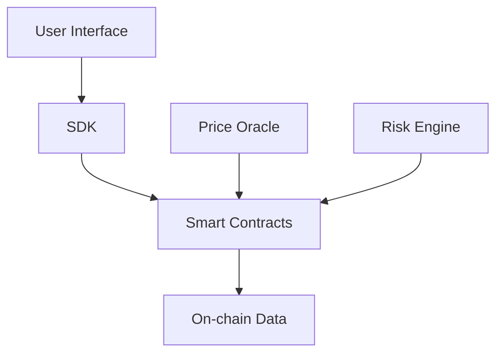

# Developer Overview

## Introduction

Triplex provides developers with a complete set of tools for building decentralized perpetual contract trading applications. This document will help you understand how to develop and integrate using the Triplex protocol.

## Core Features

- Perpetual contract trading
- Cross-margin trading
- Automated market making
- Risk management system
- Price oracle integration

## Technical Architecture

## Development Resources

### Code Repositories
- [Triplex Core](https://github.com/your-org/triplex-core)
- [Triplex SDK](https://github.com/your-org/triplex-sdk)
- [Example Applications](https://github.com/your-org/triplex-examples)

### Documentation
- [Integration Guide](/fordevelopers/integration)
- [API Reference](/fordevelopers/api)
- [Smart Contract Documentation](https://docs.triplex.io/contracts)

## Development Environment

### Test Networks
- Sepolia Testnet
- Goerli Testnet

### Mainnet
- Ethereum Mainnet
- Layer 2 Solution Support

## Technical Support

- Discord: [Triplex Developer Community](https://discord.gg/triplex)
- GitHub Issues: [Issue Tracking](https://github.com/your-org/triplex/issues)
- Email Support: dev@triplex.io 