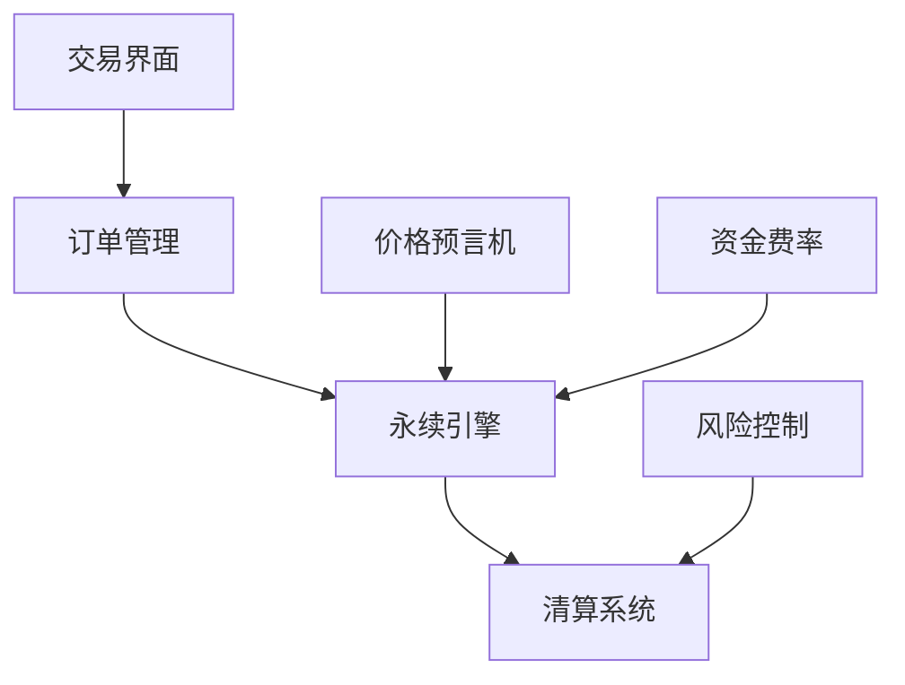

# Triplex 永续协议概述

## 介绍

Triplex 永续协议是一个去中心化的永续期货交易协议，为用户提供高效且安全的加密货币杠杆交易服务。该协议采用创新的机制设计，以确保交易公平性和系统可持续性。

## 核心功能

### 永续交易
- 支持多种加密货币交易对
- 高达50倍杠杆
- 灵活的保证金管理
- 实时市场价格反馈

### 资金费率机制
- 动态资金费率调整
- 8小时结算周期
- 市场驱动的费率计算
- 透明的费率显示

### 流动性提供
- 自动做市商(AMM)机制
- 流动性提供者激励
- 动态定价曲线
- 多层流动性池

### 风险管理
- 实时风险监控
- 自动清算机制
- 保险基金保护
- 价格偏差保护

## 技术架构

## 市场参与者

### 交易者
- 开立多头/空头头寸
- 设置止盈/止损订单
- 管理保证金
- 执行交易策略

### 流动性提供者
- 提供交易深度
- 赚取交易费用
- 参与流动性挖矿
- 管理流动性风险

### 保险基金
- 防止系统性风险
- 补偿强制清算损失
- 维护市场稳定
- 费用分配机制

## 产品优势

1. **安全性**
   - 智能合约审计
   - 多重安全机制
   - 透明的操作

2. **效率**
   - 低延迟交易执行
   - 优化的撮合引擎
   - 高性能后端

3. **公平性**
   - 统一的定价机制
   - 透明的费用结构
   - 公平的清算过程

4. **可扩展性**
   - 模块化架构
   - 跨链兼容性
   - 可升级合约

## 开发路线图

### 当前阶段
- 基本的永续合约功能
- 主要交易对支持
- 基本风险管理系统

### 近期计划
- 额外的交易对支持
- 高级订单类型
- 增强的风险管理

### 长期愿景
- 跨链集成
- 创新产品开发
- 生态系统扩展

## 其他资源

- [协议机制](/perpsDoc/mechanism)
- [风险管理](/perpsDoc/risk)
- [开发者文档](/fordevelopers/overview)
- [GitHub 仓库](https://github.com/your-org/triplex) 