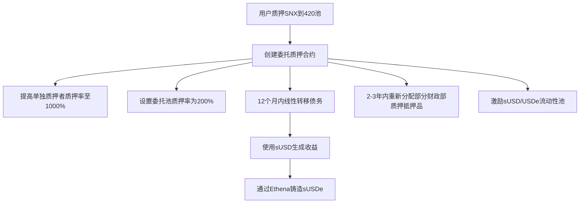
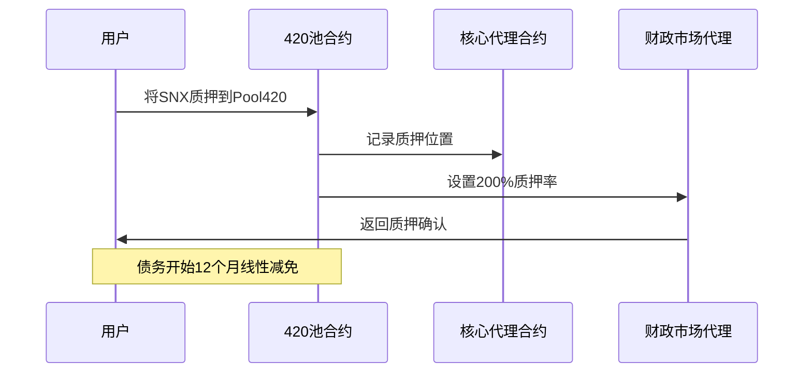
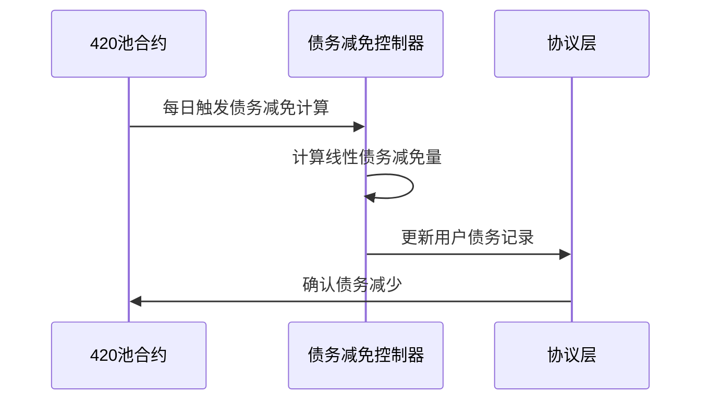
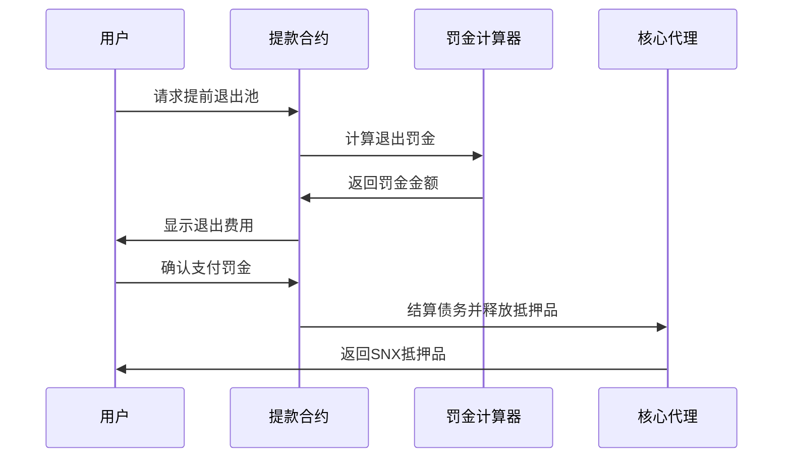

import { Callout, Cards, Steps, Tabs } from 'nextra/components'

# Synthetix 420池技术架构分析

<Callout type="info">
  Synthetix 420池是Synthetix协议的重要创新，旨在简化质押流程并解决债务管理问题。本文对其技术架构进行详细分析。
</Callout>

## 基本概念与核心机制

SIP-420提出了一个协议拥有的债务池的概念，本质上是实现了"委托质押"(delegated staking)模式。

<Tabs items={['债务池集中管理', '资本效率提升', '线性债务转移']}>
  <Tabs.Tab>
    ### 债务池集中管理
    
    - 协议创建一个中央债务池，将个人质押者的债务集中管理
    - 由协议而非个人质押者承担和管理债务风险
    - 降低了整体系统的风险暴露
  </Tabs.Tab>
  <Tabs.Tab>
    ### 资本效率提升
    
    - 将质押率(c-ratio)从传统的几百%降低到200%
    - 无需担心个别"坏账质押者"，因此可以采用更高的杠杆率
    - 提高了整个系统的资本利用效率
  </Tabs.Tab>
  <Tabs.Tab>
    ### 线性债务转移
    
    - 用户将现有债务位置贡献给新池
    - 在12个月内逐步转移债务（但不转移抵押品）
    - 实现无清算风险的债务管理
    - 6个月时减少50%，12个月后完全消除
  </Tabs.Tab>
</Tabs>

## 关键技术实现

### 智能合约结构

<Cards>
  <Cards.Card
    title="委托质押合约"
    href="#智能合约结构"
  >
    创建新的委托质押智能合约（或扩展现有质押合约）
  </Cards.Card>
  <Cards.Card
    title="债务转移逻辑"
    href="#智能合约结构"
  >
    实现债务位置随时间转移的逻辑，同时不转移底层抵押品
  </Cards.Card>
  <Cards.Card
    title="抵押品分配"
    href="#智能合约结构"
  >
    创建从财政部分配SNX抵押品的机制
  </Cards.Card>
</Cards>

### 债务管理系统

<Steps>
### 线性债务减免
线性债务减免逻辑实现（即6个月后减免50%，12个月后减免100%）

### 提前退出惩罚
实现提前退出惩罚计算，从第一天的100%逐渐降低到第364天的50%

### 完全免除
第365天完全免除债务，无需惩罚

### 收益生成与分配
将生成的sUSD用于产生收益（例如通过Ethena协议铸造sUSDe），并实现收益重新分配给质押者的机制
</Steps>

## 可配置参数

<Callout type="warning">
  SIP-420的实现设计了多个通过SCCP（Synthetix Configuration Change Proposal）可配置的参数，可以根据市场情况进行调整
</Callout>

1. 委托质押的发行比率（初始提议为200%）
2. 非委托质押者的质押率（初始为1000%）
3. 转移债务与抵押品的时间窗口（初始为12个月线性债务减少）
4. 12个月内退出池的提前退出惩罚（初始从进入池子的第一天100%线性降低到12个月末的50%）
5. sUSD/USDe池的激励金额
6. 用作质押激励的财政部抵押品数量（初始提议为1000万SNX）

## 合约交互流程

### 用户入池流程

### 债务减免机制

### 提前退出处理

## 技术优势

<Tabs items={['风险隔离', '扩展性', '简化用户体验', '资本效率']}>
  <Tabs.Tab>
    ### 风险隔离
    
    - 通过集中债务池管理，隔离个体质押者风险
    - 协议层面的风险管理更加高效
    - 降低了系统整体的风险暴露
  </Tabs.Tab>
  <Tabs.Tab>
    ### 扩展性
    
    - 随着抵押品规模线性扩展的收益模型
    - 无需依赖交易收入来维持系统激励
    - 更加可持续的长期增长模式
  </Tabs.Tab>
  <Tabs.Tab>
    ### 简化用户体验
    
    - 无需用户主动管理债务
    - 无需担心清算风险
    - 质押过程大大简化，降低了入门门槛
  </Tabs.Tab>
  <Tabs.Tab>
    ### 资本效率
    
    - 将内部化系统中的杠杆
    - 降低所有人的风险
    - 通过Ethena等平台生成高收益
    - 更有效地利用质押资产
  </Tabs.Tab>
</Tabs>

## 不清算稳定币机制

<Callout type="info">
  Synthetix 420池通过以下机制在不清算的情况下维持稳定币价值
</Callout>

<Steps>
### 共享债务池模型
- 所有质押者共同承担债务风险
- 分散个体风险，降低系统整体风险

### 协议自动调节
- 系统通过算法机制动态调整抵押品比率
- 使用治理参数自动平衡系统压力

### 线性债务减少
- 渐进式债务减少防止市场剧烈波动
- 控制稳定币供应变化速度

### 长期质押激励
- 提前退出惩罚机制鼓励长期质押
- 降低投机性退出产生的波动

### 收益机制
- 协议赚取的收益用于复合回报、分配给质押者或回购SNX
- 420池能以200%的c比率铸造合成稳定币生成收益
</Steps>

## 总结

<Callout type="default">
  SIP-420 Protocol Owned SNAX通过创建协议拥有的债务池，从根本上改变了Synthetix的质押模型。它通过将债务管理从个人转移到协议层面，在不增加系统风险的前提下提高了资本效率。同时，通过线性债务减免和有效的退出机制设计，既保护了早期质押者，又为新用户提供了明确的激励。

  这种创新模式代表了DeFi债务管理的一个新范式，解决了传统质押模式下低质押率和债务管理复杂的问题，为用户提供了无清算风险的质押收益方案。
</Callout>

## 相关资源

<Cards>
  <Cards.Card
    title="Synthetix官方文档"
    href="https://docs.synthetix.io/welcome-to-synthetix-user-docs/snx-staking/deposit-snx-to-the-420-pool"
  >
    了解420池的官方文档
  </Cards.Card>
  <Cards.Card
    title="GitHub代码库"
    href="https://github.com/Synthetixio/420"
  >
    查看420池的源代码
  </Cards.Card>
  <Cards.Card
    title="SIP-420提案"
    href="https://sips.synthetix.io/sips/sip-420/"
  >
    阅读完整的SIP-420提案
  </Cards.Card>
</Cards>