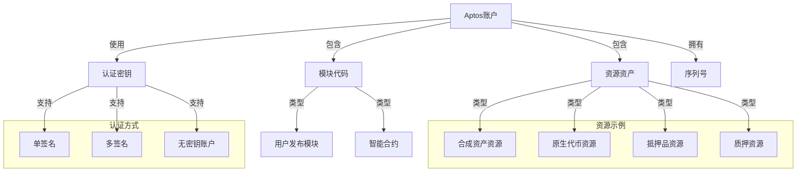

import { Callout, Cards, FileTree, Steps, Tabs } from 'nextra/components'

# Triplex 账户系统 - Aptos 实现

<Callout type="info">
  Triplex 的账户系统基于 Aptos 区块链的统一账户模型，充分利用 Move 语言的资源模型来管理用户资产、权限和状态。
</Callout>

## Aptos 账户模型概述

### 从以太坊到 Aptos 的账户模型转变

| 特性 | 以太坊账户模型 | Aptos账户模型 |
|------|---------------|--------------|
| **账户类型** | 外部拥有账户(EOA)和合约账户 | 统一账户模型 |
| **账户地址** | 160-bit (20字节) | 256-bit (32字节) |
| **交易验证** | 使用nonce | 使用序列号(sequence number) |
| **状态存储** | 合约存储映射 | 账户内资源存储 |
| **密钥管理** | 单一私钥 | 支持多公钥验证 |
| **编程模型** | 合约主导的计算 | 资源导向的计算 |

### Aptos账户结构



## Triplex 账户类型

### 用户账户

<Tabs items={['标准用户', '做市商', '治理参与者']}>
  <Tabs.Tab>
    ```move
    module triplex::user_account {
        use std::signer;
        use aptos_framework::account;
        
        struct UserProfile has key {
            username: vector<u8>,
            preferences: vector<u8>,
            is_verified: bool,
            created_at: u64,
        }
        
        public fun create_profile(account: &signer, username: vector<u8>) {
            let user_addr = signer::address_of(account);
            assert!(!exists<UserProfile>(user_addr), 1); // 检查是否已存在
            
            move_to(account, UserProfile {
                username,
                preferences: vector::empty(),
                is_verified: false,
                created_at: timestamp::now_seconds(),
            });
        }
        
        public fun update_preferences(account: &signer, new_preferences: vector<u8>) 
        acquires UserProfile {
            let user_addr = signer::address_of(account);
            let profile = borrow_global_mut<UserProfile>(user_addr);
            profile.preferences = new_preferences;
        }
    }
    ```
  </Tabs.Tab>
  
  <Tabs.Tab>
    <Steps>
      1. **做市商注册**
         - 提交交易开通做市商功能
         - 存入初始做市资金
         - 设置做市商策略参数
      
      2. **做市商权限**
         - 订单簿做市权限
         - 批量操作权限
         - 做市商费率优惠
      
      3. **做市商责任**
         - 维持最小流动性要求
         - 价格偏差控制
         - 活跃度要求
    </Steps>
  </Tabs.Tab>
  
  <Tabs.Tab>
    <Cards>
      <Cards.Card title="代表提案者" href="#治理参与者">
        可提交治理提案的账户
      </Cards.Card>
      <Cards.Card title="投票者" href="#治理参与者">
        参与投票的普通账户
      </Cards.Card>
      <Cards.Card title="多签账户" href="#治理参与者">
        执行重要操作的多签账户
      </Cards.Card>
    </Cards>
  </Tabs.Tab>
</Tabs>

### 系统账户

<Callout type="warning">
  系统账户在 Aptos 上使用资源账户(Resource Account)实现，可以管理资产但不依赖于特定私钥，而是由其他账户或预定义规则控制。
</Callout>

```move
module triplex::system_accounts {
    use std::signer;
    use aptos_framework::account;
    use aptos_framework::resource_account;
    
    struct TreasuryCapability has key {
        cap: resource_account::ResourceAccountCapability,
    }
    
    struct LiquidityPoolCapability has key {
        cap: resource_account::ResourceAccountCapability,
    }
    
    struct FeesCapability has key {
        cap: resource_account::ResourceAccountCapability,
    }
    
    public fun initialize_treasury(admin: &signer, seed: vector<u8>) {
        let (resource_signer, capability) = resource_account::create_resource_account(admin, seed);
        // 设置初始状态
        move_to(admin, TreasuryCapability { cap: capability });
    }
    
    public fun initialize_liquidity_pool(admin: &signer, seed: vector<u8>) {
        let (resource_signer, capability) = resource_account::create_resource_account(admin, seed);
        // 设置初始状态
        move_to(admin, LiquidityPoolCapability { cap: capability });
    }
    
    // 仅限授权账户可调用的功能
    public fun execute_treasury_operation(
        admin: &signer, 
        operation_type: u8,
        amount: u64
    ) acquires TreasuryCapability {
        // 执行国库操作
    }
}
```

## 资源管理

### 用户资产资源

<FileTree>
  <FileTree.Folder name="用户账户资源" defaultOpen>
    <FileTree.Folder name="合成资产" defaultOpen>
      <FileTree.File name="tpxUSD" />
      <FileTree.File name="tpxBTC" />
      <FileTree.File name="tpxETH" />
      <FileTree.File name="其他合成资产" />
    </FileTree.Folder>
    <FileTree.Folder name="抵押品">
      <FileTree.File name="APT" />
      <FileTree.File name="USDC" />
      <FileTree.File name="wBTC" />
      <FileTree.File name="其他抵押资产" />
    </FileTree.Folder>
    <FileTree.Folder name="状态资源">
      <FileTree.File name="做市商状态" />
      <FileTree.File name="治理权重" />
      <FileTree.File name="交易历史" />
      <FileTree.File name="用户配置" />
    </FileTree.Folder>
  </FileTree.Folder>
</FileTree>

### 合成资产管理

```move
module triplex::user_synth_position {
    use std::signer;
    use aptos_framework::fungible_asset::{Self, FungibleAsset};
    use triplex::synth_core;
    
    struct UserSynthPosition has key {
        collateral_type: vector<u8>,
        collateral_amount: u64,
        debt_value: u64,
        last_update: u64,
        health_factor: u64,
    }
    
    struct UserSynthPositionList has key {
        positions: vector<address>,  // 用户所有合成资产头寸的列表
    }
    
    // 创建新的合成资产头寸
    public fun create_position(
        account: &signer,
        collateral_type: vector<u8>,
        collateral_amount: u64,
        synth_type: vector<u8>,
        synth_amount: u64
    ) {
        // 实现逻辑
    }
    
    // 添加抵押品到现有头寸
    public fun add_collateral(
        account: &signer,
        position_id: address,
        collateral: FungibleAsset
    ) acquires UserSynthPosition {
        // 实现逻辑
    }
    
    // 提取部分抵押品
    public fun withdraw_collateral(
        account: &signer,
        position_id: address,
        amount: u64
    ): FungibleAsset acquires UserSynthPosition {
        // 实现逻辑
    }
    
    // 铸造更多合成资产
    public fun mint_more(
        account: &signer,
        position_id: address,
        synth_amount: u64
    ) acquires UserSynthPosition {
        // 实现逻辑
    }
    
    // 销毁部分合成资产偿还债务
    public fun burn_synth(
        account: &signer,
        position_id: address,
        synth_asset: FungibleAsset
    ) acquires UserSynthPosition {
        // 实现逻辑
    }
}
```

## 权限控制

### 基于能力的权限系统

<Callout type="info">
  Triplex 系统在 Aptos 上使用 Move 语言的能力模式(Capability Pattern)实现细粒度访问控制，确保只有授权实体可以执行受限操作。
</Callout>

```move
module triplex::permissions {
    use std::signer;
    
    // 能力类型定义
    struct AdminCapability has key { }
    struct ModeratorCapability has key { }
    struct LiquidatorCapability has key { }
    
    // 仅初始管理员可以调用
    public fun initialize(admin: &signer) {
        assert!(signer::address_of(admin) == @triplex_admin, 1);
        move_to(admin, AdminCapability {});
    }
    
    // 授予版主权限
    public fun grant_moderator(
        admin: &signer, 
        moderator_address: address
    ) acquires AdminCapability {
        // 验证调用者拥有管理员能力
        assert!(exists<AdminCapability>(signer::address_of(admin)), 2);
        
        // 创建新的版主能力并转移
        let moderator_cap = ModeratorCapability {};
        // 通过交易脚本将能力转移给moderator
    }
    
    // 授予清算人权限
    public fun grant_liquidator(
        admin_or_mod: &signer, 
        liquidator_address: address
    ) acquires AdminCapability, ModeratorCapability {
        let caller = signer::address_of(admin_or_mod);
        
        // 检查调用者是管理员或版主
        assert!(
            exists<AdminCapability>(caller) || 
            exists<ModeratorCapability>(caller), 
            3
        );
        
        // 创建清算人能力并转移
        let liquidator_cap = LiquidatorCapability {};
        // 通过交易脚本将能力转移给liquidator
    }
    
    // 验证清算权限
    public fun verify_liquidator(liquidator: &signer): bool {
        exists<LiquidatorCapability>(signer::address_of(liquidator))
    }
}
```

### 多签账户实现

<Steps>
  1. **创建多签账户**
     - 指定多签成员地址
     - 设置阈值（所需签名数）
     - 初始化多签账户
  
  2. **提交多签交易**
     - 准备交易内容
     - 获取第一个签名
     - 创建多签提案
  
  3. **收集签名**
     - 其他成员审核
     - 添加额外签名
     - 追踪签名进度
  
  4. **执行多签交易**
     - 验证签名数量满足阈值
     - 构建最终交易
     - 执行批准的操作
</Steps>

## 关键功能实现

### 账户初始化

```move
module triplex::account_management {
    use std::signer;
    use aptos_framework::account;
    use aptos_framework::coin;
    use triplex::permissions;
    
    struct UserMetadata has key {
        registration_time: u64,
        referrer: address,
        activity_score: u64,
        is_active: bool,
    }
    
    // 注册Triplex用户
    public entry fun register_user(
        new_user: &signer,
        referrer_address: address
    ) {
        let user_addr = signer::address_of(new_user);
        
        // 确保用户元数据不存在
        assert!(!exists<UserMetadata>(user_addr), 1);
        
        // 创建用户元数据
        move_to(new_user, UserMetadata {
            registration_time: timestamp::now_seconds(),
            referrer: referrer_address,
            activity_score: 0,
            is_active: true,
        });
        
        // 初始化用户需要的资源
        if (!coin::is_account_registered<AptosCoin>(user_addr)) {
            coin::register<AptosCoin>(new_user);
        }
        
        // 注册合成资产接收能力
        triplex::synthetic_assets::register_user(new_user);
    }
    
    // 停用账户
    public entry fun deactivate_account(user: &signer) 
    acquires UserMetadata {
        let user_addr = signer::address_of(user);
        let metadata = borrow_global_mut<UserMetadata>(user_addr);
        
        // 设置为非活跃
        metadata.is_active = false;
    }
    
    // 更新活跃度分数
    public fun update_activity_score(
        user_addr: address, 
        activity_value: u64
    ) acquires UserMetadata {
        let metadata = borrow_global_mut<UserMetadata>(user_addr);
        metadata.activity_score = metadata.activity_score + activity_value;
    }
}
```

### 账户存取操作

<Tabs items={['存入抵押品', '提取资产', '交易授权']}>
  <Tabs.Tab>
    <Steps>
      1. **选择抵押品类型**
         - 支持APT、稳定币和其他资产
         - 验证抵押品在白名单中
      
      2. **转移抵押品**
         - 从用户账户转移到系统账户
         - 在用户资源中记录抵押数量
      
      3. **更新用户状态**
         - 计算新的抵押率
         - 更新可铸造额度
    </Steps>
  </Tabs.Tab>
  
  <Tabs.Tab>
    ```move
    public fun withdraw_asset<CoinType>(
        user: &signer,
        amount: u64
    ): FungibleAsset acquires UserBalances {
        let user_addr = signer::address_of(user);
        
        // 获取用户余额管理器
        let balances = borrow_global_mut<UserBalances>(user_addr);
        
        // 验证余额充足
        let available_balance = get_balance<CoinType>(balances);
        assert!(available_balance >= amount, 1); // 余额不足
        
        // 更新记录
        update_balance<CoinType>(balances, available_balance - amount);
        
        // 从池中提取资产
        triplex::asset_pool::withdraw<CoinType>(amount)
    }
    ```
  </Tabs.Tab>
  
  <Tabs.Tab>
    <Cards>
      <Cards.Card title="交易授权" href="#交易授权">
        设置交易签名权限
      </Cards.Card>
      <Cards.Card title="授权限额" href="#交易授权">
        设置特定资产授权限额
      </Cards.Card>
      <Cards.Card title="时间限制" href="#交易授权">
        设置授权有效期
      </Cards.Card>
      <Cards.Card title="撤销授权" href="#交易授权">
        取消已授予的权限
      </Cards.Card>
    </Cards>
  </Tabs.Tab>
</Tabs>

## 无密钥账户

<Callout type="info">
  Aptos 支持无密钥账户(keyless accounts)，这为 Triplex 平台提供更灵活的账户抽象能力，允许用户使用社交身份验证和其他方式来控制其账户。
</Callout>

### 无密钥账户实现

```move
module triplex::keyless_accounts {
    use std::signer;
    use aptos_framework::account;
    
    struct KeylessAccountConfig has key {
        auth_validator: address,
        recovery_address: address,
        inactivity_timeout: u64,
    }
    
    // 其他实现逻辑...
}
```

## 与以太坊账户的互操作

<Cards>
  <Cards.Card title="跨链身份" href="#与以太坊账户的互操作">
    映射以太坊和Aptos账户
  </Cards.Card>
  <Cards.Card title="资产桥接" href="#与以太坊账户的互操作">
    ETH与APT生态资产互通
  </Cards.Card>
  <Cards.Card title="权限映射" href="#与以太坊账户的互操作">
    跨链权限同步机制
  </Cards.Card>
</Cards>
