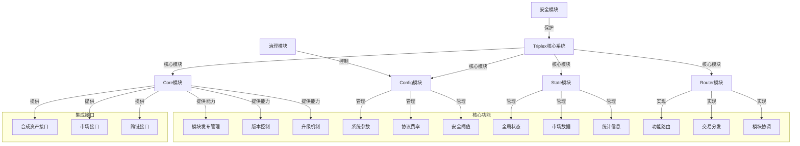

import { Callout, Cards, FileTree, Steps, Tabs } from 'nextra/components'

# Triplex 核心系统 - Aptos 实现

<Callout type="info">
  Triplex 的核心系统基于 Aptos 区块链的 Move 虚拟机实现，提供系统的基础功能和核心逻辑，包括模块管理、状态存储和系统配置，充分利用 Move 的资源导向模型和安全特性。
</Callout>

## 从以太坊到Aptos的核心系统转换

将 Synthetix 核心系统从以太坊迁移到 Aptos 平台需要彻底重构系统架构，适应两个平台之间的根本差异。这种转换不仅是简单的代码翻译，而是对整个系统设计理念的重新思考。

<Tabs items={['架构转变', '能力与权限', '编程模式', '状态管理']}>
  <Tabs.Tab>
    ### 从合约中心到模块资源架构
    
    **以太坊 Synthetix:**
    - 基于合约的分层系统，依赖代理合约实现升级
    - 通过 `Owned` 合约和修饰符控制访问权限
    - 状态数据存储在合约变量中
    - 通过事件实现链下状态跟踪
    
    **Aptos Triplex:**
    - 基于模块和资源的组织结构
    - 功能明确分离到专用模块中
    - 状态数据作为资源存储在特定账户中
    - 利用资源能力控制权限
    - 直接支持模块原地升级
  </Tabs.Tab>
  
  <Tabs.Tab>
    ### 权限与能力模型转换
    
    **以太坊 Synthetix:**
    ```solidity
    // 以太坊权限控制示例
    contract Owned {
        address public owner;
        address public nominatedOwner;
        
        constructor(address _owner) {
            owner = _owner;
        }
        
        modifier onlyOwner {
            require(msg.sender == owner, "Unauthorized");
            _;
        }
        
        function nominateNewOwner(address _owner) external onlyOwner {
            nominatedOwner = _owner;
        }
    }
    ```
    
    **Aptos Triplex:**
    ```move
    // Move能力模式示例
    struct AdminCapability has key, store {}
    
    public fun require_admin(admin: &signer) {
        assert!(exists<AdminCapability>(signer::address_of(admin)), 
               error::permission_denied(E_NOT_AUTHORIZED));
    }
    
    public fun execute_admin_action(admin: &signer, action_params: vector<u8>) acquires AdminCapability {
        require_admin(admin);
        // 执行需要管理员权限的操作
    }
    ```
  </Tabs.Tab>
  
  <Tabs.Tab>
    ### 编程模式迁移
    
    **类型系统转变:**
    - 从 Solidity 的有限类型支持到 Move 强大的类型参数化
    - 使用泛型实现高度可复用组件
    - 利用结构体能力标记(`key`, `store`, `drop`, `copy`)控制资源行为
    
    **错误处理:**
    - 从异常模型转变为错误代码模型
    - 利用 assert! 和自定义错误码提供清晰错误信息
    - 避免异常传播带来的不确定性
    
    **存储访问:**
    - 从合约存储到全局存储和表结构
    - 使用 `move_to`, `borrow_global`, `borrow_global_mut` 操作资源
    - 利用 `Table` 结构实现高效键值存储
  </Tabs.Tab>
  
  <Tabs.Tab>
    ### 状态管理与存储
    
    **以太坊 Synthetix:**
    ```solidity
    // 以太坊状态存储示例
    contract SynthetixState {
        mapping(address => uint) public issuanceData;
        mapping(bytes32 => uint) public currentIssuanceData;
        
        function setCurrentIssuanceData(bytes32 currencyKey, uint amount) external onlyAuthorized {
            currentIssuanceData[currencyKey] = amount;
        }
    }
    ```
    
    **Aptos Triplex:**
    ```move
    // Move状态存储示例
    struct SystemState has key {
        issuance_data: Table<address, u64>,
        current_issuance: Table<vector<u8>, u64>,
        last_update: u64,
    }
    
    public fun set_current_issuance(
        admin: &signer, 
        currency_key: vector<u8>, 
        amount: u64
    ) acquires SystemState {
        require_admin(admin);
        let state = borrow_global_mut<SystemState>(@triplex);
        table::upsert(&mut state.current_issuance, currency_key, amount);
    }
    ```
    
    **关键区别:**
    - Move资源明确属于特定账户
    - Table结构提供高效键值存储
    - 静态类型系统提供更强的正确性保证
    - 资源能力控制限制了状态的异常修改
  </Tabs.Tab>
</Tabs>

## Move 模块架构

### Aptos 模块系统概览



### Move 模块结构

<FileTree>
  <FileTree.Folder name="Core System" defaultOpen>
    <FileTree.Folder name="Core" defaultOpen>
      <FileTree.File name="core.move" />
      <FileTree.File name="version.move" />
      <FileTree.File name="capability.move" />
    </FileTree.Folder>
    <FileTree.Folder name="Config">
      <FileTree.File name="config.move" />
      <FileTree.File name="params.move" />
      <FileTree.File name="fees.move" />
    </FileTree.Folder>
    <FileTree.Folder name="State">
      <FileTree.File name="state.move" />
      <FileTree.File name="market_data.move" />
      <FileTree.File name="statistics.move" />
    </FileTree.Folder>
    <FileTree.Folder name="Router">
      <FileTree.File name="router.move" />
      <FileTree.File name="dispatcher.move" />
      <FileTree.File name="events.move" />
    </FileTree.Folder>
  </FileTree.Folder>
</FileTree>

## 核心模块设计

### 核心模块 (Core)

```move
module triplex::core {
    use std::error;
    use std::signer;
    use aptos_framework::account;
    use aptos_framework::timestamp;
    
    const E_NOT_INITIALIZED: u64 = 1;
    const E_ALREADY_INITIALIZED: u64 = 2;
    const E_NOT_AUTHORIZED: u64 = 3;
    
    /// 核心系统管理能力，控制系统关键操作
    struct CoreCapability has key, store {
        upgrader_cap: account::SignerCapability,
    }
    
    /// 系统版本信息
    struct Version has key {
        major: u64,
        minor: u64,
        patch: u64,
    }
    
    /// 系统初始化状态
    struct SystemState has key {
        initialized: bool,
        paused: bool,
        last_update: u64,
    }
    
    /// 初始化系统
    public fun initialize(admin: &signer) {
        let admin_addr = signer::address_of(admin);
        assert!(admin_addr == @triplex_admin, error::permission_denied(E_NOT_AUTHORIZED));
        
        assert!(!exists<SystemState>(admin_addr), error::already_exists(E_ALREADY_INITIALIZED));
        
        // 创建一个资源账户用于升级操作
        let seed = b"triplex_core_upgrader";
        let (upgrader, upgrader_cap) = account::create_resource_account(admin, seed);
        
        // 初始化系统状态
        move_to(admin, SystemState {
            initialized: true,
            paused: false,
            last_update: timestamp::now_seconds(),
        });
        
        // 初始化版本信息
        move_to(admin, Version {
            major: 1,
            minor: 0,
            patch: 0,
        });
        
        // 保存能力
        move_to(admin, CoreCapability {
            upgrader_cap,
        });
    }
    
    /// 检查系统是否已初始化
    public fun is_initialized(addr: address): bool acquires SystemState {
        exists<SystemState>(addr) && borrow_global<SystemState>(addr).initialized
    }
    
    /// 暂停系统（紧急情况）
    public fun pause_system(admin: &signer) acquires SystemState {
        let admin_addr = signer::address_of(admin);
        assert!(admin_addr == @triplex_admin, error::permission_denied(E_NOT_AUTHORIZED));
        
        let system_state = borrow_global_mut<SystemState>(admin_addr);
        system_state.paused = true;
        system_state.last_update = timestamp::now_seconds();
    }
    
    /// 恢复系统运行
    public fun unpause_system(admin: &signer) acquires SystemState {
        let admin_addr = signer::address_of(admin);
        assert!(admin_addr == @triplex_admin, error::permission_denied(E_NOT_AUTHORIZED));
        
        let system_state = borrow_global_mut<SystemState>(admin_addr);
        system_state.paused = false;
        system_state.last_update = timestamp::now_seconds();
    }
    
    /// 获取系统状态
    public fun get_system_state(addr: address): (bool, bool, u64) acquires SystemState {
        let state = borrow_global<SystemState>(addr);
        (state.initialized, state.paused, state.last_update)
    }
    
    /// 获取系统版本信息
    public fun get_version(addr: address): (u64, u64, u64) acquires Version {
        let version = borrow_global<Version>(addr);
        (version.major, version.minor, version.patch)
    }
    
    /// 升级系统版本（只能由管理员调用）
    public fun upgrade_version(
        admin: &signer,
        new_major: u64,
        new_minor: u64,
        new_patch: u64
    ) acquires Version, SystemState {
        let admin_addr = signer::address_of(admin);
        assert!(admin_addr == @triplex_admin, error::permission_denied(E_NOT_AUTHORIZED));
        
        // 检查系统状态
        assert!(is_initialized(admin_addr), error::not_found(E_NOT_INITIALIZED));
        
        // 更新版本信息
        let version = borrow_global_mut<Version>(admin_addr);
        version.major = new_major;
        version.minor = new_minor;
        version.patch = new_patch;
        
        // 更新系统状态
        let system_state = borrow_global_mut<SystemState>(admin_addr);
        system_state.last_update = timestamp::now_seconds();
    }
}
```

### 配置模块 (Config)

<Tabs items={['基本参数', '费率配置', '安全阈值']}>
  <Tabs.Tab>
    ```move
    module triplex::config {
        use std::error;
        use std::signer;
        use aptos_framework::event;
        
        /// 系统基础配置参数
        struct SystemParams has key {
            min_collateral_ratio: u64,    // 最小抵押率 (基点: 10000 = 100%)
            liquidation_threshold: u64,    // 清算阈值 (基点)
            max_leverage: u64,    // 最大杠杆倍数 (x100)
            maintenance_margin: u64,    // 维持保证金率 (基点)
            max_positions_per_account: u64,    // 每账户最大头寸数
            max_price_delay: u64,    // 价格最大延迟(秒)
        }
        
        /// 参数更新事件
        struct ParamsUpdateEvent has drop, store {
            param_name: vector<u8>,
            old_value: u64,
            new_value: u64,
        }
        
        struct EventsStore has key {
            params_update_events: event::EventHandle<ParamsUpdateEvent>,
        }
        
        // 初始化系统参数
        public fun initialize(admin: &signer) {
            let admin_addr = signer::address_of(admin);
            assert!(admin_addr == @triplex_admin, 1);
            
            if (!exists<EventsStore>(admin_addr)) {
                move_to(admin, EventsStore {
                    params_update_events: event::new_event_handle<ParamsUpdateEvent>(admin),
                });
            };
            
            // 设置默认参数
            move_to(admin, SystemParams {
                min_collateral_ratio: 15000,  // 150%
                liquidation_threshold: 12500,  // 125%
                max_leverage: 2000,  // 20x
                maintenance_margin: 500,  // 5%
                max_positions_per_account: 100,
                max_price_delay: 300,  // 5分钟
            });
        }
        
        // 更新最小抵押率
        public fun update_min_collateral_ratio(admin: &signer, new_value: u64) 
        acquires SystemParams, EventsStore {
            let admin_addr = signer::address_of(admin);
            assert!(admin_addr == @triplex_admin, 1);
            
            let params = borrow_global_mut<SystemParams>(admin_addr);
            let old_value = params.min_collateral_ratio;
            params.min_collateral_ratio = new_value;
            
            // 发出更新事件
            let events = borrow_global_mut<EventsStore>(admin_addr);
            event::emit_event(&mut events.params_update_events, ParamsUpdateEvent {
                param_name: b"min_collateral_ratio",
                old_value,
                new_value,
            });
        }
        
        // 获取系统参数
        public fun get_system_params(addr: address): (u64, u64, u64, u64, u64, u64) 
        acquires SystemParams {
            let params = borrow_global<SystemParams>(addr);
            (
                params.min_collateral_ratio,
                params.liquidation_threshold,
                params.max_leverage,
                params.maintenance_margin,
                params.max_positions_per_account,
                params.max_price_delay
            )
        }
    }
    ```
  </Tabs.Tab>
  
  <Tabs.Tab>
    <Steps>
      1. **基础费率**
         - 铸造费率
         - 赎回费率
         - 交易费率
      
      2. **高级费率**
         - 清算奖励
         - 流动性奖励
         - 质押奖励
      
      3. **费率分配**
         - 协议国库
         - 流动性提供者
         - 抵押品提供者
    </Steps>
  </Tabs.Tab>
  
  <Tabs.Tab>
    <Cards>
      <Cards.Card title="价格阈值" href="#安全阈值">
        价格变动限制和延迟容忍度
      </Cards.Card>
      <Cards.Card title="交易限制" href="#安全阈值">
        单笔和累计交易限额
      </Cards.Card>
      <Cards.Card title="头寸限制" href="#安全阈值">
        最大头寸规模和数量
      </Cards.Card>
      <Cards.Card title="流动性要求" href="#安全阈值">
        池最小流动性要求
      </Cards.Card>
    </Cards>
  </Tabs.Tab>
</Tabs>

### 状态模块 (State)

```move
module triplex::state {
    use std::signer;
    use aptos_framework::timestamp;
    
    /// 全局市场状态
    struct GlobalState has key {
        total_collateral_value: u64,    // 总抵押品价值 (USD, 精度1e8)
        total_debt_value: u64,    // 总债务价值 (USD, 精度1e8)
        global_collateral_ratio: u64,    // 全局抵押率 (基点)
        last_update_time: u64,    // 最后更新时间
        active_accounts: u64,    // 活跃账户数
        active_synths: u64,    // 活跃合成资产数
    }
    
    /// 市场统计信息
    struct MarketStatistics has key {
        total_trade_volume: u64,    // 总交易量 (USD, 精度1e8)
        daily_trade_volume: u64,    // 日交易量 (USD, 精度1e8)
        total_fees_collected: u64,    // 总收取费用 (USD, 精度1e8)
        daily_fees_collected: u64,    // 日收取费用 (USD, 精度1e8)
        total_liquidation_volume: u64,    // 总清算量 (USD, 精度1e8)
        last_daily_reset: u64,    // 上次日统计重置时间
    }
    
    // 初始化全局状态
    public fun initialize(admin: &signer) {
        let admin_addr = signer::address_of(admin);
        assert!(admin_addr == @triplex_admin, 1);
        
        // 初始化全局市场状态
        move_to(admin, GlobalState {
            total_collateral_value: 0,
            total_debt_value: 0,
            global_collateral_ratio: 0,
            last_update_time: timestamp::now_seconds(),
            active_accounts: 0,
            active_synths: 0,
        });
        
        // 初始化市场统计信息
        move_to(admin, MarketStatistics {
            total_trade_volume: 0,
            daily_trade_volume: 0,
            total_fees_collected: 0,
            daily_fees_collected: 0,
            total_liquidation_volume: 0,
            last_daily_reset: timestamp::now_seconds(),
        });
    }
    
    // 更新全局状态
    public fun update_global_state(
        operator: &signer,
        collateral_value: u64,
        debt_value: u64,
        accounts_delta: i64,
        synths_delta: i64
    ) acquires GlobalState {
        // 实现更新逻辑
    }
    
    // 更新市场统计
    public fun update_market_stats(
        operator: &signer,
        trade_volume: u64,
        fees: u64,
        liquidation_volume: u64
    ) acquires MarketStatistics {
        // 实现更新逻辑
    }
    
    // 重置每日统计
    public fun reset_daily_stats(operator: &signer) acquires MarketStatistics {
        // 实现重置逻辑
    }
    
    // 获取全局状态
    public fun get_global_state(addr: address): (u64, u64, u64, u64, u64, u64) 
    acquires GlobalState {
        let state = borrow_global<GlobalState>(addr);
        (
            state.total_collateral_value,
            state.total_debt_value,
            state.global_collateral_ratio,
            state.last_update_time,
            state.active_accounts,
            state.active_synths
        )
    }
    
    // 获取市场统计
    public fun get_market_statistics(addr: address): (u64, u64, u64, u64, u64, u64) 
    acquires MarketStatistics {
        let stats = borrow_global<MarketStatistics>(addr);
        (
            stats.total_trade_volume,
            stats.daily_trade_volume,
            stats.total_fees_collected,
            stats.daily_fees_collected,
            stats.total_liquidation_volume,
            stats.last_daily_reset
        )
    }
}
```

### 路由模块 (Router)

<Callout type="info">
  路由模块作为系统核心组件，负责协调不同模块间的交互，处理系统对外接口的请求分发，以及事件触发与日志记录。它利用 Move 的静态调度特性，确保高效率和安全性。
</Callout>

```move
module triplex::router {
    use std::signer;
    use std::error;
    use std::vector;
    use aptos_framework::event;
    
    const E_NOT_AUTHORIZED: u64 = 1;
    const E_INVALID_ROUTE: u64 = 2;
    
    /// 路由配置
    struct RouterConfig has key {
        routes: vector<Route>,
        enabled: bool,
    }
    
    /// 路由定义
    struct Route has store, drop {
        route_id: u64,
        target_module: vector<u8>,
        target_function: vector<u8>,
        enabled: bool,
    }
    
    /// 路由调用事件
    struct RouteCalledEvent has drop, store {
        route_id: u64,
        caller: address,
        timestamp: u64,
        success: bool,
    }
    
    struct EventsStore has key {
        route_events: event::EventHandle<RouteCalledEvent>,
    }
    
    // 初始化路由模块
    public fun initialize(admin: &signer) {
        let admin_addr = signer::address_of(admin);
        assert!(admin_addr == @triplex_admin, error::permission_denied(E_NOT_AUTHORIZED));
        
        // 初始化路由配置
        move_to(admin, RouterConfig {
            routes: vector::empty<Route>(),
            enabled: true,
        });
        
        // 初始化事件存储
        move_to(admin, EventsStore {
            route_events: event::new_event_handle<RouteCalledEvent>(admin),
        });
    }
    
    // 添加新路由
    public fun add_route(
        admin: &signer,
        route_id: u64,
        target_module: vector<u8>,
        target_function: vector<u8>
    ) acquires RouterConfig {
        let admin_addr = signer::address_of(admin);
        assert!(admin_addr == @triplex_admin, error::permission_denied(E_NOT_AUTHORIZED));
        
        let config = borrow_global_mut<RouterConfig>(admin_addr);
        
        // 创建新路由
        let new_route = Route {
            route_id,
            target_module,
            target_function,
            enabled: true,
        };
        
        // 添加到路由表
        vector::push_back(&mut config.routes, new_route);
    }
    
    // 禁用路由
    public fun disable_route(admin: &signer, route_id: u64) acquires RouterConfig {
        // 实现禁用逻辑
    }
    
    // 启用路由
    public fun enable_route(admin: &signer, route_id: u64) acquires RouterConfig {
        // 实现启用逻辑
    }
    
    // 获取路由信息
    public fun get_route(addr: address, route_id: u64): (vector<u8>, vector<u8>, bool) 
    acquires RouterConfig {
        // 实现查询逻辑
        (b"", b"", false) // 占位返回
    }
    
    // 记录路由调用事件
    public fun log_route_call(
        route_id: u64,
        caller: address,
        timestamp: u64,
        success: bool
    ) acquires EventsStore {
        // 实现日志记录逻辑
    }
}
```

## 功能集成

### 与其他模块的集成

<Tabs items={['合成资产集成', '市场集成', '治理集成']}>
  <Tabs.Tab>
    <Steps>
      1. **注册合成资产类型**
         - 在核心系统注册新资产
         - 设置价格来源
         - 配置铸造参数
      
      2. **铸造授权管理**
         - 控制铸造权限
         - 设置铸造限额
         - 管理铸造安全参数
      
      3. **系统状态同步**
         - 更新抵押状态
         - 维护债务记录
         - 计算全局抵押率
    </Steps>
  </Tabs.Tab>
  
  <Tabs.Tab>
    ```move
    public fun register_market(
        admin: &signer,
        market_name: vector<u8>,
        base_asset: vector<u8>,
        quote_asset: vector<u8>,
        min_position_size: u64,
        max_position_size: u64,
        max_leverage: u64,
        maintenance_margin_ratio: u64
    ) acquires CoreCapability {
        let admin_addr = signer::address_of(admin);
        assert!(admin_addr == @triplex_admin, error::permission_denied(E_NOT_AUTHORIZED));
        
        // 验证系统状态
        assert!(core::is_initialized(admin_addr), error::not_found(E_NOT_INITIALIZED));
        
        // 创建市场资源账户
        // 注册市场参数
        // 初始化市场状态
        // ...
    }
    ```
  </Tabs.Tab>
  
  <Tabs.Tab>
    <Cards>
      <Cards.Card title="参数管理" href="#治理集成">
        治理控制系统参数
      </Cards.Card>
      <Cards.Card title="升级流程" href="#治理集成">
        系统升级决策与执行
      </Cards.Card>
      <Cards.Card title="安全控制" href="#治理集成">
        系统暂停与恢复机制
      </Cards.Card>
    </Cards>
  </Tabs.Tab>
</Tabs>

### 事件系统

```move
module triplex::events {
    use std::signer;
    use aptos_framework::event;
    
    /// 系统事件类型
    struct SystemEvent has drop, store {
        event_type: u8,
        timestamp: u64,
        initiator: address,
        data: vector<u8>,
    }
    
    /// 市场事件类型
    struct MarketEvent has drop, store {
        market_id: u64,
        event_type: u8,
        timestamp: u64,
        price: u64,
        volume: u64,
        initiator: address,
    }
    
    /// 错误事件类型
    struct ErrorEvent has drop, store {
        error_code: u64,
        module_name: vector<u8>,
        function_name: vector<u8>,
        timestamp: u64,
    }
    
    struct EventsRegistry has key {
        system_events: event::EventHandle<SystemEvent>,
        market_events: event::EventHandle<MarketEvent>,
        error_events: event::EventHandle<ErrorEvent>,
    }
    
    // 初始化事件系统
    public fun initialize(admin: &signer) {
        let admin_addr = signer::address_of(admin);
        assert!(admin_addr == @triplex_admin, 1);
        
        move_to(admin, EventsRegistry {
            system_events: event::new_event_handle<SystemEvent>(admin),
            market_events: event::new_event_handle<MarketEvent>(admin),
            error_events: event::new_event_handle<ErrorEvent>(admin),
        });
    }
    
    // 发出系统事件
    public fun emit_system_event(
        event_type: u8,
        timestamp: u64,
        initiator: address,
        data: vector<u8>
    ) acquires EventsRegistry {
        // 实现事件发布逻辑
    }
    
    // 发出市场事件
    public fun emit_market_event(
        market_id: u64,
        event_type: u8,
        timestamp: u64,
        price: u64,
        volume: u64,
        initiator: address
    ) acquires EventsRegistry {
        // 实现事件发布逻辑
    }
    
    // 发出错误事件
    public fun emit_error_event(
        error_code: u64,
        module_name: vector<u8>,
        function_name: vector<u8>,
        timestamp: u64
    ) acquires EventsRegistry {
        // 实现事件发布逻辑
    }
}
```

## 安全与升级

### 安全特性

<Callout type="warning">
  Triplex 核心系统在 Aptos 上利用 Move 的强大安全特性，实现了多层次的安全保障，包括能力模式权限控制、资源安全保证和形式化验证支持。
</Callout>

<Cards>
  <Cards.Card title="能力模式" href="#安全特性">
    限制关键操作只能由授权实体执行
  </Cards.Card>
  <Cards.Card title="资源安全" href="#安全特性">
    防止资源被意外复制或丢失
  </Cards.Card>
  <Cards.Card title="形式化验证" href="#安全特性">
    使用 Move Prover 验证关键逻辑
  </Cards.Card>
  <Cards.Card title="紧急机制" href="#安全特性">
    系统暂停和恢复功能
  </Cards.Card>
</Cards>

### 升级机制

```move
module triplex::upgrader {
    use std::signer;
    use aptos_framework::code;
    use triplex::core::{Self, CoreCapability};
    
    /// 执行模块升级
    public fun upgrade_module(
        admin: &signer,
        module_name: vector<u8>,
        code_bytes: vector<u8>,
        expected_sha256: vector<u8>
    ) acquires CoreCapability {
        let admin_addr = signer::address_of(admin);
        assert!(admin_addr == @triplex_admin, 1);
        
        // 验证系统状态
        let (initialized, paused, _) = core::get_system_state(admin_addr);
        assert!(initialized, 2);
        assert!(paused, 3); // 系统需要处于暂停状态才能升级
        
        // 获取核心能力
        let core_cap = borrow_global<CoreCapability>(admin_addr);
        
        // 获取升级者签名者
        let upgrader = account::create_signer_with_capability(&core_cap.upgrader_cap);
        
        // 执行代码升级
        code::publish_package_txn(
            &upgrader,
            code_bytes,
            expected_sha256
        );
        
        // 更新版本信息
        // ...
    }
}
```

## 与 Aptos 标准库的集成

### 标准库利用

<Tabs items={['账户管理', '资产管理', '时间服务']}>
  <Tabs.Tab>
    <Steps>
      1. **账户创建与管理**
         - 使用 `aptos_framework::account`
         - 资源账户创建
         - 账户能力管理
      
      2. **身份验证**
         - 使用签名者引用 (`&signer`)
         - 地址验证
         - 权限检查
      
      3. **模块发布**
         - 代码部署
         - 版本管理
         - 升级流程
    </Steps>
  </Tabs.Tab>
  
  <Tabs.Tab>
    ```move
    use aptos_framework::fungible_asset::{Self, FungibleAsset};
    
    public fun register_asset_type(
        admin: &signer,
        asset_name: vector<u8>,
        symbol: vector<u8>,
        decimals: u8
    ) {
        let admin_addr = signer::address_of(admin);
        
        // 创建代币元数据
        let metadata = fungible_asset::create_metadata(
            admin,
            asset_name,
            symbol,
            decimals,
            false, // 不设置供应上限
            b"", // 图标URL
            b"", // 项目URL
        );
        
        // 创建铸造和燃烧能力
        let (mint_cap, burn_cap) = fungible_asset::create_mint_burn_capabilities(
            admin,
            metadata
        );
        
        // 存储能力
        // ...
    }
    ```
  </Tabs.Tab>
  
  <Tabs.Tab>
    <Cards>
      <Cards.Card title="时间戳服务" href="#时间服务">
        使用 timestamp 模块获取一致时间
      </Cards.Card>
      <Cards.Card title="定时任务" href="#时间服务">
        基于区块时间的定时操作
      </Cards.Card>
      <Cards.Card title="超时处理" href="#时间服务">
        处理时间敏感操作
      </Cards.Card>
    </Cards>
  </Tabs.Tab>
</Tabs>

## 性能与可扩展性

### 并行执行优化

<Steps>
  1. **资源访问优化**
     - 精细划分资源边界
     - 最小化全局访问
     - 减少资源交叉依赖
  
  2. **状态管理策略**
     - 分散状态存储
     - 批处理状态更新
     - 懒加载机制
  
  3. **交易设计优化**
     - 独立化交易设计
     - 减少交易间依赖
     - 优化事务大小
</Steps>

### 模块扩展性

<Callout type="info">
  Triplex 核心系统采用模块化设计，支持灵活扩展新功能而不影响现有功能，与 Aptos 的模块系统完美结合。
</Callout>

<Cards>
  <Cards.Card title="插件架构" href="#模块扩展性">
    标准化接口与扩展点
  </Cards.Card>
  <Cards.Card title="功能注册" href="#模块扩展性">
    动态功能注册与发现
  </Cards.Card>
  <Cards.Card title="版本兼容" href="#模块扩展性">
    向前兼容性保障
  </Cards.Card>
  <Cards.Card title="渐进式升级" href="#模块扩展性">
    无缝迁移与功能过渡
  </Cards.Card>
</Cards>
