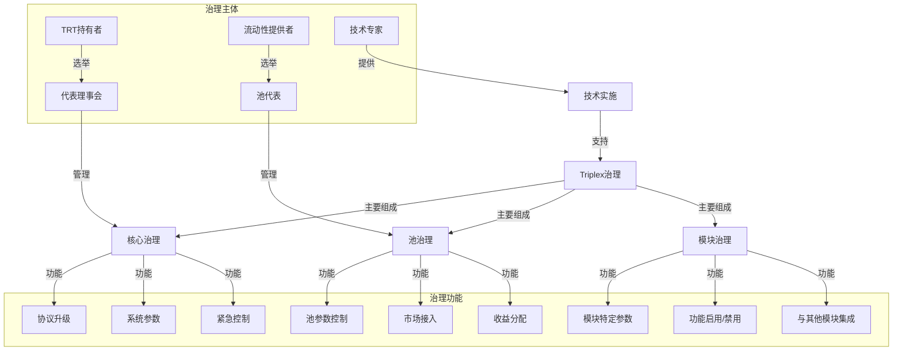
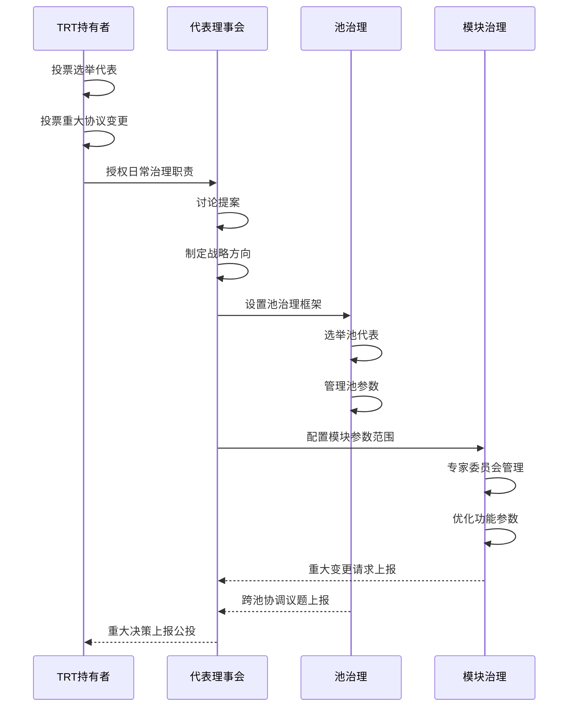
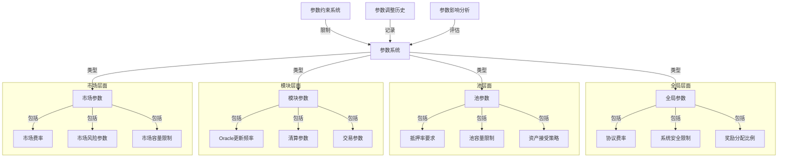
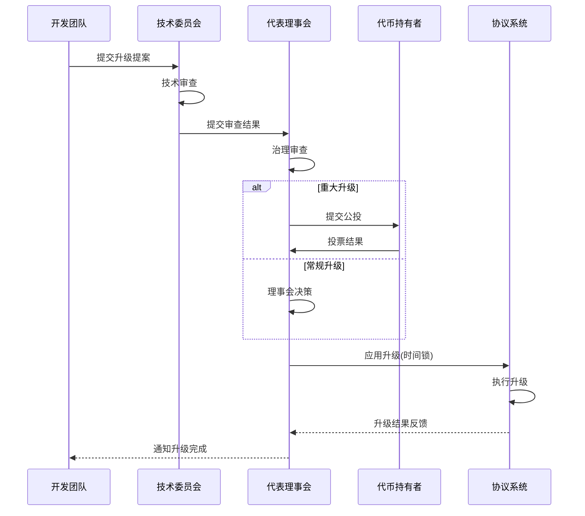

import { Callout, Cards, FileTree, Steps, Tabs } from 'nextra/components'

# Triplex 治理系统 - Aptos 实现

<Callout type="info">
  Triplex 在 Aptos 区块链上实现了多层次的治理架构，结合链上投票、代表制和技术自动化，确保协议的安全运行和持续发展。系统通过分散决策权力和利用 Move 语言的安全特性，实现高效且去中心化的治理。
</Callout>

## 治理架构

### 治理系统概览



### 核心组件

<Cards>
  <Cards.Card title="代币治理" href="#代币治理">
    TRT投票、权益验证、提案机制
  </Cards.Card>
  <Cards.Card title="代表制" href="#代表制">
    理事会选举、池代表、专家委员会
  </Cards.Card>
  <Cards.Card title="参数治理" href="#参数治理">
    系统配置、风险控制、收益分配
  </Cards.Card>
  <Cards.Card title="升级治理" href="#升级治理">
    协议升级、模块更新、紧急响应
  </Cards.Card>
</Cards>

### 系统结构

<FileTree>
  <FileTree.Folder name="Governance System" defaultOpen>
    <FileTree.Folder name="Core" defaultOpen>
      <FileTree.File name="voting_module.move" />
      <FileTree.File name="council_manager.move" />
      <FileTree.File name="proposal_system.move" />
    </FileTree.Folder>
    <FileTree.Folder name="Parameters">
      <FileTree.File name="param_controller.move" />
      <FileTree.File name="security_params.move" />
      <FileTree.File name="pool_params.move" />
    </FileTree.Folder>
    <FileTree.Folder name="Implementation">
      <FileTree.File name="executor.move" />
      <FileTree.File name="timelock.move" />
      <FileTree.File name="emergency_module.move" />
    </FileTree.Folder>
  </FileTree.Folder>
</FileTree>

## 治理机制

### 治理决策流程



### 投票系统

<Tabs items={['投票权重', '提案流程', '执行机制']}>
  <Tabs.Tab>
    ```move
    module triplex::voting_power {
        use std::signer;
        use aptos_framework::account;
        use aptos_framework::event;
        use aptos_std::table::{Self, Table};
        
        /// 投票权重存储
        struct VotingPowerStore has key {
            // 用户地址到投票权重的映射
            votes: Table<address, u64>,
            // 用户地址到委托地址的映射
            delegates: Table<address, address>,
            // 委托更改事件处理器
            delegate_events: event::EventHandle<DelegateChangedEvent>,
        }
        
        /// 委托更改事件
        struct DelegateChangedEvent has drop, store {
            delegator: address,
            from_delegate: address,
            to_delegate: address,
        }
        
        /// 初始化投票权重存储
        public fun initialize(admin: &signer) {
            let admin_addr = signer::address_of(admin);
            
            move_to(admin, VotingPowerStore {
                votes: table::new<address, u64>(),
                delegates: table::new<address, address>(),
                delegate_events: account::new_event_handle<DelegateChangedEvent>(admin),
            });
        }
        
        /// 获取账户的投票权重
        public fun get_voting_power(
            governance_address: address,
            account: address
        ): u64 acquires VotingPowerStore {
            let store = borrow_global<VotingPowerStore>(governance_address);
            
            if (table::contains(&store.votes, account)) {
                *table::borrow(&store.votes, account)
            } else {
                0
            }
        }
        
        /// 委托投票权给其他地址
        public fun delegate(
            account: &signer,
            governance_address: address,
            delegatee: address
        ) acquires VotingPowerStore {
            let delegator = signer::address_of(account);
            let store = borrow_global_mut<VotingPowerStore>(governance_address);
            
            let old_delegate = if (table::contains(&store.delegates, delegator)) {
                *table::borrow(&store.delegates, delegator)
            } else {
                delegator // 默认是自委托
            };
            
            // 更新委托
            if (table::contains(&store.delegates, delegator)) {
                *table::borrow_mut(&store.delegates, delegator) = delegatee;
            } else {
                table::add(&mut store.delegates, delegator, delegatee);
            };
            
            // 发出事件
            event::emit_event(
                &mut store.delegate_events,
                DelegateChangedEvent {
                    delegator,
                    from_delegate: old_delegate,
                    to_delegate: delegatee,
                }
            );
        }
        
        /// 获取委托的投票权
        public fun get_votes(
            governance_address: address,
            account: address
        ): u64 acquires VotingPowerStore {
            get_voting_power(governance_address, account)
        }
    }
    ```
  </Tabs.Tab>
  
  <Tabs.Tab>
    <Steps>
      1. **提案创建**
         - 提案阈值
         - 提案格式
         - 讨论期
      
      2. **投票阶段**
         - 投票期限
         - 法定人数
         - 通过条件
      
      3. **执行阶段**
         - 时间锁
         - 执行确认
         - 结果公示
    </Steps>
  </Tabs.Tab>
  
  <Tabs.Tab>
    <Cards>
      <Cards.Card title="时间锁" href="#时间锁">
        延迟执行、撤销机制、紧急处理
      </Cards.Card>
      <Cards.Card title="多重签名" href="#多重签名">
        能力验证、签名者验证、阈值控制
      </Cards.Card>
      <Cards.Card title="执行确认" href="#执行确认">
        状态验证、事件发布、结果确认
      </Cards.Card>
    </Cards>
  </Tabs.Tab>
</Tabs>

### 代表制度

<Steps>
  1. **代表理事会**
     - 定期选举
     - 职责范围
     - 决策权限
  
  2. **池代表**
     - LP代币投票
     - 池参数管理
     - 市场准入
  
  3. **专家委员会**
     - 技术审核
     - 参数建议
     - 风险评估
</Steps>

## 参数管理

### 参数系统架构



### 参数类型

<Cards>
  <Cards.Card title="全局参数" href="#全局参数">
    协议费率、安全限制、奖励分配
  </Cards.Card>
  <Cards.Card title="池参数" href="#池参数">
    抵押要求、容量限制、资产策略
  </Cards.Card>
  <Cards.Card title="模块参数" href="#模块参数">
    更新频率、清算条件、交易规则
  </Cards.Card>
  <Cards.Card title="市场参数" href="#市场参数">
    费率设置、风险控制、容量管理
  </Cards.Card>
</Cards>

### 参数控制

<Tabs items={['配置管理', '约束机制', '调整流程']}>
  <Tabs.Tab>
    ```move
    module triplex::parameter_controller {
        use std::signer;
        use std::error;
        use std::vector;
        use aptos_framework::event;
        use aptos_std::table::{Self, Table};
        
        /// 错误代码
        const E_NOT_AUTHORIZED: u64 = 1;
        const E_INVALID_VALUE: u64 = 2;
        const E_PARAM_NOT_FOUND: u64 = 3;
        
        /// 参数存储
        struct ParameterStore has key {
            // 参数ID到数值的映射
            params: Table<vector<u8>, u64>,
            // 参数ID到最小值的映射
            min_values: Table<vector<u8>, u64>,
            // 参数ID到最大值的映射
            max_values: Table<vector<u8>, u64>,
            // 参数更新事件
            update_events: event::EventHandle<ParameterUpdatedEvent>,
        }
        
        /// 参数更新事件
        struct ParameterUpdatedEvent has drop, store {
            param_id: vector<u8>,
            old_value: u64,
            new_value: u64,
        }
        
        /// 初始化参数控制器
        public fun initialize(admin: &signer) {
            let admin_addr = signer::address_of(admin);
            
            move_to(admin, ParameterStore {
                params: table::new<vector<u8>, u64>(),
                min_values: table::new<vector<u8>, u64>(),
                max_values: table::new<vector<u8>, u64>(),
                update_events: event::new_event_handle<ParameterUpdatedEvent>(admin),
            });
        }
        
        /// 设置参数
        public fun set_parameter(
            account: &signer,
            governance_address: address,
            param_id: vector<u8>,
            value: u64
        ) acquires ParameterStore {
            // 验证权限 (此处简化，实际应使用权限控制模块)
            let account_addr = signer::address_of(account);
            assert!(account_addr == governance_address, error::permission_denied(E_NOT_AUTHORIZED));
            
            // 验证值在有效范围内
            assert!(is_valid_value(governance_address, param_id, value), error::invalid_argument(E_INVALID_VALUE));
            
            let store = borrow_global_mut<ParameterStore>(governance_address);
            
            // 获取旧值
            assert!(table::contains(&store.params, param_id), error::not_found(E_PARAM_NOT_FOUND));
            let old_value = *table::borrow(&store.params, param_id);
            
            // 更新参数
            *table::borrow_mut(&mut store.params, param_id) = value;
            
            // 发出事件
            event::emit_event(
                &mut store.update_events,
                ParameterUpdatedEvent {
                    param_id,
                    old_value,
                    new_value: value,
                }
            );
        }
        
        /// 获取参数值
        public fun get_parameter(
            governance_address: address,
            param_id: vector<u8>
        ): u64 acquires ParameterStore {
            let store = borrow_global<ParameterStore>(governance_address);
            
            assert!(table::contains(&store.params, param_id), error::not_found(E_PARAM_NOT_FOUND));
            *table::borrow(&store.params, param_id)
        }
        
        /// 验证参数值是否有效
        public fun is_valid_value(
            governance_address: address,
            param_id: vector<u8>,
            value: u64
        ): bool acquires ParameterStore {
            let store = borrow_global<ParameterStore>(governance_address);
            
            let min = if (table::contains(&store.min_values, param_id)) {
                *table::borrow(&store.min_values, param_id)
            } else {
                0
            };
            
            let max = if (table::contains(&store.max_values, param_id)) {
                *table::borrow(&store.max_values, param_id)
            } else {
                0xFFFFFFFFFFFFFFFF // u64 max
            };
            
            value >= min && value <= max
        }
    }
    ```
  </Tabs.Tab>
  
  <Tabs.Tab>
    <Cards>
      <Cards.Card title="值范围" href="#值范围">
        最大最小值、步长控制、有效性验证
      </Cards.Card>
      <Cards.Card title="时间限制" href="#时间限制">
        冷却期、生效时间、过期设置
      </Cards.Card>
      <Cards.Card title="依赖检查" href="#依赖检查">
        参数关联、冲突检测、一致性维护
      </Cards.Card>
    </Cards>
  </Tabs.Tab>
  
  <Tabs.Tab>
    <Steps>
      1. **提议阶段**
         - 参数分析
         - 影响评估
         - 提案准备
      
      2. **审核阶段**
         - 专家审查
         - 社区讨论
         - 风险评估
      
      3. **执行阶段**
         - 分步调整
         - 效果监控
         - 回滚准备
    </Steps>
  </Tabs.Tab>
</Tabs>

## 升级机制

### 协议升级流程



### 协议升级

<Callout type="warning">
  系统利用 Aptos 的模块升级机制实现了安全可控的升级流程，包括标准升级流程和紧急响应机制，确保协议能够安全地进行功能更新和漏洞修复。
</Callout>

<Steps>
  1. **提案阶段**
     - 升级规划
     - Move Prover 验证
     - 社区讨论
  
  2. **测试阶段**
     - 功能测试
     - 安全验证
     - 性能评估
  
  3. **部署阶段**
     - 模块发布
     - 状态迁移
     - 功能验证
</Steps>

### 紧急响应

<Cards>
  <Cards.Card title="漏洞响应" href="#漏洞响应">
    快速修复、临时措施、影响控制
  </Cards.Card>
  <Cards.Card title="攻击防护" href="#攻击防护">
    攻击检测、系统防护、损失控制
  </Cards.Card>
  <Cards.Card title="恢复流程" href="#恢复流程">
    状态恢复、功能恢复、补偿方案
  </Cards.Card>
  <Cards.Card title="后续优化" href="#后续优化">
    原因分析、改进方案、预防措施
  </Cards.Card>
</Cards>
