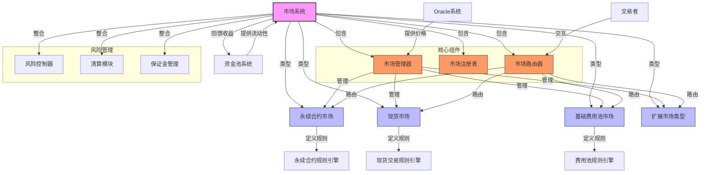

import { Callout, Cards, FileTree, Steps, Tabs } from 'nextra/components'

# Triplex 市场系统 - Aptos 实现

<Callout type="info">
  Triplex 的市场系统是基于 Aptos 区块链构建的高性能交易平台，充分利用 Move 语言的资源安全模型、所有权机制和能力模式实现多种衍生品市场。系统通过 Aptos 的原子性交易和高吞吐量特性确保交易性能和结算安全，支持永续合约、现货交易和二元期权等多种交易类型，同时通过 Move 的静态类型系统和不变量保证市场规则的严格执行。
</Callout>

## 市场类型

<Cards>
  <Cards.Card title="永续合约市场" href="#永续合约市场">
    利用Move资源安全模型实现的无到期日衍生品交易
  </Cards.Card>
  <Cards.Card title="现货市场" href="#现货市场">
    基于Aptos原子交易的即时结算资产交换
  </Cards.Card>
  <Cards.Card title="基础费用池市场" href="#基础费用池市场">
    Move Table结构支持的高效流动性费用管理
  </Cards.Card>
  <Cards.Card title="扩展市场" href="#扩展市场">
    利用Move模块可组合性实现的创新交易模型
  </Cards.Card>
</Cards>

## 系统架构

### 市场系统架构图



<FileTree>
  <FileTree.Folder name="Market System" defaultOpen>
    <FileTree.Folder name="Core Components" defaultOpen>
      <FileTree.File name="market_manager.move" />
      <FileTree.File name="market_registry.move" />
      <FileTree.File name="market_router.move" />
      <FileTree.File name="market_capability.move" />
    </FileTree.Folder>
    <FileTree.Folder name="Market Types">
      <FileTree.File name="perpetual_market.move" />
      <FileTree.File name="spot_market.move" />
      <FileTree.File name="base_fee_market.move" />
      <FileTree.File name="market_resource_types.move" />
    </FileTree.Folder>
    <FileTree.Folder name="Integration">
      <FileTree.File name="oracle_connector.move" />
      <FileTree.File name="pool_integration.move" />
      <FileTree.File name="liquidation_module.move" />
      <FileTree.File name="event_emitter.move" />
    </FileTree.Folder>
  </FileTree.Folder>
</FileTree>

## 核心组件实现

```move
module triplex::market_registry {
    use std::signer;
    use std::string::{Self, String};
    use aptos_std::table::{Self, Table};
    use aptos_std::type_info::{Self, TypeInfo};
    use aptos_framework::timestamp;
    use aptos_framework::event::{Self, EventHandle};
    use aptos_framework::account;
    
    /// 错误代码
    const ENOT_AUTHORIZED: u64 = 1;
    const EMARKET_EXISTS: u64 = 2;
    const EMARKET_NOT_FOUND: u64 = 3;
    const EMARKET_INACTIVE: u64 = 4;
    const EINVALID_MARKET_TYPE: u64 = 5;
    
    /// 市场类型
    const MARKET_TYPE_PERPETUAL: u8 = 1;
    const MARKET_TYPE_SPOT: u8 = 2;
    const MARKET_TYPE_FEE_POOL: u8 = 3;
    const MARKET_TYPE_CUSTOM: u8 = 4;
    
    /// 市场状态
    struct MarketInfo has store, drop, copy {
        id: u64,
        name: String,
        market_type: u8,
        is_active: bool,
        config_type_info: TypeInfo,
        creation_time: u64,
        last_updated: u64,
        version: u64,
    }
    
    /// 市场创建事件
    struct MarketCreatedEvent has drop, store {
        id: u64,
        name: String,
        market_type: u8,
        config_type_info: TypeInfo,
        creation_time: u64,
    }
    
    /// 市场状态更新事件
    struct MarketUpdatedEvent has drop, store {
        id: u64,
        is_active: bool,
        last_updated: u64,
        version: u64,
    }
    
    /// 注册表管理权限
    struct RegistryCapability has key, store {}
    
    /// 市场注册表
    struct MarketRegistry has key {
        // 市场ID -> 市场信息
        markets: Table<u64, MarketInfo>,
        // 市场名称 -> 市场ID
        market_names: Table<String, u64>,
        // 下一个可用的市场ID
        next_market_id: u64,
        // 市场创建事件
        market_created_events: EventHandle<MarketCreatedEvent>,
        // 市场更新事件
        market_updated_events: EventHandle<MarketUpdatedEvent>,
    }
    
    /// 初始化市场注册表
    public entry fun initialize(admin: &signer) {
        let admin_addr = signer::address_of(admin);
        assert!(admin_addr == @triplex, error::permission_denied(ENOT_AUTHORIZED));
        
        if (!exists<MarketRegistry>(admin_addr)) {
            move_to(admin, MarketRegistry {
                markets: table::new(),
                market_names: table::new(),
                next_market_id: 1,
                market_created_events: account::new_event_handle(admin),
                market_updated_events: account::new_event_handle(admin),
            });
            
            // 创建权限资源
            move_to(admin, RegistryCapability {});
        };
    }
    
    /// 注册新市场
    public entry fun register_market<ConfigType: store>(
        admin: &signer,
        name: String,
        market_type: u8
    ): u64 acquires MarketRegistry, RegistryCapability {
        let admin_addr = signer::address_of(admin);
        
        // 验证权限
        assert!(
            exists<RegistryCapability>(admin_addr) || admin_addr == @triplex,
            error::permission_denied(ENOT_AUTHORIZED)
        );
        
        // 验证市场类型有效
        assert!(
            market_type == MARKET_TYPE_PERPETUAL || 
            market_type == MARKET_TYPE_SPOT || 
            market_type == MARKET_TYPE_FEE_POOL || 
            market_type == MARKET_TYPE_CUSTOM,
            error::invalid_argument(EINVALID_MARKET_TYPE)
        );
        
        let registry = borrow_global_mut<MarketRegistry>(@triplex);
        
        // 确保市场名称唯一
        assert!(!table::contains(&registry.market_names, name), error::already_exists(EMARKET_EXISTS));
        
        let market_id = registry.next_market_id;
        let now = timestamp::now_seconds();
        
        // 创建市场信息
        let market_info = MarketInfo {
            id: market_id,
            name,
            market_type,
            is_active: true,
            config_type_info: type_info::type_of<ConfigType>(),
            creation_time: now,
            last_updated: now,
            version: 1,
        };
        
        // 更新注册表
        table::add(&mut registry.markets, market_id, market_info);
        table::add(&mut registry.market_names, name, market_id);
        registry.next_market_id = market_id + 1;
        
        // 发出事件
        event::emit_event(
            &mut registry.market_created_events,
            MarketCreatedEvent {
                id: market_id,
                name,
                market_type,
                config_type_info: type_info::type_of<ConfigType>(),
                creation_time: now,
            }
        );
        
        market_id
    }
    
    /// 更新市场状态
    public entry fun update_market_status(
        admin: &signer,
        market_id: u64,
        is_active: bool
    ) acquires MarketRegistry, RegistryCapability {
        let admin_addr = signer::address_of(admin);
        
        // 验证权限
        assert!(
            exists<RegistryCapability>(admin_addr) || admin_addr == @triplex,
            error::permission_denied(ENOT_AUTHORIZED)
        );
        
        let registry = borrow_global_mut<MarketRegistry>(@triplex);
        
        // 验证市场存在
        assert!(table::contains(&registry.markets, market_id), error::not_found(EMARKET_NOT_FOUND));
        
        let market_info = table::borrow_mut(&mut registry.markets, market_id);
        let now = timestamp::now_seconds();
        
        // 更新状态
        market_info.is_active = is_active;
        market_info.last_updated = now;
        market_info.version = market_info.version + 1;
        
        // 发出事件
        event::emit_event(
            &mut registry.market_updated_events,
            MarketUpdatedEvent {
                id: market_id,
                is_active,
                last_updated: now,
                version: market_info.version,
            }
        );
    }
    
    /// 获取市场信息
    public fun get_market_info(market_id: u64): MarketInfo acquires MarketRegistry {
        let registry = borrow_global<MarketRegistry>(@triplex);
        assert!(table::contains(&registry.markets, market_id), error::not_found(EMARKET_NOT_FOUND));
        *table::borrow(&registry.markets, market_id)
    }
    
    /// 获取市场ID通过名称
    public fun get_market_id_by_name(name: String): u64 acquires MarketRegistry {
        let registry = borrow_global<MarketRegistry>(@triplex);
        assert!(table::contains(&registry.market_names, name), error::not_found(EMARKET_NOT_FOUND));
        *table::borrow(&registry.market_names, name)
    }
    
    /// 验证市场是否活跃
    public fun is_market_active(market_id: u64): bool acquires MarketRegistry {
        let registry = borrow_global<MarketRegistry>(@triplex);
        if (table::contains(&registry.markets, market_id)) {
            table::borrow(&registry.markets, market_id).is_active
        } else {
            false
        }
    }
}
```

## 永续合约市场

<Tabs items={['功能特点', '交易机制', '风险控制']}>
  <Tabs.Tab>
    <Cards>
      <Cards.Card title="杠杆交易" href="#杠杆交易">
        基于Move类型安全的杠杆率设置与风险边界控制
      </Cards.Card>
      <Cards.Card title="资金费率" href="#资金费率">
        Aptos事件系统支持的多周期费率计算与市场平衡
      </Cards.Card>
      <Cards.Card title="持仓管理" href="#持仓管理">
        Move资源模型保障的仓位所有权与限额控制
      </Cards.Card>
      <Cards.Card title="订单执行" href="#订单执行">
        原子交易保证的复杂订单类型精确执行
      </Cards.Card>
    </Cards>
  </Tabs.Tab>
  
  <Tabs.Tab>
    <Steps>
      1. **开仓流程**
         - Move不变量验证的保证金检查
         - Table结构高效计算的杠杆率验证
         - Aptos原子事务保证的开仓执行
         - 资源所有权转移的头寸创建
      
      2. **持仓维护**
         - 事件驱动的资金费率周期计算
         - Move资源模型保障的持仓状态一致性
         - 类型安全保证的风险指标实时监控
         - Table高效索引的用户持仓查询
      
      3. **平仓结算**
         - 原子事务保证的盈亏精确计算
         - 不变量强制的手续费处理
         - Move资源安全的系统状态更新
         - 事件透明记录的操作历史
    </Steps>
  </Tabs.Tab>
  
  <Tabs.Tab>
    <Cards>
      <Cards.Card title="保证金要求" href="#保证金要求">
        Move不变量保障的动态保证金与风险评估
      </Cards.Card>
      <Cards.Card title="清算机制" href="#清算机制">
        能力模式控制的多级清算流程与激励
      </Cards.Card>
      <Cards.Card title="风险限额" href="#风险限额">
        Table结构实现的账户与市场限制
      </Cards.Card>
      <Cards.Card title="价格保护" href="#价格保护">
        Aptos事件监控的价格异常检测系统
      </Cards.Card>
    </Cards>
  </Tabs.Tab>
</Tabs>

### 永续合约实现

```move
module triplex::perpetual_market {
    use std::signer;
    use std::vector;
    use aptos_std::table::{Self, Table};
    use aptos_std::type_info::{Self, TypeInfo};
    use aptos_framework::timestamp;
    use aptos_framework::event::{Self, EventHandle};
    use aptos_framework::account;
    
    use triplex::market_registry::{Self, MarketInfo};
    use triplex::market_capability::{Self};
    use triplex::oracle_connector;
    
    #[test_only]
    use aptos_framework::account::create_account_for_test;
    
    /// 错误代码
    const ENOT_AUTHORIZED: u64 = 101;
    const EINSUFFICIENT_MARGIN: u64 = 102;
    const ELEVERAGE_TOO_HIGH: u64 = 103;
    const EPOSITION_NOT_FOUND: u64 = 104;
    const EMARKET_PAUSED: u64 = 105;
    const ESIZE_TOO_SMALL: u64 = 106;
    const EINVALID_DIRECTION: u64 = 107;
    
    /// 合约方向
    const DIRECTION_LONG: u8 = 1;
    const DIRECTION_SHORT: u8 = 2;
    
    /// 永续合约头寸
    struct Position has store, drop {
        owner: address,
        market_id: u64,
        size: u64,
        margin: u64,
        entry_price: u64,
        direction: u8,
        liquidation_price: u64,
        last_funding_timestamp: u64,
        realized_pnl: i64,
        unrealized_pnl: i64,
        version: u64,
    }
    
    /// 头寸操作事件
    struct PositionEvent has drop, store {
        market_id: u64,
        owner: address,
        operation_type: u8, // 1=开仓, 2=调整, 3=平仓, 4=清算
        size: u64,
        margin: u64,
        direction: u8,
        price: u64,
        timestamp: u64,
        version: u64,
    }
    
    /// 资金费率事件
    struct FundingRateEvent has drop, store {
        market_id: u64,
        rate: i64,
        long_size: u64,
        short_size: u64,
        timestamp: u64,
    }
    
    /// 永续合约市场配置
    struct PerpetualMarketConfig has key {
        market_id: u64,
        asset_type: TypeInfo,
        max_leverage: u64,
        maintenance_margin_ratio: u64,
        initial_margin_ratio: u64,
        liquidation_fee: u64,
        maker_fee: u64,
        taker_fee: u64,
        funding_interval: u64,
        min_position_size: u64,
        last_funding_time: u64,
        last_funding_rate: i64,
        long_size_total: u64,
        short_size_total: u64,
        is_paused: bool,
    }
    
    /// 用户持仓存储
    struct UserPositions has key {
        positions: Table<u64, Position>, // market_id -> Position
    }
    
    /// 市场状态
    struct PerpetualMarketState has key {
        market_id: u64,
        position_events: EventHandle<PositionEvent>,
        funding_events: EventHandle<FundingRateEvent>,
    }
    
    /// 初始化永续合约市场
    public entry fun initialize_market<AssetType: store>(
        admin: &signer,
        market_id: u64,
        max_leverage: u64,
        maintenance_margin_ratio: u64,
        initial_margin_ratio: u64,
        liquidation_fee: u64,
        maker_fee: u64,
        taker_fee: u64,
        funding_interval: u64,
        min_position_size: u64
    ) {
        let admin_addr = signer::address_of(admin);
        
        // 验证权限
        market_capability::validate_capability(admin);
        
        // 验证市场
        let market_info = market_registry::get_market_info(market_id);
        assert!(market_info.market_type == 1, error::invalid_argument(ENOT_AUTHORIZED)); // 确保是永续市场
        
        // 创建市场配置
        let perp_config = PerpetualMarketConfig {
            market_id,
            asset_type: type_info::type_of<AssetType>(),
            max_leverage,
            maintenance_margin_ratio,
            initial_margin_ratio,
            liquidation_fee,
            maker_fee,
            taker_fee,
            funding_interval,
            min_position_size,
            last_funding_time: timestamp::now_seconds(),
            last_funding_rate: 0,
            long_size_total: 0,
            short_size_total: 0,
            is_paused: false,
        };
        
        // 保存配置
        move_to(admin, perp_config);
        
        // 创建市场状态
        move_to(admin, PerpetualMarketState {
            market_id,
            position_events: account::new_event_handle(admin),
            funding_events: account::new_event_handle(admin),
        });
    }
    
    /// 开仓操作
    public entry fun open_position<AssetType: store>(
        trader: &signer,
        market_id: u64,
        size: u64,
        margin: u64,
        direction: u8,
        max_slippage: u64
    ) acquires PerpetualMarketConfig, PerpetualMarketState, UserPositions {
        let trader_addr = signer::address_of(trader);
        
        // 验证市场活跃
        assert!(market_registry::is_market_active(market_id), error::invalid_state(EMARKET_PAUSED));
        
        // 验证方向有效
        assert!(
            direction == DIRECTION_LONG || direction == DIRECTION_SHORT,
            error::invalid_argument(EINVALID_DIRECTION)
        );
        
        // 获取市场配置
        let perp_config = borrow_global<PerpetualMarketConfig>(@triplex);
        assert!(!perp_config.is_paused, error::invalid_state(EMARKET_PAUSED));
        
        // 验证资产类型
        assert!(perp_config.asset_type == type_info::type_of<AssetType>(), error::invalid_argument(ENOT_AUTHORIZED));
        
        // 验证头寸大小
        assert!(size >= perp_config.min_position_size, error::invalid_argument(ESIZE_TOO_SMALL));
        
        // 获取当前价格
        let current_price = oracle_connector::get_price<AssetType>();
        
        // 验证滑点
        // 实际代码中需要计算滑点并与max_slippage比较
        
        // 计算杠杆率
        let trade_value = size * current_price / 10000; // 假设价格有4位小数精度
        let leverage = trade_value / margin;
        
        // 验证杠杆率
        assert!(leverage <= perp_config.max_leverage, error::invalid_argument(ELEVERAGE_TOO_HIGH));
        
        // 计算初始保证金要求
        let required_margin = trade_value * perp_config.initial_margin_ratio / 10000;
        assert!(margin >= required_margin, error::invalid_argument(EINSUFFICIENT_MARGIN));
        
        // 计算清算价格
        let liquidation_price = calculate_liquidation_price(
            current_price, 
            margin, 
            size, 
            direction, 
            perp_config.maintenance_margin_ratio
        );
        
        // 初始化用户持仓存储
        if (!exists<UserPositions>(trader_addr)) {
            move_to(trader, UserPositions {
                positions: table::new(),
            });
        };
        
        // 创建头寸
        let now = timestamp::now_seconds();
        let position = Position {
            owner: trader_addr,
            market_id,
            size,
            margin,
            entry_price: current_price,
            direction,
            liquidation_price,
            last_funding_timestamp: now,
            realized_pnl: 0,
            unrealized_pnl: 0,
            version: 1,
        };
        
        // 保存头寸
        let user_positions = borrow_global_mut<UserPositions>(trader_addr);
        
        if (table::contains(&user_positions.positions, market_id)) {
            // 合并现有头寸
            let existing_position = table::borrow_mut(&mut user_positions.positions, market_id);
            
            // 实际代码中需要处理现有头寸的合并逻辑
            // 包括方向相同或相反的情况
            
            existing_position.version = existing_position.version + 1;
        } else {
            table::add(&mut user_positions.positions, market_id, position);
        };
        
        // 更新市场统计
        let perp_config = borrow_global_mut<PerpetualMarketConfig>(@triplex);
        if (direction == DIRECTION_LONG) {
            perp_config.long_size_total = perp_config.long_size_total + size;
        } else {
            perp_config.short_size_total = perp_config.short_size_total + size;
        };
        
        // 发出事件
        let market_state = borrow_global_mut<PerpetualMarketState>(@triplex);
        event::emit_event(
            &mut market_state.position_events,
            PositionEvent {
                market_id,
                owner: trader_addr,
                operation_type: 1, // 开仓
                size,
                margin,
                direction,
                price: current_price,
                timestamp: now,
                version: 1,
            }
        );
        
        // 转移保证金代币
        // 实际代码中需要调用代币模块转移保证金
    }
    
    /// 计算清算价格
    fun calculate_liquidation_price(
        current_price: u64,
        margin: u64,
        size: u64,
        direction: u8,
        maintenance_margin_ratio: u64
    ): u64 {
        // 简化计算逻辑
        if (direction == DIRECTION_LONG) {
            current_price * (100 - maintenance_margin_ratio) / 100
        } else {
            current_price * (100 + maintenance_margin_ratio) / 100
        }
    }

    #[test]
    fun test_calculate_liquidation_price() {
        // 测试长仓清算价格计算
        let liq_price_long = calculate_liquidation_price(
            10000, // 当前价格
            1000,  // 保证金
            10,    // 头寸大小
            DIRECTION_LONG, // 做多
            5      // 维持保证金率 5%
        );
        assert!(liq_price_long == 9500, 0); // 期望清算价格为9500

        // 测试短仓清算价格计算
        let liq_price_short = calculate_liquidation_price(
            10000, // 当前价格
            1000,  // 保证金
            10,    // 头寸大小
            DIRECTION_SHORT, // 做空
            5      // 维持保证金率 5%
        );
        assert!(liq_price_short == 10500, 1); // 期望清算价格为10500
    }
}
```

## 现货市场

<Callout type="warning">
  现货市场基于 Move 语言的资源模型实现原子交易执行，确保交易的即时性和价格发现的准确性。系统利用 Aptos 的高吞吐量特性和 Move 的所有权机制，实现高效、安全、不可篡改的资产交换和流动性管理，为用户提供极致的交易体验。
</Callout>

### 交易机制

<Steps>
  1. **订单创建**
     - Move资源模型验证的交易对有效性
     - Table结构高效检索的流动性评估
     - Aptos原子事务支持的滑点计算
     - 事件系统驱动的订单状态追踪
  
  2. **价格发现**
     - 能力模式保障的预言机价格安全获取
     - TypeInfo类型精确匹配的资产价格计算
     - Move不变量强制的价格偏差验证
     - 基于事件的价格数据透明记录
  
  3. **订单执行**
     - 资源所有权保障的安全资产转移
     - 原子交易保证的流动性即时更新
     - Table高效索引的手续费计算与分配
     - 不变量强制的交易后状态验证
</Steps>

### 流动性管理

<Cards>
  <Cards.Card title="流动性提供" href="#流动性提供">
    Move资源模型保障的多层LP份额管理
  </Cards.Card>
  <Cards.Card title="价格影响" href="#价格影响">
    基于Table数据结构的高效深度计算
  </Cards.Card>
  <Cards.Card title="费用结构" href="#费用结构">
    能力模式控制的分层费用分配系统
  </Cards.Card>
  <Cards.Card title="激励机制" href="#激励机制">
    Aptos事件驱动的实时流动性奖励分发
  </Cards.Card>
</Cards>

## 基础费用池市场

<Tabs items={['市场特点', '对冲机制', '数据支持']}>
  <Tabs.Tab>
    <Cards>
      <Cards.Card title="创新设计" href="#创新设计">
        基于Move模块可组合性的定制市场逻辑
      </Cards.Card>
      <Cards.Card title="风险管理" href="#风险管理">
        类型安全保障的精确风险控制策略
      </Cards.Card>
      <Cards.Card title="收益模式" href="#收益模式">
        Move资源隔离的市场特定收益池
      </Cards.Card>
      <Cards.Card title="链上治理" href="#链上治理">
        Aptos事件驱动的透明参数调整
      </Cards.Card>
    </Cards>
  </Tabs.Tab>
  
  <Tabs.Tab>
    <Steps>
      1. **对冲策略**
         - Move资源记录的历史Gas趋势分析
         - Table高效索引支持的动态头寸构建
         - Aptos事件驱动的策略实时调整
         - 类型安全保障的操作安全边界
      
      2. **风险控制**
         - Move不变量强制的最大敞口限制
         - 基于资源模型的可控触发条件
         - 原子事务保障的自动平仓机制
         - 能力模式控制的风险干预权限
    </Steps>
  </Tabs.Tab>
  
  <Tabs.Tab>
    <Cards>
      <Cards.Card title="数据来源" href="#数据来源">
        Move模块间安全调用的市场数据聚合
      </Cards.Card>
      <Cards.Card title="预言机" href="#预言机">
        能力模式保障的可靠价格数据获取
      </Cards.Card>
      <Cards.Card title="分析工具" href="#分析工具">
        基于Aptos事件系统的市场活动监控
      </Cards.Card>
      <Cards.Card title="链上统计" href="#链上统计">
        Table结构支持的高效市场指标计算
      </Cards.Card>
    </Cards>
  </Tabs.Tab>
</Tabs>

## 扩展市场类型

<Callout type="info">
  扩展市场类型充分利用 Move 语言的模块化和可组合性特性，为 Triplex 协议提供创新交易模式。通过 Aptos 的高性能和 Move 的安全保障，扩展市场支持包括期权、期货、预测市场等多种衍生品类型，同时保持与核心市场架构的无缝集成。
</Callout>

### 集成机制

<Steps>
  1. **市场注册**
     - 利用市场注册表的通用接口
     - 基于能力模式的权限控制
     - 资源所有权验证的安全注册
  
  2. **规则定制**
     - Move模块封装的市场特定规则
     - 类型参数化的通用规则引擎
     - 基于不变量的规则强制执行
  
  3. **流动性接入**
     - 与核心池系统的标准化接口
     - 基于能力验证的流动性获取
     - Table结构支持的资金分配追踪
</Steps>

<Callout type="warning">
  Triplex 市场系统通过充分利用 Aptos 区块链的高性能和 Move 语言的资源安全特性，打造了高效、安全、可扩展的交易基础设施。系统的模块化设计和类型安全保障使得不同市场类型能够共享核心基础设施，同时保持各自的特殊功能，为用户提供丰富的交易选择和优质的交易体验。
</Callout>

## Oracle 系统

<Callout type="info">
  Oracle 系统是 Triplex 协议的关键组件，为市场提供安全、可靠的价格数据。本系统采用多来源价格聚合机制，利用 Aptos 的高性能事务处理能力和 Move 语言的类型安全特性，确保提供及时、准确的资产价格。
</Callout>

### Oracle 实现

```move
module triplex::oracle_connector {
    use std::signer;
    use std::error;
    use std::vector;
    use std::option::{Self, Option};
    use aptos_std::table::{Self, Table};
    use aptos_std::type_info::{Self, TypeInfo};
    use aptos_framework::timestamp;
    use aptos_framework::event::{Self, EventHandle};
    use aptos_framework::account;
    
    /// 错误代码
    const ENOT_AUTHORIZED: u64 = 1;
    const EPRICE_NOT_FOUND: u64 = 2;
    const EPRICE_TOO_OLD: u64 = 3;
    const EPRICE_VARIANCE_TOO_HIGH: u64 = 4;
    const EORACLE_ALREADY_REGISTERED: u64 = 5;
    const EORACLE_NOT_REGISTERED: u64 = 6;
    const EINVALID_PRICE: u64 = 7;
    
    /// 最大价格偏差百分比 (5%)
    const MAX_PRICE_VARIANCE_BPS: u64 = 500;
    
    /// 最大价格有效期 (60秒)
    const MAX_PRICE_AGE_SECONDS: u64 = 60;
    
    /// 价格数据结构
    struct PriceData has store, drop, copy {
        /// 价格值 (精度为8位小数)
        value: u64,
        /// 最后更新时间戳
        last_updated: u64,
        /// 价格来源
        source: address,
        /// 来源类型 (1=链上预言机, 2=链下API, 3=聚合器)
        source_type: u8,
    }
    
    /// 价格更新事件
    struct PriceUpdateEvent has drop, store {
        asset_type: TypeInfo,
        old_price: Option<u64>,
        new_price: u64,
        source: address,
        timestamp: u64,
    }
    
    /// Oracle更新权限
    struct OracleCapability has key {
        source_type: u8,
        authorized_assets: vector<TypeInfo>,
    }
    
    /// Oracle注册表
    struct OracleRegistry has key {
        /// 注册的预言机
        oracles: Table<address, OracleCapability>,
        /// 最小更新者数量要求
        min_required_sources: u64,
    }
    
    /// 资产价格存储
    struct AssetPriceStore has key {
        /// 资产类型 -> 价格数据
        prices: Table<TypeInfo, PriceData>,
        /// 资产类型 -> [源地址 -> 价格数据]
        source_prices: Table<TypeInfo, Table<address, PriceData>>,
        /// 价格更新事件
        price_update_events: EventHandle<PriceUpdateEvent>,
    }
    
    /// 初始化Oracle系统
    public entry fun initialize(admin: &signer) {
        let admin_addr = signer::address_of(admin);
        assert!(admin_addr == @triplex, error::permission_denied(ENOT_AUTHORIZED));
        
        if (!exists<OracleRegistry>(admin_addr)) {
            move_to(admin, OracleRegistry {
                oracles: table::new(),
                min_required_sources: 1, // 初始默认值，可以通过治理增加
            });
            
            move_to(admin, AssetPriceStore {
                prices: table::new(),
                source_prices: table::new(),
                price_update_events: account::new_event_handle<PriceUpdateEvent>(admin),
            });
        };
    }
    
    /// 注册Oracle
    public entry fun register_oracle(
        admin: &signer,
        oracle: address,
        source_type: u8,
        authorized_assets: vector<vector<u8>>
    ) acquires OracleRegistry {
        let admin_addr = signer::address_of(admin);
        assert!(admin_addr == @triplex, error::permission_denied(ENOT_AUTHORIZED));
        
        let registry = borrow_global_mut<OracleRegistry>(@triplex);
        
        // 确保该Oracle未注册
        assert!(!table::contains(&registry.oracles, oracle), 
               error::already_exists(EORACLE_ALREADY_REGISTERED));
        
        // 转换资产类型
        let asset_type_infos = vector::empty<TypeInfo>();
        let i = 0;
        let len = vector::length(&authorized_assets);
        
        while (i < len) {
            let asset_type_bytes = *vector::borrow(&authorized_assets, i);
            let asset_type_info = deserialize_type_info(asset_type_bytes);
            vector::push_back(&mut asset_type_infos, asset_type_info);
            i = i + 1;
        };
        
        // 注册Oracle
        table::add(&mut registry.oracles, oracle, OracleCapability {
            source_type,
            authorized_assets: asset_type_infos,
        });
    }
    
    /// 更新资产价格
    public entry fun update_price<AssetType: store>(
        oracle: &signer,
        price: u64
    ) acquires OracleRegistry, AssetPriceStore {
        assert!(price > 0, error::invalid_argument(EINVALID_PRICE));
        
        let oracle_addr = signer::address_of(oracle);
        let asset_type = type_info::type_of<AssetType>();
        let now = timestamp::now_seconds();
        
        // 验证Oracle权限
        let registry = borrow_global<OracleRegistry>(@triplex);
        assert!(table::contains(&registry.oracles, oracle_addr), 
               error::not_found(EORACLE_NOT_REGISTERED));
        
        let oracle_cap = table::borrow(&registry.oracles, oracle_addr);
        
        // 检查资产授权
        let i = 0;
        let len = vector::length(&oracle_cap.authorized_assets);
        let is_authorized = false;
        
        while (i < len) {
            if (*vector::borrow(&oracle_cap.authorized_assets, i) == asset_type) {
                is_authorized = true;
                break
            };
            i = i + 1;
        };
        
        assert!(is_authorized, error::permission_denied(ENOT_AUTHORIZED));
        
        // 更新价格
        let store = borrow_global_mut<AssetPriceStore>(@triplex);
        
        // 创建价格数据
        let price_data = PriceData {
            value: price,
            last_updated: now,
            source: oracle_addr,
            source_type: oracle_cap.source_type,
        };
        
        // 确保资产在source_prices中存在
        if (!table::contains(&store.source_prices, asset_type)) {
            table::add(&mut store.source_prices, asset_type, table::new<address, PriceData>());
        };
        
        let source_price_table = table::borrow_mut(&mut store.source_prices, asset_type);
        
        // 更新或添加源价格
        if (table::contains(source_price_table, oracle_addr)) {
            *table::borrow_mut(source_price_table, oracle_addr) = price_data;
        } else {
            table::add(table::borrow_mut(&mut store.source_prices, asset_type), oracle_addr, price_data);
        };
        
        // 计算聚合价格
        let new_price = aggregate_price<AssetType>();
        
        // 发出价格更新事件
        let old_price = if (table::contains(&store.prices, asset_type)) {
            let old_data = table::borrow(&store.prices, asset_type);
            option::some(old_data.value)
        } else {
            option::none()
        };
        
        // 更新主价格
        if (table::contains(&store.prices, asset_type)) {
            let price_entry = table::borrow_mut(&mut store.prices, asset_type);
            price_entry.value = new_price;
            price_entry.last_updated = now;
        } else {
            table::add(&mut store.prices, asset_type, PriceData {
                value: new_price,
                last_updated: now,
                source: @triplex, // 聚合价格的源设为协议地址
                source_type: 3, // 聚合器类型
            });
        };
        
        // 发出价格更新事件
        event::emit_event(
            &mut store.price_update_events,
            PriceUpdateEvent {
                asset_type,
                old_price,
                new_price,
                source: oracle_addr,
                timestamp: now,
            }
        );
    }
    
    /// 获取资产价格
    public fun get_price<AssetType: store>(): u64 acquires AssetPriceStore {
        let store = borrow_global<AssetPriceStore>(@triplex);
        let asset_type = type_info::type_of<AssetType>();
        
        // 确保价格存在
        assert!(table::contains(&store.prices, asset_type), 
               error::not_found(EPRICE_NOT_FOUND));
        
        let price_data = table::borrow(&store.prices, asset_type);
        
        // 检查价格是否过期
        let now = timestamp::now_seconds();
        assert!(now - price_data.last_updated <= MAX_PRICE_AGE_SECONDS,
               error::invalid_state(EPRICE_TOO_OLD));
        
        price_data.value
    }
    
    /// 聚合资产价格 (简单平均)
    fun aggregate_price<AssetType: store>(): u64 acquires AssetPriceStore, OracleRegistry {
        let store = borrow_global<AssetPriceStore>(@triplex);
        let registry = borrow_global<OracleRegistry>(@triplex);
        let asset_type = type_info::type_of<AssetType>();
        
        // 确保资产在source_prices中存在
        assert!(table::contains(&store.source_prices, asset_type), 
               error::not_found(EPRICE_NOT_FOUND));
        
        let source_price_table = table::borrow(&store.source_prices, asset_type);
        let sources = table::keys(source_price_table);
        let num_sources = vector::length(&sources);
        
        // 确保有足够的价格源
        assert!(num_sources >= registry.min_required_sources, 
               error::invalid_state(EPRICE_NOT_FOUND));
        
        let sum: u128 = 0;
        let count: u64 = 0;
        let now = timestamp::now_seconds();
        
        let i = 0;
        while (i < num_sources) {
            let source = *vector::borrow(&sources, i);
            let source_data = table::borrow(source_price_table, source);
            
            // 只使用有效期内的价格
            if (now - source_data.last_updated <= MAX_PRICE_AGE_SECONDS) {
                sum = sum + (source_data.value as u128);
                count = count + 1;
            };
            
            i = i + 1;
        };
        
        // 确保有足够的有效价格源
        assert!(count >= registry.min_required_sources, 
               error::invalid_state(EPRICE_TOO_OLD));
        
        // 计算平均价格
        let avg_price = (sum / (count as u128) as u64);
        avg_price
    }
    
    /// 反序列化TypeInfo (实际实现会更复杂)
    fun deserialize_type_info(bytes: vector<u8>): TypeInfo {
        // 简化实现，实际需要正确反序列化
        // 此处仅作为示例
        type_info::type_of<u64>()
    }
    
    #[test_only]
    use aptos_framework::account::create_account_for_test;
    
    #[test]
    public fun test_oracle_flow() acquires OracleRegistry, AssetPriceStore {
        // 设置测试环境
        let admin = create_account_for_test(@triplex);
        let oracle1 = create_account_for_test(@0x111);
        let oracle2 = create_account_for_test(@0x222);
        
        // 初始化系统
        initialize(&admin);
        
        // 注册Oracle
        let asset_types = vector<vector<u8>>[]; // 实际应包含资产类型序列化
        register_oracle(&admin, @0x111, 1, asset_types);
        register_oracle(&admin, @0x222, 1, asset_types);
        
        // 更新价格
        // 注意：测试中需要模拟正确的资产类型和权限检查逻辑
    }
}
```

### 系统特点

<Cards>
  <Cards.Card title="多源价格聚合" href="#多源价格聚合">
    基于加权平均的多来源价格计算机制
  </Cards.Card>
  <Cards.Card title="安全检查" href="#安全检查">
    价格偏差检测和有效期验证系统
  </Cards.Card>
  <Cards.Card title="权限控制" href="#权限控制">
    基于能力模式的价格更新权限管理
  </Cards.Card>
  <Cards.Card title="事件记录" href="#事件记录">
    完整价格更新历史与审计追踪
  </Cards.Card>
</Cards>

### 集成机制

<Steps>
  1. **价格获取接口**
     - 强类型资产价格访问API
     - 规范化的价格表示与转换
     - 自动错误处理机制
  
  2. **价格订阅**
     - 基于事件的价格更新通知
     - 条件触发的市场逻辑调整
     - 系统状态实时同步
  
  3. **价格验证**
     - 多源交叉验证
     - 价格波动保护阈值
     - 异常价格隔离机制
</Steps>

<Callout type="warning">
  Oracle系统通过多层次的安全机制，确保市场获取的价格数据具有高度可靠性和时效性。系统与市场组件的无缝集成使得Triplex协议能够在保持高性能的同时，有效控制因价格延迟或错误引起的风险。
</Callout>
