import { Callout, Cards, FileTree, Steps, Tabs } from 'nextra/components'

# Triplex 架构分析

<Callout type="info">
  Triplex 是基于 Synthetix 协议架构迁移到 Aptos 区块链的去中心化金融项目，充分利用 Move 虚拟机的安全特性和性能优势，提供合成资产、永续合约等金融产品。
</Callout>

## 系统概述

Triplex 是将以太坊上成熟的 Synthetix 协议迁移到 Aptos 区块链的去中心化金融协议，专注于提供多样化的合成资产和衍生品交易服务。通过利用 Move 虚拟机的先进特性，Triplex 实现了更高的安全性、更低的交易成本和更好的用户体验。

### 核心优势

<Cards>
  <Cards.Card title="安全性" href="/architecturalanalysis/security">
    Move 资源模型和形式化验证支持更高安全保障
  </Cards.Card>
  <Cards.Card title="性能" href="/architecturalanalysis/performance">
    Aptos 并行执行引擎带来更高交易吞吐量
  </Cards.Card>
  <Cards.Card title="扩展性" href="/architecturalanalysis/core">
    模块化设计支持灵活扩展和升级
  </Cards.Card>
  <Cards.Card title="资产多样性" href="/architecturalanalysis/synthetic">
    丰富的合成资产类型支持全球资产交易
  </Cards.Card>
</Cards>

## 系统组件

<Cards>
  <Cards.Card title="合成资产系统" href="/architecturalanalysis/synthetic">
    基于 Aptos 区块链的合成资产铸造与交易
  </Cards.Card>
  <Cards.Card title="账户系统" href="/architecturalanalysis/accounts">
    利用 Move 资源模型的账户管理
  </Cards.Card>
  <Cards.Card title="核心引擎" href="/architecturalanalysis/core">
    系统核心逻辑与合约
  </Cards.Card>
  <Cards.Card title="治理机制" href="/architecturalanalysis/governance">
    去中心化治理流程
  </Cards.Card>
  <Cards.Card title="市场体系" href="/architecturalanalysis/markets">
    交易市场和价格发现
  </Cards.Card>
  <Cards.Card title="预言机整合" href="/architecturalanalysis/oracle">
    价格数据提供与验证
  </Cards.Card>
  <Cards.Card title="流动性池" href="/architecturalanalysis/pool">
    资源型流动性管理
  </Cards.Card>
  <Cards.Card title="跨链桥接" href="/architecturalanalysis/cross-chain">
    与其他区块链的互操作
  </Cards.Card>
  <Cards.Card title="安全机制" href="/architecturalanalysis/security">
    Move语言安全特性与风险控制
  </Cards.Card>
  <Cards.Card title="性能优化" href="/architecturalanalysis/performance">
    系统性能与扩展性
  </Cards.Card>
  <Cards.Card title="代币经济" href="/architecturalanalysis/tokenomics">
    代币设计与激励机制
  </Cards.Card>
  <Cards.Card title="开发工具" href="/architecturalanalysis/tools">
    接口与开发者工具
  </Cards.Card>
  <Cards.Card title="集成方案" href="/architecturalanalysis/integration">
    与外部系统的集成
  </Cards.Card>
</Cards>

## 从以太坊迁移到 Aptos

### 迁移策略与流程

```mermaid
graph TB
    A[Synthetix 以太坊架构] --> B[分析核心组件]
    B --> C[确定迁移策略]
    C --> D[适配 Move 资源模型]
    D --> E[重新设计数据结构]
    E --> F[实现 Move 合约]
    F --> G[优化并行执行]
    G --> H[安全审计与测试]
    H --> I[Triplex Aptos 版本]
    
    subgraph 以太坊特性
    J[Solidity]
    K[EVM]
    L[合约存储]
    M[动态调度]
    end
    
    subgraph Aptos特性
    N[Move语言]
    O[MoveVM]
    P[资源导向存储]
    Q[静态调度]
    end
    
    A --- J
    A --- K
    A --- L
    A --- M
    
    I --- N
    I --- O
    I --- P
    I --- Q
```



### 架构变化

<Tabs items={['设计理念', '技术栈改变', '存储模型', '执行机制']}>
  <Tabs.Tab>
    <Steps>
      1. **资源安全模型**
         - 从以太坊的合约中心模型转向 Aptos 的资源中心模型
         - 合成资产作为 Move 资源而非合约状态变量
         - 用户资产直接存储在账户中而非合约映射中
      
      2. **模块化设计**
         - 将整体架构分解为功能独立的模块
         - 每个模块负责特定的业务逻辑
         - 模块间通过明确的接口和能力进行交互
      
      3. **形式化验证**
         - 核心合约配备形式化验证规范
         - 利用 Move Prover 在编译时验证安全属性
         - 减少运行时错误和漏洞风险
    </Steps>
  </Tabs.Tab>
  
  <Tabs.Tab>
    <Cards>
      <Cards.Card title="编程语言" href="/architecturalanalysis/core">
        从 Solidity 转变为 Move 语言
      </Cards.Card>
      <Cards.Card title="虚拟机" href="/architecturalanalysis/core">
        从 EVM 转变为 MoveVM
      </Cards.Card>
      <Cards.Card title="存储模型" href="/architecturalanalysis/core">
        从合约存储转变为资源存储
      </Cards.Card>
      <Cards.Card title="库支持" href="/architecturalanalysis/tools">
        从 web3.js/ethers.js 到 Aptos SDK
      </Cards.Card>
    </Cards>
  </Tabs.Tab>
  
  <Tabs.Tab>
    ```move
    // Solidity 中的代币余额存储
    mapping(address => uint256) private _balances;
    
    // Move 中的代币余额存储
    struct CoinStore<phantom CoinType> has key {
        coin: Coin<CoinType>,
        frozen: bool,
        deposit_events: EventHandle<DepositEvent>,
        withdraw_events: EventHandle<WithdrawEvent>,
    }
    ```
    
    在 Solidity 中，代币余额存储在合约的映射结构中，而在 Move 中，代币作为资源直接存储在用户账户下。这种存储模型的变化带来了以下优势：
    
    1. **所有权明确**：资产明确属于特定账户
    2. **安全保障**：资产不可凭空创建或消失
    3. **并行执行**：不同账户的操作可并行处理
    4. **直观交互**：资产操作方式更符合现实世界
  </Tabs.Tab>
  
  <Tabs.Tab>
    <Cards>
      <Cards.Card title="交易执行" href="/architecturalanalysis/performance">
        从顺序执行到并行执行
      </Cards.Card>
      <Cards.Card title="合约调用" href="/architecturalanalysis/core">
        从动态调度到静态调度
      </Cards.Card>
      <Cards.Card title="访问控制" href="/architecturalanalysis/security">
        从修饰符模式到能力模式
      </Cards.Card>
      <Cards.Card title="错误处理" href="/architecturalanalysis/core">
        从异常回滚到细粒度错误代码
      </Cards.Card>
    </Cards>
  </Tabs.Tab>
</Tabs>

## 技术对比

| 特性 | 以太坊 (Synthetix) | Aptos (Triplex) |
|------|-------------------|-----------------|
| **编程语言** | Solidity | Move |
| **虚拟机** | EVM | MoveVM |
| **账户模型** | 外部拥有账户与合约账户 | 统一账户模型 |
| **存储模型** | 合约内状态存储 | 账户内资源存储 |
| **执行模型** | 顺序执行 | 并行执行 |
| **交易费用** | 波动性高 | 更稳定可预测 |
| **安全特性** | 需额外防御 | 内置资源安全 |
| **形式化验证** | 有限支持 | Move Prover 支持 |
| **调用方识别** | msg.sender | &signer 引用 |
| **合约升级** | 代理模式 | 直接模块升级 |
| **并发性** | 有限并发 | 高并发支持 |
| **代币标准** | ERC-20, ERC-721 | Fungible Asset, Digital Asset |

### 代币标准对比

| Solidity               | Move (Aptos)                                                      |                                                                                                                                                                 |
| ---------------------- | ----------------------------------------------------------------- | --------------------------------------------------------------------------------------------------------------------------------------------------------------- |
| **代币结构**    | 每个代币是独立的合约 | 每个代币是类型化的 Coin 或 FungibleAsset |
| **代币标准**     | 需要符合 ERC20 等标准；实现可能各异 | 所有代币具有统一的接口和实现 |
| **余额存储**    | 余额存储在合约的映射结构中 | **面向资源的余额**: 余额作为资源存储在用户账户中。资源不能被任意创建，确保代币价值的完整性 |
| **转账机制** | 代币可以在无接收者明确许可的情况下转移 | 除特定情况外，代币通常需要接收者的签名授权才能转移 |

## 系统架构

<FileTree>
  <FileTree.Folder name="Triplex System" defaultOpen>
    <FileTree.Folder name="Core Modules">
      <FileTree.File name="synth_core.move" />
      <FileTree.File name="markets.move" />
      <FileTree.File name="staking.move" />
    </FileTree.Folder>
    <FileTree.Folder name="Assets">
      <FileTree.File name="synthetic_assets.move" />
      <FileTree.File name="collateral.move" />
      <FileTree.File name="token.move" />
    </FileTree.Folder>
    <FileTree.Folder name="Governance">
      <FileTree.File name="dao.move" />
      <FileTree.File name="voting.move" />
      <FileTree.File name="treasury.move" />
    </FileTree.Folder>
    <FileTree.Folder name="Integration">
      <FileTree.File name="oracle.move" />
      <FileTree.File name="exchange.move" />
      <FileTree.File name="cross_chain.move" />
    </FileTree.Folder>
  </FileTree.Folder>
</FileTree>

## 主要功能

<Tabs items={['合成资产', '交易市场', '质押机制', '治理系统']}>
  <Tabs.Tab>
    <Steps>
      1. **铸造合成资产**
         - 存入抵押品资源
         - 基于价格数据铸造合成资产
         - 管理抵押率和健康因子
      
      2. **管理合成头寸**
         - 调整抵押品比例
         - 切换抵押品类型
         - 清算风险管理
      
      3. **合成资产类型**
         - 稳定币（tpxUSD）
         - 加密资产（tpxBTC、tpxETH等）
         - 传统资产（股票、商品）
    </Steps>
  </Tabs.Tab>
  
  <Tabs.Tab>
    <Cards>
      <Cards.Card title="现货交易" href="/architecturalanalysis/markets">
        合成资产直接交易
      </Cards.Card>
      <Cards.Card title="永续合约" href="/architecturalanalysis/markets">
        杠杆化衍生品交易
      </Cards.Card>
      <Cards.Card title="做市商系统" href="/architecturalanalysis/markets">
        提供流动性获取收益
      </Cards.Card>
      <Cards.Card title="订单簿" href="/architecturalanalysis/markets">
        高效匹配交易订单
      </Cards.Card>
    </Cards>
  </Tabs.Tab>
  
  <Tabs.Tab>
    ```move
    module triplex::staking {
        use std::signer;
        use aptos_framework::coin;
        use aptos_framework::timestamp;
        
        struct StakePosition has key {
            amount: u64,
            start_time: u64,
            last_claim: u64,
            unclaimed_rewards: u64,
        }
        
        struct StakingConfig has key {
            reward_rate: u64,
            min_lock_period: u64,
            early_exit_penalty: u64,
        }
        
        public fun stake(account: &signer, amount: u64) {
            // 质押实现逻辑
        }
        
        public fun unstake(account: &signer, amount: u64): u64 {
            // 解除质押逻辑
        }
        
        public fun claim_rewards(account: &signer): u64 {
            // 领取奖励逻辑
        }
    }
    ```
  </Tabs.Tab>
  
  <Tabs.Tab>
    <Callout type="info">
      Triplex 采用去中心化自治组织(DAO)模式进行治理，持有TPX代币的用户可以参与提案投票，决定系统参数、费用分配和升级方案。
    </Callout>
    
    <Steps>
      1. **提案流程**
         - 创建治理提案
         - 社区讨论期
         - 投票表决
         - 实施执行
      
      2. **投票权重**
         - 基于代币持有量
         - 考虑质押时长
         - 代表机制
      
      3. **多签名执行**
         - 关键参数变更
         - 紧急操作授权
         - 升级控制
    </Steps>
  </Tabs.Tab>
</Tabs>

## Move 与 EVM 虚拟机对比

| EVM (以太坊虚拟机)  | Move VM (Move 虚拟机)                                          |                                                                                                                    |
| ------------------------------- | ---------------------------------------------------------------------- | ------------------------------------------------------------------------------------------------------------------ |
| **数据存储**                | 数据存储在智能合约的存储空间中                  | 数据分布在智能合约、用户账户和对象中                                                 |
| **并行化执行**             | 由于共享存储空间限制，并行执行受限             | 灵活的分离存储设计支持更高并行执行                                              |
| **VM与语言集成** | EVM和智能合约语言(如Solidity)是分离的 | VM层和Move语言无缝集成，网络原生功能直接用Rust实现并可在Move中执行 |
| **关键网络操作** | 网络操作实现复杂且间接   | 验证者集管理等关键操作在Move中原生实现，支持直接执行     |
| **函数调用机制**            | 动态调度允许任意合约调用            | 静态调度专注于安全性和可预测行为                                          |
| **类型安全**            | 合约类型提供一定程度的类型安全                         | Move的模块结构和泛型提供强大类型安全                                                      |
| **交易安全**          | 使用nonce确保交易顺序和安全                       | 使用序列号确保交易顺序和安全                                                         |
| **认证存储**       | 智能合约存储提供认证                      | 利用Move资源模型提供认证存储                                                             |
| **对象可访问性**        | 对象不可全局访问，受限于智能合约范围    | 保证对象全局可访问                                                        |

## 安全考虑

<Callout type="warning">
  Triplex 系统利用 Move 语言的资源模型和形式化验证优势，提供更高安全性保障，同时实施多层风险控制措施。
</Callout>

### 安全机制

<Cards>
  <Cards.Card title="资源安全" href="/architecturalanalysis/security">
    Move 资源不可复制、不可丢失
  </Cards.Card>
  <Cards.Card title="形式化验证" href="/architecturalanalysis/security">
    Move Prover 数学证明
  </Cards.Card>
  <Cards.Card title="权限控制" href="/architecturalanalysis/security">
    细粒度访问管理
  </Cards.Card>
  <Cards.Card title="紧急响应" href="/architecturalanalysis/security">
    风险监控与应急机制
  </Cards.Card>
  <Cards.Card title="静态分析" href="/architecturalanalysis/security">
    编译时类型安全检查
  </Cards.Card>
  <Cards.Card title="错误处理" href="/architecturalanalysis/security">
    精确的错误代码与处理
  </Cards.Card>
  <Cards.Card title="防重入" href="/architecturalanalysis/security">
    资源模型自然防御重入攻击
  </Cards.Card>
  <Cards.Card title="时间锁" href="/architecturalanalysis/security">
    关键操作的时间锁定机制
  </Cards.Card>
</Cards>

## 性能优势

<Tabs items={['并行执行', '存储优化', '手续费']}>
  <Tabs.Tab>
    <Steps>
      1. **交易并行化**
         - 基于无冲突的Block-STM技术
         - 资源模型的天然隔离性
         - 地址前缀识别减少冲突
      
      2. **执行加速**
         - 静态调度减少运行时解析
         - 原生操作提升计算性能
         - 高效的验证器设计
      
      3. **吞吐量提升**
         - 合成资产交易高并发支持
         - 多账户操作同时处理
         - 事件系统异步处理
    </Steps>
  </Tabs.Tab>
  
  <Tabs.Tab>
    <Cards>
      <Cards.Card title="资源隔离" href="/architecturalanalysis/performance">
        账户级别的资源存储
      </Cards.Card>
      <Cards.Card title="表结构" href="/architecturalanalysis/performance">
        高效 Table 支持复杂索引
      </Cards.Card>
      <Cards.Card title="事件系统" href="/architecturalanalysis/performance">
        高效事件记录和查询
      </Cards.Card>
      <Cards.Card title="状态压缩" href="/architecturalanalysis/performance">
        紧凑编码减少存储开销
      </Cards.Card>
    </Cards>
  </Tabs.Tab>
  
  <Tabs.Tab>
    <Callout type="info">
      Aptos 区块链的手续费模型相比以太坊更加稳定和可预测，这使得 Triplex 能够提供更具竞争力的交易成本。
    </Callout>
    
    - **固定计算模型**：交易费用基于资源使用的确定性计算
    - **低波动性**：费用相对稳定，不受网络拥堵剧烈影响
    - **批量优化**：支持合并多个操作降低总费用
    - **精细控制**：开发者可优化代码以最小化费用开销
    - **用户友好**：可预测的费用提升用户体验
  </Tabs.Tab>
</Tabs>

## 开发者资源

<Cards>
  <Cards.Card title="代码库" href="https://github.com/aptos-labs/aptos-core">
    Aptos 核心代码和文档
  </Cards.Card>
  <Cards.Card title="Move教程" href="https://aptos.dev/move/move-book/SUMMARY">
    Move 语言学习资源
  </Cards.Card>
  <Cards.Card title="迁移指南" href="https://aptos.dev/build/get-started/ethereum-cheatsheet">
    以太坊到 Aptos 迁移指南
  </Cards.Card>
  <Cards.Card title="开发工具" href="/architecturalanalysis/tools">
    IDE、CLI 和 SDK
  </Cards.Card>
</Cards>

<Callout type="info">
  Triplex 协议通过迁移 Synthetix 核心功能到 Aptos 区块链，不仅保留了成熟的合成资产机制，还利用 Move 语言的独特优势提供了更安全、更高效的链上金融服务。系统设计充分考虑了两个平台的技术差异，确保平滑迁移的同时实现性能和安全的全面提升。
</Callout>
