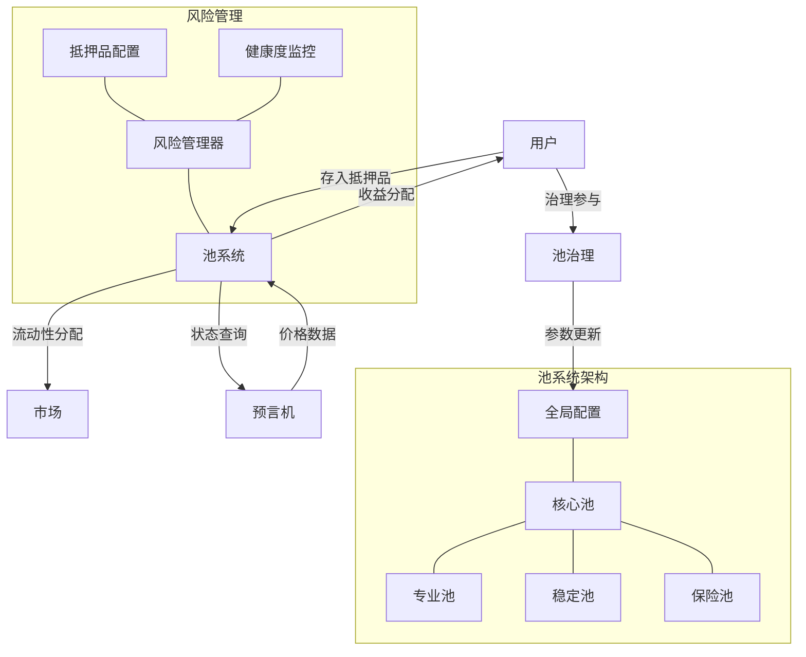

import { Callout, Cards, FileTree, Steps, Tabs } from 'nextra/components'

# Triplex 池系统 - Aptos 实现

<Callout type="info">
  Triplex 池系统是协议的核心流动性和风险管理组件，在 Aptos 区块链上实现了高度可配置的多抵押品池架构。系统充分利用 Move 语言的资源安全模型和所有权机制，确保资金安全并优化链上资本效率，为各类市场提供流动性支持。
</Callout>

## 池系统架构

<Tabs items={['架构概述', '交互流程', '安全保障']}>
  <Tabs.Tab>
    池系统在 Triplex 协议中担任流动性聚合和风险管理的核心角色，基于 Aptos 区块链实现了以下关键功能：

    - **多抵押品支持**：利用 Move 资源模型安全管理多种不同抵押品
    - **流动性分配**：通过 Table 结构高效分配流动性到不同市场和合成资产
    - **风险隔离**：依靠 Move 的所有权机制实现严格的风险分离
    - **收益生成**：结合 Aptos 高吞吐量特性实现高效收益策略
    - **治理整合**：Move 模块间安全交互支持透明池参数治理

    池系统的核心价值在于提供高效的资本利用率，同时利用 Move 语言的安全特性确保系统稳定性。
  </Tabs.Tab>
  
  <Tabs.Tab>
    <Steps>
      1. **用户存入抵押品**
         - 通过 Move 安全资源交互存入代币
         - 系统验证代币类型和资源所有权
         - 生成相应的LP代币作为资产凭证
      
      2. **抵押品分配**
         - 池管理器通过 Move 模块间安全调用分配资源
         - 原子化事务保证分配过程不可篡改
         - Table 结构高效更新和查询池状态
      
      3. **市场流动性提供**
         - 利用 Capability 模式安全授权流动性使用
         - 基于 Aptos 时间戳进行动态调整
         - 通过 Move 事件系统实时监控风险
      
      4. **收益分配**
         - Table 结构精确记录用户份额和时间
         - 原子化交易确保收益分配准确无误
         - 提供再投资或提取的安全操作路径
    </Steps>
  </Tabs.Tab>
  
  <Tabs.Tab>
    <Cards>
      <Cards.Card title="资源安全" href="#资源安全">
        Move 资源模型强制所有权与不可复制性
      </Cards.Card>
      <Cards.Card title="权限管理" href="#权限管理">
        Capability 模式实现细粒度访问控制
      </Cards.Card>
      <Cards.Card title="紧急机制" href="#紧急机制">
        基于 Move 能力的暂停功能与资金保护
      </Cards.Card>
      <Cards.Card title="风险参数" href="#风险参数">
        Aptos 事件系统实时监控与自动调整
      </Cards.Card>
    </Cards>
  </Tabs.Tab>
</Tabs>

## 池系统结构



<FileTree>
  <FileTree.Folder name="Pool System" defaultOpen>
    <FileTree.Folder name="Core Modules" defaultOpen>
      <FileTree.File name="pool_module.move" />
      <FileTree.File name="pool_config.move" />
      <FileTree.File name="pool_manager.move" />
      <FileTree.File name="liquidity_distributor.move" />
    </FileTree.Folder>
    <FileTree.Folder name="Collateral Types">
      <FileTree.File name="collateral_registry.move" />
      <FileTree.File name="collateral_validator.move" />
      <FileTree.File name="collateral_state.move" />
    </FileTree.Folder>
    <FileTree.Folder name="Specialized Pools">
      <FileTree.File name="staking_pool.move" />
      <FileTree.File name="insurance_pool.move" />
      <FileTree.File name="stability_pool.move" />
    </FileTree.Folder>
    <FileTree.Folder name="Yield Strategies">
      <FileTree.File name="yield_manager.move" />
      <FileTree.File name="strategy_registry.move" />
      <FileTree.File name="rewards_distributor.move" />
    </FileTree.Folder>
  </FileTree.Folder>
</FileTree>

## 核心功能

### 多抵押品支持

<Tabs items={['抵押品管理', '权重与分配', '风险参数']}>
  <Tabs.Tab>
    ```move
    module triplex::collateral_registry {
        use std::string::String;
        use aptos_std::table::{Self, Table};
        use aptos_std::type_info::{Self, TypeInfo};
        use aptos_framework::coin::{Self, CoinStore};
        use aptos_framework::account;
        use aptos_framework::event;
        use aptos_framework::error;
        use aptos_framework::timestamp;
        
        // 错误常量
        const ENOT_AUTHORIZED: u64 = 1001;
        const ECOLLATERAL_ALREADY_REGISTERED: u64 = 1002;
        const ECOIN_NOT_INITIALIZED: u64 = 1003;
        const ECOLLATERAL_NOT_REGISTERED: u64 = 1004;
        
        /// 抵押品配置
        struct CollateralConfig has store, copy, drop {
            // 抵押品标识符
            coin_type_info: TypeInfo,
            // 抵押率 (以基点表示，10000=100%)
            collateral_ratio: u64,
            // 清算阈值
            liquidation_threshold: u64,
            // 最大容量（0表示无限制）
            max_capacity: u64,
            // 是否启用
            is_active: bool,
            // 权重（用于流动性分配）
            weight: u64,
            // 最后更新时间
            last_updated: u64,
        }
        
        /// 抵押品注册事件
        struct CollateralRegisteredEvent has drop, store {
            coin_type_info: TypeInfo,
            collateral_ratio: u64,
            weight: u64,
            timestamp: u64,
        }
        
        /// 全局抵押品注册表
        struct CollateralRegistry has key, store {
            collaterals: Table<TypeInfo, CollateralConfig>,
            active_collateral_count: u64,
            // 事件处理
            register_events: event::EventHandle<CollateralRegisteredEvent>,
        }
        
        /// 初始化抵押品注册表
        public entry fun initialize(admin: &signer) {
            let admin_addr = signer::address_of(admin);
            assert!(admin_addr == @triplex, error::permission_denied(ENOT_AUTHORIZED)); // 仅限管理员
            
            move_to(admin, CollateralRegistry {
                collaterals: table::new<TypeInfo, CollateralConfig>(),
                active_collateral_count: 0,
                register_events: event::new_event_handle<CollateralRegisteredEvent>(admin),
            });
        }
        
        /// 注册新的抵押品类型
        public entry fun register_collateral<CoinType>(
            admin: &signer,
            collateral_ratio: u64,
            liquidation_threshold: u64,
            max_capacity: u64,
            weight: u64
        ) acquires CollateralRegistry {
            let admin_addr = signer::address_of(admin);
            assert!(admin_addr == @triplex, error::permission_denied(ENOT_AUTHORIZED)); // 仅限管理员
            
            let registry = borrow_global_mut<CollateralRegistry>(@triplex);
            let coin_type_info = type_info::type_of<CoinType>();
            
            assert!(
                !table::contains(&registry.collaterals, coin_type_info), 
                error::already_exists(ECOLLATERAL_ALREADY_REGISTERED)
            ); // 已注册
            
            // 验证代币已在Aptos上注册
            assert!(coin::is_coin_initialized<CoinType>(), error::invalid_state(ECOIN_NOT_INITIALIZED));
            
            // 创建配置
            let config = CollateralConfig {
                coin_type_info,
                collateral_ratio,
                liquidation_threshold,
                max_capacity,
                is_active: true,
                weight,
                last_updated: timestamp::now_seconds(),
            };
            
            // 添加到注册表
            table::add(&mut registry.collaterals, coin_type_info, config);
            registry.active_collateral_count = registry.active_collateral_count + 1;
            
            // 触发事件
            event::emit_event(
                &mut registry.register_events,
                CollateralRegisteredEvent {
                    coin_type_info,
                    collateral_ratio,
                    weight,
                    timestamp: timestamp::now_seconds(),
                }
            );
        }
        
        /// 获取抵押品配置
        public fun get_collateral_config<CoinType>(): CollateralConfig acquires CollateralRegistry {
            let registry = borrow_global<CollateralRegistry>(@triplex);
            let coin_type_info = type_info::type_of<CoinType>();
            
            assert!(table::contains(&registry.collaterals, coin_type_info), ECOLLATERAL_NOT_REGISTERED); // 未注册
            *table::borrow(&registry.collaterals, coin_type_info)
        }
        
        /// 更新抵押品参数
        public fun update_collateral_params<CoinType>(
            admin: &signer,
            collateral_ratio: u64,
            liquidation_threshold: u64,
            max_capacity: u64,
            weight: u64
        ) acquires CollateralRegistry {
            let admin_addr = signer::address_of(admin);
            assert!(admin_addr == @triplex, ENOT_AUTHORIZED); // 仅限管理员
            
            let registry = borrow_global_mut<CollateralRegistry>(@triplex);
            let coin_type_info = type_info::type_of<CoinType>();
            
            assert!(table::contains(&registry.collaterals, coin_type_info), ECOLLATERAL_NOT_REGISTERED); // 未注册
            
            let config = table::borrow_mut(&mut registry.collaterals, coin_type_info);
            config.collateral_ratio = collateral_ratio;
            config.liquidation_threshold = liquidation_threshold;
            config.max_capacity = max_capacity;
            config.weight = weight;
            config.last_updated = timestamp::now_seconds();
        }
    }
    ```
  </Tabs.Tab>
  
  <Tabs.Tab>
    <Cards>
      <Cards.Card title="基于权重分配" href="#基于权重分配">
        Move Table结构高效实现的权重分配系统
      </Cards.Card>
      <Cards.Card title="动态调整" href="#动态调整">
        基于Aptos时间戳的实时调整策略
      </Cards.Card>
      <Cards.Card title="策略分配" href="#策略分配">
        利用Move泛型实现灵活的市场匹配策略
      </Cards.Card>
      <Cards.Card title="流动性限制" href="#流动性限制">
        资源模型确保的安全流动性上限管理
      </Cards.Card>
    </Cards>
  </Tabs.Tab>
  
  <Tabs.Tab>
    <Steps>
      1. **抵押率**
         - 每种抵押品通过TypeInfo独立配置
         - 基于Aptos事件系统实时调整
         - 治理提案透明审查与修改
      
      2. **清算阈值**
         - Aptos时间戳精确控制的清算时机
         - Move资源模型确保清算操作安全性
         - 考虑预言机数据时效性的动态阈值
      
      3. **价格来源**
         - 与Aptos生态预言机深度集成
         - 多重验证确保价格准确性
         - Move模块间安全数据传递
    </Steps>
  </Tabs.Tab>
</Tabs>

### 池类型

<Cards>
  <Cards.Card title="核心池" href="#核心池">
    基于Move资源模型的主要流动性聚合池，支持多抵押品管理
  </Cards.Card>
  <Cards.Card title="稳定池" href="#稳定池">
    专为稳定币设计的低波动性流动性池，利用Aptos高吞吐确保稳定性
  </Cards.Card>
  <Cards.Card title="保险池" href="#保险池">
    Move资源隔离保护的风险缓冲池，应对系统风险事件
  </Cards.Card>
  <Cards.Card title="策略池" href="#策略池">
    针对特定市场的专业化流动性池，支持复杂策略实现
  </Cards.Card>
</Cards>

### 池管理

```move
module triplex::pool_manager {
    use std::signer;
    use std::vector;
    use std::string::{Self, String};
    use aptos_std::table::{Self, Table};
    use aptos_std::type_info::{Self, TypeInfo};
    use aptos_std::bcs;
    use aptos_framework::coin;
    use aptos_framework::account;
    use aptos_framework::timestamp;
    use aptos_framework::event::{Self, EventHandle};
    use aptos_framework::error;
    
    use triplex::collateral_registry::{Self, CollateralConfig};
    
    // 错误常量
    const ENOT_AUTHORIZED: u64 = 2001;
    const EPOOL_ALREADY_EXISTS: u64 = 2002;
    const EMAX_COLLATERAL_REACHED: u64 = 2003;
    const ECOLLATERAL_ALREADY_ADDED: u64 = 2004;
    const EPOOL_NOT_FOUND: u64 = 2005;
    const EPOOL_INACTIVE: u64 = 2006;
    const ECOLLATERAL_NOT_REGISTERED: u64 = 2007;
    const EINSUFFICIENT_FUNDS: u64 = 2008;
    const ENO_CAPABILITY: u64 = 2009;
    
    /// 池状态
    struct PoolState has key, store {
        // 池ID
        pool_id: u64,
        // 池名称
        name: String,
        // 抵押品余额表 (抵押品类型 -> 金额)
        collateral_balances: Table<TypeInfo, u64>,
        // 分配到市场的资金
        allocated_funds: Table<u64, u64>,
        // 总流动性（美元价值）
        total_liquidity_value: u64,
        // 创建时间
        creation_time: u64,
        // 上次更新时间
        last_update_time: u64,
        // 池配置
        config: PoolConfig,
        // 操作事件
        operation_events: EventHandle<PoolOperationEvent>,
    }
    
    /// 池操作事件
    struct PoolOperationEvent has drop, store {
        pool_id: u64,
        operation_type: u8, // 使用常量定义的操作类型
        amount: u64,
        timestamp: u64,
    }
    
    // 操作类型常量
    const OPERATION_DEPOSIT: u8 = 1;
    const OPERATION_WITHDRAW: u8 = 2;
    const OPERATION_ALLOCATE: u8 = 3;
    const OPERATION_CONFIG: u8 = 4;
    
    /// 池配置
    struct PoolConfig has store, copy, drop {
        // 费用比率 (基点)
        fee_ratio: u64,
        // 最大杠杆率
        max_leverage: u64,
        // 是否启用
        is_active: bool,
        // 最大抵押品类型数
        max_collateral_types: u64,
    }
    
    /// 池能力token
    struct PoolCapability has key, store {}
    
    /// 获取池地址
    public fun get_pool_address(pool_id: u64): address {
        let pool_seed = vector::empty<u8>();
        vector::append(&mut pool_seed, b"pool_");
        vector::append(&mut pool_seed, bcs::to_bytes(&pool_id));
        account::create_resource_address(@triplex, pool_seed)
    }
    
    /// 初始化池
    public entry fun initialize_pool(
        admin: &signer,
        pool_id: u64,
        name: String,
        fee_ratio: u64,
        max_leverage: u64,
        max_collateral_types: u64
    ) {
        let admin_addr = signer::address_of(admin);
        assert!(admin_addr == @triplex, error::permission_denied(ENOT_AUTHORIZED)); // 仅管理员
        
        // 创建池配置
        let config = PoolConfig {
            fee_ratio,
            max_leverage,
            is_active: true,
            max_collateral_types,
        };
        
        // 创建池资源账户
        let pool_seed = vector::empty<u8>();
        vector::append(&mut pool_seed, b"pool_");
        vector::append(&mut pool_seed, bcs::to_bytes(&pool_id));
        
        let (pool_resource, pool_cap) = 
            account::create_resource_account(admin, pool_seed);
        
        // 保存池状态
        move_to(&pool_resource, PoolState {
            pool_id,
            name,
            collateral_balances: table::new<TypeInfo, u64>(),
            allocated_funds: table::new<u64, u64>(),
            total_liquidity_value: 0,
            creation_time: timestamp::now_seconds(),
            last_update_time: timestamp::now_seconds(),
            config,
            operation_events: event::new_event_handle<PoolOperationEvent>(&pool_resource),
        });
        
        // 保存池能力token
        move_to(admin, PoolCapability {});
    }
    
    /// 添加抵押品到池
    public entry fun add_collateral_type<CoinType>(
        admin: &signer, 
        pool_id: u64
    ) acquires PoolState, PoolCapability {
        let admin_addr = signer::address_of(admin);
        assert!(admin_addr == @triplex, error::permission_denied(ENOT_AUTHORIZED)); // 仅管理员
        assert!(exists<PoolCapability>(admin_addr), error::not_found(ENO_CAPABILITY)); // 需要能力token
        
        // 获取池地址
        let pool_addr = get_pool_address(pool_id);
        let pool_state = borrow_global_mut<PoolState>(pool_addr);
        
        // 验证抵押品已注册
        let collateral_config = collateral_registry::get_collateral_config<CoinType>();
        let coin_type_info = collateral_config.coin_type_info;
        
        // 检查池中的抵押品类型数量
        let current_count = table::length(&pool_state.collateral_balances);
        assert!(
            current_count < pool_state.config.max_collateral_types, 
            error::resource_exhausted(EMAX_COLLATERAL_REACHED)
        );
        
        // 添加抵押品类型
        assert!(
            !table::contains(&pool_state.collateral_balances, coin_type_info), 
            error::already_exists(ECOLLATERAL_ALREADY_ADDED)
        );
        table::add(&mut pool_state.collateral_balances, coin_type_info, 0);
        
        // 更新池状态
        pool_state.last_update_time = timestamp::now_seconds();
        
        // 触发事件
        event::emit_event(
            &mut pool_state.operation_events,
            PoolOperationEvent {
                pool_id,
                operation_type: OPERATION_CONFIG, // 更新配置
                amount: 0,
                timestamp: timestamp::now_seconds(),
            }
        );
    }
    
    /// 计算池总价值
    public fun calculate_pool_total_value(
        pool_id: u64
    ): u64 acquires PoolState {
        let pool_addr = get_pool_address(pool_id);
        let pool_state = borrow_global<PoolState>(pool_addr);
        
        let total_value = 0;
        
        // 获取所有抵押品类型
        let collateral_types = table::keys(&pool_state.collateral_balances);
        let len = vector::length(&collateral_types);
        
        // 遍历所有抵押品并计算美元价值
        let i = 0;
        while (i < len) {
            let type_info = *vector::borrow(&collateral_types, i);
            let amount = *table::borrow(&pool_state.collateral_balances, type_info);
            
            // 此处应调用预言机获取价格
            // let price = oracle::get_price(type_info);
            // total_value = total_value + (amount * price) / 1000000; // 假设价格精度为1e6
            
            // 简化实现，实际中应使用预言机价格
            total_value = total_value + amount;
            
            i = i + 1;
        };
        
        total_value
    }
    
    /// 用户存款
    public entry fun deposit<CoinType>(
        user: &signer,
        pool_id: u64,
        amount: u64
    ) acquires PoolState {
        let user_addr = signer::address_of(user);
        let pool_addr = get_pool_address(pool_id);
        
        // 验证池存在并活跃
        assert!(exists<PoolState>(pool_addr), error::not_found(EPOOL_NOT_FOUND));
        let pool_state = borrow_global_mut<PoolState>(pool_addr);
        assert!(pool_state.config.is_active, error::invalid_state(EPOOL_INACTIVE));
        
        // 验证抵押品类型已在池中注册
        let coin_type_info = type_info::type_of<CoinType>();
        assert!(
            table::contains(&pool_state.collateral_balances, coin_type_info), 
            error::invalid_argument(ECOLLATERAL_NOT_REGISTERED)
        );
        
        // 转移代币
        let coin_in = coin::withdraw<CoinType>(user, amount);
        coin::deposit(pool_addr, coin_in);
        
        // 更新余额
        let balance = table::borrow_mut(&mut pool_state.collateral_balances, coin_type_info);
        *balance = *balance + amount;
        
        // 更新池状态
        pool_state.last_update_time = timestamp::now_seconds();
        
        // 触发事件
        event::emit_event(
            &mut pool_state.operation_events,
            PoolOperationEvent {
                pool_id,
                operation_type: OPERATION_DEPOSIT,
                amount,
                timestamp: timestamp::now_seconds(),
            }
        );
        
        // 铸造LP代币 (简化实现，实际会调用LP代币模块)
        // triplex::lp_token::mint<CoinType>(user, amount);
    }
}
```

### 流动性分配

<Tabs items={['分配策略', '优先级机制', '市场互动']}>
  <Tabs.Tab>
    <Steps>
      1. **比例分配**
         - Move Table结构实现的高效权重计算
         - 基于Aptos时间戳的定期重新平衡
         - 资源模型确保资金分配安全性
      
      2. **动态调整**
         - 事件系统监控的实时使用率
         - 高需求市场的自动流动性增配
         - Move能力模式控制的分配限制
      
      3. **自适应策略**
         - 利用Aptos VM高性能实现复杂策略
         - 基于Move模块编码的市场状况监测
         - 链上自动化调整流程
    </Steps>
  </Tabs.Tab>
  
  <Tabs.Tab>
    <Cards>
      <Cards.Card title="关键市场优先" href="#关键市场优先">
        基于Move资源权重的核心市场优先机制
      </Cards.Card>
      <Cards.Card title="稳定性优先" href="#稳定性优先">
        资源隔离保护的稳定资产市场保障
      </Cards.Card>
      <Cards.Card title="收益最大化" href="#收益最大化">
        Aptos高吞吐支持的复杂收益优化逻辑
      </Cards.Card>
      <Cards.Card title="风险平衡" href="#风险平衡">
        Move静态类型安全的风险平衡系统
      </Cards.Card>
    </Cards>
  </Tabs.Tab>
  
  <Tabs.Tab>
    ```move
    module triplex::liquidity_distributor {
        use std::signer;
        use aptos_std::table::{Self, Table};
        use aptos_framework::timestamp;
        use aptos_framework::event::{Self, EventHandle};
        use aptos_framework::error;
        
        use triplex::pool_manager::{Self, PoolState};
        use triplex::market_registry::{Self, MarketInfo};
        
        // 错误常量
        const ENOT_AUTHORIZED: u64 = 3000;
        const EPOOL_NOT_FOUND: u64 = 3001;
        const ENO_CAPABILITY: u64 = 3002;
        const EMARKET_INACTIVE: u64 = 3003;
        const EINSUFFICIENT_LIQUIDITY: u64 = 3004;
        const EMINIMUM_INTERVAL_NOT_REACHED: u64 = 3005;
        
        /// 分配事件
        struct AllocationEvent has drop, store {
            pool_id: u64,
            market_id: u64,
            amount: u64,
            timestamp: u64,
        }
        
        /// 流动性分配状态
        struct DistributorState has key, store {
            // 市场分配比例 (市场ID -> 权重)
            market_weights: Table<u64, u64>,
            // 流动性使用率 (市场ID -> 使用率)
            utilization_rates: Table<u64, u64>,
            // 上次调整时间
            last_adjustment_time: u64,
            // 最小调整间隔
            min_adjustment_interval: u64,
            // 分配事件
            allocation_events: EventHandle<AllocationEvent>,
        }
        
        /// 分配能力
        struct DistributorCapability has key, store {}
        
        /// 初始化分配器
        public entry fun initialize_distributor(admin: &signer) {
            let admin_addr = signer::address_of(admin);
            assert!(admin_addr == @triplex, error::permission_denied(ENOT_AUTHORIZED));
            
            move_to(admin, DistributorState {
                market_weights: table::new<u64, u64>(),
                utilization_rates: table::new<u64, u64>(),
                last_adjustment_time: timestamp::now_seconds(),
                min_adjustment_interval: 3600, // 1小时
                allocation_events: event::new_event_handle<AllocationEvent>(admin),
            });
            
            move_to(admin, DistributorCapability {});
        }
        
        /// 为市场分配流动性
        public entry fun allocate_liquidity(
            admin: &signer, 
            pool_id: u64, 
            market_id: u64, 
            amount: u64
        ) acquires DistributorState, DistributorCapability {
            let admin_addr = signer::address_of(admin);
            assert!(admin_addr == @triplex, error::permission_denied(ENOT_AUTHORIZED)); // 仅管理员
            assert!(exists<DistributorCapability>(admin_addr), error::not_found(ENO_CAPABILITY)); // 需要能力
            
            // 验证池和市场
            let pool_addr = pool_manager::get_pool_address(pool_id);
            assert!(exists<PoolState>(pool_addr), error::not_found(EPOOL_NOT_FOUND));
            
            let market_info = market_registry::get_market_info(market_id);
            assert!(market_info.is_active, error::invalid_state(EMARKET_INACTIVE));
            
            // 验证池有足够可用流动性
            let available_liquidity = pool_manager::get_available_liquidity(pool_id);
            assert!(
                available_liquidity >= amount, 
                error::resource_exhausted(EINSUFFICIENT_LIQUIDITY)
            );
            
            // 分配流动性到市场
            pool_manager::allocate_to_market(pool_id, market_id, amount);
            
            // 更新流动性分配状态
            let distributor = borrow_global_mut<DistributorState>(@triplex);
            if (!table::contains(&distributor.utilization_rates, market_id)) {
                table::add(&mut distributor.utilization_rates, market_id, 0);
            };
            
            // 更新使用率
            let total_allocated = pool_manager::get_market_allocated_amount(pool_id, market_id);
            let market_cap = market_info.capacity;
            
            if (market_cap > 0) {
                let utilization = (total_allocated * 10000) / market_cap;
                table::upsert(&mut distributor.utilization_rates, market_id, utilization);
            };
            
            // 触发事件
            event::emit_event(
                &mut distributor.allocation_events,
                AllocationEvent {
                    pool_id,
                    market_id,
                    amount,
                    timestamp: timestamp::now_seconds(),
                }
            );
        }
        
        /// 重新平衡所有市场的流动性
        public entry fun rebalance_all_markets(admin: &signer) acquires DistributorState, DistributorCapability {
            let admin_addr = signer::address_of(admin);
            assert!(admin_addr == @triplex, error::permission_denied(ENOT_AUTHORIZED)); // 仅管理员
            assert!(exists<DistributorCapability>(admin_addr), error::not_found(ENO_CAPABILITY)); // 需要能力
            
            let distributor = borrow_global_mut<DistributorState>(@triplex);
            let current_time = timestamp::now_seconds();
            
            // 检查是否满足最小调整间隔
            assert!(
                current_time >= distributor.last_adjustment_time + distributor.min_adjustment_interval,
                error::invalid_state(EMINIMUM_INTERVAL_NOT_REACHED)
            );
            
            // 获取所有市场权重
            let market_ids = table::keys(&distributor.market_weights);
            let len = vector::length(&market_ids);
            
            // 实现实际的重新平衡逻辑
            // 示例：根据权重计算理想分配并调整
            let i = 0;
            while (i < len) {
                let market_id = *vector::borrow(&market_ids, i);
                let weight = *table::borrow(&distributor.market_weights, market_id);
                
                // 实际重新平衡逻辑在这里实现
                // pool_manager::reallocate_to_market(pool_id, market_id, new_amount);
                
                i = i + 1;
            };
            
            // 更新上次调整时间
            distributor.last_adjustment_time = current_time;
        }
    }
    ```
  </Tabs.Tab>
</Tabs>

### 收益生成与分配

<Cards>
  <Cards.Card title="交易费用" href="#交易费用">
    Move事件系统精确记录和分配的市场交易费用
  </Cards.Card>
  <Cards.Card title="借贷收益" href="#借贷收益">
    基于Aptos时间戳计算的精确利息收入
  </Cards.Card>
  <Cards.Card title="质押奖励" href="#质押奖励">
    Move资源模型安全管理的TRT代币质押奖励
  </Cards.Card>
  <Cards.Card title="外部策略" href="#外部策略">
    利用跨模块调用安全集成的Aptos生态DeFi收益
  </Cards.Card>
</Cards>

## 池系统优势

<Tabs items={['资本效率', '灵活性', '风险管理']}>
  <Tabs.Tab>
    <Steps>
      1. **资金利用率优化**
         - Aptos高吞吐量支持的快速资金重新分配
         - Move模块间安全交互减少闲置资金
         - Table数据结构支持的高效资本跟踪
      
      2. **抵押品效率**
         - Move资源模型安全管理多种抵押品
         - 基于TypeInfo的精确抵押率调整
         - Aptos事件驱动的智能清算机制
      
      3. **成本效率**
         - 共享基础设施降低系统成本
         - Aptos低Gas费用的高效操作设计
         - Move模块优化的批处理和事件处理
    </Steps>
  </Tabs.Tab>
  
  <Tabs.Tab>
    <Cards>
      <Cards.Card title="可配置参数" href="#可配置参数">
        Move强类型系统支持的安全参数调整
      </Cards.Card>
      <Cards.Card title="模块化结构" href="#模块化结构">
        Move模块封装与能力模式的组件化设计
      </Cards.Card>
      <Cards.Card title="扩展性" href="#扩展性">
        泛型机制支持的无缝扩展和资产添加
      </Cards.Card>
      <Cards.Card title="治理适应" href="#治理适应">
        Aptos事件系统支持的透明治理调整
      </Cards.Card>
    </Cards>
  </Tabs.Tab>
  
  <Tabs.Tab>
    <Steps>
      1. **分层风险隔离**
         - Move资源模型强制的严格风险隔离
         - 基于能力的池间权限控制
         - 类型安全保证的市场风险管理
      
      2. **健康度监控**
         - Aptos事件系统的实时状态监控
         - 自动化预警和干预系统
         - Move资源保证的风险暴露限制
      
      3. **应急机制**
         - 基于Move能力的安全清算流程
         - 资源所有权控制的紧急暂停
         - 保险池资源隔离的风险缓冲
    </Steps>
  </Tabs.Tab>
</Tabs> 

## 与其他系统的集成

<Steps>
  1. **预言机集成**
     - Move模块间安全调用的价格数据获取
     - 基于Aptos时间戳的风险参数实时调整
     - 链上事件驱动的清算触发机制
  
  2. **市场系统**
     - 能力模式授权的流动性提供
     - 跨模块资源交互的费用收集
     - Table高效查询的市场状态同步
  
  3. **治理系统**
     - 事件透明记录的参数调整提案
     - Move模块验证的安全审批流程
     - 资源所有权控制的策略决策执行
  
  4. **合成资产系统**
     - 资源安全交互的抵押品管理
     - Move类型安全的合成资产发行
     - 原子交易保证的流动性支持
</Steps>

<Callout type="warning">
  池系统是 Triplex 协议的核心流动性引擎，它的稳定性和效率直接影响整个协议的安全性与用户体验。在 Aptos 区块链上，Move 语言的资源安全模型为池系统提供了强大的安全保障，确保资金安全和高效流动，同时提供了极高的灵活性和扩展性。
</Callout> 