import { Callout, Cards, FileTree, Steps, Tabs } from 'nextra/components'

# Triplex 安全系统 - Aptos 实现

<Callout type="error">
  Triplex 实施了全面的多层次安全措施和风险管理策略，以保护用户资产和确保系统稳定性。基于 Aptos 区块链和 Move 语言的安全系统包含智能合约安全、经济安全、预言机安全、市场风险管理等多个维度。
</Callout>

## 智能合约安全

### 安全系统架构图

```mermaid
graph TD
    A[Triplex安全系统] -->|层级| B[智能合约安全]
    A -->|层级| C[经济安全]
    A -->|层级| D[预言机安全]
    A -->|层级| E[市场风险管理]
    
    B -->|包括| F[代码安全]
    F -->|措施| F1[形式化验证]
    F -->|措施| F2[多重审计]
    F -->|措施| F3[安全最佳实践]
    
    B -->|包括| G[访问控制]
    G -->|机制| G1[能力模型]
    G -->|机制| G2[签名验证]
    G -->|机制| G3[多重签名]
    
    B -->|包括| H[升级安全]
    H -->|机制| H1[模块升级]
    H -->|机制| H2[兼容性检查]
    H -->|机制| H3[紧急暂停]
    
    C -->|包括| I[抵押机制]
    I -->|特性| I1[多层抵押率]
    I -->|特性| I2[健康度监控]
    I -->|特性| I3[动态调整]
    
    C -->|包括| J[清算系统]
    J -->|特性| J1[分层清算]
    J -->|特性| J2[激励对齐]
    J -->|特性| J3[清算保护]
    
    D -->|包括| K[价格操纵防护]
    K -->|机制| K1[多重数据源]
    K -->|机制| K2[时间加权]
    K -->|机制| K3[异常检测]
    
    D -->|包括| L[故障保障]
    L -->|机制| L1[故障检测]
    L -->|机制| L2[备份系统]
    L -->|机制| L3[性能优化]
    
    E -->|包括| M[极端市场处理]
    M -->|机制| M1[断路器]
    M -->|机制| M2[头寸限制]
    M -->|机制| M3[风险限额]
    
    E -->|包括| N[操纵防护]
    
    style A fill:#f9f,stroke:#333,stroke-width:2px
    style B fill:#f96,stroke:#333,stroke-width:1px
    style C fill:#f96,stroke:#333,stroke-width:1px
    style D fill:#f96,stroke:#333,stroke-width:1px
    style E fill:#f96,stroke:#333,stroke-width:1px
```



### 安全开发流程

<Cards>
  <Cards.Card title="多重审计" href="#多重审计">
    内部审计、外部审计、持续审计
  </Cards.Card>
  <Cards.Card title="形式化验证" href="#形式化验证">
    协议验证、Move Prover、状态验证
  </Cards.Card>
  <Cards.Card title="安全实践" href="#安全实践">
    Move 最佳实践、代码标准、安全生命周期
  </Cards.Card>
  <Cards.Card title="漏洞赏金" href="#漏洞赏金">
    赏金计划、风险分级、奖励机制
  </Cards.Card>
</Cards>

### 合约架构安全

<FileTree>
  <FileTree.Folder name="Security Architecture" defaultOpen>
    <FileTree.Folder name="Access Control" defaultOpen>
      <FileTree.File name="role_manager.move" />
      <FileTree.File name="permission_control.move" />
      <FileTree.File name="signer_verification.move" />
    </FileTree.Folder>
    <FileTree.Folder name="Protection">
      <FileTree.File name="abort_control.move" />
      <FileTree.File name="math_utils.move" />
      <FileTree.File name="pause_module.move" />
    </FileTree.Folder>
    <FileTree.Folder name="Upgrade">
      <FileTree.File name="upgrade_control.move" />
      <FileTree.File name="compatibility_checker.move" />
    </FileTree.Folder>
  </FileTree.Folder>
</FileTree>

### 核心安全特性

<Tabs items={['权限控制', '资源保护', '升级机制']}>
  <Tabs.Tab>
    ```move
    // Move 语言的能力模型权限控制
    module triplex::permission_control {
        use std::signer;
        use std::error;
        
        /// 错误代码
        const E_NOT_AUTHORIZED: u64 = 1;
        const E_NOT_ADMIN: u64 = 2;
        
        /// 管理员角色
        struct AdminCap has key, store {
            admin_address: address
        }
        
        /// 池管理员角色
        struct PoolManagerCap has key, store {
            pool_id: u64
        }
        
        /// 检查是否为系统管理员
        public fun assert_admin(account: &signer) {
            let addr = signer::address_of(account);
            assert!(exists<AdminCap>(addr), error::permission_denied(E_NOT_ADMIN));
        }
        
        /// 检查是否为池管理员
        public fun assert_pool_manager(account: &signer, pool_id: u64) {
            let addr = signer::address_of(account);
            assert!(
                exists<PoolManagerCap>(addr) && borrow_global<PoolManagerCap>(addr).pool_id == pool_id,
                error::permission_denied(E_NOT_AUTHORIZED)
            );
        }
    }
    ```
  </Tabs.Tab>
  
  <Tabs.Tab>
    ```move
    // Move 的内建资源保护和类型安全
    module triplex::safe_math {
        use std::error;
        
        /// 错误代码
        const E_OVERFLOW: u64 = 1;
        const E_DIVIDE_BY_ZERO: u64 = 2;
        
        /// 安全加法，防止溢出
        public fun safe_add(a: u64, b: u64): u64 {
            let res = a + b;
            assert!(res >= a, error::invalid_argument(E_OVERFLOW)); // 检查溢出
            res
        }
        
        /// 安全乘法，防止溢出
        public fun safe_mul(a: u64, b: u64): u64 {
            if (a == 0 || b == 0) {
                return 0
            };
            
            let res = a * b;
            assert!(res / a == b, error::invalid_argument(E_OVERFLOW)); // 检查溢出
            res
        }
        
        /// 安全除法，防止除以零
        public fun safe_div(a: u64, b: u64): u64 {
            assert!(b != 0, error::invalid_argument(E_DIVIDE_BY_ZERO));
            a / b
        }
    }
    ```
  </Tabs.Tab>
  
  <Tabs.Tab>
    <Steps>
      1. **模块升级机制**
         - 利用 Aptos 代码发布功能
         - 状态兼容性验证
         - 权限控制升级过程
      
      2. **升级控制**
         - 多重签名要求
         - 治理投票确认
         - 状态迁移验证
    </Steps>
  </Tabs.Tab>
</Tabs>

## 经济安全

<Callout type="warning">
  系统基于 Move 语言的类型和资源安全特性，实施了复杂的经济安全机制，包括抵押率管理、清算机制和风险定价模型。
</Callout>

### 抵押率管理

<Steps>
  1. **多层抵押率**
     - 资产风险差异化
     - 市场波动性调整
     - 相关性风险模型
  
  2. **健康系数**
     - 实时状态监控
     - 预警系统
     - 自动干预机制
  
  3. **极端保护**
     - 全局最小抵押率
     - 自动调整机制
     - 治理干预选项
</Steps>

### 清算机制

<Cards>
  <Cards.Card title="分层清算" href="#分层清算">
    优先级排序、风险定价、顺序执行
  </Cards.Card>
  <Cards.Card title="激励对齐" href="#激励对齐">
    市场驱动、收益分配、成本控制
  </Cards.Card>
  <Cards.Card title="清算保护" href="#清算保护">
    缓冲机制、预警系统、自动干预
  </Cards.Card>
  <Cards.Card title="公平竞争" href="#公平竞争">
    MEV防护、公平访问、透明竞争
  </Cards.Card>
</Cards>

## 预言机安全

### 价格操纵防护

<Tabs items={['数据源管理', '时间加权', '异常检测']}>
  <Tabs.Tab>
    <Cards>
      <Cards.Card title="多重数据源" href="#多重数据源">
        多个预言机、去中心化喂价、数据聚合
      </Cards.Card>
      <Cards.Card title="权威验证" href="#权威验证">
        签名验证、信誉系统、质押机制
      </Cards.Card>
      <Cards.Card title="数据加权" href="#数据加权">
        可信度评分、历史表现、异常惩罚
      </Cards.Card>
    </Cards>
  </Tabs.Tab>
  
  <Tabs.Tab>
    ```move
    module triplex::oracle_security {
        use std::vector;
        use aptos_std::table::{Self, Table};
        
        /// 采用时间加权的价格数据
        struct TimeWeightedPrice has store {
            // 价格数据点
            price_points: vector<PricePoint>,
            // 最后更新时间
            last_update: u64,
            // TWAP参数
            window_size: u64,
        }
        
        /// 价格数据点
        struct PricePoint has store, drop {
            price: u64,
            timestamp: u64,
            weight: u64,
        }
        
        /// 计算时间加权平均价格
        public fun calculate_twap(price_data: &TimeWeightedPrice): u64 {
            let points = &price_data.price_points;
            let len = vector::length(points);
            
            // 数据点不足
            if (len < 2) {
                return vector::borrow(points, 0).price
            };
            
            let total_weight = 0;
            let weighted_sum = 0;
            let i = 0;
            
            // 计算加权平均
            while (i < len) {
                let point = vector::borrow(points, i);
                weighted_sum = weighted_sum + point.price * point.weight;
                total_weight = total_weight + point.weight;
                i = i + 1;
            };
            
            // 返回加权平均价格
            if (total_weight == 0) {
                vector::borrow(points, len - 1).price
            } else {
                weighted_sum / total_weight
            }
        }
    }
    ```
  </Tabs.Tab>
  
  <Tabs.Tab>
    <Cards>
      <Cards.Card title="价格有效性检查" href="#价格有效性检查">
        价格范围检查、变化率检查、历史偏差分析
      </Cards.Card>
      <Cards.Card title="异常喂价处理" href="#异常喂价处理">
        自动剔除、惩罚机制、降权策略
      </Cards.Card>
      <Cards.Card title="降级机制" href="#降级机制">
        备用数据源、紧急价格确认、治理干预
      </Cards.Card>
    </Cards>
  </Tabs.Tab>
</Tabs>

### 故障保障

<Steps>
  1. **故障检测**
     - 数据过时检查
     - 心跳监控
     - 性能分析
  
  2. **备份系统**
     - 多层回退策略
     - 链上链下结合
     - 紧急价格机制
  
  3. **性能优化**
     - 更新频率平衡
     - gas成本适应
     - 优先级管理
</Steps>

## 市场风险管理

### 极端市场条件

<Tabs items={['断路器', '头寸限制', '风险限额']}>
  <Tabs.Tab>
    <Steps>
      1. **触发机制**
         - 价格波动监控
         - 分层触发阈值
         - 自动暂停交易
      
      2. **恢复流程**
         - 条件验证
         - 分级恢复
         - 人工确认
    </Steps>
  </Tabs.Tab>
  
  <Tabs.Tab>
    <Cards>
      <Cards.Card title="规模控制" href="#规模控制">
        市场特定限额
      </Cards.Card>
      <Cards.Card title="动态调整" href="#动态调整">
        基于流动性变化
      </Cards.Card>
      <Cards.Card title="集中度管理" href="#集中度管理">
        风险分散要求
      </Cards.Card>
    </Cards>
  </Tabs.Tab>
  
  <Tabs.Tab>
    <Steps>
      1. **系统限额**
         - 总风险敞口
         - 市场相关性
         - 定期压力测试
      
      2. **调整机制**
         - 自动化调整
         - 治理审查
         - 紧急干预
    </Steps>
  </Tabs.Tab>
</Tabs>

### 操纵防护

<Cards>
  <Cards.Card title="价格影响" href="#价格影响">
    动态滑点与分批执行
  </Cards.Card>
  <Cards.Card title="流动性保障" href="#流动性保障">
    LP激励与风险控制
  </Cards.Card>
  <Cards.Card title="交易限制" href="#交易限制">
    账户评分与监控
  </Cards.Card>
  <Cards.Card title="异常检测" href="#异常检测">
    可疑活动识别
  </Cards.Card>
</Cards>

## 治理安全

<Callout type="info">
  基于 Aptos 链的治理系统采用多层安全架构，确保决策过程的安全性和公平性。
</Callout>

### 攻击防护

<Steps>
  1. **投票锁定**
     - 强制执行延迟
     - 多重签名验证
     - 紧急取消机制
  
  2. **投票保护**
     - 时间加权投票
     - 抵押要求验证
     - 委托控制
  
  3. **提案管理**
     - 初步审查
     - 质押要求
     - 恶意识别
</Steps>

### 紧急响应

<Tabs items={['安全理事会', '系统暂停', '恢复流程']}>
  <Tabs.Tab>
    <Cards>
      <Cards.Card title="组成" href="#组成">
        多方参与、专业成员、职责分工
      </Cards.Card>
      <Cards.Card title="权限" href="#权限">
        有限紧急权力
      </Cards.Card>
      <Cards.Card title="监督" href="#监督">
        透明度与责任制
      </Cards.Card>
    </Cards>
  </Tabs.Tab>
  
  <Tabs.Tab>
    <Steps>
      1. **暂停机制**
         - 组件级暂停
         - 自动触发条件
         - 手动干预选项
      
      2. **状态管理**
         - 暂停状态记录
         - 依赖项处理
         - 恢复准备
    </Steps>
  </Tabs.Tab>
  
  <Tabs.Tab>
    <Cards>
      <Cards.Card title="预案执行" href="#预案执行">
        事件响应策略
      </Cards.Card>
      <Cards.Card title="状态恢复" href="#状态恢复">
        安全恢复机制
      </Cards.Card>
      <Cards.Card title="后续改进" href="#后续改进">
        事故分析与优化
      </Cards.Card>
    </Cards>
  </Tabs.Tab>
</Tabs>

## 故障模式分析

<Callout type="error">
  系统定义了主要故障模式及其对应的风险等级和缓解策略，特别考虑了 Aptos 链上运行的特性。
</Callout>

### 关键故障应对

| 故障模式 | 风险级别 | 缓解策略 |
|---------|---------|---------|
| 预言机失效 | 高 | 多重数据源、备份系统、断路器、Move 类型安全 |
| 流动性危机 | 高 | 激励机制、动态参数、清算缓冲、资源隔离 |
| 治理攻击 | 中 | 投票锁定、多重签名、权重限制、能力模式验证 |
| 智能合约漏洞 | 中 | Move Prover、形式化验证、赏金计划、资源安全特性 |

## 智能合约安全审计

### 多层审计方法

<Steps>
  1. **内部审计**
     - 代码审查
     - 单元测试
     - 集成测试
     - 形式化验证
     
  2. **外部审计**
     - 专业安全公司审计
     - 社区审查
     - 公开测试网
     
  3. **持续审计**
     - 监控与分析
     - 自动化测试
     - 漏洞赏金计划
</Steps>

### Move Prover 形式化验证

```move
/// 提供安全的资金管理功能
module triplex::secure_fund_manager {
    use std::signer;
    use aptos_framework::coin;
    
    /// 用户资金不足
    const E_INSUFFICIENT_BALANCE: u64 = 1;
    
    /// @notice 从用户账户安全转移资金
    /// @param from 转出账户签名者
    /// @param to_address 接收地址
    /// @param amount 转账金额
    /// @ensures 成功时转账金额不变，账户余额更新
    public fun secure_transfer<CoinType>(
        from: &signer,
        to_address: address,
        amount: u64
    ) {
        let from_address = signer::address_of(from);
        
        // 验证账户余额充足
        assert!(
            coin::balance<CoinType>(from_address) >= amount,
            E_INSUFFICIENT_BALANCE
        );
        
        // 执行转账
        coin::transfer<CoinType>(from, to_address, amount);
    }
    
    /// @invariant 任何操作不会创造或销毁代币总量
    spec secure_transfer {
        // 前置条件：发送者余额充足
        requires coin::balance<CoinType>(signer::address_of(from)) >= amount;
        
        // 后置条件：接收者余额增加，发送者余额减少
        ensures coin::balance<CoinType>(to_address) 
            == old(coin::balance<CoinType>(to_address)) + amount;
        ensures coin::balance<CoinType>(signer::address_of(from)) 
            == old(coin::balance<CoinType>(signer::address_of(from))) - amount;
            
        // 总代币数量保持不变
        ensures coin::supply<CoinType>() == old(coin::supply<CoinType>());
        
        // 操作不会创建新账户
        ensures old(coin::is_account_registered<CoinType>(to_address))
            ==> coin::is_account_registered<CoinType>(to_address);
    }
}
```

## 漏洞应对机制

### 紧急暂停系统

<Cards>
  <Cards.Card title="分层暂停" href="#分层暂停">
    系统暂停、模块暂停、功能暂停
  </Cards.Card>
  <Cards.Card title="条件触发" href="#条件触发">
    自动条件、治理触发、风险阈值
  </Cards.Card>
  <Cards.Card title="快速恢复" href="#快速恢复">
    状态验证、段落式恢复、功能测试
  </Cards.Card>
</Cards>

```move
module triplex::emergency_pause {
    use std::error;
    use std::signer;
    use aptos_framework::timestamp;
    
    /// 错误代码
    const E_NOT_AUTHORIZED: u64 = 1;
    const E_SYSTEM_PAUSED: u64 = 2;
    const E_FUNCTION_PAUSED: u64 = 3;
    
    /// 系统暂停状态
    struct PauseConfig has key {
        // 全局暂停
        system_paused: bool,
        // 模块级暂停
        module_pauses: vector<ModulePause>,
        // 最后更新时间
        last_updated: u64,
        // 紧急恢复时间（如果设置）
        auto_unpause_time: Option<u64>,
    }
    
    /// 模块暂停状态
    struct ModulePause has store, drop {
        module_name: vector<u8>,
        paused: bool,
        // 功能级暂停
        function_pauses: vector<FunctionPause>,
    }
    
    /// 功能暂停状态
    struct FunctionPause has store, drop {
        function_name: vector<u8>,
        paused: bool,
    }
    
    /// 权限检查
    public fun assert_emergency_admin(account: &signer) {
        // 实际实现会检查治理权限
        let admin_addr = @triplex_admin;
        assert!(
            signer::address_of(account) == admin_addr,
            error::permission_denied(E_NOT_AUTHORIZED)
        );
    }
    
    /// 紧急暂停系统
    public entry fun pause_system(
        admin: &signer,
        auto_unpause_seconds: Option<u64>
    ) acquires PauseConfig {
        assert_emergency_admin(admin);
        
        let config = borrow_global_mut<PauseConfig>(@triplex);
        config.system_paused = true;
        config.last_updated = timestamp::now_seconds();
        
        // 设置自动恢复时间（如果提供）
        if (option::is_some(&auto_unpause_seconds)) {
            let unpause_delay = option::extract(&mut auto_unpause_seconds);
            let auto_unpause_time = timestamp::now_seconds() + unpause_delay;
            option::fill(&mut config.auto_unpause_time, auto_unpause_time);
        };
    }
    
    /// 恢复系统
    public entry fun unpause_system(admin: &signer) acquires PauseConfig {
        assert_emergency_admin(admin);
        
        let config = borrow_global_mut<PauseConfig>(@triplex);
        config.system_paused = false;
        config.last_updated = timestamp::now_seconds();
        
        // 清除自动恢复时间
        if (option::is_some(&config.auto_unpause_time)) {
            option::extract(&mut config.auto_unpause_time);
        };
    }
    
    /// 检查系统是否暂停
    public fun check_system_running() acquires PauseConfig {
        let config = borrow_global<PauseConfig>(@triplex);
        
        // 检查是否到达自动恢复时间
        if (option::is_some(&config.auto_unpause_time)) {
            let unpause_time = option::borrow(&config.auto_unpause_time);
            if (timestamp::now_seconds() >= *unpause_time) {
                // 系统应该已经自动恢复
                return
            };
        };
        
        // 检查系统暂停状态
        assert!(!config.system_paused, error::invalid_state(E_SYSTEM_PAUSED));
    }
    
    /// 检查特定功能是否暂停
    public fun check_function_running(
        module_name: vector<u8>,
        function_name: vector<u8>
    ) acquires PauseConfig {
        // 首先检查系统是否运行
        check_system_running();
        
        let config = borrow_global<PauseConfig>(@triplex);
        
        // 检查模块暂停状态
        let i = 0;
        let module_len = vector::length(&config.module_pauses);
        
        while (i < module_len) {
            let module_pause = vector::borrow(&config.module_pauses, i);
            
            if (module_pause.module_name == module_name) {
                // 检查模块是否暂停
                assert!(!module_pause.paused, error::invalid_state(E_FUNCTION_PAUSED));
                
                // 检查函数是否暂停
                let j = 0;
                let func_len = vector::length(&module_pause.function_pauses);
                
                while (j < func_len) {
                    let func_pause = vector::borrow(&module_pause.function_pauses, j);
                    
                    if (func_pause.function_name == function_name) {
                        assert!(!func_pause.paused, error::invalid_state(E_FUNCTION_PAUSED));
                        return
                    };
                    
                    j = j + 1;
                };
                
                // 函数未被单独暂停
                return
            };
            
            i = i + 1;
        };
        
        // 模块未被暂停
    }
}
```

### 漏洞赏金计划

<Tabs items={['严重级别', '奖励机制', '安全流程']}>
  <Tabs.Tab>
    | 漏洞级别 | 描述 | 奖励范围 | 示例 |
    |---------|-----|---------|------|
    | 关键    | 直接资金损失风险，无需用户交互 | $50,000-$500,000 | 未授权提款、智能合约重入、越权访问 |
    | 严重    | 大规模资金风险，需受限条件    | $10,000-$50,000 | 不正确的利率计算、抵押率错误、预言机操纵 |
    | 高等    | 有限资金风险或系统不稳定     | $5,000-$10,000 | 拒绝服务、超额铸币、价格计算漏洞 |
    | 中等    | 功能不正确但无直接资金风险    | $1,000-$5,000 | UI操纵、元交易问题、权限缺陷 |
    | 低等    | 最佳实践偏差和小问题        | $500-$1,000 | 数据验证不足、可选验证缺失、边缘错误 |
  </Tabs.Tab>
  
  <Tabs.Tab>
    <Steps>
      1. **即时支付**
         - 漏洞确认后24小时内支付初始奖励
         - 完整验证后补充支付
         - 优质报告额外奖励
      
      2. **特殊激励**
         - 首个报告奖励翻倍
         - 高质量修复建议额外奖励
         - 自动检测工具额外奖励
      
      3. **信誉系统**
         - 贡献者排行榜
         - 累计奖励等级
         - 专属安全研究者徽章
    </Steps>
  </Tabs.Tab>
  
  <Tabs.Tab>
    <Cards>
      <Cards.Card title="报告流程" href="#报告流程">
        提交、分类、验证、修复、奖励
      </Cards.Card>
      <Cards.Card title="负责任披露" href="#负责任披露">
        保密期、漏洞确认、补丁发布、公开披露
      </Cards.Card>
      <Cards.Card title="安全监控" href="#安全监控">
        24/7监控、异常检测、快速响应
      </Cards.Card>
    </Cards>
  </Tabs.Tab>
</Tabs>

## Move语言的安全优势

<Cards>
  <Cards.Card title="资源安全模型" href="#资源安全模型">
    资源永不可复制或隐式销毁，只能转移或有条件销毁
  </Cards.Card>
  <Cards.Card title="强静态类型" href="#强静态类型">
    严格类型检查，减少运行时错误，支持泛型
  </Cards.Card>
  <Cards.Card title="形式化验证" href="#形式化验证">
    内置形式化验证工具，支持不变式和条件证明
  </Cards.Card>
  <Cards.Card title="能力模型" href="#能力模型">
    细粒度的访问控制和权限管理，限制敏感操作
  </Cards.Card>
</Cards>

### 对比安全特性

| 安全特性 | Move (Aptos) | Solidity (以太坊) | Move 优势 |
|----------|-------------|-------------------|---------|
| 资源处理 | 所有权语义，资源不可复制或隐式丢弃 | 智能合约状态映射，无直接所有权 | 防止资产重复或丢失，资产是一等公民 |
| 类型系统 | 强静态类型，编译时类型检查 | 静态类型，但类型转换灵活 | 减少运行时错误，更严格的类型安全 |
| 形式化验证 | 内置 Move Prover | 需要外部工具如 Mythril, Certora | 更容易进行正式验证，语言层面支持 |
| 数学安全 | 内置安全数学操作，溢出检查 | 需要使用SafeMath等库 | 默认更安全的数学操作，减少溢出风险 |
| 并发安全 | 线性类型系统，防止并发竞争 | 缺乏并发原语，依赖单线程执行 | 更好的并发控制，支持并行执行 |
| 访问控制 | 细粒度能力模型，函数级权限 | 合约级权限控制，修饰符 | 更精细的权限控制，减少提权风险 |

<Callout type="error">
  Triplex 的安全系统充分利用了 Move 语言和 Aptos 区块链的安全特性，实现了全面的多层次防护。智能合约安全、经济安全、预言机安全和市场风险管理共同构成了一个强大的安全网络，保护用户资产和系统稳定性。通过持续的安全审计和漏洞应对机制，系统能够快速应对潜在威胁并维持长期安全运行。
</Callout>
