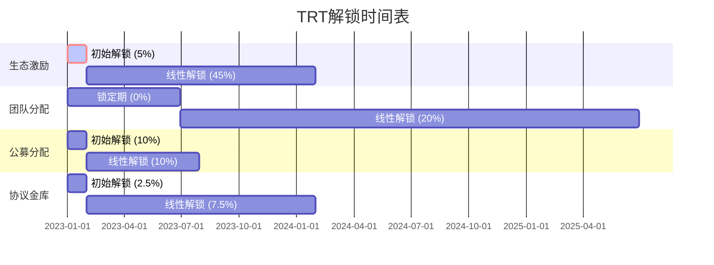

import { Callout, Cards, FileTree, Steps, Tabs } from 'nextra/components'

# Triplex 代币经济学 - Aptos 实现

<Callout type="info">
  Triplex 的代币经济学设计基于 Aptos 区块链实现，充分利用 Move 语言的资源安全特性和高性能交易处理能力，确保系统的可持续发展、公平参与和长期价值捕获。
</Callout>

## TRT 代币概览

### TRT 代币设计

```move
module triplex::trt_token {
    use std::error;
    use std::signer;
    use std::string;
    use std::option;
    use aptos_framework::fungible_asset::{Self, FungibleAsset, Metadata, Supply};
    use aptos_framework::object::{Self, Object, ExtendRef};
    use aptos_framework::primary_fungible_store;
    
    /// TRT代币详情常量
    const NAME: vector<u8> = b"Triplex Token";
    const SYMBOL: vector<u8> = b"TRT";
    const DECIMALS: u8 = 8;
    const ICON_URI: vector<u8> = b"https://triplex.finance/images/trt-logo.png";
    const PROJECT_URI: vector<u8> = b"https://triplex.finance";
    
    /// 总供应量：100,000,000 TRT (精度为8，所以这里是 100M * 10^8)
    const TOTAL_SUPPLY: u64 = 10000000000000000;
    
    /// 错误代码
    const ENOT_AUTHORIZED: u64 = 1;
    const EEXCEEDS_MAXIMUM_SUPPLY: u64 = 2;
    const ENOT_INITIALIZED: u64 = 3;
    const EZERO_AMOUNT: u64 = 4;
    
    /// TRT代币管理员权限
    struct TRTAdminCapability has key {
        extend_ref: ExtendRef,
        metadata: Object<Metadata>,
    }
    
    /// 初始化TRT代币
    public entry fun initialize(admin: &signer) {
        let admin_addr = signer::address_of(admin);
        
        // 创建代币元数据
        let constructor_ref = object::create_named_object(
            admin,
            NAME,
        );
        let object_signer = object::generate_signer(&constructor_ref);
        let extend_ref = object::generate_extend_ref(&constructor_ref);
        
        // 设置代币属性
        let metadata_object = fungible_asset::create_metadata(
            &object_signer,
            string::utf8(NAME),
            string::utf8(SYMBOL),
            DECIMALS,
            false, // 不可冻结
            false, // 不可直接转账
            string::utf8(ICON_URI),
            string::utf8(PROJECT_URI),
            option::none(), // 没有额外属性
        );
        
        // 初始化可变供应
        fungible_asset::initialize_supply(
            &object_signer, 
            option::some(TOTAL_SUPPLY)
        );
        
        // 创建管理员权限
        move_to(admin, TRTAdminCapability { 
            extend_ref,
            metadata: metadata_object,
        });
    }
    
    /// 铸造TRT代币
    public entry fun mint(
        admin: &signer,
        amount: u64,
        to: address
    ) acquires TRTAdminCapability {
        assert!(amount > 0, error::invalid_argument(EZERO_AMOUNT));
        
        // 验证发送者是否有铸币能力
        let admin_addr = signer::address_of(admin);
        assert!(exists<TRTAdminCapability>(admin_addr), error::permission_denied(ENOT_AUTHORIZED));
        
        let capability = borrow_global<TRTAdminCapability>(admin_addr);
        let admin_signer = object::generate_signer_for_extending(&capability.extend_ref);
        
        // 确保发行量不超过总供应量
        let current_supply = fungible_asset::supply(capability.metadata);
        let maximum_supply = fungible_asset::maximum_supply(capability.metadata);
        
        if (option::is_some(&maximum_supply)) {
            let max_supply = option::extract(&mut maximum_supply);
            assert!(
                current_supply + amount <= max_supply,
                error::invalid_argument(EEXCEEDS_MAXIMUM_SUPPLY)
            );
        };
        
        // 铸造代币并转入接收者账户
        let fa = fungible_asset::mint(&admin_signer, capability.metadata, amount);
        
        // 确保接收者有primary store
        if (!primary_fungible_store::store_exists(to, capability.metadata)) {
            primary_fungible_store::ensure_primary_store_exists(to, capability.metadata);
        };
        
        primary_fungible_store::deposit(to, fa);
    }
    
    /// 销毁TRT代币
    public entry fun burn(
        admin: &signer,
        from: address,
        amount: u64
    ) acquires TRTAdminCapability {
        assert!(amount > 0, error::invalid_argument(EZERO_AMOUNT));
        
        // 验证发送者是否有权限
        let admin_addr = signer::address_of(admin);
        assert!(exists<TRTAdminCapability>(admin_addr), error::permission_denied(ENOT_AUTHORIZED));
        
        let capability = borrow_global<TRTAdminCapability>(admin_addr);
        let admin_signer = object::generate_signer_for_extending(&capability.extend_ref);
        
        // 从用户账户提取代币
        let fa = primary_fungible_store::withdraw(from, capability.metadata, amount);
        
        // 销毁代币
        fungible_asset::burn(&admin_signer, fa);
    }
    
    /// 获取TRT代币供应量
    public fun get_supply(admin_addr: address): u64 acquires TRTAdminCapability {
        assert!(exists<TRTAdminCapability>(admin_addr), error::not_found(ENOT_AUTHORIZED));
        let capability = borrow_global<TRTAdminCapability>(admin_addr);
        fungible_asset::supply(capability.metadata)
    }
    
    /// 检查账户余额
    public fun balance(account: address, admin_addr: address): u64 acquires TRTAdminCapability {
        let capability = borrow_global<TRTAdminCapability>(admin_addr);
        if (primary_fungible_store::store_exists(account, capability.metadata)) {
            primary_fungible_store::balance(account, capability.metadata)
        } else {
            0
        }
    }
    
    #[test_only]
    use aptos_framework::account::create_account_for_test;
    
    #[test]
    fun test_initialize_and_mint() acquires TRTAdminCapability {
        // 设置测试环境
        let admin = create_account_for_test(@triplex);
        let user = create_account_for_test(@0x123);
        
        // 初始化代币
        initialize(&admin);
        
        // 铸造代币给用户
        mint(&admin, 1000 * 100000000, @0x123);
        
        // 检查余额
        let user_balance = balance(@0x123, @triplex);
        assert!(user_balance == 1000 * 100000000, 0);
        
        // 检查供应量
        let supply = get_supply(@triplex);
        assert!(supply == 1000 * 100000000, 1);
        
        // 销毁部分代币
        burn(&admin, @0x123, 500 * 100000000);
        
        // 验证余额和供应量更新
        let user_balance = balance(@0x123, @triplex);
        assert!(user_balance == 500 * 100000000, 2);
        
        let supply = get_supply(@triplex);
        assert!(supply == 500 * 100000000, 3);
    }
}
```

### 分配结构

<Cards>
  <Cards.Card title="生态激励" href="#生态激励">
    协议流动性、市场建设、生态发展
  </Cards.Card>
  <Cards.Card title="团队分配" href="#团队分配">
    核心团队、顾问、未来招募
  </Cards.Card>
  <Cards.Card title="公募分配" href="#公募分配">
    公开销售、社区轮、战略伙伴
  </Cards.Card>
  <Cards.Card title="协议金库" href="#协议金库">
    保险基金、持续开发、市场拓展
  </Cards.Card>
</Cards>

### 解锁机制



## 代币实用性

### 功能概览

<Tabs items={['治理', '质押奖励', '协议费用', '折扣']}>
  <Tabs.Tab>
    <Steps>
      1. **投票**
         - 提案投票权重
         - 委托投票
         - 提案创建要求
      
      2. **参数治理**
         - 风险参数调整
         - 费率结构更新
         - 新市场上线
      
      3. **协议升级**
         - 代码升级投票
         - 架构变更
         - 紧急修复
    </Steps>
  </Tabs.Tab>
  
  <Tabs.Tab>
    <Cards>
      <Cards.Card title="流动性提供" href="#质押奖励">
        质押获得流动性奖励
      </Cards.Card>
      <Cards.Card title="验证质押" href="#质押奖励">
        风险验证者角色
      </Cards.Card>
      <Cards.Card title="安全质押" href="#质押奖励">
        安全提案投票
      </Cards.Card>
    </Cards>
  </Tabs.Tab>
  
  <Tabs.Tab>
    <Steps>
      1. **支付渠道**
         - 交易手续费
         - 铸造费用
         - 高级功能访问
      
      2. **费用分配**
         - 质押者分成
         - 协议金库
         - 销毁机制
    </Steps>
  </Tabs.Tab>

  <Tabs.Tab>
<Cards>
      <Cards.Card title="手续费折扣" href="#折扣">
        持币享受交易折扣
  </Cards.Card>
      <Cards.Card title="保险费率" href="#折扣">
        保险费用优惠
  </Cards.Card>
      <Cards.Card title="高级功能" href="#折扣">
        独家功能访问权
  </Cards.Card>
</Cards>
  </Tabs.Tab>
</Tabs>

### 治理实现

```move
module triplex::governance {
    use std::signer;
    use std::vector;
    use std::error;
    use std::string::{Self, String};
    use aptos_framework::fungible_asset;
    use aptos_framework::timestamp;
    use aptos_framework::account;
    use aptos_framework::event::{Self, EventHandle};
    use aptos_std::table::{Self, Table};
    use aptos_std::simple_map::{Self, SimpleMap};
    use triplex::trt_token;
    
    /// 提案状态
    const PROPOSAL_STATUS_ACTIVE: u8 = 1;
    const PROPOSAL_STATUS_PASSED: u8 = 2;
    const PROPOSAL_STATUS_FAILED: u8 = 3;
    const PROPOSAL_STATUS_EXECUTED: u8 = 4;
    const PROPOSAL_STATUS_CANCELED: u8 = 5;
    
    /// 错误代码
    const EINSUFFICIENT_VOTING_POWER: u64 = 1;
    const EINVALID_PROPOSAL_STATUS: u64 = 2;
    const EVOTING_PERIOD_ENDED: u64 = 3;
    const EVOTING_PERIOD_NOT_ENDED: u64 = 4;
    const EALREADY_VOTED: u64 = 5;
    const EINVALID_QUORUM: u64 = 6;
    const EZERO_VOTING_PERIOD: u64 = 7;
    const EPROPOSAL_NOT_FOUND: u64 = 8;
    const EGOVERNANCE_NOT_INITIALIZED: u64 = 9;
    
    /// 提案结构
    struct Proposal has store, drop {
        id: u64,
        creator: address,
        description: String,
        execution_hash: vector<u8>,
        status: u8,
        created_at: u64,
        voting_ends_at: u64,
        for_votes: u64,
        against_votes: u64,
        quorum: u64,
    }
    
    /// 治理状态资源
    struct GovernanceStore has key {
        proposals: Table<u64, Proposal>,
        next_proposal_id: u64,
        // 投票记录 (proposal_id, voter) -> vote_direction
        votes: SimpleMap<vector<u8>, bool>,
        // 事件
        proposal_created_events: EventHandle<ProposalCreatedEvent>,
        voted_events: EventHandle<VotedEvent>,
        proposal_executed_events: EventHandle<ProposalExecutedEvent>,
        proposal_status_events: EventHandle<ProposalStatusEvent>,
    }
    
    /// 提案创建事件
    struct ProposalCreatedEvent has drop, store {
        proposal_id: u64,
        creator: address,
        description: String,
        voting_ends_at: u64,
    }
    
    /// 投票事件
    struct VotedEvent has drop, store {
        proposal_id: u64,
        voter: address,
        support: bool,
        voting_power: u64,
    }
    
    /// 提案执行事件
    struct ProposalExecutedEvent has drop, store {
        proposal_id: u64,
        executor: address,
    }
    
    /// 提案状态变更事件
    struct ProposalStatusEvent has drop, store {
        proposal_id: u64,
        old_status: u8,
        new_status: u8,
        timestamp: u64,
    }
    
    /// 初始化治理系统
    public entry fun initialize(admin: &signer) {
        let admin_addr = signer::address_of(admin);
        assert!(admin_addr == @triplex, error::permission_denied(EINSUFFICIENT_VOTING_POWER));
        
        if (!exists<GovernanceStore>(admin_addr)) {
            move_to(admin, GovernanceStore {
                proposals: table::new(),
                next_proposal_id: 1,
                votes: simple_map::create(),
                proposal_created_events: account::new_event_handle(admin),
                voted_events: account::new_event_handle(admin),
                proposal_executed_events: account::new_event_handle(admin),
                proposal_status_events: account::new_event_handle(admin),
            });
        };
    }
    
    /// 创建提案
    public entry fun create_proposal(
        creator: &signer,
        description: String,
        execution_hash: vector<u8>,
        voting_period: u64,
        quorum: u64
    ) acquires GovernanceStore {
        assert!(voting_period > 0, error::invalid_argument(EZERO_VOTING_PERIOD));
        assert!(quorum > 0, error::invalid_argument(EINVALID_QUORUM));
        
        let creator_addr = signer::address_of(creator);
        
        // 检查创建者是否持有足够TRT创建提案
        let creator_voting_power = get_voting_power(creator_addr);
        assert!(creator_voting_power >= 1000 * 100000000, // 至少1000 TRT (精度8)
               error::invalid_argument(EINSUFFICIENT_VOTING_POWER));
        
        assert!(exists<GovernanceStore>(@triplex), error::not_found(EGOVERNANCE_NOT_INITIALIZED));
        
        // 获取治理状态
        let governance_store = borrow_global_mut<GovernanceStore>(@triplex);
        
        // 创建新提案
        let proposal_id = governance_store.next_proposal_id;
        governance_store.next_proposal_id = proposal_id + 1;
        
        let now = timestamp::now_seconds();
        
        let proposal = Proposal {
            id: proposal_id,
            creator: creator_addr,
            description,
            execution_hash,
            status: PROPOSAL_STATUS_ACTIVE,
            created_at: now,
            voting_ends_at: now + voting_period,
            for_votes: 0,
            against_votes: 0,
            quorum,
        };
        
        // 存储提案
        table::add(&mut governance_store.proposals, proposal_id, proposal);
        
        // 发出事件
        event::emit_event(
            &mut governance_store.proposal_created_events,
            ProposalCreatedEvent {
                proposal_id,
                creator: creator_addr,
                description,
                voting_ends_at: now + voting_period,
            }
        );
    }
    
    /// 投票
    public entry fun vote(
        voter: &signer,
        proposal_id: u64,
        support: bool
    ) acquires GovernanceStore {
        assert!(exists<GovernanceStore>(@triplex), error::not_found(EGOVERNANCE_NOT_INITIALIZED));
        
        let voter_addr = signer::address_of(voter);
        let governance_store = borrow_global_mut<GovernanceStore>(@triplex);
        
        // 检查提案存在且状态为活跃
        assert!(table::contains(&governance_store.proposals, proposal_id), 
               error::not_found(EPROPOSAL_NOT_FOUND));
        
        let proposal = table::borrow_mut(&mut governance_store.proposals, proposal_id);
        assert!(proposal.status == PROPOSAL_STATUS_ACTIVE, 
               error::invalid_state(EINVALID_PROPOSAL_STATUS));
        
        // 检查投票期限未结束
        let now = timestamp::now_seconds();
        assert!(now <= proposal.voting_ends_at,
               error::invalid_state(EVOTING_PERIOD_ENDED));
        
        // 确保用户未投票
        let vote_key = get_vote_key(proposal_id, voter_addr);
        assert!(!simple_map::contains_key(&governance_store.votes, &vote_key),
               error::already_exists(EALREADY_VOTED));
        
        // 获取投票权重
        let voting_power = get_voting_power(voter_addr);
        assert!(voting_power > 0, error::invalid_argument(EINSUFFICIENT_VOTING_POWER));
        
        // 记录投票
        simple_map::add(&mut governance_store.votes, vote_key, support);
        
        // 更新投票计数
        if (support) {
            proposal.for_votes = proposal.for_votes + voting_power;
        } else {
            proposal.against_votes = proposal.against_votes + voting_power;
        };
        
        // 发出事件
        event::emit_event(
            &mut governance_store.voted_events,
            VotedEvent {
                proposal_id,
                voter: voter_addr,
                support,
                voting_power,
            }
        );
    }
    
    /// 结束投票
    public entry fun finalize_proposal(
        admin: &signer,
        proposal_id: u64
    ) acquires GovernanceStore {
        assert!(exists<GovernanceStore>(@triplex), error::not_found(EGOVERNANCE_NOT_INITIALIZED));
        
        let admin_addr = signer::address_of(admin);
        assert!(admin_addr == @triplex, error::permission_denied(EINSUFFICIENT_VOTING_POWER));
        
        let governance_store = borrow_global_mut<GovernanceStore>(@triplex);
        
        // 检查提案存在
        assert!(table::contains(&governance_store.proposals, proposal_id), 
               error::not_found(EPROPOSAL_NOT_FOUND));
        
        let proposal = table::borrow_mut(&mut governance_store.proposals, proposal_id);
        
        // 确保提案状态为活跃
        assert!(proposal.status == PROPOSAL_STATUS_ACTIVE, 
               error::invalid_state(EINVALID_PROPOSAL_STATUS));
        
        // 检查投票期限已结束
        let now = timestamp::now_seconds();
        assert!(now > proposal.voting_ends_at,
               error::invalid_state(EVOTING_PERIOD_NOT_ENDED));
        
        let old_status = proposal.status;
        
        // 计算投票结果
        let total_votes = proposal.for_votes + proposal.against_votes;
        
        // 是否达到法定人数
        if (total_votes >= proposal.quorum) {
            // 赞成票是否超过反对票
            if (proposal.for_votes > proposal.against_votes) {
                proposal.status = PROPOSAL_STATUS_PASSED;
            } else {
                proposal.status = PROPOSAL_STATUS_FAILED;
            }
        } else {
            proposal.status = PROPOSAL_STATUS_FAILED;
        };
        
        // 发出状态变更事件
        event::emit_event(
            &mut governance_store.proposal_status_events,
            ProposalStatusEvent {
                proposal_id,
                old_status,
                new_status: proposal.status,
                timestamp: now,
            }
        );
    }
    
    /// 执行提案
    public entry fun execute_proposal(
        executor: &signer,
        proposal_id: u64
    ) acquires GovernanceStore {
        assert!(exists<GovernanceStore>(@triplex), error::not_found(EGOVERNANCE_NOT_INITIALIZED));
        
        let executor_addr = signer::address_of(executor);
        let governance_store = borrow_global_mut<GovernanceStore>(@triplex);
        
        // 检查提案存在
        assert!(table::contains(&governance_store.proposals, proposal_id), 
               error::not_found(EPROPOSAL_NOT_FOUND));
        
        let proposal = table::borrow_mut(&mut governance_store.proposals, proposal_id);
        
        // 确保提案已通过但未执行
        assert!(proposal.status == PROPOSAL_STATUS_PASSED, 
               error::invalid_state(EINVALID_PROPOSAL_STATUS));
        
        let old_status = proposal.status;
        proposal.status = PROPOSAL_STATUS_EXECUTED;
        
        // 发出执行事件
        event::emit_event(
            &mut governance_store.proposal_executed_events,
            ProposalExecutedEvent {
                proposal_id,
                executor: executor_addr,
            }
        );
        
        // 发出状态变更事件
        event::emit_event(
            &mut governance_store.proposal_status_events,
            ProposalStatusEvent {
                proposal_id,
                old_status,
                new_status: proposal.status,
                timestamp: timestamp::now_seconds(),
            }
        );
        
        // 实际执行提案的逻辑由链下系统解析execution_hash后执行
    }
    
    /// 获取投票权重
    public fun get_voting_power(voter: address): u64 {
        // 实际实现可能包括质押、历史锁定等因素
        // 此处仅基于TRT余额计算
        if (voter == @triplex) {
            return 10000 * 100000000 // 管理员特权
        };
        
        trt_token::balance(voter, @triplex)
    }
    
    /// 生成投票记录键
    fun get_vote_key(proposal_id: u64, voter: address): vector<u8> {
        let key = vector::empty<u8>();
        vector::append(&mut key, bcs::to_bytes(&proposal_id));
        vector::append(&mut key, bcs::to_bytes(&voter));
        key
    }
    
    /// 查询提案
    public fun get_proposal(proposal_id: u64): Proposal acquires GovernanceStore {
        assert!(exists<GovernanceStore>(@triplex), error::not_found(EGOVERNANCE_NOT_INITIALIZED));
        
        let governance_store = borrow_global<GovernanceStore>(@triplex);
        assert!(table::contains(&governance_store.proposals, proposal_id), 
               error::not_found(EPROPOSAL_NOT_FOUND));
        
        *table::borrow(&governance_store.proposals, proposal_id)
    }
    
    #[test_only]
    use aptos_framework::account::create_account_for_test;
    
    #[test]
    fun test_governance_flow() acquires GovernanceStore {
        // 设置测试环境
        let admin = create_account_for_test(@triplex);
        let user1 = create_account_for_test(@0x111);
        let user2 = create_account_for_test(@0x222);
        
        // 初始化治理系统
        initialize(&admin);
        
        // 创建提案
        let description = string::utf8(b"Test Proposal");
        let execution_hash = x"1234";
        let voting_period = 86400; // 1天
        let quorum = 2000 * 100000000; // 2000 TRT
        
        // 因为用户没有足够的投票权，创建应该失败
        // 注意：在测试中我们无法捕获错误，所以这部分逻辑略过
        
        // 因为管理员有10000 TRT的投票权，创建应该成功
        create_proposal(&admin, description, execution_hash, voting_period, quorum);
        
        // 验证提案创建成功
        let proposal = get_proposal(1);
        assert!(proposal.id == 1, 0);
        assert!(proposal.status == PROPOSAL_STATUS_ACTIVE, 1);
        
        // 投票
        vote(&admin, 1, true);
        
        // 检查票数更新
        let proposal = get_proposal(1);
        assert!(proposal.for_votes == 10000 * 100000000, 2);
        
        // 在测试中，我们无法等待投票期结束，所以这里直接调用finalize
        // 在真实场景中，需要等待voting_period结束
        finalize_proposal(&admin, 1);
        
        // 检查提案状态变更为通过
        let proposal = get_proposal(1);
        assert!(proposal.status == PROPOSAL_STATUS_PASSED, 3);
        
        // 执行提案
        execute_proposal(&admin, 1);
        
        // 检查提案状态变更为已执行
        let proposal = get_proposal(1);
        assert!(proposal.status == PROPOSAL_STATUS_EXECUTED, 4);
    }
}
```

## 代币经济机制

### 通缩与通胀平衡

<Tabs items={['销毁机制', '增发控制', '价值捕获']}>
  <Tabs.Tab>
    <Cards>
      <Cards.Card title="手续费销毁" href="#销毁机制">
        交易费用部分销毁
      </Cards.Card>
      <Cards.Card title="回购销毁" href="#销毁机制">
        协议利润回购销毁
      </Cards.Card>
      <Cards.Card title="事件触发" href="#销毁机制">
        特定条件下触发销毁
      </Cards.Card>
    </Cards>
  </Tabs.Tab>
  
  <Tabs.Tab>
    <Steps>
      1. **限制条件**
         - 最大增发率
         - 触发门槛
         - 治理投票
      
      2. **用途限制**
         - 激励专用
         - 安全储备
         - 生态建设
    </Steps>
  </Tabs.Tab>
  
  <Tabs.Tab>
    <Cards>
      <Cards.Card title="价值分享" href="#价值捕获">
        协议收入分配给TRT持有者
      </Cards.Card>
      <Cards.Card title="积分权重" href="#价值捕获">
        活跃用户评分系统
      </Cards.Card>
      <Cards.Card title="引导流动性" href="#价值捕获">
        激励机制设计
      </Cards.Card>
    </Cards>
  </Tabs.Tab>
</Tabs>

### 激励设计

<Callout type="warning">
  激励设计基于 Aptos 链上的高效交易处理和 Move 语言的资源安全特性，实现更精确的用户行为引导和无损奖励分发。
</Callout>

```move
module triplex::incentives {
    use std::signer;
    use std::vector;
    use aptos_framework::timestamp;
    use aptos_framework::event;
    use aptos_std::table::{Self, Table};
    use triplex::trt_token;
    
    /// 激励类型常量
    const INCENTIVE_TYPE_LIQUIDITY: u8 = 1;
    const INCENTIVE_TYPE_TRADING: u8 = 2;
    const INCENTIVE_TYPE_STAKING: u8 = 3;
    
    /// 池激励配置
    struct PoolIncentive has store {
        pool_id: u64,
        rewards_per_second: u64,
        last_update_time: u64,
        reward_index: u128,
        total_staked: u64,
    }
    
    /// 用户在池中的状态
    struct UserPoolState has store, drop {
        reward_debt: u64,
        staked_amount: u64,
        user_reward_index: u128,
    }
    
    /// 激励管理器
    struct IncentiveManager has key {
        // 激励池配置
        pool_incentives: Table<u64, PoolIncentive>,
        // 用户状态
        user_states: Table<vector<u8>, UserPoolState>, // 用户地址 + 池ID -> 状态
        // 每周分发总量
        weekly_distribution: u64,
        // 最后重置时间
        last_reset_time: u64,
        // 事件
        reward_distributed_events: event::EventHandle<RewardDistributedEvent>,
    }
    
    /// 奖励分发事件
    struct RewardDistributedEvent has drop, store {
        user: address,
        pool_id: u64,
        amount: u64,
        timestamp: u64,
    }
    
    /// 质押到激励池
    public fun stake(
        user: &signer,
        pool_id: u64,
        amount: u64
    ) acquires IncentiveManager {
        let user_addr = signer::address_of(user);
        let incentive_manager = borrow_global_mut<IncentiveManager>(@triplex);
        
        // 更新池状态
        update_pool(pool_id);
        
        // 获取用户在该池的状态
        let user_key = get_user_key(user_addr, pool_id);
        
        if (!table::contains(&incentive_manager.user_states, user_key)) {
            // 新用户，初始化状态
            table::add(&mut incentive_manager.user_states, user_key, UserPoolState {
                reward_debt: 0,
                staked_amount: 0,
                user_reward_index: 0,
            });
        };
        
        // 获取用户状态和池状态
        let user_state = table::borrow_mut(&mut incentive_manager.user_states, user_key);
        let pool = table::borrow_mut(&mut incentive_manager.pool_incentives, pool_id);
        
        // 如果用户已有质押，先结算应得奖励
        if (user_state.staked_amount > 0) {
            let pending_reward = calculate_rewards(user_state, pool);
            if (pending_reward > 0) {
                distribute_reward(user_addr, pool_id, pending_reward);
            };
        };
        
        // 更新用户状态
        user_state.staked_amount = user_state.staked_amount + amount;
        user_state.user_reward_index = pool.reward_index;
        user_state.reward_debt = (((user_state.staked_amount as u128) * pool.reward_index) >> 64) as u64;
        
        // 更新池总质押量
        pool.total_staked = pool.total_staked + amount;
    }
    
    /// 计算用户奖励
    fun calculate_rewards(
        user_state: &UserPoolState,
        pool: &PoolIncentive
    ): u64 {
        if (user_state.staked_amount == 0) {
            return 0
        };
        
        // 计算应得奖励
        let accumulated_rewards = (((user_state.staked_amount as u128) * 
                                   (pool.reward_index - user_state.user_reward_index)) >> 64) as u64;
        
        accumulated_rewards
    }
    
    /// 更新池状态
    fun update_pool(pool_id: u64) acquires IncentiveManager {
        let incentive_manager = borrow_global_mut<IncentiveManager>(@triplex);
        
        // 确认池存在
        assert!(table::contains(&incentive_manager.pool_incentives, pool_id), 1);
        
        let pool = table::borrow_mut(&mut incentive_manager.pool_incentives, pool_id);
        let now = timestamp::now_seconds();
        
        // 如果池中没有质押或者上次更新时间是当前时间，不更新
        if (pool.total_staked == 0 || pool.last_update_time == now) {
            return
        };
        
        // 计算时间差
        let time_elapsed = now - pool.last_update_time;
        
        // 计算产生的奖励
        let rewards = time_elapsed * pool.rewards_per_second;
        
        // 如果总质押量大于0，更新奖励指数
        if (pool.total_staked > 0) {
            pool.reward_index = pool.reward_index + (((rewards as u128) << 64) / (pool.total_staked as u128));
        };
        
        // 更新最后更新时间
        pool.last_update_time = now;
    }
    
    /// 分发奖励
    fun distribute_reward(user: address, pool_id: u64, amount: u64) acquires IncentiveManager {
        let incentive_manager = borrow_global_mut<IncentiveManager>(@triplex);
        
        // 铸造TRT奖励给用户
        // 在实际实现中，这里应该调用TRT代币合约的mint函数
        
        // 记录事件
        event::emit_event(
            &mut incentive_manager.reward_distributed_events,
            RewardDistributedEvent {
                user,
                pool_id,
                amount,
                timestamp: timestamp::now_seconds(),
            }
        );
    }
    
    /// 生成用户键
    fun get_user_key(user: address, pool_id: u64): vector<u8> {
        let key = vector::empty<u8>();
        vector::append(&mut key, bcs::to_bytes(&user));
        vector::append(&mut key, bcs::to_bytes(&pool_id));
        key
    }
}
```

### 流动性挖矿

<Cards>
  <Cards.Card title="单边质押" href="#单边质押">
    TRT单币质押机制
  </Cards.Card>
  <Cards.Card title="LP质押" href="#lp质押">
    流动性提供奖励
  </Cards.Card>
  <Cards.Card title="合成资产挖矿" href="#合成资产挖矿">
    合成资产相关奖励
  </Cards.Card>
  <Cards.Card title="交易挖矿" href="#交易挖矿">
    基于交易量的奖励
  </Cards.Card>
</Cards>

## 金库管理

<Callout type="info">
  Triplex 在 Aptos 链上通过资源账户管理协议金库，确保多层治理保障和高透明度。
</Callout>

### 金库架构

<FileTree>
  <FileTree.Folder name="Treasury System" defaultOpen>
    <FileTree.Folder name="Resource Accounts" defaultOpen>
      <FileTree.File name="main_treasury.move" />
      <FileTree.File name="insurance_fund.move" />
      <FileTree.File name="development_fund.move" />
    </FileTree.Folder>
    <FileTree.Folder name="Management">
      <FileTree.File name="treasury_governance.move" />
      <FileTree.File name="spending_control.move" />
      <FileTree.File name="investment_strategy.move" />
    </FileTree.Folder>
  </FileTree.Folder>
</FileTree>

### 收入分配

    <Steps>
  1. **费用收入**
     - 交易手续费
     - 特殊服务费
     - 清算费用
  
  2. **分配机制**
     - TRT质押者分红
     - 保险基金增强
     - 开发基金支持
  
  3. **社区福利**
     - 社区活动奖励
     - 公共产品支持
     - 生态系统扩展
</Steps>

### 透明度与问责

<Tabs items={['收支透明', '治理控制', '绩效指标']}>
  <Tabs.Tab>
    <Cards>
      <Cards.Card title="链上数据" href="#收支透明">
        公开可查的预算使用
      </Cards.Card>
      <Cards.Card title="定期报告" href="#收支透明">
        金库状态报告
      </Cards.Card>
      <Cards.Card title="审计追踪" href="#收支透明">
        完整资金流向审计
      </Cards.Card>
    </Cards>
  </Tabs.Tab>
  
  <Tabs.Tab>
    <Steps>
      1. **支出批准**
         - 多签要求
         - 大额支出投票
         - 用途限制
      
      2. **参数调整**
         - 分配比例治理
         - 投资策略调整
         - 预算规划
    </Steps>
  </Tabs.Tab>
  
  <Tabs.Tab>
    <Cards>
      <Cards.Card title="增长指标" href="#绩效指标">
        用户增长与留存
      </Cards.Card>
      <Cards.Card title="效率指标" href="#绩效指标">
        资金利用效率评估
      </Cards.Card>
      <Cards.Card title="回报指标" href="#绩效指标">
        投资回报与价值增长
      </Cards.Card>
    </Cards>
  </Tabs.Tab>
</Tabs>