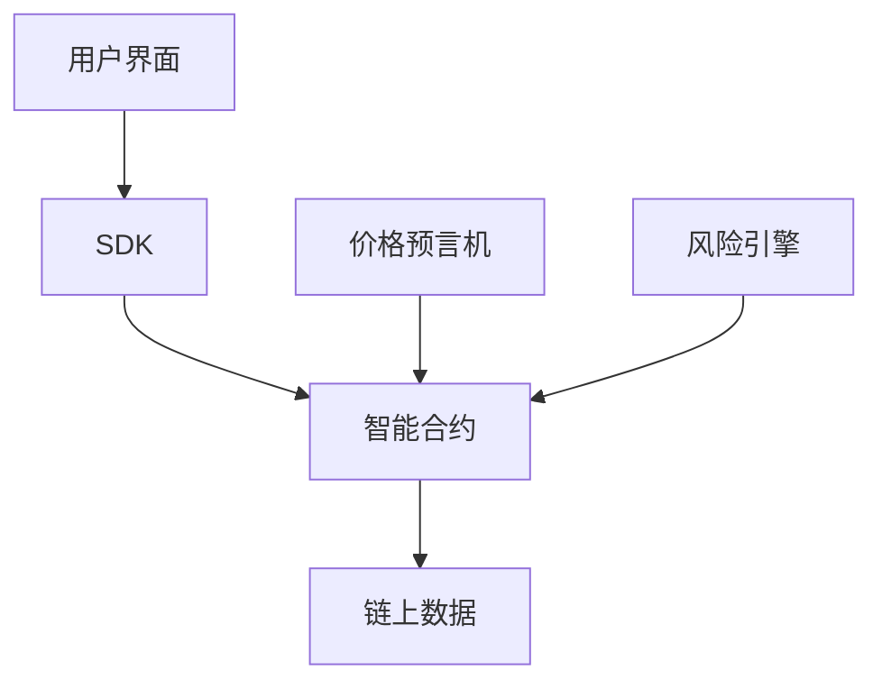

# 开发者概览

## 简介

Triplex为开发者提供了完整的工具集，用于构建去中心化永续合约交易应用。本文档将帮助您了解如何使用Triplex协议进行开发和集成。

## 核心功能

- 永续合约交易
- 跨保证金交易
- 自动化做市
- 风险管理系统
- 价格预言机集成

## 技术架构

## 开发资源

### 代码仓库
- [Triplex Core](https://github.com/your-org/triplex-core)
- [Triplex SDK](https://github.com/your-org/triplex-sdk)
- [示例应用](https://github.com/your-org/triplex-examples)

### 文档
- [集成指南](/fordevelopers/integration)
- [API参考](/fordevelopers/api)
- [智能合约文档](https://docs.triplex.io/contracts)

## 开发环境

### 测试网络
- Sepolia Testnet
- Goerli Testnet

### 主网
- Ethereum Mainnet
- Layer 2 解决方案支持

## 技术支持

- Discord: [Triplex开发者社区](https://discord.gg/triplex)
- GitHub Issues: [问题追踪](https://github.com/your-org/triplex/issues)
- 邮件支持: dev@triplex.io 