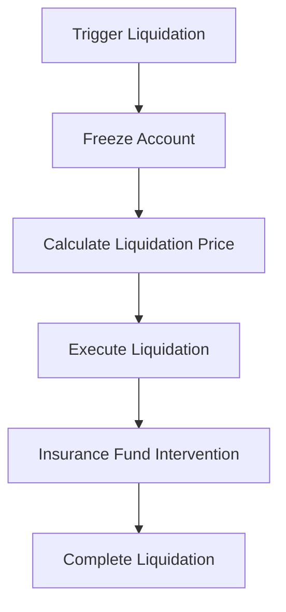

# Protocol Mechanism

## Trading Mechanism

### Perpetual Contract Basics
A perpetual contract is a derivative contract without an expiry date, which anchors the contract price to the spot price through a funding rate mechanism.

### Price Formation
- Mark Price
- Index Price
- Fair Price
- Estimated Liquidation Price

### Order Types
1. **Limit Orders**
   - Specify price and quantity
   - Customizable execution strategies
   - Support for Post-only

2. **Market Orders**
   - Immediate execution
   - Slippage protection
   - Best price execution

3. **Conditional Orders**
   - Take-profit/Stop-loss
   - Trailing stop
   - Iceberg orders

## Funding Rate

### Calculation Formula
Funding Rate = Base Rate + Premium Index × (Long Position Size - Short Position Size) / Total Position Size

### Settlement Cycle
- 8-hour settlement intervals
- Real-time estimated rate display
- Automated settlement process

### Rate Limits
- Maximum positive rate: 0.375%
- Maximum negative rate: -0.375%
- Dynamic adjustment mechanism

## Margin System

### Initial Margin
- Minimum requirement: 2%
- Leverage-based adjustments
- Tiered margin requirements

### Maintenance Margin
- Minimum requirement: 1%
- Dynamic adjustment mechanism
- Risk level classification

### Margin Calls
- Warning mechanism
- Automated top-up process
- Manual top-up options

## Liquidation Mechanism

### Trigger Conditions
1. Account equity below maintenance margin
2. Severe market volatility
3. System risk alerts

### Liquidation Process

### Insurance Fund
- Funding sources
- Usage rules
- Replenishment mechanism

## Liquidity Mechanism

### AMM Model
- Constant product formula
- Dynamic pricing curve
- Slippage calculation

### Liquidity Provision
- LP token mechanism
- Revenue distribution
- Risk control

### Depth Management
- Multi-tier liquidity pools
- Dynamic adjustment mechanism
- Incentive mechanism

## Oracle System

### Price Sources
- On-chain oracles
- Exchange APIs
- Decentralized oracle networks

### Price Updates
- Update frequency
- Delay handling
- Anomaly detection

### Failure Protection
- Backup price sources
- Price deviation protection
- Emergency pause mechanism

## Fee Mechanism

### Fee Types
1. **Trading Fees**
   - Opening position fees
   - Closing position fees
   - Fee discounts

2. **Other Fees**
   - Withdrawal fees
   - Liquidation fees
   - Protocol fees

### Fee Distribution
- Liquidity providers
- Insurance fund
- Protocol treasury

## Governance Mechanism

### Parameter Adjustment
- Funding rate parameters
- Margin requirements
- Fee rates

### Emergency Handling
- Trading suspension
- Forced liquidation
- Emergency upgrades

### Upgrade Mechanism
- Proposal process
- Voting mechanism
- Implementation schedule 