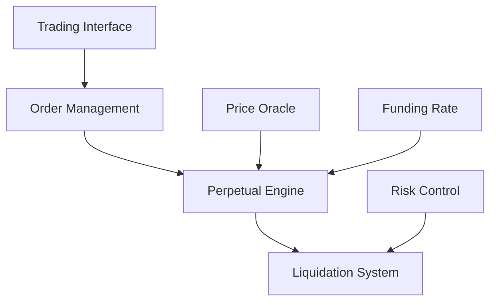

# Triplex Perpetual Protocol Overview

## Introduction

Triplex Perpetual Protocol is a decentralized perpetual futures trading protocol that provides users with efficient and secure leveraged cryptocurrency trading services. The protocol employs innovative mechanism designs to ensure trading fairness and system sustainability.

## Core Features

### Perpetual Trading
- Support for multiple cryptocurrency trading pairs
- Up to 50x leverage
- Flexible margin management
- Real-time market price feedback

### Funding Rate Mechanism
- Dynamic funding rate adjustment
- 8-hour settlement cycle
- Market-driven rate calculation
- Transparent rate display

### Liquidity Provision
- Automated Market Maker (AMM) mechanism
- Liquidity provider incentives
- Dynamic pricing curve
- Multi-tier liquidity pools

### Risk Management
- Real-time risk monitoring
- Automated liquidation mechanism
- Insurance fund protection
- Price deviation protection

## Technical Architecture

## Market Participants

### Traders
- Open long/short positions
- Set take-profit/stop-loss orders
- Manage margin
- Execute trading strategies

### Liquidity Providers
- Provide trading depth
- Earn trading fees
- Participate in liquidity mining
- Manage liquidity risks

### Insurance Fund
- Prevent systemic risks
- Compensate forced liquidation losses
- Maintain market stability
- Fee distribution mechanism

## Product Advantages

1. **Security**
   - Smart contract audits
   - Multiple security mechanisms
   - Transparent operations

2. **Efficiency**
   - Low-latency trade execution
   - Optimized matching engine
   - High-performance backend

3. **Fairness**
   - Unified pricing mechanism
   - Transparent fee structure
   - Fair liquidation process

4. **Scalability**
   - Modular architecture
   - Cross-chain compatibility
   - Upgradeable contracts

## Development Roadmap

### Current Stage
- Basic perpetual contract functionality
- Major trading pair support
- Basic risk management system

### Near-term Plans
- Additional trading pair support
- Advanced order types
- Enhanced risk management

### Long-term Vision
- Cross-chain integration
- Innovative product development
- Ecosystem expansion

## Additional Resources

- [Protocol Mechanism](/perpsDoc/mechanism)
- [Risk Management](/perpsDoc/risk)
- [Developer Documentation](/fordevelopers/overview)
- [GitHub Repository](https://github.com/your-org/triplex) 