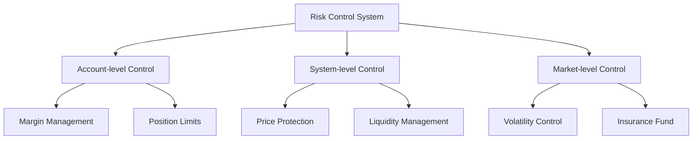

# Risk Management

## Risk Control System

### Multi-layer Risk Protection

## Account Risk Management

### Margin System
1. **Initial Margin Requirements**
   - Base margin rate
   - Dynamic adjustment mechanism
   - Tiered margin requirements

2. **Maintenance Margin Requirements**
   - Minimum maintenance margin
   - Risk level classification
   - Warning mechanism

3. **Margin Call Process**
   - Warning notifications
   - Top-up timeframe
   - Automated top-up options

### Position Limits
- Maximum position per account
- Maximum position per market
- Leverage limits

## Liquidation Mechanism

### Liquidation Triggers
- Account equity below maintenance margin
- Severe market volatility
- System risk alerts

### Liquidation Process
1. Risk warning
2. Account freeze
3. Liquidation price calculation
4. Position closure
5. Margin processing
6. Liquidation confirmation

### Partial Liquidation
- Trigger conditions
- Execution priority
- Margin allocation

## Price Protection Mechanism

### Price Sources
- Multi-source price aggregation
- Outlier filtering
- Dynamic weight adjustment

### Price Updates
- Real-time update mechanism
- Delay protection
- Backup solutions

### Price Deviation Protection
- Maximum deviation limits
- Automatic suspension mechanism
- Recovery process

## Liquidity Risk Management

### Liquidity Monitoring
- Real-time depth monitoring
- Liquidity alerts
- Automated intervention mechanism

### Liquidity Provider Management
- LP qualification requirements
- Risk limits
- Incentive mechanisms

### Emergency Liquidity Plans
- Backup liquidity pools
- Emergency liquidity provision
- Market intervention mechanisms

## System Risk Control

### Trading Restrictions
- Maximum order size
- Price fluctuation limits
- Trading frequency limits

### System Capacity Management
- Order queue management
- System load monitoring
- Automatic scaling mechanism

### Emergency Response
- Trading suspension triggers
- System degradation plans
- Recovery procedures

## Insurance Fund

### Fund Management
- Funding sources
- Usage rules
- Size management

### Dynamic Adjustment
- Risk assessment
- Rate adjustment
- Replenishment mechanism

### Usage Process
- Trigger conditions
- Fund allocation
- Record tracking

## Risk Monitoring System

### Real-time Monitoring
- Key metrics monitoring
- Anomaly detection
- Alert system

### Risk Reporting
- Daily risk reports
- Incident analysis
- Improvement suggestions

### Emergency Plans
- Plan classification
- Response procedures
- Recovery mechanisms

## Governance and Upgrades

### Risk Parameter Governance
- Parameter adjustment process
- Community voting
- Implementation timeline

### System Upgrades
- Upgrade proposals
- Security audits
- Phased implementation

### Emergency Handling
- Emergency committee
- Rapid decision mechanism
- Follow-up tracking 