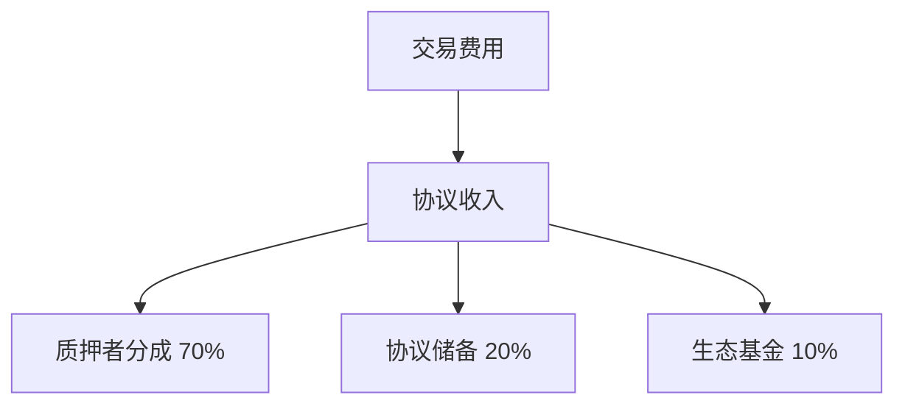
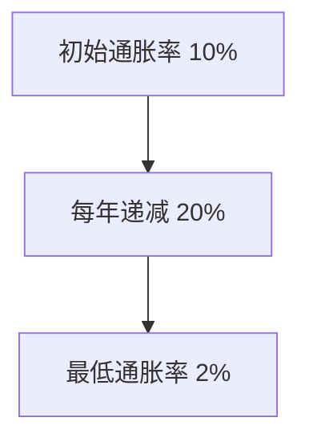

import { Callout } from 'nextra/components'

# TRT 质押奖励机制

TRT 质押者可以获得多种形式的奖励。本页面将详细介绍各种奖励机制。

## 奖励总览

<div className="mt-4 grid grid-cols-1 gap-4 sm:grid-cols-3">
  <div className="p-4 border rounded-lg bg-gradient-to-br from-blue-50 to-blue-100 dark:from-blue-900 dark:to-blue-800">
    <h3 className="font-semibold">📊 协议费用分成</h3>
    <p className="text-sm mt-2">当前年化：~8-12%</p>
    <p className="text-xs mt-1 text-gray-600">每周自动发放</p>
  </div>
  
  <div className="p-4 border rounded-lg bg-gradient-to-br from-green-50 to-green-100 dark:from-green-900 dark:to-green-800">
    <h3 className="font-semibold">🌱 通胀奖励</h3>
    <p className="text-sm mt-2">当前年化：~5-8%</p>
    <p className="text-xs mt-1 text-gray-600">实时累积</p>
  </div>
  
  <div className="p-4 border rounded-lg bg-gradient-to-br from-purple-50 to-purple-100 dark:from-purple-900 dark:to-purple-800">
    <h3 className="font-semibold">🎁 额外激励</h3>
    <p className="text-sm mt-2">不定期发放</p>
    <p className="text-xs mt-1 text-gray-600">活动奖励</p>
  </div>
</div>

## 奖励来源详解

### 协议费用分成

来自交易费用的分成按以下规则分配：



#### 分配规则
- 按质押比例分配
- 每周自动发放
- 无需手动领取

### 通胀奖励

通胀奖励采用递减模型：



#### 计算方式
- 基于质押时长
- 考虑质押金额
- 实时累积更新

### 额外激励

包括以下类型：
- 特殊活动奖励
- 治理投票奖励
- 生态建设奖励

#### 发放规则
- 根据活动规则
- 完成指定任务
- 社区贡献度

## 奖励计算公式

<div className="p-6 bg-gray-50 dark:bg-neutral-900 rounded-lg">
  <h3 className="font-semibold mb-4">基础年化收益率计算</h3>
  
  ```
  基础年化收益率 = 协议费用收益率 + 通胀奖励率
  ```
  
  <div className="mt-4 p-4 border rounded bg-white dark:bg-neutral-800">
    <h4 className="font-medium mb-2">示例计算</h4>
    <pre className="text-sm">
      协议费用收益率: 10%
      通胀奖励率: 6%
      基础年化收益率 = 10% + 6% = 16%
    </pre>
  </div>
</div>

### 实际收益计算

<div className="mt-4 space-y-4">
  <div className="p-4 border rounded-lg">
    <h4 className="font-semibold">短期质押（7天）</h4>
    ```
    收益 = 质押金额 × (年化率 ÷ 365 × 7)
    ```
    示例：10,000 TRT，年化 16%
    ```
    收益 = 10,000 × (16% ÷ 365 × 7) = 30.68 TRT
    ```
  </div>
  
  <div className="p-4 border rounded-lg">
    <h4 className="font-semibold">长期质押（365天）</h4>
    ```
    收益 = 质押金额 × 年化率
    ```
    示例：10,000 TRT，年化 16%
    ```
    收益 = 10,000 × 16% = 1,600 TRT
    ```
  </div>
</div>

## 影响因素

<div className="mt-4 grid grid-cols-1 gap-4 sm:grid-cols-2">
  <div className="p-4 border rounded-lg">
    <h3 className="font-semibold mb-2">📈 质押规模</h3>
    <ul className="list-disc list-inside text-sm">
      <li>最低质押：100 TRT</li>
      <li>质押金额越大，获得的奖励比例越高</li>
      <li>大额质押可获得额外奖励</li>
    </ul>
  </div>
  
  <div className="p-4 border rounded-lg">
    <h3 className="font-semibold mb-2">⏳ 质押时长</h3>
    <ul className="list-disc list-inside text-sm">
      <li>最短锁定：7天</li>
      <li>长期质押可获得额外奖励</li>
      <li>锁定期越长，奖励越高</li>
    </ul>
  </div>
</div>

## 市场条件影响

<div className="mt-4 p-4 border rounded-lg">
  <h3 className="font-semibold mb-4">影响收益的市场因素</h3>
  
  ```mermaid
  graph LR
    A[协议使用率] --> D[实际收益]
    B[TRT价格波动] --> D
    C[质押总量] --> D
  ```
</div>

<Callout type="warning">
收益率会随市场情况动态调整，不构成任何投资建议。
</Callout>

## 领取奖励

### 自动发放的奖励
- 协议费用奖励每周自动发放到质押者地址
- 发放时间：每周一 UTC 00:00
- 无需手动操作

### 需要手动领取的奖励

<div className="mt-4 grid grid-cols-1 gap-4 sm:grid-cols-3">
  <div className="p-4 border rounded-lg">
    <h4 className="font-semibold">🌱 通胀奖励</h4>
    <p className="text-sm mt-2">实时累积，随时可领</p>
  </div>
  
  <div className="p-4 border rounded-lg">
    <h4 className="font-semibold">🎁 活动奖励</h4>
    <p className="text-sm mt-2">完成活动后领取</p>
  </div>
  
  <div className="p-4 border rounded-lg">
    <h4 className="font-semibold">🏛️ 治理奖励</h4>
    <p className="text-sm mt-2">参与投票后领取</p>
  </div>
</div>

<Callout>
建议在奖励累积到一定数量后再领取，以节省 gas 费用。
</Callout>

## 下一步

<div className="mt-4 flex space-x-4">
  <a
    href="../calculator"
    className="flex-1 p-4 border rounded-lg hover:border-gray-300 dark:hover:border-neutral-700"
  >
    <h3 className="font-semibold">使用计算器 →</h3>
    <p className="text-sm text-gray-600">计算您的预期质押收益</p>
  </a>
  
  <a
    href="../faq"
    className="flex-1 p-4 border rounded-lg hover:border-gray-300 dark:hover:border-neutral-700"
  >
    <h3 className="font-semibold">常见问题 →</h3>
    <p className="text-sm text-gray-600">了解更多关于奖励的问题</p>
  </a>
</div> 