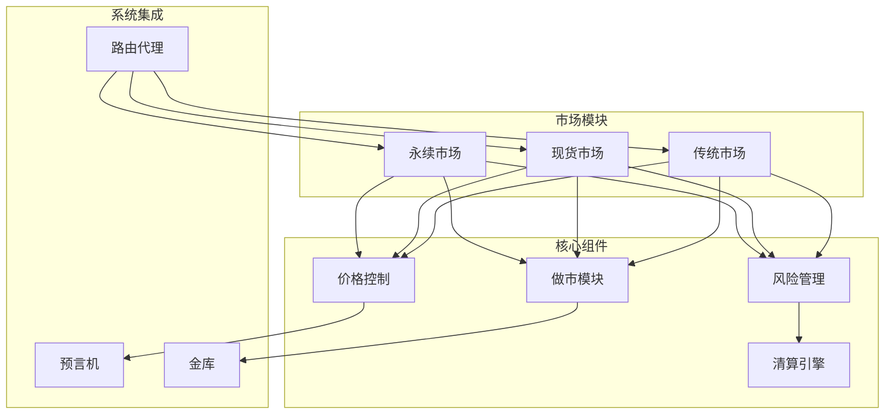
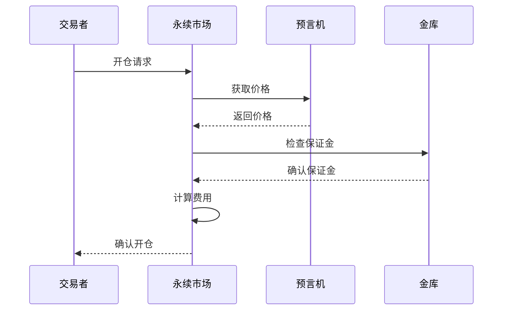
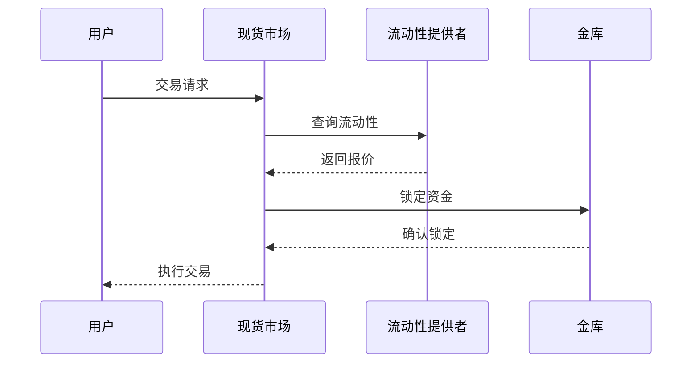
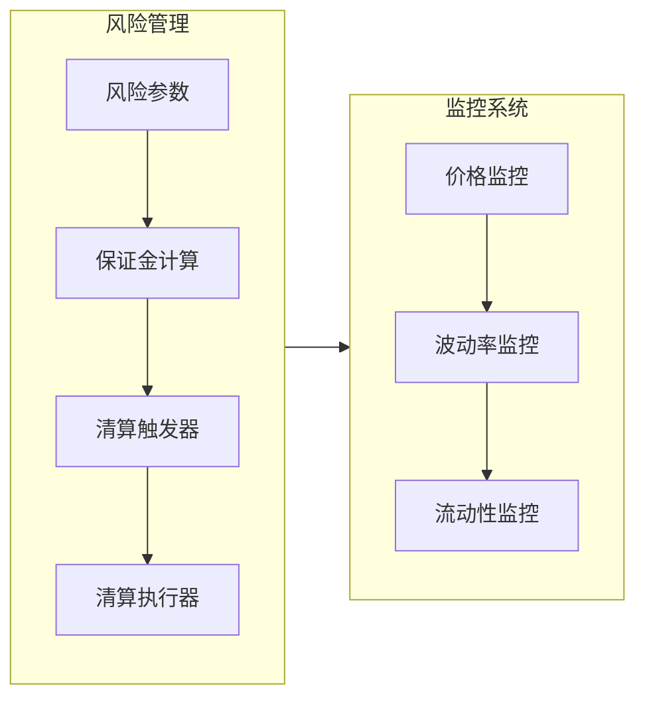
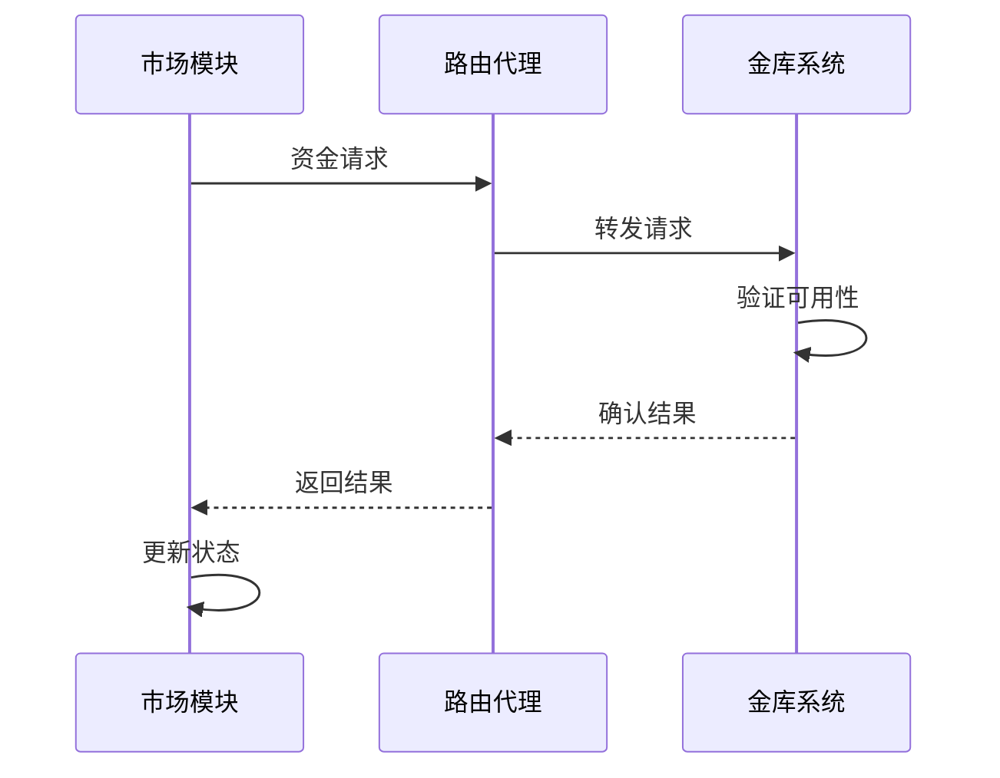

# Synthetix V3 市场模块分析

## 市场模块架构

## 市场类型分析

### 1. 永续市场 (Perpetual Market)

- **功能特点**
  - 永续合约交易
  - 资金费率机制
  - 动态杠杆调整

### 2. 现货市场 (Spot Market)

- **核心机制**
  - 即时交割
  - 双向报价
  - 流动性池管理

### 3. 传统市场 (Legacy Market)

- **主要特征**
  - 与 V2 版本兼容
  - 迁移支持
  - 历史数据处理

## 风险管理系统

### 1. 风险参数配置

- **保证金要求**
  - 初始保证金率
  - 维持保证金率
  - 最大杠杆率

- **价格限制**
  - 最大价格偏差
  - 滑点限制
  - 波动率调整

### 2. 清算机制

- **触发条件**
  - 保证金率低于阈值
  - 价格剧烈波动
  - 系统风险上升

- **执行流程**
  - 仓位平仓
  - 保证金处理
  - 损失分摊

## 与金库交互

### 1. 资金流动

- **入金流程**
  - 保证金验证
  - 资金锁定
  - 头寸记录

- **出金流程**
  - 持仓检查
  - 解锁资金
  - 清算确认

### 2. 风险共享

- **损失分摊**
  - 超额损失处理
  - 保险基金使用
  - 社会化损失

- **收益分配**
  - 手续费分配
  - 做市商奖励
  - 流动性激励

## 性能优化

1. **批量处理**
   - 订单批处理
   - 更新批处理
   - 清算批处理

2. **缓存策略**
   - 价格缓存
   - 状态缓存
   - 配置缓存

3. **Gas 优化**
   - 存储优化
   - 计算优化
   - 调用优化

## 监控与维护

1. **系统监控**
   - 性能指标
   - 风险指标
   - 健康状态

2. **维护流程**
   - 日常维护
   - 紧急响应
   - 升级流程

3. **数据分析**
   - 交易分析
   - 风险评估
   - 性能分析 