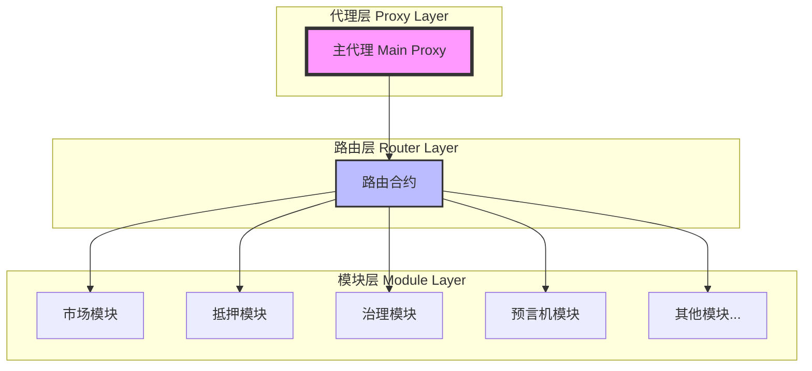
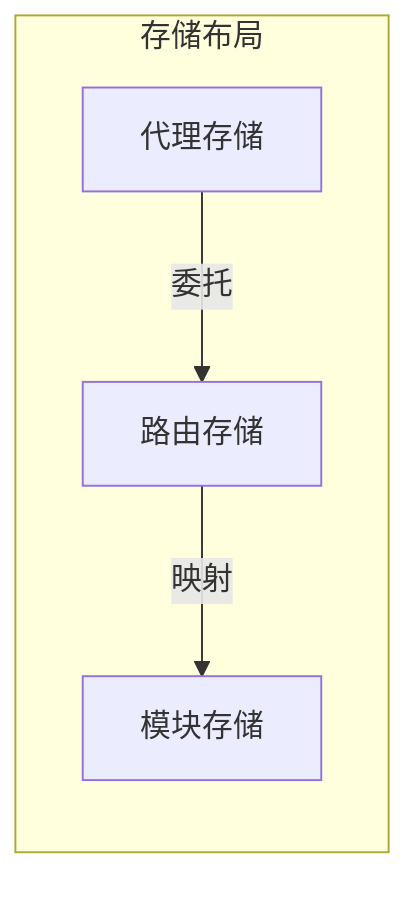
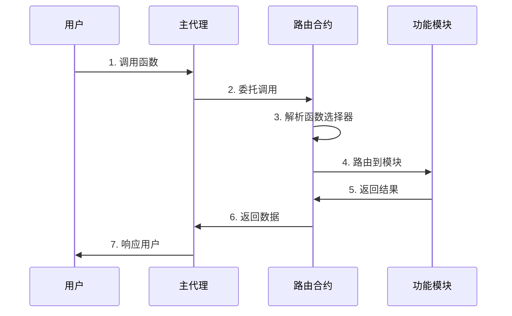

# Synthetix V3 路由代理架构分析

## 路由代理架构图



## 核心概念

### 1. 路由代理设计理念

- **模块合并机制**
  - 多个独立合约模块合并为单一实现
  - 统一的调用入口
  - 灵活的模块组合

- **代理架构优势**
  - 合约可升级性
  - 存储布局优化
  - 调用路径简化

### 2. 存储管理



- **存储分层**
  - 代理层存储不变量
  - 路由层管理映射关系
  - 模块层独立存储空间

- **存储优化**
  - 避免存储碰撞
  - 优化存储布局
  - 降低 gas 消耗

### 3. 调用流程



## 实现细节

### 1. 模块注册

```solidity
// 模块注册示例
function registerModule(
    bytes4[] calldata selectors,
    address module
) external onlyOwner {
    for (uint i = 0; i < selectors.length; i++) {
        selectorToModule[selectors[i]] = module;
    }
}
```

### 2. 函数路由

```solidity
// 函数路由示例
fallback() external payable {
    address module = selectorToModule[msg.sig];
    require(module != address(0), "Unknown selector");
    
    assembly {
        calldatacopy(0, 0, calldatasize())
        let result := delegatecall(gas(), module, 0, calldatasize(), 0, 0)
        returndatacopy(0, 0, returndatasize())
        switch result
        case 0 { revert(0, returndatasize()) }
        default { return(0, returndatasize()) }
    }
}
```

## 安全考虑

1. **升级风险控制**
   - 严格的权限管理
   - 升级冷却期
   - 多重签名要求

2. **存储安全**
   - 存储槽冲突检测
   - 初始化保护
   - 状态完整性校验

3. **调用安全**
   - 重入攻击防护
   - 权限检查
   - 参数验证

## 最佳实践

1. **模块设计**
   - 功能独立性
   - 接口标准化
   - 状态隔离

2. **升级管理**
   - 版本控制
   - 兼容性测试
   - 回滚机制

3. **监控审计**
   - 事件日志
   - 状态监控
   - 异常检测

## 与其他组件的关系

1. **与金库的关系**
   - 提供统一访问接口
   - 管理调用权限
   - 确保存储隔离

2. **与市场的关系**
   - 路由市场调用
   - 管理市场模块
   - 协调跨市场操作

3. **与治理的关系**
   - 执行升级操作
   - 管理系统参数
   - 控制模块注册 