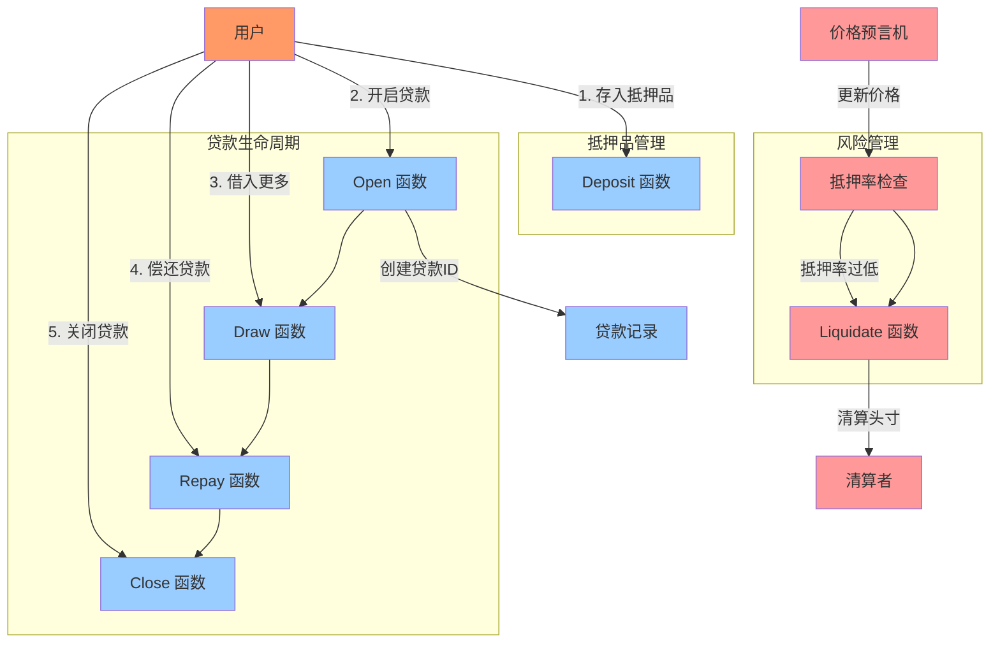

# Synthetix借款常见问题

## 问题：我可以在synthetix中借钱吗？

是的，您可以在Synthetix中借钱。Synthetix提供了几种借贷功能，主要有以下几种方式：

1. **抵押贷款**：您可以通过提供不同类型的抵押品来借入合成资产。Synthetix支持多种抵押品类型：
   - ETH抵押（CollateralEth）：使用ETH作为抵押品
   - ERC20代币抵押（CollateralErc20）：使用其他ERC20代币作为抵押品
   - 做空抵押（CollateralShort）：用于做空特定资产

2. **借贷流程**：
   - 存入抵押品（deposit）
   - 开启贷款（open）
   - 借入合成资产（borrow/draw）
   - 还款（repay）
   - 关闭头寸（close）

3. **关键参数**：
   - 最低抵押率（minCratio）：维持贷款所需的最低抵押比例
   - 最低抵押金额（minCollateral）：开始贷款所需的最低抵押品数量
   - 发行费率（issueFeeRate）：借款时支付的费用

4. **风险**：如果您的抵押率低于要求，您的头寸可能会被清算（liquidate）。

借贷过程需要密切关注市场变化和抵押率，以避免清算风险。在Synthetix V3中，借贷功能已经进行了改进，提供了更灵活的抵押和借款选项。

## Synthetix借款与传统DeFi借贷的区别

Synthetix的借款机制与传统DeFi借贷平台（如Aave、Compound等）有显著区别：

### 1. 借款资产类型

- **传统DeFi借贷**：用户借入已存在的代币（如ETH、USDC等）
- **Synthetix借款**：用户借入的是合成资产（Synths），这些资产由Synthetix协议铸造，跟踪各类资产价格

### 2. 借款目的

- **传统DeFi借贷**：主要用于获取流动性、杠杆交易或避免出售持有资产
- **Synthetix借款**：
  - 合成资产发行：用户可借入sUSD等合成资产
  - 做空机制：通过CollateralShort合约，用户可以对特定资产进行做空操作
  - 合成资产交易：借入后可在Synthetix交易所无滑点交易

### 3. 债务池机制

- **传统DeFi借贷**：债务是一对一的，借款人向特定资金池借款
- **Synthetix借款**：所有Synth持有者共享债务池，系统性风险更高，但也允许更灵活的交易

### 4. 清算机制

- **传统DeFi借贷**：清算通常由外部清算者执行，他们购买抵押品以偿还债务
- **Synthetix借款**：清算与传统相似，但由于合成资产的特性，清算过程和激励机制有所不同

### 5. 利率模型

- **传统DeFi借贷**：动态利率根据资金池利用率变化
- **Synthetix借款**：通常收取固定的铸造费用而非利息，V3引入了更多动态费用机制

### 6. 抵押品选择

- **传统DeFi借贷**：通常支持多种加密货币作为抵押品
- **Synthetix借款**：主要支持SNX、ETH和特定的ERC20代币作为抵押品，且不同抵押品有专门的合约处理

### 7. 交易体验

- **传统DeFi借贷**：借款后资产需转移到其他平台交易
- **Synthetix借款**：借入合成资产后可直接在Synthetix生态内无滑点交易，一站式体验

总的来说，Synthetix的借款机制是为了服务于其合成资产生态系统而设计的，而非单纯提供借贷服务。这使得它在用途上更为特殊化，但也提供了传统借贷平台所没有的独特功能。

## 代码出处

本文档中引用的代码来自Synthetix官方代码库：

- **Synthetix V2合约**：[Synthetix/synthetix](https://github.com/Synthetixio/synthetix)
  - 抵押合约：`contracts/CollateralEth.sol`、`contracts/CollateralErc20.sol`、`contracts/CollateralShort.sol`

- **Synthetix V3合约**：[Synthetix/synthetix-v3](https://github.com/Synthetixio/synthetix-v3)
  - 核心合约：`protocol/synthetix/contracts/`
  - 市场合约：
    - 遗留市场：`markets/legacy-market/contracts/`
    - 财政市场：`markets/treasury-market/contracts/`
    - 永续市场：`markets/perps-market/contracts/`

- **接口定义**：
  - V3核心代理：`markets/legacy-market/contracts/interfaces/external/IV3CoreProxy.sol`
  - 财政市场：`markets/treasury-market/contracts/interfaces/ITreasuryMarket.sol`

## Synthetix借款流程源码分析

根据Synthetix源码，我们可以详细了解整个借款过程的实现机制。以下是主要的借款相关合约及其关键函数：

### 1. 抵押品类型合约

Synthetix提供了三种主要的抵押品合约：

- **CollateralEth**：使用ETH作为抵押品
- **CollateralErc20**：使用ERC20代币作为抵押品
- **CollateralShort**：用于做空特定资产

这些合约提供了类似的接口，但根据抵押品类型有不同的实现。

### 2. 关键函数解析

#### 开启贷款 (open)

ETH抵押示例：
```solidity
// CollateralEth.sol
function open(uint256 amount, bytes32 currency) payable returns (uint256 id)
```

ERC20抵押示例：
```solidity
// CollateralErc20.sol
function open(uint256 collateral, uint256 amount, bytes32 currency) returns (uint256 id)
```

#### 存入抵押品 (deposit)

ETH抵押示例：
```solidity
// CollateralEth.sol
function deposit(address borrower, uint256 id) payable returns (uint256 principal, uint256 collateral)
```

ERC20抵押示例：
```solidity
// CollateralErc20.sol
function deposit(address borrower, uint256 id, uint256 amount) returns (uint256 principal, uint256 collateral)
```

#### 借入更多 (draw)

```solidity
function draw(uint256 id, uint256 amount) returns (uint256 principal, uint256 collateral)
```

#### 还款 (repay)

```solidity
function repay(address borrower, uint256 id, uint256 amount) returns (uint256 principal, uint256 collateral)
```

#### 关闭贷款 (close)

```solidity
function close(uint256 id) returns (uint256 amount, uint256 collateral)
```

#### 清算 (liquidate)

```solidity
function liquidate(address borrower, uint256 id, uint256 amount)
```

### 3. 抵押率计算

Synthetix使用以下方法来计算抵押率：

```solidity
function collateralRatio(uint256 id) view returns (uint256 cratio)
```

如果抵押率低于最低要求（minCratio），贷款可能被清算：

```solidity
function liquidationAmount(uint256 id) view returns (uint256 liqAmount)
```

### 4. 实际部署的合约地址

在Ethereum主网上，以下合约已部署并可供使用：

- **CollateralEth**: `0x5c8344bcdC38F1aB5EB5C1d4a35DdEeA522B5DfA`
- **CollateralErc20**: `0xaa03aB31b55DceEeF845C8d17890CC61cD98eD04`
- **CollateralShort**: `0x1F2c3a1046c32729862fcB038369696e3273a516`

这些合约地址可在[Synthetix部署信息](https://github.com/Synthetixio/synthetix-docs/tree/master/content/contracts/deployment)中找到。

## Synthetix借款流程图



## Synthetix V3借款与V2的区别

Synthetix V3对借款机制进行了多项改进：

1. **更灵活的抵押品支持**：V3支持更多种类的抵押品
2. **优化的流动性池**：改进了资金利用效率
3. **改进的风险参数**：更精细的清算机制和抵押率设置
4. **跨链支持**：实现了多链部署的借贷功能
5. **模块化架构**：更容易扩展和升级各个组件

整个借贷过程仍需密切关注市场变化和抵押率，以避免清算风险。V3提供了更多工具来管理这些风险。 