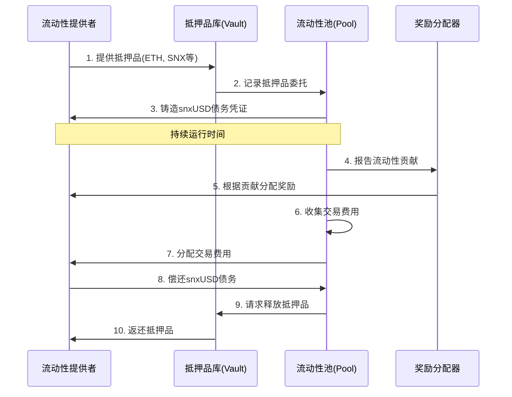
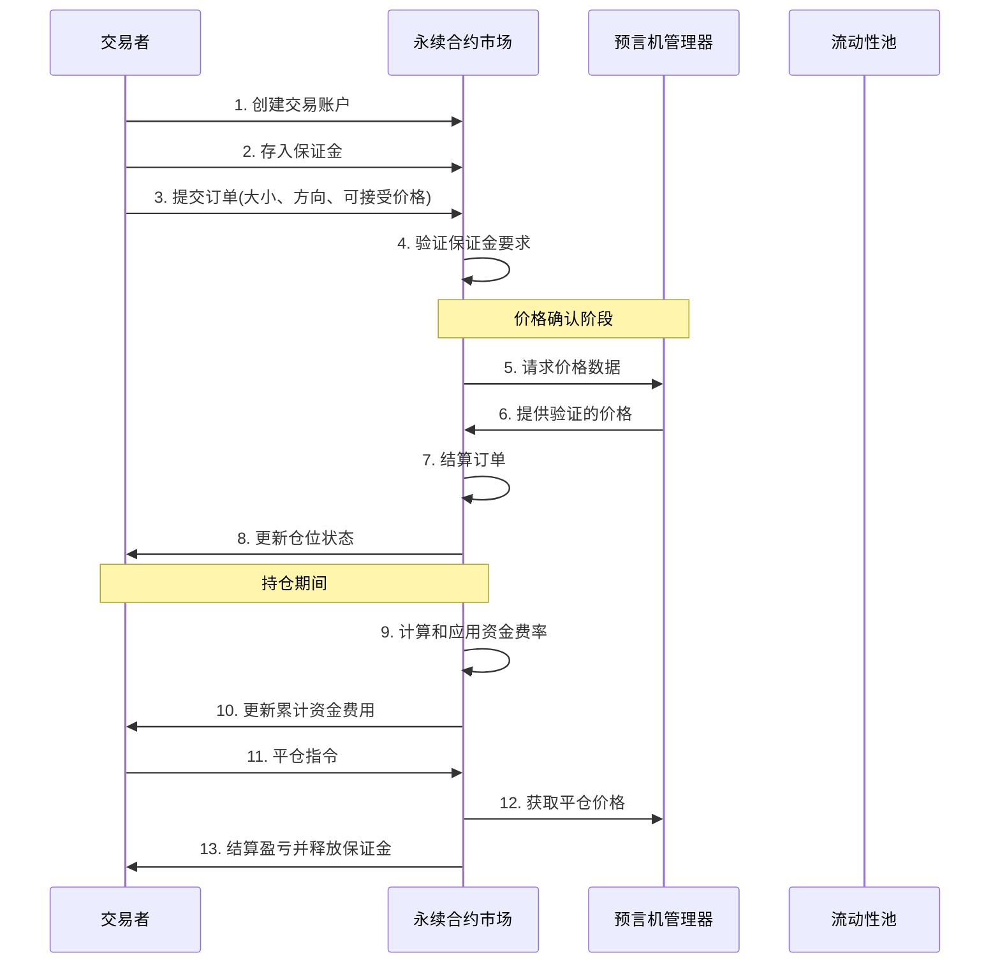
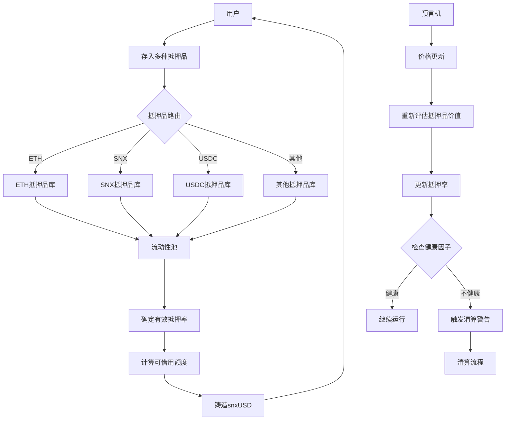
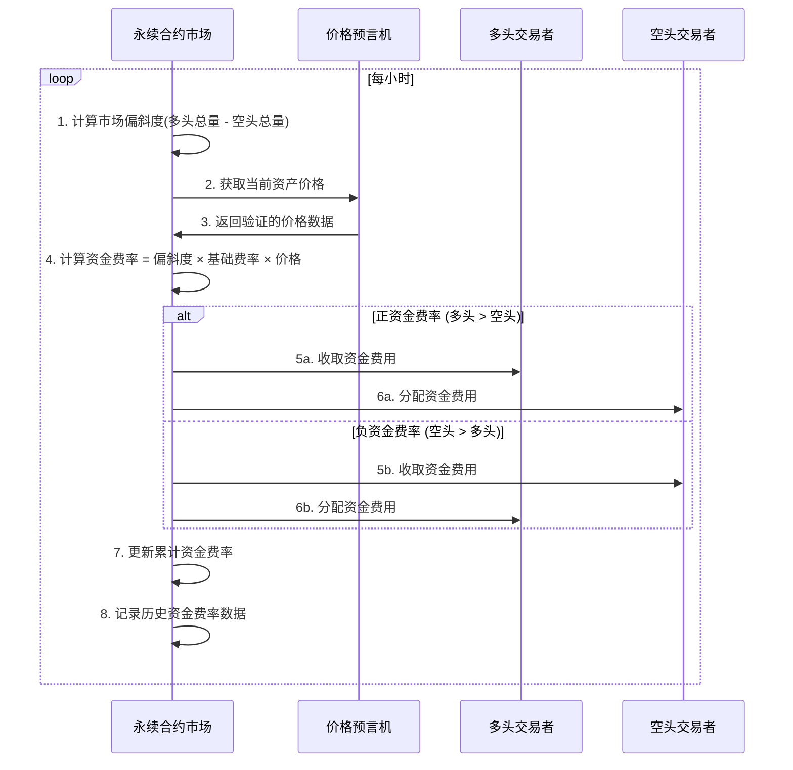
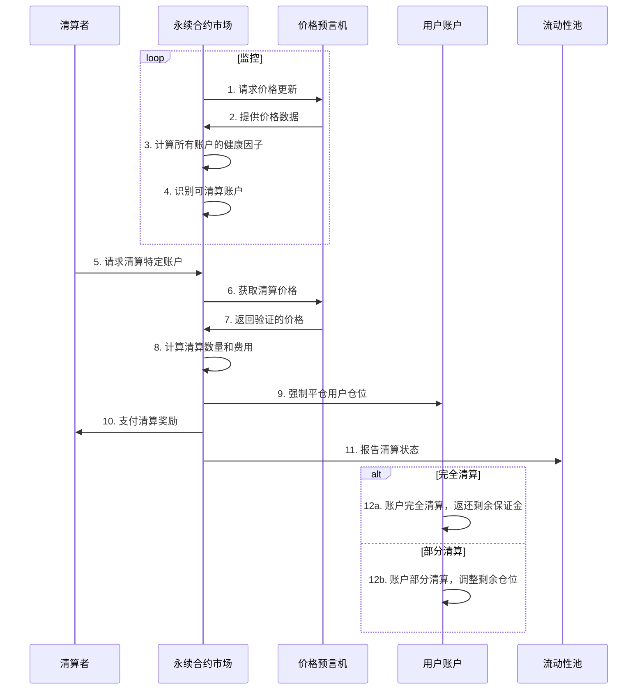
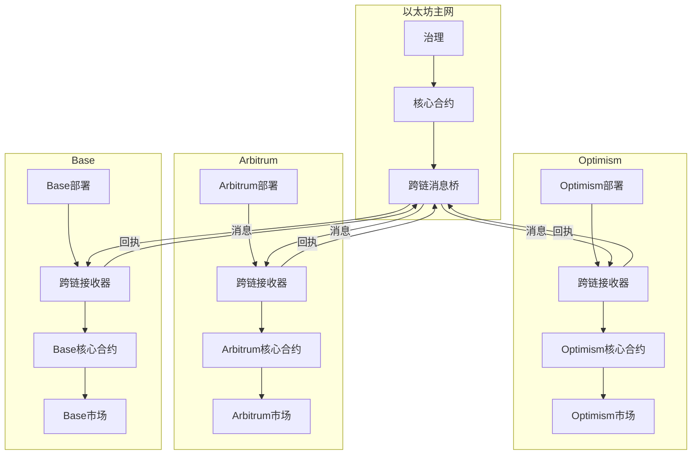
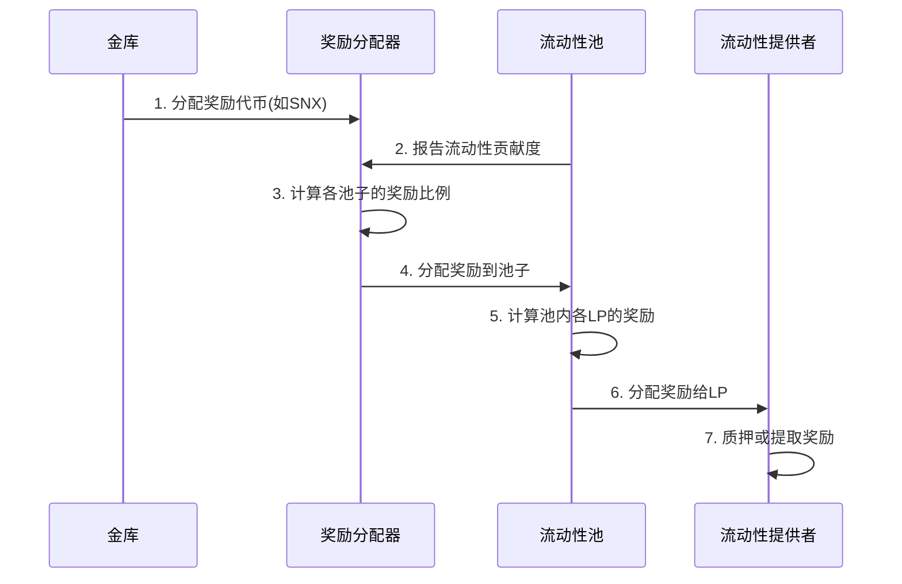

# Synthetix V3 业务流程分析

本文档详细分析Synthetix V3的核心业务流程，包括流动性提供、衍生品交易、跨链操作等关键业务活动，以便深入理解系统的运作方式。

## 目录

1. [流动性提供流程](#流动性提供流程)
2. [永续合约交易流程](#永续合约交易流程)
3. [跨抵押品管理流程](#跨抵押品管理流程)
4. [资金费率机制](#资金费率机制)
5. [清算流程](#清算流程)
6. [跨链操作流程](#跨链操作流程)
7. [奖励分配流程](#奖励分配流程)

## 流动性提供流程

流动性提供是Synthetix V3的基础功能，该流程描述了流动性提供者如何向系统提供抵押品并获得奖励。

### 流程说明

1. **抵押品提供**: 流动性提供者(LP)向特定的抵押品库提供抵押资产(如ETH, SNX等)
2. **抵押品记录**: 抵押品库记录委托的抵押品并通知流动性池
3. **债务铸造**: 流动性池向LP铸造相应数量的snxUSD作为债务凭证
4. **流动性贡献报告**: 流动性池向奖励分配器报告LP的贡献度
5. **奖励分配**: 奖励分配器根据贡献度向LP分配奖励(如SNX代币)
6. **费用收集**: 流动性池从市场收集交易费用
7. **费用分配**: 流动性池将收集的费用分配给LP
8. **债务偿还**: LP偿还snxUSD债务时，流动性池记录债务减少
9. **抵押品释放请求**: 流动性池向抵押品库请求释放相应的抵押品
10. **抵押品返还**: 抵押品库将抵押品返还给LP

## 永续合约交易流程

永续合约交易是Synthetix V3中最活跃的衍生品交易类型，以下流程详细描述了交易者如何在永续合约市场中操作。

### 流程说明

1. **账户创建**: 交易者创建一个永续合约交易账户，可以是NFT形式表示
2. **保证金存入**: 交易者向账户存入保证金，支持多种抵押品类型
3. **订单提交**: 交易者提交包含大小、方向和可接受价格的订单
4. **保证金验证**: 系统验证账户是否有足够的保证金满足初始保证金要求
5. **价格请求**: 市场向预言机管理器请求价格数据以结算订单
6. **价格提供**: 预言机管理器提供经验证的价格数据
7. **订单结算**: 系统根据当前价格和订单参数结算订单
8. **仓位更新**: 通知交易者仓位状态已更新
9. **资金费率计算**: 系统根据市场偏斜度计算资金费率
10. **资金费用更新**: 更新交易者仓位的累计资金费用
11. **平仓指令**: 交易者提交平仓订单
12. **平仓价格获取**: 系统从预言机获取平仓价格
13. **盈亏结算**: 系统计算交易者的盈亏并释放剩余保证金

## 跨抵押品管理流程

Synthetix V3支持多种抵押品类型，以下流程展示了系统如何管理不同类型的抵押品。

### 流程说明

1. **多抵押品存入**: 用户可以存入多种类型的抵押品
2. **抵押品路由**: 系统根据抵押品类型将其路由到相应的抵押品库
3. **抵押率确定**: 系统根据不同抵押品的风险特性确定有效抵押率
4. **额度计算**: 计算用户基于所有抵押品的可借用额度
5. **债务铸造**: 向用户铸造snxUSD作为债务
6. **价格更新**: 预言机定期更新抵押品价格
7. **价值重估**: 系统重新评估抵押品的市场价值
8. **抵押率更新**: 更新用户的当前抵押率
9. **健康检查**: 检查用户的仓位健康因子是否满足要求
10. **清算触发**: 如果健康因子不足，触发清算流程

## 资金费率机制

资金费率是永续合约市场中平衡市场偏斜度的关键机制，以下流程详细说明了资金费率的计算和应用方式。

### 流程说明

1. **偏斜度计算**: 市场计算当前的偏斜度(多头总量减去空头总量)
2. **价格获取**: 从预言机获取当前资产价格
3. **价格返回**: 预言机返回经验证的价格数据
4. **费率计算**: 根据偏斜度、基础费率和价格计算当前资金费率
5. **费用收取**: 从占主导地位的一方收取资金费用
6. **费用分配**: 将收取的费用分配给非主导方
7. **累计更新**: 更新每个仓位的累计资金费率
8. **历史记录**: 记录历史资金费率数据供分析和审计

## 清算流程

清算是Synthetix V3风险管理的关键机制，以下流程详细描述了系统如何处理不健康的仓位。

### 流程说明

1. **价格更新请求**: 市场请求预言机更新价格
2. **价格数据提供**: 预言机提供最新的价格数据
3. **健康因子计算**: 市场计算所有账户的健康因子
4. **可清算账户识别**: 识别健康因子低于阈值的账户
5. **清算请求**: 清算者请求清算特定的不健康账户
6. **清算价格获取**: 市场获取用于清算的价格数据
7. **验证价格返回**: 预言机返回经验证的价格
8. **清算计算**: 计算需要清算的数量和相关费用
9. **强制平仓**: 强制平仓用户的仓位
10. **奖励支付**: 向清算者支付清算奖励
11. **状态报告**: 向流动性池报告清算状态
12. **账户调整**: 根据清算类型调整用户账户状态

## 跨链操作流程

Synthetix V3支持跨链功能，允许在多个区块链上部署和操作，以下流程展示了跨链操作的机制。

### 流程说明

1. **核心合约部署**: 在以太坊主网和各个L2网络上部署核心合约
2. **跨链消息传递**: 通过跨链消息桥在不同网络间传递消息
3. **治理控制**: 以太坊主网上的治理合约控制所有网络的核心设置
4. **L2特定部署**: 各L2网络有特定的部署和市场实现
5. **消息确认**: 跨链操作通过消息确认机制保证一致性
6. **回执传递**: L2网络将操作回执传回以太坊主网

## 奖励分配流程

奖励分配是激励用户参与系统的重要机制，以下流程展示了奖励的生成和分配方式。

### 流程说明

1. **代币分配**: 系统金库向奖励分配器分配奖励代币(如SNX)
2. **贡献度报告**: 流动性池向奖励分配器报告各自的贡献度
3. **奖励比例计算**: 奖励分配器根据各池子的贡献度计算奖励比例
4. **池子奖励分配**: 向各个流动性池分配相应比例的奖励
5. **LP奖励计算**: 流动性池计算池内各LP的奖励份额
6. **LP奖励分配**: 将奖励分配给各个LP
7. **奖励处理**: LP可以选择质押或提取奖励代币
