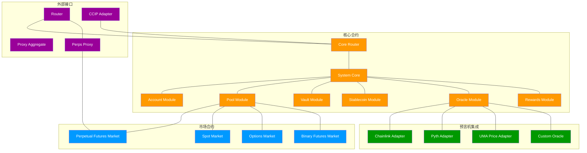
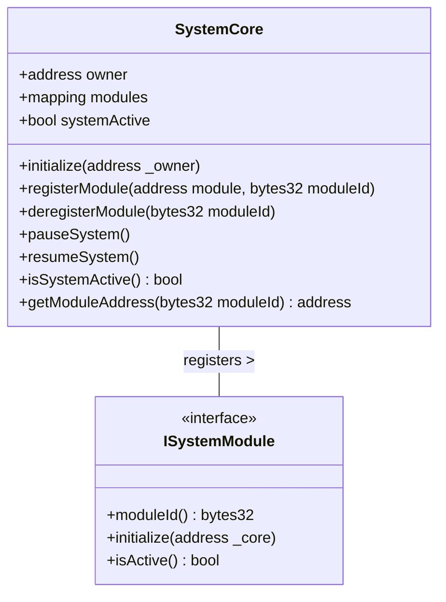
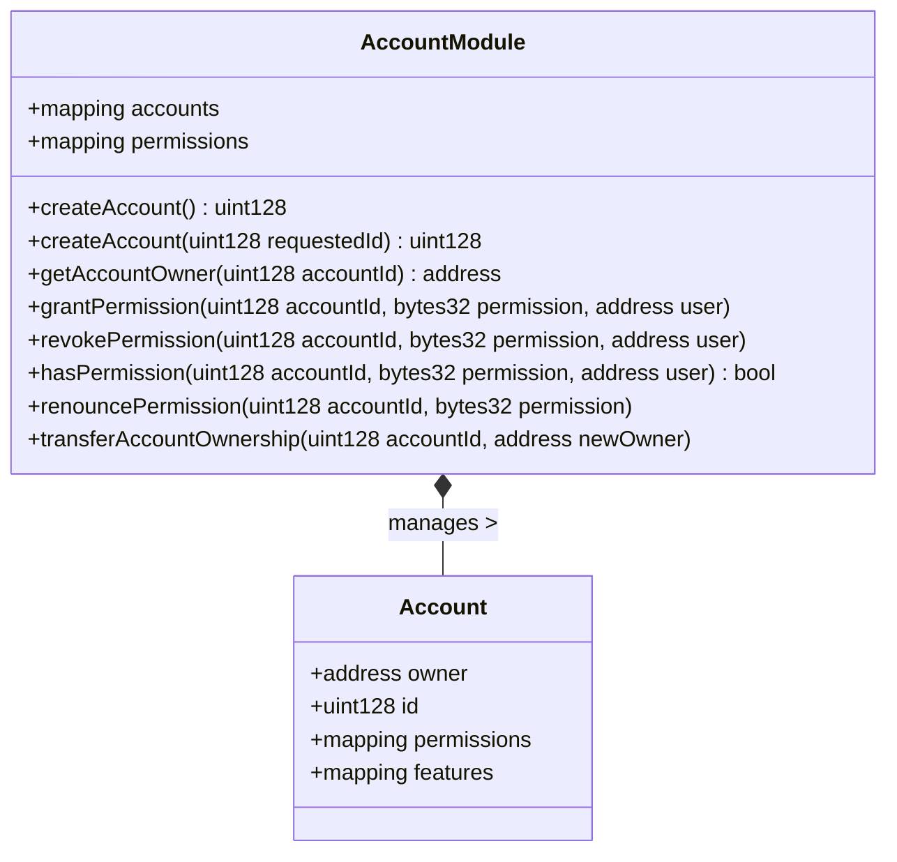
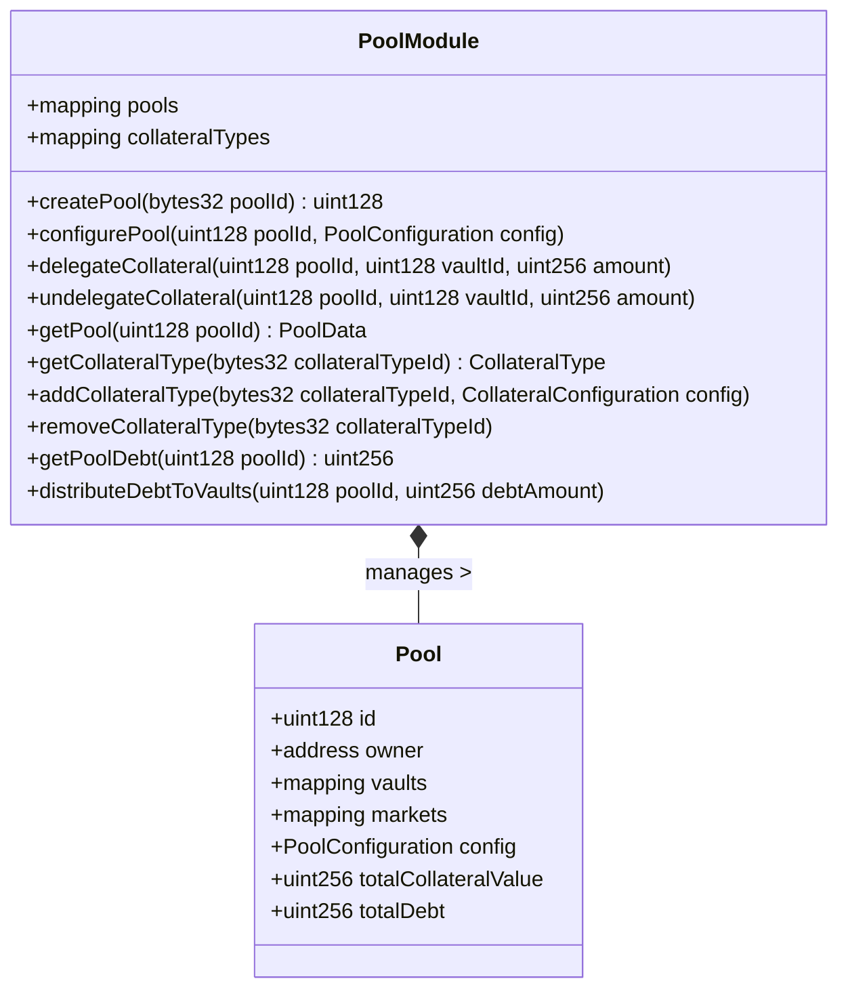
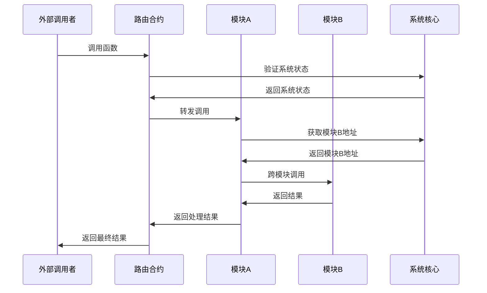
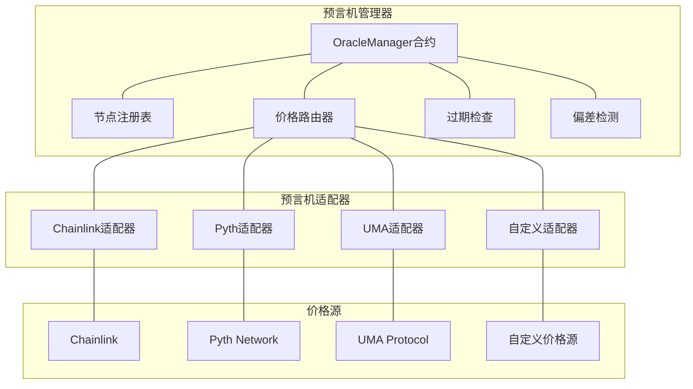
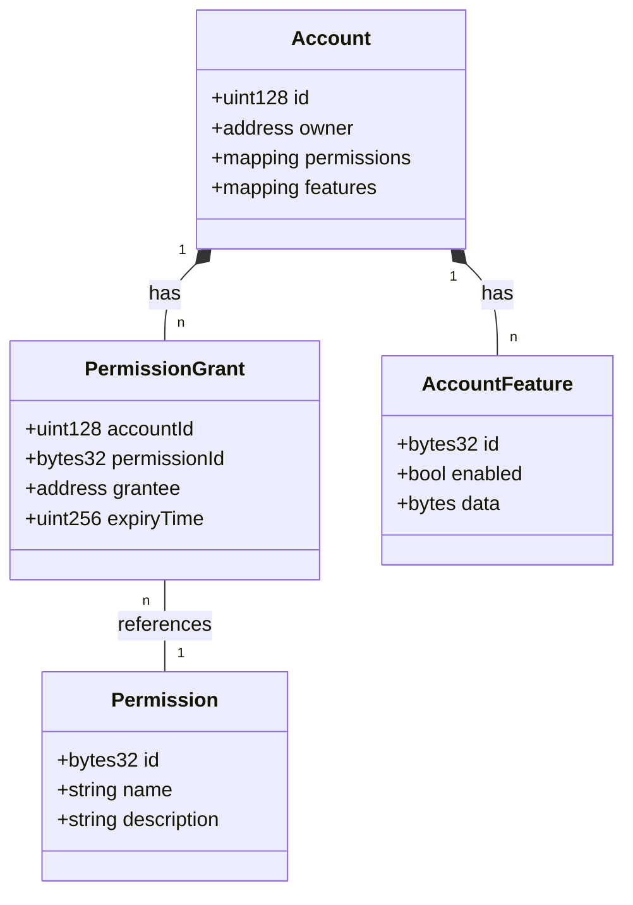
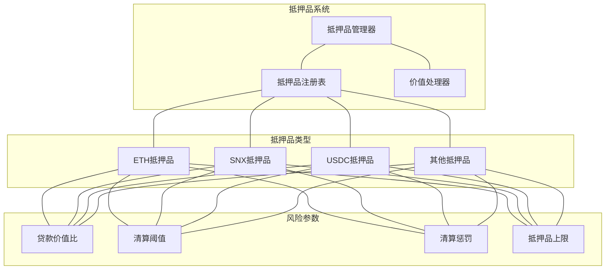
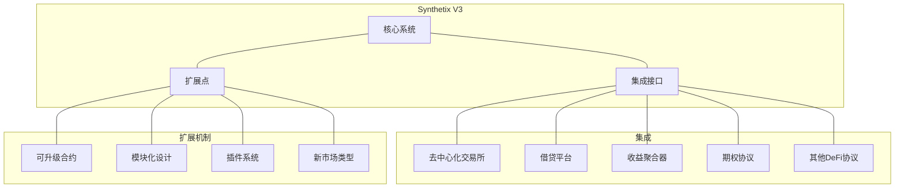
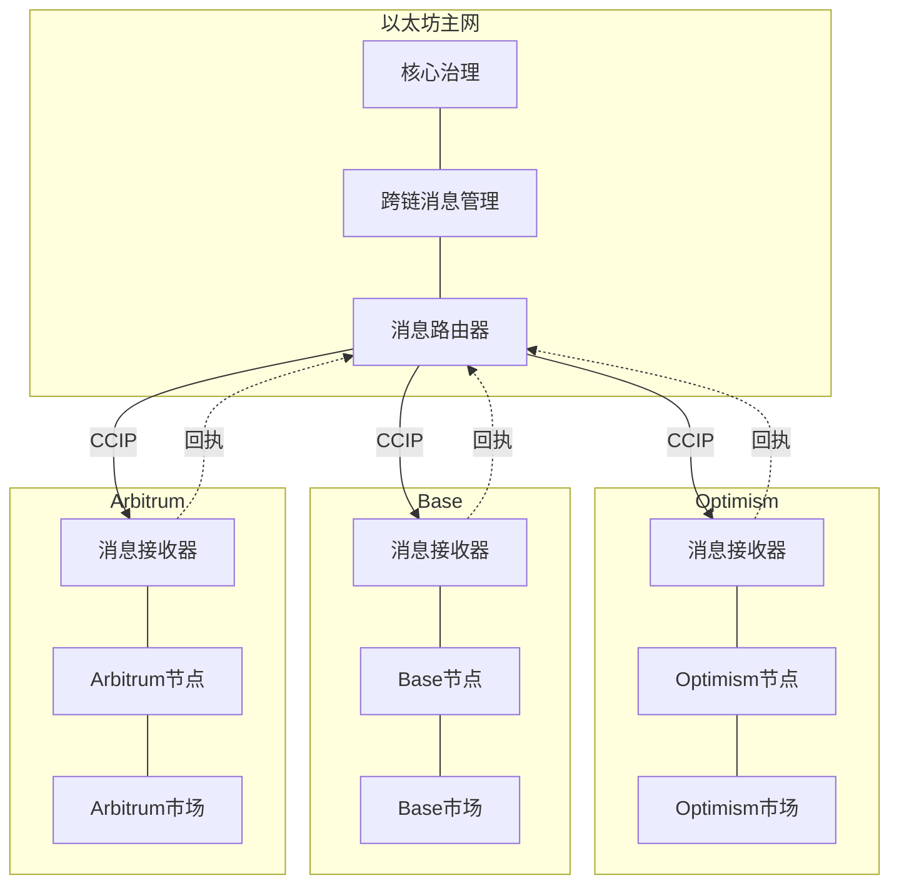

# Synthetix V3 技术架构分析

本文档深入分析Synthetix V3的技术架构实现，包括合约结构、模块化设计、跨链机制以及技术创新点。

## 目录

1. [合约架构概览](#合约架构概览)
2. [核心模块详解](#核心模块详解)
3. [模块间交互机制](#模块间交互机制)
4. [预言机集成机制](#预言机集成机制)
5. [账户与权限管理](#账户与权限管理)
6. [多抵押品支持机制](#多抵押品支持机制)
7. [扩展性与可组合性](#扩展性与可组合性)
8. [跨链实现技术](#跨链实现技术)

## 合约架构概览

Synthetix V3采用高度模块化的合约架构，使系统更加灵活和可扩展。以下是系统的主要合约架构图：

### 合约结构说明

Synthetix V3的合约架构包含以下主要组件：

1. **核心合约组**:
   - **System Core**: 系统的核心合约，管理其他模块的集成和交互
   - **Account Module**: 管理用户账户、权限和身份
   - **Core Router**: 路由核心合约之间的交互
   - **Pool Module**: 管理流动性池和资金分配
   - **Vault Module**: 处理抵押品保管和风险管理
   - **Stablecoin Module**: 管理stablecoin的铸造和销毁
   - **Oracle Module**: 集成和管理价格预言机
   - **Rewards Module**: 处理奖励发放和分配

2. **市场合约组**:
   - **Perpetual Futures Market**: 永续合约市场逻辑
   - **Spot Market**: 现货市场逻辑
   - **Options Market**: 期权市场逻辑
   - **Binary Futures Market**: 二元期货市场逻辑

3. **预言机集成**:
   - **Chainlink Adapter**: 连接Chainlink价格源
   - **Pyth Adapter**: 连接Pyth Network价格源
   - **UMA Price Adapter**: 连接UMA价格源
   - **Custom Oracle**: 自定义预言机解决方案

4. **外部接口**:
   - **Router**: 主要路由合约，处理外部调用
   - **Proxy Aggregate**: 聚合代理合约
   - **Perps Proxy**: 永续合约市场的专用代理
   - **CCIP Adapter**: 跨链互操作性协议适配器

## 核心模块详解

### SystemCore

SystemCore是整个Synthetix V3系统的核心，它负责协调不同模块之间的交互，并维护系统的整体状态和安全性。

SystemCore提供以下关键功能：
- 模块注册和管理
- 系统暂停和恢复机制
- 模块间通信协调
- 系统安全保障

### AccountModule

AccountModule管理用户账户和权限，实现了基于角色的访问控制(RBAC)机制。

AccountModule的主要特性：
- 账户创建和管理
- 权限分配和撤销
- 基于NFT的账户表示
- 账户所有权转移
- 灵活的权限模型

### PoolModule

PoolModule管理流动性池、池配置和流动性分配。

PoolModule的主要功能：
- 流动性池创建和管理
- 抵押品类型配置
- 流动性委托和撤回
- 池债务计算和分配
- 市场流动性分配

## 模块间交互机制

Synthetix V3采用了灵活的模块间交互机制，允许模块之间进行安全、可控的通信。以下是主要的交互模式：

关键交互机制包括：

1. **路由转发**:
   - 外部调用通过路由合约转发到目标模块
   - 路由合约验证系统状态和调用权限

2. **模块发现**:
   - 模块通过SystemCore获取其他模块的地址
   - SystemCore维护模块注册表

3. **跨模块通信**:
   - 模块可以直接调用其他已注册模块的函数
   - 通信受权限控制和系统状态限制

4. **事件通知**:
   - 模块通过事件通知其他模块状态变化
   - 事件用于异步通信和状态同步

## 预言机集成机制

Synthetix V3实现了灵活的预言机集成架构，支持多种价格源并保证价格数据的可靠性。

预言机集成的关键特性：

1. **多源价格聚合**:
   - 支持从多个预言机获取价格
   - 实现价格聚合以提高可靠性

2. **适配器模式**:
   - 使用适配器模式集成不同预言机
   - 统一接口简化新预言机的集成

3. **价格验证**:
   - 检测价格过期和异常偏差
   - 实现价格阈值和偏差限制

4. **ERC-7412兼容**:
   - 永续合约V3使用兼容ERC-7412的预言机合约
   - 提供统一的客户端库用于离链集成

## 账户与权限管理

Synthetix V3实现了基于角色的复杂权限管理系统，支持灵活的账户操作和权限委托。

权限管理系统的主要特性：

1. **NFT账户表示**:
   - 每个账户由NFT代表，可转移所有权
   - 支持多账户所有权

2. **细粒度权限**:
   - 支持细粒度权限分配
   - 权限可以限定到特定功能

3. **时间绑定授权**:
   - 支持权限授权的时间限制
   - 自动过期机制增强安全性

4. **权限委托链**:
   - 支持权限的多级委托
   - 回收机制确保权限可控

5. **系统级权限**:
   - 定义系统级权限控制关键操作
   - 治理权限控制系统参数修改

## 多抵押品支持机制

Synthetix V3的多抵押品机制允许系统接受和管理各种类型的抵押资产，提高系统的灵活性和资本效率。

多抵押品支持的关键特性：

1. **抵押品注册表**:
   - 维护系统支持的抵押品列表
   - 存储抵押品配置和风险参数

2. **差异化风险参数**:
   - 每种抵押品有独立的风险参数
   - 参数包括贷款价值比、清算阈值等

3. **价值评估**:
   - 实时评估抵押品的市场价值
   - 使用预言机获取最新价格数据

4. **抵押品上限**:
   - 针对每种抵押品设置系统上限
   - 防止单一抵押品过度集中

5. **抵押品替换**:
   - 支持在不平仓的情况下替换抵押品
   - 提高用户资本效率

## 扩展性与可组合性

Synthetix V3的架构设计强调扩展性和可组合性，允许系统与其他DeFi协议无缝集成。

扩展性和可组合性的关键特性：

1. **模块化设计**:
   - 系统由独立模块组成
   - 支持模块的添加、替换和升级

2. **标准化接口**:
   - 定义标准接口促进集成
   - 接口稳定性保证兼容性

3. **插件架构**:
   - 支持功能扩展的插件系统
   - 插件不需要修改核心代码

4. **市场模板**:
   - 提供标准化的市场模板
   - 简化新市场类型的创建

5. **事件系统**:
   - 丰富的事件系统促进集成
   - 外部系统可订阅关键事件

## 跨链实现技术

Synthetix V3实现了强大的跨链功能，允许系统在多个区块链网络上无缝运行。

跨链实现的关键技术：

1. **跨链通信协议(CCIP)**:
   - 使用Chainlink CCIP实现跨链消息传递
   - 确保消息的安全性和可靠性

2. **节点架构**:
   - 各链上部署独立的Synthetix节点
   - 节点同步核心状态和配置

3. **治理分离**:
   - 主网处理核心治理决策
   - L2网络处理高吞吐量市场操作

4. **状态同步**:
   - 关键状态在链间同步
   - 使用消息回执确认同步完成

5. **流动性分布**:
   - 流动性可以在不同链间分配
   - 优化不同链上的资本效率
