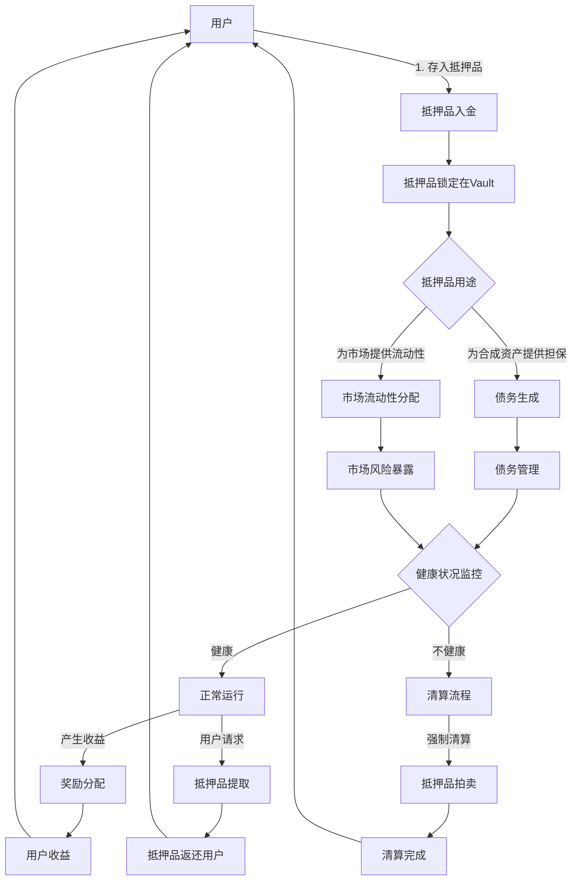
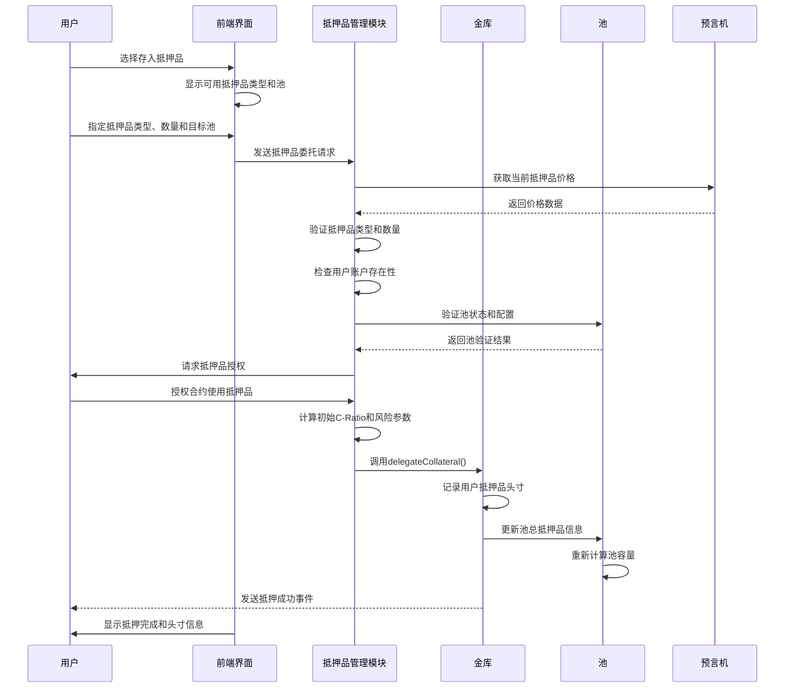
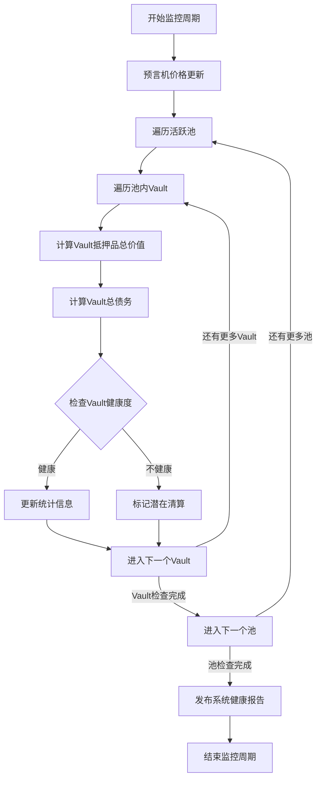
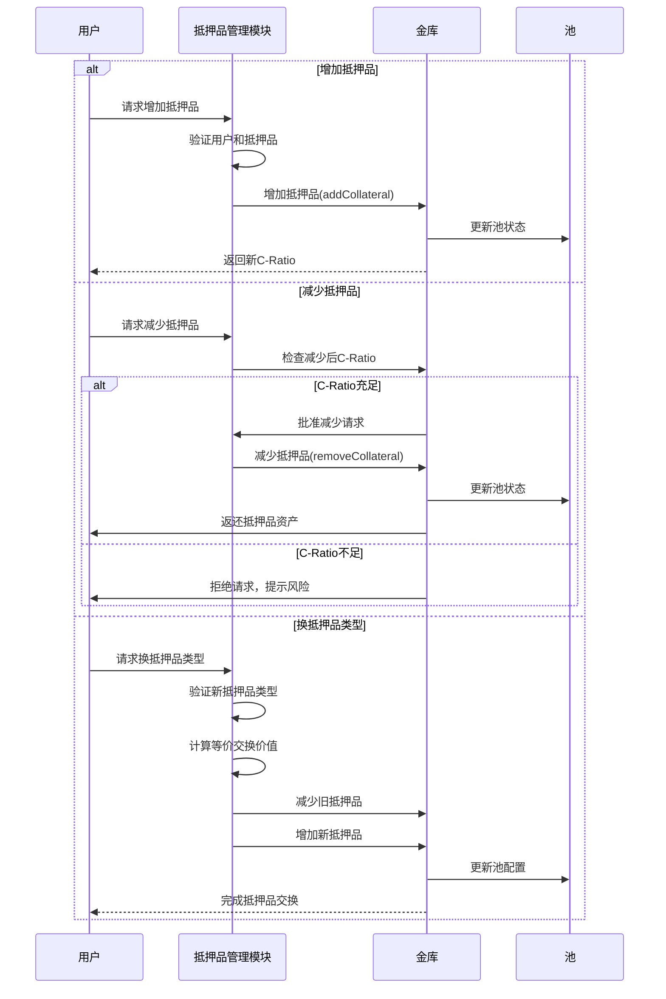

# Synthetix V3 抵押品管理流程

## 概述

抵押品管理是Synthetix V3协议的核心功能之一，它涉及抵押品的生命周期全过程，包括存入、管理、评估、清算和提取。本文档详细介绍抵押品在协议中的完整流程、风险管理策略以及与其他系统组件的交互方式。

## 抵押品生命周期

### 抵押品生命周期全景图

以下流程图展示了抵押品在Synthetix V3系统中的完整生命周期：



抵押品在系统中经历以下主要阶段：
1. **入金阶段**：用户将资产存入协议
2. **使用阶段**：抵押品用于担保债务或提供流动性
3. **管理阶段**：监控健康度、调整头寸、收取奖励
4. **退出阶段**：自愿提取或强制清算

## 详细流程分析

### 1. 抵押品入金流程

当用户向Synthetix V3协议提供抵押品时，执行以下步骤：



#### 代码示例：抵押品委托实现

```solidity
// CollateralManager.sol 片段
function delegateCollateral(
    uint128 accountId,
    uint128 poolId,
    address collateralType,
    uint256 amount,
    uint256 leverage
) external nonReentrant whenNotPaused {
    // 验证账户所有权
    require(accountModule.isAccountOwner(accountId, msg.sender), "Not account owner");
    
    // 验证池和抵押品类型
    require(poolModule.isPoolActive(poolId), "Pool not active");
    require(isAcceptedCollateral(poolId, collateralType), "Collateral not accepted");
    
    // 验证并处理抵押品转移
    IERC20 token = IERC20(collateralType);
    uint256 balanceBefore = token.balanceOf(address(this));
    token.safeTransferFrom(msg.sender, address(this), amount);
    uint256 actualAmount = token.balanceOf(address(this)) - balanceBefore;
    
    // 获取价格和计算抵押品价值
    uint256 collateralPrice = oracleManager.getPrice(collateralType);
    uint256 collateralValue = (actualAmount * collateralPrice) / 1e18;
    
    // 验证最低抵押品要求
    require(collateralValue >= minCollateralValue, "Below minimum collateral");
    
    // 执行委托操作
    vaultModule.delegateCollateral(accountId, poolId, collateralType, actualAmount, leverage);
    
    // 更新用户累计抵押统计
    accountStats[accountId].totalCollateralValue += collateralValue;
    
    emit CollateralDelegated(accountId, poolId, collateralType, actualAmount, leverage);
}
```

### 2. 抵押品评估与监控

抵押品价值持续通过预言机更新，系统使用以下流程监控抵押品状态：



#### 关键指标计算

抵押品健康度通过以下关键指标监控：

1. **抵押率(C-Ratio)**：
   ```
   C-Ratio = 抵押品价值 / 债务价值
   ```

2. **清算阈值**：
   ```
   清算风险 = 1 - (C-Ratio / 最低要求C-Ratio)
   ```

3. **抵押品利用率**：
   ```
   利用率 = 生成债务价值 / 最大可生成债务价值
   ```

#### 风险分级系统

系统对抵押品状态进行风险分级：

| 风险等级 | C-Ratio范围 | 系统响应 | 建议操作 |
|---------|------------|----------|---------|
| 安全 | C-Ratio > 最低要求 × 1.5 | 正常运行 | 可考虑优化资金效率 |
| 注意 | 最低要求 × 1.5 ≥ C-Ratio > 最低要求 × 1.2 | 提醒通知 | 监控市场波动 |
| 警告 | 最低要求 × 1.2 ≥ C-Ratio > 最低要求 × 1.1 | 高频监控 | 考虑添加抵押品 |
| 危险 | 最低要求 × 1.1 ≥ C-Ratio > 最低要求 | 准备清算 | 立即添加抵押品 |
| 清算 | C-Ratio ≤ 最低要求 | 触发清算 | 清算流程启动 |

### 3. 抵押品调整流程

用户可以通过以下方式调整抵押品头寸：



#### 抵押品调整的风险控制措施

为确保系统安全，抵押品调整操作受到以下限制：

1. **降低抵押限制**：
   - 提取后C-Ratio必须保持在最低要求以上安全水平
   - 大额提取可能需要分批进行
   - 市场高波动期可能实施额外限制

2. **响应时间窗口**：
   - 大额抵押品变更可能需要时间锁定
   - 根据市场波动性调整响应窗口
   - 防止闪电贷攻击的安全措施

3. **费用机制**：
   - 频繁调整可能产生附加费用
   - 基于市场状况的动态费率
   - 费用分配给协议和抵押品提供者
