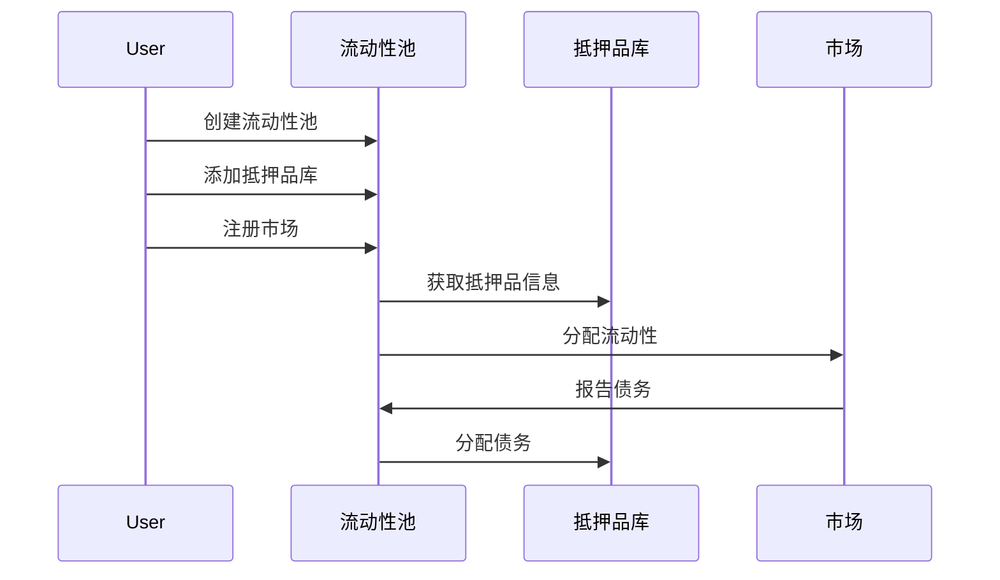
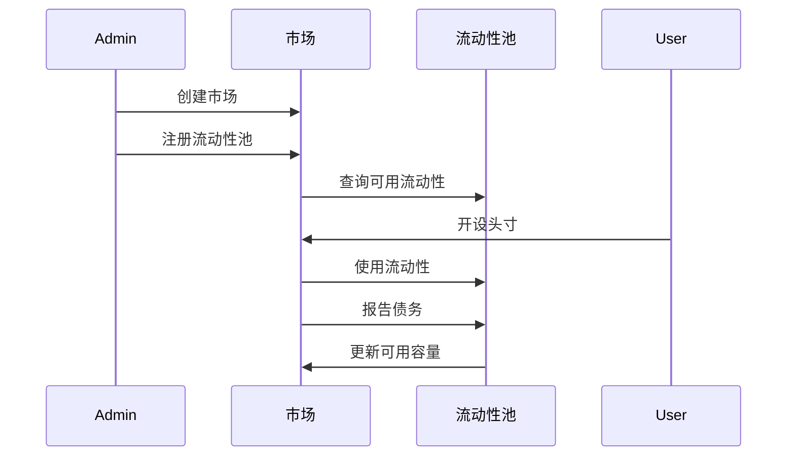
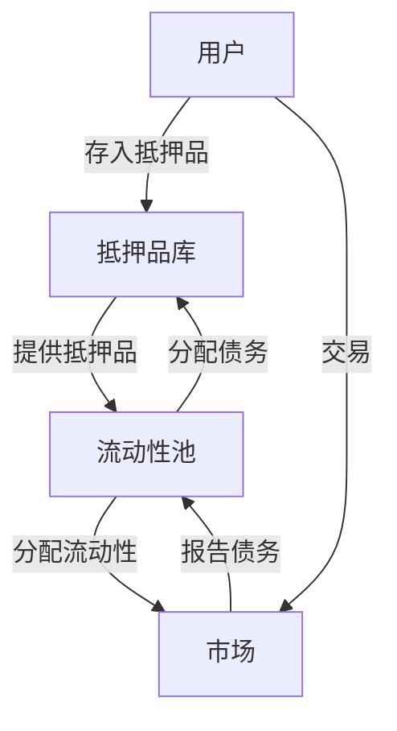

# 流动性池与市场模块

## 概述

流动性池和市场模块是Triplex协议核心架构的关键组成部分，它们建立在抵押品库(vault)基础上，实现了流动性聚合和市场交易功能。这两个模块共同工作，支持合成资产的创建、交易和管理。

## 流动性池模块

### 核心概念

流动性池模块负责聚合来自多个抵押品库的抵押品，并将流动性分配给不同的市场。它实现了以下主要功能：

- **流动性聚合**：从多个抵押品库收集和管理抵押品
- **市场分配**：基于权重系统将流动性分配给不同市场
- **风险管理**：通过最大债务上限控制市场风险敞口

### 主要结构

#### 流动性池接口

```move
module triplex::liquidity_pool_interface {
    /// 流动性池类型
    const POOL_TYPE_STANDARD: u8 = 1;
    const POOL_TYPE_STABLE: u8 = 2;
    const POOL_TYPE_VOLATILE: u8 = 3;
    
    /// 流动性池状态
    const POOL_STATUS_ACTIVE: u8 = 1;
    const POOL_STATUS_RESTRICTED: u8 = 2;
    const POOL_STATUS_CLOSED: u8 = 3;
    const POOL_STATUS_EMERGENCY: u8 = 4;
    
    /// 市场分配设置
    struct MarketAllocation has store, copy, drop {
        /// 市场ID
        market_id: u64,
        /// 分配权重
        weight: u64,
        /// 最大债务上限
        max_debt_value: Decimal,
        /// 是否启用
        enabled: bool,
    }
}
```

#### 流动性池实现

```move
module triplex::liquidity_pool {
    /// 池中的库记录
    struct PoolVault has store {
        /// 抵押品库ID
        vault_id: u64,
        /// 抵押品类型
        collateral_type: String,
        /// 委托的流动性价值(USD)
        delegated_value: Decimal,
    }
    
    /// 池中的市场记录
    struct PoolMarket has store {
        /// 市场ID
        market_id: u64,
        /// 分配权重
        weight: u64,
        /// 最大债务上限
        max_debt_value: Decimal,
        /// 当前分配的债务
        current_debt: Decimal,
        /// 是否启用
        enabled: bool,
    }
    
    /// 流动性池结构
    struct LiquidityPool has key, store {
        /// 流动性池ID
        id: u64,
        /// 所有者地址
        owner: address,
        /// 池类型
        pool_type: u8,
        /// 池状态
        status: u8,
        /// 包含的抵押品库
        vaults: vector<PoolVault>,
        /// 支持的市场列表
        markets: vector<PoolMarket>,
        /// 总流动性价值(USD)
        total_liquidity_value: Decimal,
        /// 总债务价值(USD)
        total_debt_value: Decimal,
        /// 创建时间戳
        created_at: u64,
        /// 上次更新时间戳
        last_updated: u64,
    }
}
```

### 核心功能

流动性池模块支持以下核心功能：

1. **创建流动性池**：用户可以创建不同类型的流动性池。
2. **添加抵押品库**：将现有抵押品库添加到流动性池中。
3. **注册市场**：为流动性池注册市场，设置分配权重和债务上限。
4. **更新市场权重**：动态调整市场的流动性分配比例。
5. **计算市场容量**：基于池总流动性和市场权重计算可用容量。

### 交互流程



## 市场模块

### 核心概念

市场模块负责管理交易对和交易功能，支持不同类型的市场（现货、永续合约等）。它实现了以下主要功能：

- **市场管理**：创建和维护交易市场
- **流动性使用**：从流动性池获取并使用流动性
- **头寸管理**：跟踪和管理用户的交易头寸
- **风险控制**：实施杠杆限制和清算机制

### 主要结构

#### 市场接口

```move
module triplex::market_interface {
    /// 市场类型
    const MARKET_TYPE_SPOT: u8 = 1;
    const MARKET_TYPE_PERPETUAL: u8 = 2;
    const MARKET_TYPE_OPTIONS: u8 = 3;
    
    /// 市场状态
    const MARKET_STATUS_ACTIVE: u8 = 1;
    const MARKET_STATUS_RESTRICTED: u8 = 2;
    const MARKET_STATUS_CLOSED: u8 = 3;
    const MARKET_STATUS_LIQUIDATION_ONLY: u8 = 4;
    
    /// 交易方向
    const DIRECTION_LONG: u8 = 1;
    const DIRECTION_SHORT: u8 = 2;
    
    /// 市场参数
    struct MarketParams has store, copy, drop {
        /// 基础资产符号
        base_asset: String,
        /// 报价资产符号
        quote_asset: String,
        /// 起始挂单手续费率
        maker_fee_rate: Decimal,
        /// 起始吃单手续费率
        taker_fee_rate: Decimal,
        /// 最小交易金额
        min_trade_amount: Decimal,
        /// 最大交易金额
        max_trade_amount: Decimal,
        /// 最大杠杆率
        max_leverage: Decimal,
        /// 初始保证金比例
        initial_margin_ratio: Decimal,
        /// 维持保证金比例
        maintenance_margin_ratio: Decimal,
        /// 是否启用
        enabled: bool,
    }
}
```

#### 市场实现

```move
module triplex::market {
    /// 市场关联流动性池
    struct MarketPool has store {
        /// 流动性池ID
        pool_id: u64,
        /// 从该池分配的流动性上限
        capacity: Decimal,
        /// 当前使用的流动性
        used_capacity: Decimal,
        /// 是否启用
        enabled: bool,
    }
    
    /// 交易头寸
    struct Position has store, drop {
        /// 头寸ID
        id: u64,
        /// 所有者地址
        owner: address,
        /// 市场ID
        market_id: u64,
        /// 交易方向
        direction: u8,
        /// 头寸大小（基础资产数量）
        size: Decimal,
        /// 入场价格
        entry_price: Decimal,
        /// 清算价格
        liquidation_price: Decimal,
        /// 杠杆率
        leverage: Decimal,
        /// 初始保证金
        initial_margin: Decimal,
        /// 已实现盈亏
        realized_pnl: Decimal,
        /// 未实现盈亏
        unrealized_pnl: Decimal,
        /// 已支付的资金费率
        funding_fee_paid: Decimal,
        /// 头寸状态
        status: u8,
        /// 打开时间
        opened_at: u64,
        /// 上次更新时间
        last_updated: u64,
    }
    
    /// 市场结构
    struct Market has key, store {
        /// 市场ID
        id: u64,
        /// 市场类型
        market_type: u8,
        /// 市场状态
        status: u8,
        /// 基础资产符号
        base_asset: String,
        /// 报价资产符号
        quote_asset: String,
        /// 挂单手续费率
        maker_fee_rate: Decimal,
        /// 吃单手续费率
        taker_fee_rate: Decimal,
        /// 最小交易金额
        min_trade_amount: Decimal,
        /// 最大交易金额
        max_trade_amount: Decimal,
        /// 最大杠杆率
        max_leverage: Decimal,
        /// 初始保证金比例
        initial_margin_ratio: Decimal,
        /// 维持保证金比例
        maintenance_margin_ratio: Decimal,
        /// 当前资金费率
        funding_rate: Decimal,
        /// 上次资金费率更新时间
        last_funding_time: u64,
        /// 支持的流动性池
        pools: vector<MarketPool>,
        /// 市场总开放多头头寸价值
        total_long_position_value: Decimal,
        /// 市场总开放空头头寸价值
        total_short_position_value: Decimal,
        /// 总交易量
        total_volume: Decimal,
        /// 总交易次数
        total_trades: u64,
        /// 创建时间
        created_at: u64,
        /// 最后更新时间
        last_updated: u64,
    }
}
```

### 核心功能

市场模块支持以下核心功能：

1. **创建市场**：管理员可以创建不同类型的市场。
2. **注册流动性池**：为市场注册流动性来源。
3. **更新市场状态**：管理市场的活跃状态。
4. **更新市场参数**：调整费率、杠杆率和保证金要求等参数。
5. **更新资金费率**：为永续合约市场设置资金费率。
6. **更新市场容量**：从流动性池获取最新的容量信息。

### 交互流程



## 模块间交互

流动性池和市场模块之间通过以下机制实现紧密集成：

1. **流动性分配**：流动性池基于权重将流动性分配给市场。
2. **债务报告**：市场向流动性池报告已使用的债务。
3. **容量查询**：市场从流动性池查询可用容量。
4. **风险参数同步**：共享风险控制参数以保持系统稳定。

### 关键交互点



## 下一步开发计划

在当前实现的基础上，未来将继续开发以下功能：

### 流动性池模块

1. **债务报告处理**：接收并处理市场的债务报告。
2. **与抵押品库集成**：完善与抵押品库的交互，实现流动性和债务的分配。
3. **市场容量再平衡**：优化不同市场间的流动性分配。

### 市场模块

1. **头寸管理**：实现开设、关闭和清算头寸的功能。
2. **资金费率计算**：基于市场状态动态计算资金费率。
3. **预言机集成**：接入价格预言机获取实时市场价格。
4. **债务报告机制**：向流动性池报告已使用的债务。

## 系统风险控制

两个模块共同实现了多层风险控制机制：

1. **债务上限**：每个市场有最大债务限制。
2. **权重分配**：通过权重控制不同市场的风险敞口。
3. **保证金要求**：设置初始和维持保证金比例。
4. **杠杆限制**：限制最大杠杆率防止过度风险。
5. **清算机制**：当头寸风险过高时进行清算。

## 总结

流动性池和市场模块是Triplex协议的核心组件，它们共同构建了一个高效的合成资产平台。通过流动性聚合和智能分配，系统能够支持多种市场类型，同时保持资本效率和风险控制的平衡。未来的发展将进一步增强这些模块的功能，提高系统的灵活性和可扩展性。 