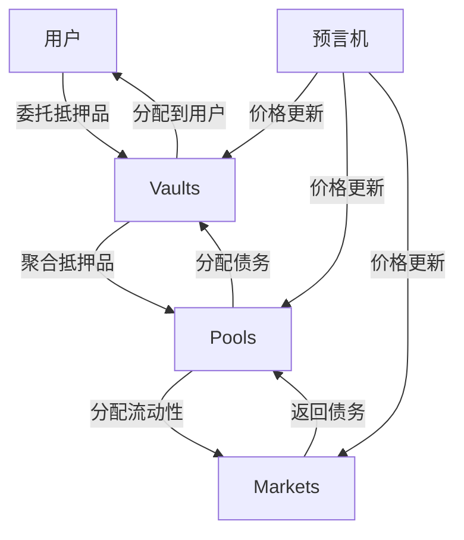
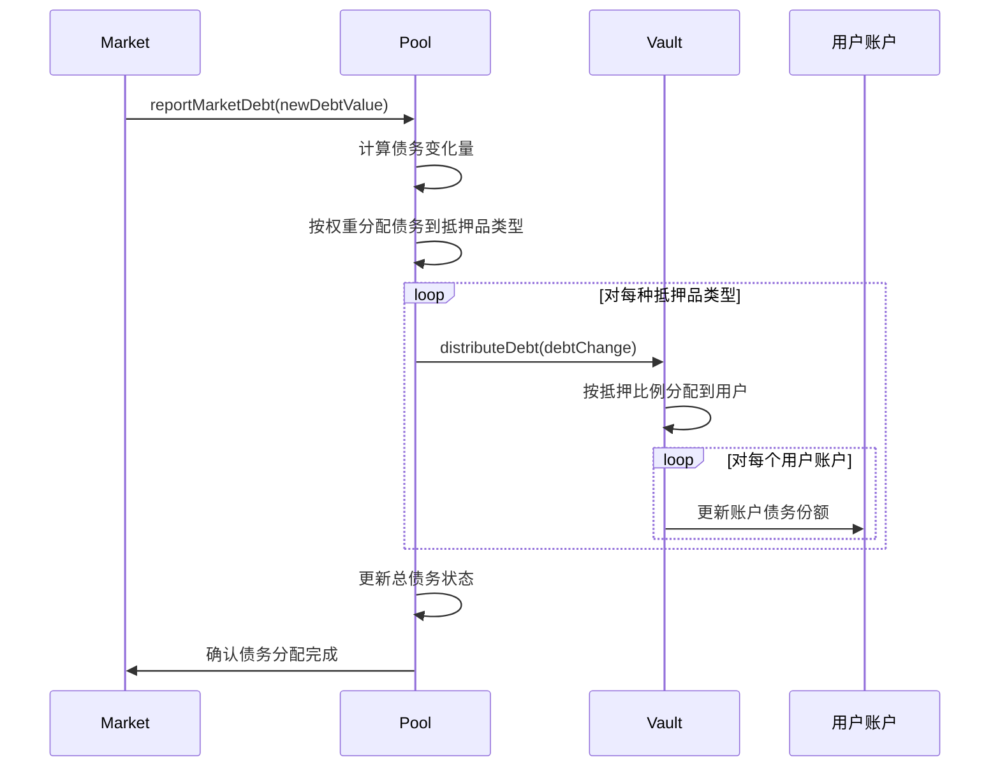
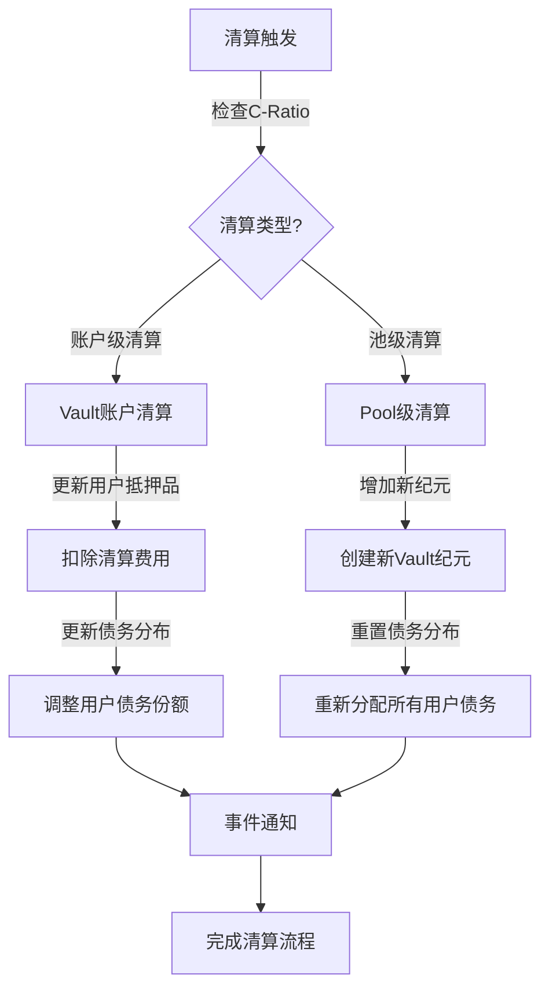
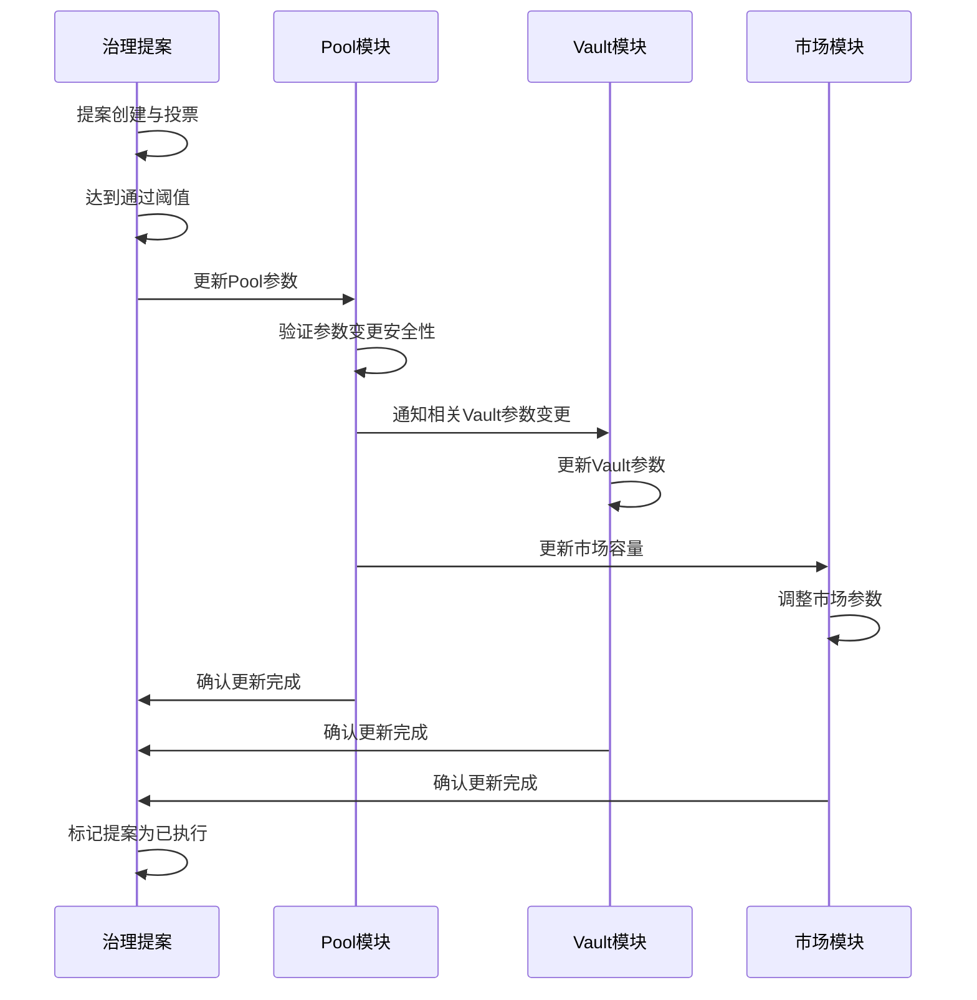

# Pools与Vaults的交互机制

## 概述

Synthetix V3协议中，Pools（池）与Vaults（金库）之间的交互构成了协议的核心运行机制。这种交互支撑了抵押品管理、债务分配和市场流动性供应的基础运作。本文档深入分析这两个组件之间的交互模式、数据流动和权责分配。

## 基础交互模型

### 系统架构视角

Pools与Vaults在V3协议中形成了以下架构关系：



在这个架构中：
1. **Vaults**：负责特定抵押品类型的管理
2. **Pools**：汇聚多种抵押品，协调分配资源
3. **Markets**：使用流动性提供衍生品服务

### 资金流动路径

当用户与系统交互时，资金遵循以下流动路径：

1. **入金路径**：用户 → Vault → Pool → Market
2. **收益路径**：Market（费用）→ Pool（分配）→ Vault（奖励）→ 用户
3. **债务路径**：Market（生成）→ Pool（聚合）→ Vault（分布）→ 用户

## 详细交互流程

### 委托抵押品流程

当用户委托抵押品时，交互过程如下：

```solidity
// 伪代码展示抵押品委托流程
function delegateCollateral(
    uint128 accountId,
    uint128 poolId,
    address collateralType,
    uint256 amount
) external {
    // 1. 验证用户和池信息
    Account.validateAccount(accountId, msg.sender);
    Pool.validatePool(poolId);
    
    // 2. 转移抵押品到Vault
    IERC20(collateralType).transferFrom(msg.sender, address(this), amount);
    
    // 3. Vault记录用户抵押
    vaults[poolId][collateralType].addCollateral(accountId, amount);
    
    // 4. Pool更新聚合抵押品信息
    pools[poolId].updateTotalCollateral(collateralType, amount, true);
    
    // 5. 重新计算Pool可用于Market的流动性
    pools[poolId].recalculateAvailableLiquidity();
    
    // 6. 更新用户债务份额
    vaults[poolId][collateralType].updateDebtShares(accountId);
    
    emit CollateralDelegated(accountId, poolId, collateralType, amount);
}
```

交互细节分析：
1. **状态变更范围**：
   - Vault状态：用户抵押品余额、债务份额
   - Pool状态：总抵押品数量、市场可用流动性
   
2. **关键检查点**：
   - 抵押品转移前验证用户余额
   - 委托前验证池的有效性
   - 抵押品添加后重新计算资产负债比率

### 债务分配流程

市场产生的债务如何通过Pool分配到Vault，然后分配给用户：



核心交互分析：
1. **Pool分配逻辑**：
   - 基于预设权重分配债务
   - 考虑抵押品类型的风险参数
   - 确保总债务不超过系统安全阈值

2. **Vault分配策略**：
   - 基于用户抵押品价值分配债务
   - 使用债务份额机制确保公平分配
   - 考虑用户杠杆设置影响分配比例

### 流动性分配机制

Pool如何将聚合的抵押品流动性分配给不同市场：

```solidity
// 伪代码展示流动性分配逻辑
function distributeMarketCapacity(uint128 poolId) internal {
    Pool.Data storage pool = pools[poolId];
    uint256 totalCollateralValue = pool.getTotalCollateralValue();
    uint256 totalWeights = pool.getTotalMarketWeights();
    
    for (uint256 i = 0; i < pool.registeredMarkets.length; i++) {
        uint128 marketId = pool.registeredMarkets[i];
        uint256 marketWeight = pool.marketConfigurations[marketId].weight;
        
        // 计算市场应获得的流动性比例
        uint256 marketCapacity = (totalCollateralValue * marketWeight) / totalWeights;
        
        // 应用市场特定限制
        uint256 maxCapacity = pool.marketConfigurations[marketId].maxDebtShareValue;
        marketCapacity = Math.min(marketCapacity, maxCapacity);
        
        // 更新市场容量
        markets[marketId].updateCapacity(marketCapacity);
    }
}
```

分配策略分析：
1. **权重系统**：
   - 市场权重决定流动性分配比例
   - 动态调整以响应市场需求变化
   - 治理投票可修改权重分布

2. **容量限制**：
   - 单个市场的最大债务上限
   - 基于风险模型设置的安全阈值
   - 防止单一市场风险过度集中

## 高级交互机制

### 清算互动流程

当账户需要清算时，Pools与Vaults的协同工作：



关键交互点：
1. **账户级清算**：
   - Vault主导的针对单个账户清算
   - Pool接收清算状态更新
   - 不影响其他用户的债务分配

2. **池级清算**：
   - 当整个池的抵押不足时触发
   - 涉及所有Vault的纪元更新
   - 所有用户债务重新分配

### 奖励分发流程

Pools与Vaults在奖励分发中的合作机制：

```solidity
// 伪代码展示奖励分发流程
function distributeRewards(
    uint128 poolId,
    address rewardToken,
    uint256 rewardAmount
) external onlyRewardDistributor {
    Pool.Data storage pool = pools[poolId];
    
    // 计算每个Vault应获得的奖励
    for (uint256 i = 0; i < pool.preferredCollateral.length; i++) {
        address collateralType = pool.preferredCollateral[i];
        Vault.Data storage vault = pool.vaults[collateralType];
        
        // 基于抵押品价值计算奖励比例
        uint256 vaultCollateralValue = vault.getTotalCollateralValue();
        uint256 vaultRewardShare = (rewardAmount * vaultCollateralValue) / pool.getTotalCollateralValue();
        
        // 将奖励发送到Vault
        vault.receiveRewards(rewardToken, vaultRewardShare);
        
        // Vault负责基于用户债务份额分配奖励
        vault.distributeRewardsToUsers(rewardToken);
    }
    
    emit RewardsDistributed(poolId, rewardToken, rewardAmount);
}
```

分配逻辑分析：
1. **Pool层面分配**：
   - 基于Vault抵押品价值分配奖励
   - 可应用治理定义的奖励乘数
   - 跟踪不同奖励代币的分发

2. **Vault层面分配**：
   - 基于用户债务份额分配奖励
   - 实施最低抵押时间要求
   - 允许用户声明累积奖励

## 数据同步与状态一致性

### 关键状态同步点

Pools与Vaults必须保持状态一致性的关键点：

1. **抵押品价值更新**：
   - 价格预言机更新触发重新评估
   - Pool和Vault同时更新抵押品价值
   - 抵押率检查基于同步后状态

2. **债务分配同步**：
   - 市场债务变更传播到Pool
   - Pool债务分配到多个Vaults
   - 确保总债务在各组件间保持一致

3. **系统参数变更**：
   - 治理参数更新同时影响Pool和Vault
   - 风险参数变更需要级联更新
   - 版本迁移需要协调状态迁移

### 原子性操作保证

为确保系统状态一致性，V3实现了以下原子性保证：

1. **事务原子性**：
   - 关键操作封装在单一事务中
   - 使用重入锁防止状态不一致
   - 失败操作完全回滚

2. **状态验证**：
   - 操作前后进行状态一致性检查
   - 使用不变量验证确保系统安全
   - 事件记录用于外部验证

```solidity
// 伪代码展示原子性保证示例
function atomicOperation() external nonReentrant {
    // 记录初始状态哈希
    bytes32 initialStateHash = calculateSystemStateHash();
    
    // 执行状态变更操作
    try {
        // 执行多步骤操作...
    } catch {
        // 完全回滚
        revert("Operation failed");
    }
    
    // 验证最终状态一致性
    bytes32 finalStateHash = calculateSystemStateHash();
    require(validateStateTransition(initialStateHash, finalStateHash), "Invalid state transition");
    
    emit OperationCompleted(initialStateHash, finalStateHash);
}
```

## 效率优化机制

### 批处理操作

V3实现了多种批处理机制优化Pool和Vault交互：

1. **债务批量更新**：
   - 累积多个市场债务变化后一次性分配
   - 减少Gas成本和状态更新频率
   - 优化大规模用户操作处理

2. **奖励批量分发**：
   - 周期性奖励计算替代实时计算
   - 用户级奖励累积减少存储写入
   - 优化链上计算效率

### 缓存与延迟计算

为提高系统效率，V3实施了多层缓存策略：

```solidity
// 伪代码展示缓存优化
contract OptimizedVault {
    // 缓存结构
    struct Cache {
        uint256 lastUpdateTime;
        uint256 cachedTotalCollateralValue;
        uint256 cachedTotalDebtValue;
        // 其他缓存字段...
    }
    
    mapping(address => Cache) public collateralCache;
    
    function getTotalCollateralValue(address collateralType) public view returns (uint256) {
        Cache memory cache = collateralCache[collateralType];
        
        // 如果缓存是最新的，直接返回
        if (block.timestamp - cache.lastUpdateTime < CACHE_VALIDITY_PERIOD) {
            return cache.cachedTotalCollateralValue;
        }
        
        // 否则计算新值
        uint256 freshValue = computeTotalCollateralValue(collateralType);
        return freshValue;
    }
    
    // 只在必要时更新缓存
    function updateCacheIfNeeded(address collateralType) internal {
        if (shouldUpdateCache(collateralType)) {
            updateCollateralCache(collateralType);
        }
    }
}
```

优化策略分析：
1. **懒惰更新模式**：
   - 仅在必要时更新完整状态
   - 使用增量更新减少计算量
   - 优先级队列处理状态更新

2. **计算优化**：
   - 利用累积值代替全量重算
   - 定期快照减少历史遍历
   - 链下计算搭配链上验证

## 安全与错误处理

### 一致性保护机制

V3实现了多层保护机制确保Pool和Vault交互安全：

1. **数值溢出防护**：
   - 使用SafeMath库防止算术错误
   - 验证输入范围避免极端值
   - 金额上限限制避免操作错误

2. **逻辑不变量**：
   - 池总债务必须等于所有Vault债务之和
   - 用户债务份额总和必须等于Vault总债务
   - 系统总抵押价值必须大于或等于总债务价值

### 故障恢复策略

系统设计了故障恢复机制处理异常情况：

1. **紧急暂停**：
   - 模块级暂停功能隔离问题
   - 选择性暂停特定Pool或Vault
   - 保留最小功能允许用户取回资金

2. **版本回滚**：
   - 状态存档支持回滚关键操作
   - 纪元系统支持系统级恢复点
   - 治理批准的紧急恢复程序

## 治理交互

### 参数治理

Pools与Vaults的治理参数调整机制：

1. **Pool治理参数**：
   - 市场权重配置
   - 抵押品风险参数
   - 流动性上限设置

2. **Vault治理参数**：
   - 最低抵押率要求
   - 清算阈值调整
   - 奖励分配比例

3. **协调更新流程**：
   - 参数更新提案流程
   - 时间锁定执行
   - 影响模拟与安全检查

### 跨模块治理决策

需要协调多个模块的治理决策流程：



## 未来扩展性考虑

### 模块化扩展路径

V3的Pool-Vault架构设计支持以下扩展路径：

1. **新抵押品类型**：
   - 创建新Vault类型
   - 配置与Pool的集成参数
   - 实施特定抵押品的风险控制

2. **新市场类型**：
   - 定义新市场与Pool的交互接口
   - 配置债务分配与流动性管理
   - 实施市场特定的风险参数

3. **跨链扩展**：
   - 设计跨链Vault状态同步
   - 实现跨链Pool流动性协调
   - 建立跨链债务和抵押品追踪

## 优化建议

### 当前架构优化机会

基于分析，以下是Pool-Vault交互的优化建议：

1. **状态压缩**：
   - 更紧凑的数据表示减少存储成本
   - 位级打包优化存储布局
   - 状态差异编码减少更新成本

2. **计算优化**：
   - 预计算常用值减少实时计算
   - 分层缓存策略优化读取模式
   - 批量更新减少交易频率

3. **接口简化**：
   - 统一Pool-Vault交互接口
   - 简化跨模块调用路径
   - 优化事件结构提高可分析性

## 结论

Synthetix V3中的Pool-Vault交互机制构成了协议的核心功能支柱。这种设计实现了抵押品聚合、风险隔离和流动性优化的平衡，为协议的稳定性和可扩展性奠定了基础。

通过精心设计的数据流和状态同步机制，V3能够支持复杂的DeFi应用场景，同时保持系统的安全性和效率。随着协议的发展，这种交互机制将继续演进，适应新的市场需求和技术可能性。
