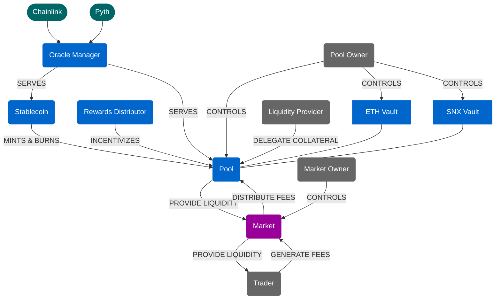

# Synthetix V3 系统架构图

下面的图表展示了Synthetix V3的核心组件及其交互关系。

## 图表说明

### 组件颜色说明

- **蓝色** - V3核心组件，任何人都可以使用
- **深绿色** - 任何适合的外部预言机
- **紫色** - 任何人都可以创建的市场
- **灰色** - 可以是任何人的所有者/用户

### 主要组件

1. **Oracle Manager** - 管理来自Chainlink和Pyth等预言机的价格数据
2. **Stablecoin** - 稳定币组件，通过Pool进行铸造和销毁
3. **Pool** - 核心资金池组件，管理抵押品并提供流动性
4. **Vault** - 抵押品保管库，包括ETH Vault和SNX Vault
5. **Rewards Distributor** - 负责分发奖励以激励Pool参与者
6. **Market** - 交易市场，与Pool交互以提供流动性

### 用户角色

1. **Liquidity Provider** - 向Pool提供抵押品的用户
2. **Pool Owner** - 控制Pool和相关Vault的管理者
3. **Market Owner** - 控制Market的管理者
4. **Trader** - 与Market交互进行交易的用户

### 关键交互流程

1. **价格数据流**: Chainlink/Pyth → Oracle Manager → Pool/Stablecoin
2. **流动性流**: Liquidity Provider → Pool → Market → Trader
3. **费用流**: Trader → Market → Pool → (分配给流动性提供者)
4. **激励流**: Rewards Distributor → Pool
5. **控制流**: Pool Owner → Pool/Vaults, Market Owner → Market
