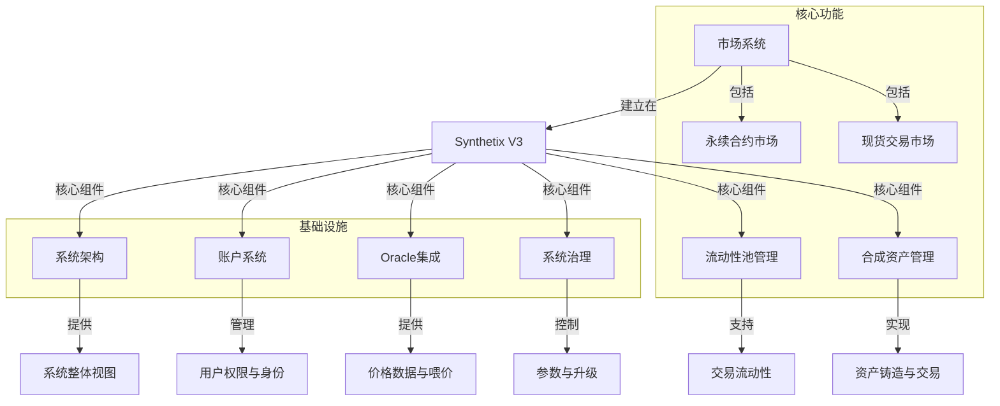
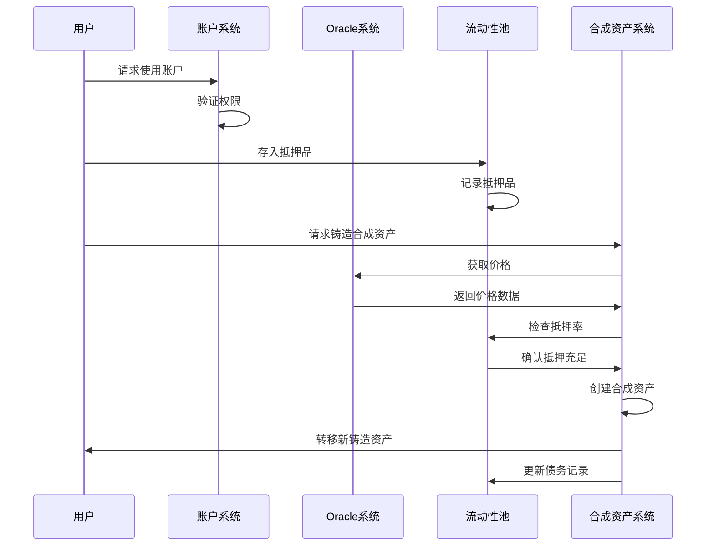
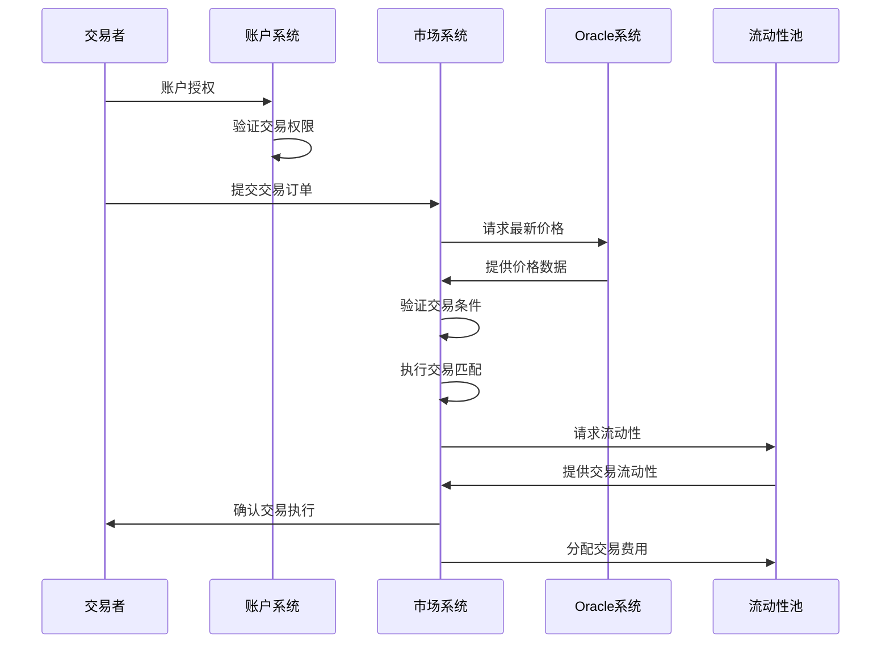
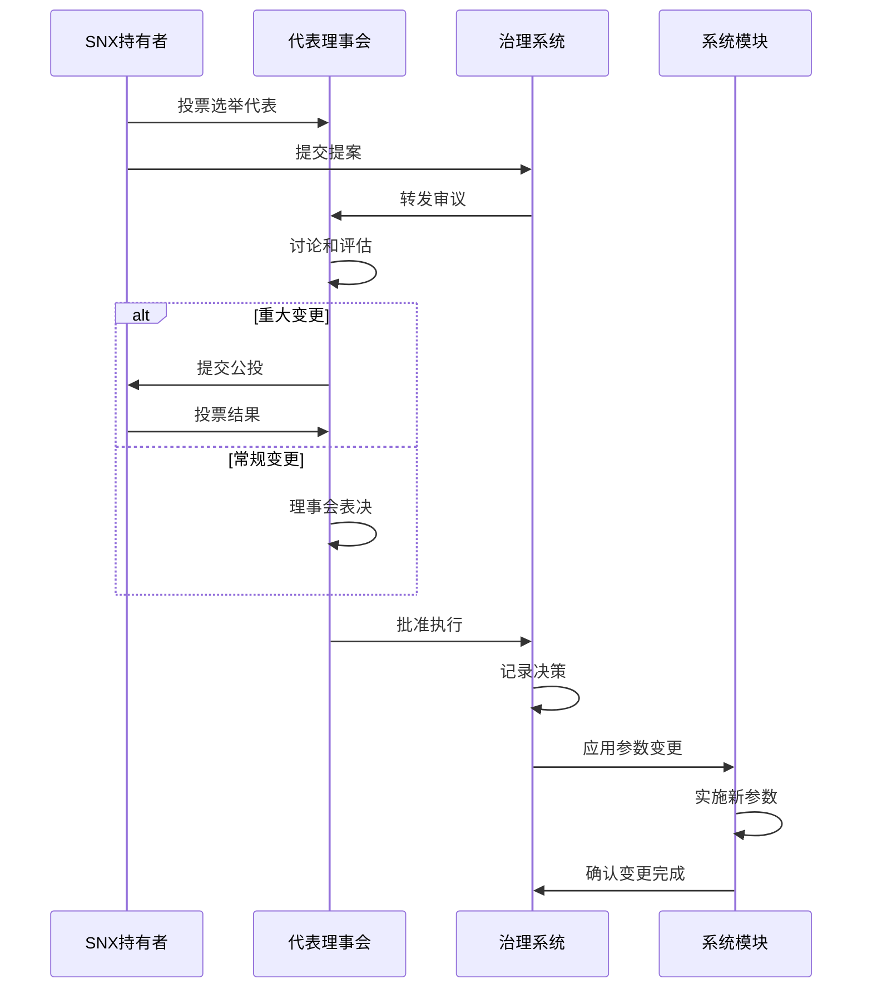
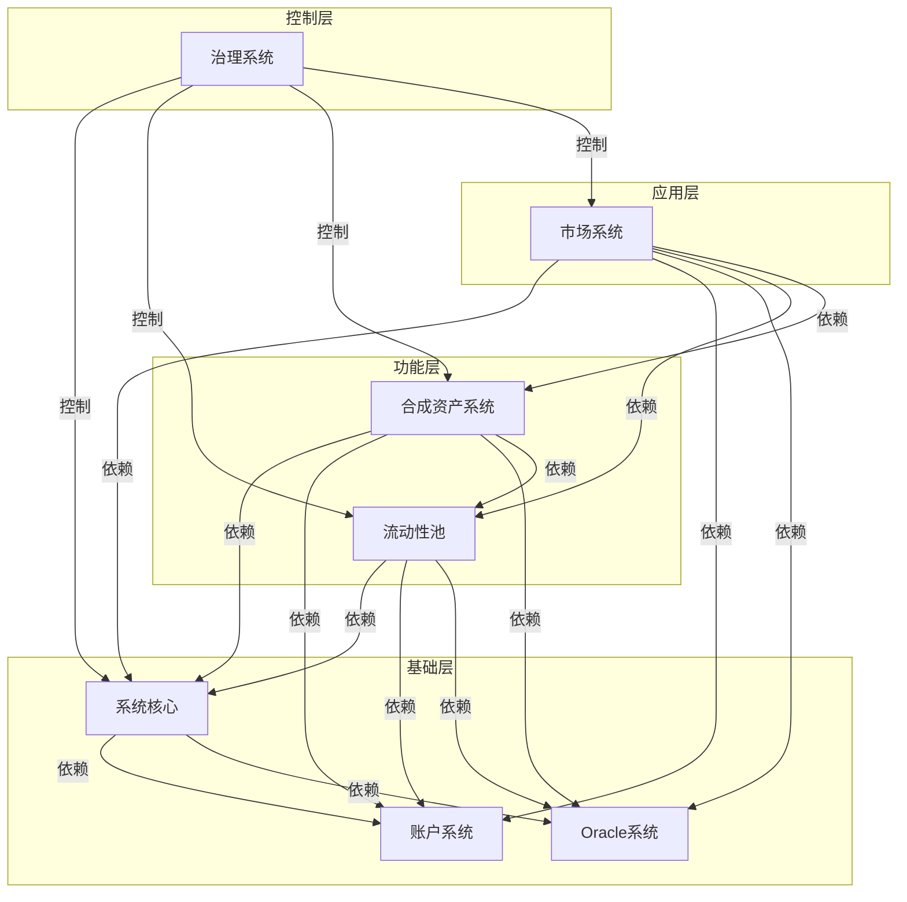

# Synthetix V3 系统分析文档索引

本文档提供Synthetix V3系统分析的综合索引，将各个模块的详细分析文档组织在一起，方便整体了解系统架构和业务流程。

## 系统概述

Synthetix V3是一个去中心化的衍生品流动性协议，允许创建合成资产并在链上交易，通过创新的池化流动性机制和灵活的多抵押品系统提供无滑点交易体验。本分析文档集合旨在深入探讨Synthetix V3的各个核心模块及其相互作用。

## 文档目录

### 1. 系统核心与架构

- [系统架构概览](/Users/zplao/Documents/GitHub/ThreeProtocol/DOC/core/system-architecture-diagram.md)
  - 概述Synthetix V3的整体架构设计
  - 展示核心组件及其交互关系
  - 提供系统高层视图

### 2. 账户与权限管理

- [账户系统与权限管理](/Users/zplao/Documents/GitHub/ThreeProtocol/DOC/accounts/account-management.md)
  - 分析基于NFT的创新账户模型
  - 细粒度权限控制系统设计
  - 授权委托机制与跨模块账户交互
  - 账户安全保障机制

### 3. Oracle集成系统

- [Oracle价格数据集成](/Users/zplao/Documents/GitHub/ThreeProtocol/DOC/oracle/oracle-integration.md)
  - Oracle在系统中的核心作用
  - 价格数据来源与验证机制
  - 多Oracle聚合与防操纵设计
  - 跨链Oracle协调与容错机制

### 4. 流动性池管理

- [流动性池管理机制](/Users/zplao/Documents/GitHub/ThreeProtocol/DOC/pool/liquidity-pool-management.md)
  - 流动性池结构设计与角色
  - 多抵押品管理策略
  - 流动性提供者激励机制
  - 风险分担与收益分配模型
  - 跨池互操作性设计

### 5. 合成资产系统

- [合成资产铸造与管理](/Users/zplao/Documents/GitHub/ThreeProtocol/DOC/synthetic/synthetic-assets.md)
  - 合成资产创建与赎回流程
  - 多抵押品铸造策略
  - 价格确定与交易执行模型
  - 风险管理与清算机制
  - 资产类型与配置系统

### 6. 系统治理与参数控制

- [治理系统与参数控制](/Users/zplao/Documents/GitHub/ThreeProtocol/DOC/governance/governance-system.md)
  - 多层次治理架构设计
  - 参数配置管理系统
  - 协议升级机制实现
  - 跨链治理协调方案
  - 治理安全防护措施

### 7. 市场系统

- [永续合约市场](/Users/zplao/Documents/GitHub/ThreeProtocol/DOC/markets/perps-market.md)
  - 永续合约市场设计
  - 订单类型与执行机制
  - 资金费率与市场平衡
  - 清算流程与风险控制

## 系统交互流程

以下是几个关键业务流程的概述，展示主要组件如何协同工作：

### 合成资产铸造流程

### 交易执行流程

### 治理决策流程

## 模块依赖关系

以下是Synthetix V3主要模块之间的依赖关系图，展示了系统各组件如何相互关联：

## 未来扩展方向

基于当前的系统分析，以下是可能的未来分析和扩展方向：

1. **深入技术实现**
   - 智能合约架构与设计模式
   - 安全措施与防攻击机制
   - 性能优化策略

2. **跨链扩展分析**
   - 跨链资产桥接机制
   - 多链部署和协调策略
   - 跨链消息传递系统

3. **新市场机制**
   - 期权市场设计
   - 组合资产和指数产品
   - 新型衍生品结构

4. **用户体验改进**
   - 前端交互设计
   - 风险管理工具
   - 数据可视化解决方案

## 术语表

| 术语 | 定义 |
|------|------|
| SNX | Synthetix网络代币，治理系统的核心代币 |
| 合成资产 | 在Synthetix系统中创建的代表各种基础资产价值的代币 |
| 流动性池 | 提供交易流动性和风险承担的资金池 |
| Oracle | 向系统提供价格和其他外部数据的数据源 |
| 抵押率 | 抵押品价值与铸造资产价值之比 |
| 清算 | 当账户抵押率低于阈值时强制出售抵押品的过程 |
| 永续合约 | 无到期日的衍生品合约，通过资金费率机制维持价格 |
| 代表理事会 | 由SNX持有者选举产生的负责日常治理决策的机构 |

## 文档更新计划

本文档集合计划根据Synthetix V3的发展进行持续更新：

1. **定期更新**
   - 随系统主要版本更新文档
   - 添加新增功能和模块分析
   - 更新过时的流程和架构图

2. **计划中的文档**
   - 详细的API参考文档
   - 开发者指南和集成教程
   - 风险模型和经济安全分析

## 贡献指南

欢迎对本文档集合进行贡献和改进：

1. 提交错误修正和内容更新
2. 建议新的分析主题和方向
3. 提供反馈和改进建议

## 联系方式

如有问题或建议，请通过以下方式联系：

- 项目仓库: [GitHub Repository](https://github.com/OlendDAO/ThreeProtocol)
- 文档维护者: zplao
