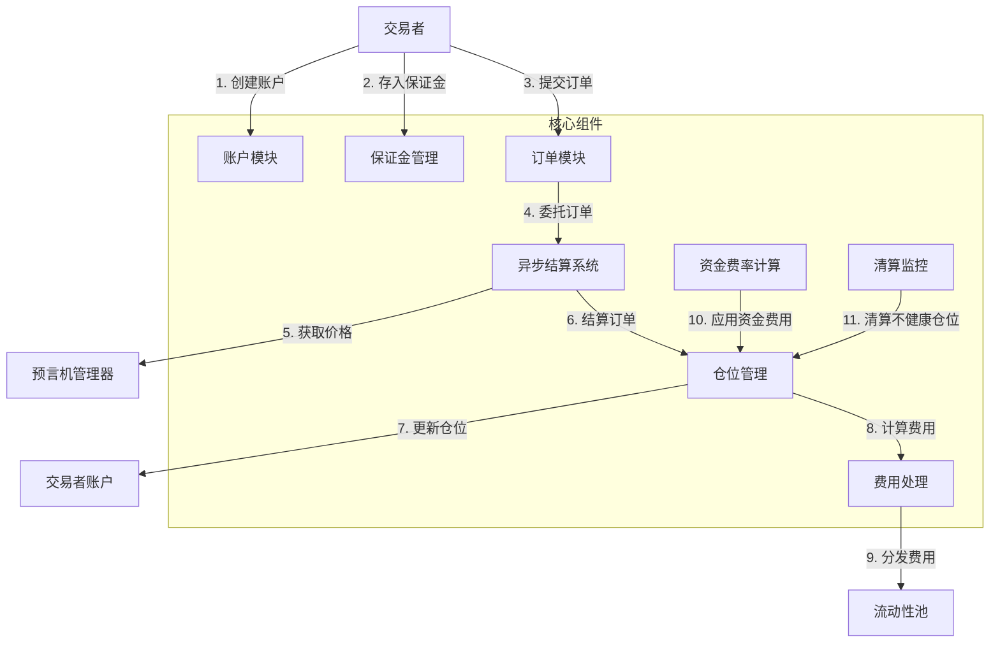
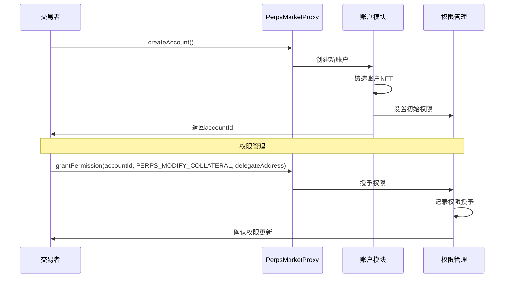
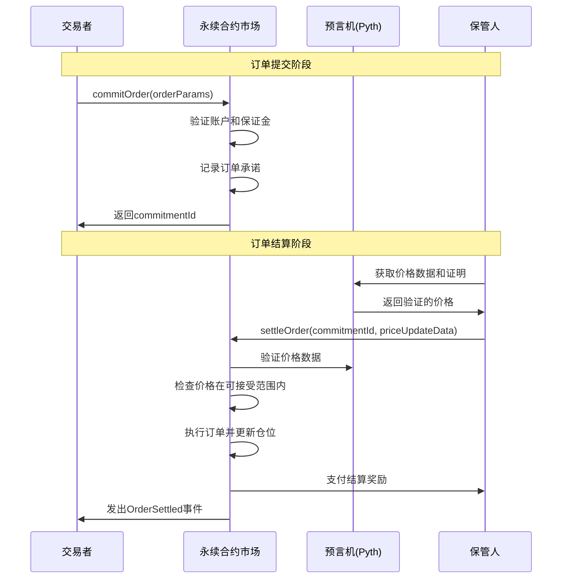
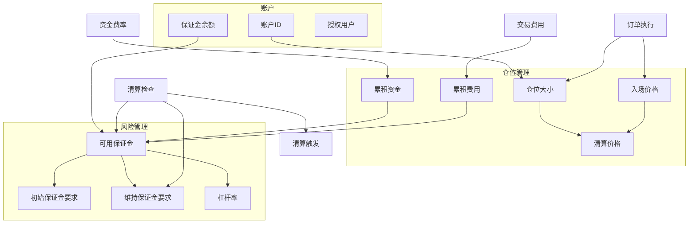
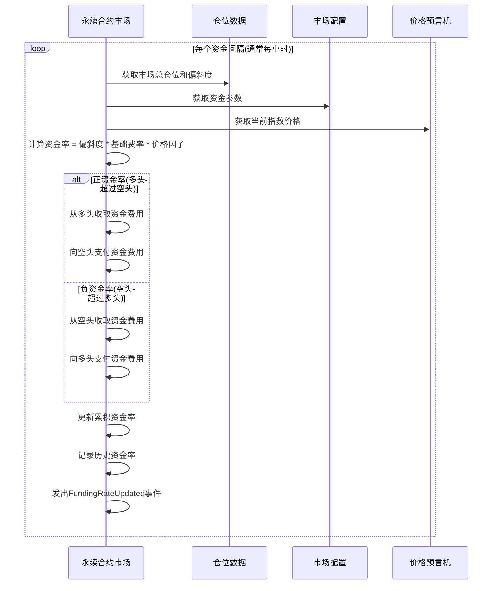
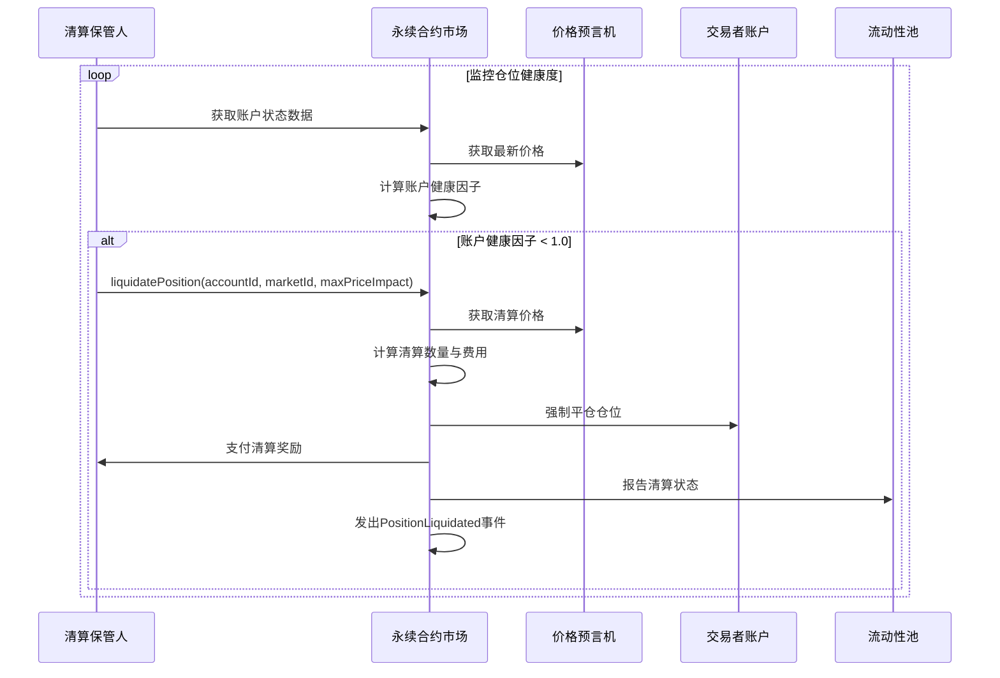
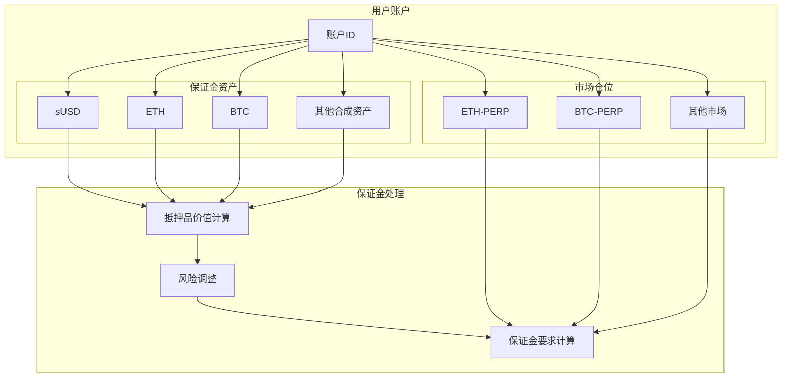

# Synthetix V3 永续合约市场流程分析

本文档详细分析Synthetix V3永续合约(Perps V3)的核心业务流程，包括订单处理、仓位管理和清算机制等。

## 目录

1. [永续合约市场概述](#永续合约市场概述)
2. [账户创建与管理流程](#账户创建与管理流程)
3. [订单提交与结算流程](#订单提交与结算流程)
4. [仓位管理流程](#仓位管理流程)
5. [资金费率计算与应用](#资金费率计算与应用)
6. [清算流程](#清算流程)
7. [跨保证金功能](#跨保证金功能)

## 永续合约市场概述

Synthetix V3永续合约市场(Perps V3)是Synthetix生态系统的旗舰衍生品市场实现，它允许交易者在无到期日的情况下建立杠杆多空仓位。

Perps V3相比前代产品的主要改进：

1. **跨保证金**: 账户保证金可用于多个市场的多个仓位
2. **仅支持异步订单**: 简化结算流程并减少操作复杂性
3. **无订单取消**: 减少保管人需要执行的操作和LP需要支付的费用
4. **基于角色的访问控制**: 用于修改抵押品、开/平仓位的灵活访问控制
5. **利用率利率**: 基于市场利用率的动态利率计算
6. **多抵押品支持**: 接受任何在系统中配置的合成资产作为账户保证金

## 账户创建与管理流程

Perps V3采用了基于NFT的账户管理系统，交易者首先需要创建一个账户才能与永续合约市场交互。

账户创建与管理流程说明：

1. **账户创建**:
   - 调用`PerpsMarketProxy.createAccount()`创建账户
   - 可以指定特定的accountId或使用随机生成的ID
   - 账户以NFT形式表示，归交易者所有

2. **权限管理**:
   - 账户所有者可以委托权限给其他地址
   - 支持的关键权限包括`PERPS_MODIFY_COLLATERAL`和`PERPS_COMMIT_ASYNC_ORDER`
   - 权限可以被授予和撤销，支持灵活的访问控制

3. **账户访问控制**:
   - 账户所有者拥有完全控制权
   - 被授权地址只能执行已授权的特定操作
   - 权限可以细粒度控制到具体功能

## 订单提交与结算流程

Perps V3采用了异步订单处理模型，订单提交和结算是分离的两个阶段，通过保管人协助完成结算。

订单提交与结算流程说明：

1. **订单提交**:
   - 交易者调用`commitOrder`函数提交订单
   - 订单参数包括：市场ID、账户ID、大小变化、结算策略ID、可接受价格等
   - 系统验证账户保证金是否足够并记录订单承诺

2. **订单结算**:
   - 保管人(第三方或自动化系统)监控待处理订单
   - 保管人从Pyth等预言机获取价格数据和验证证明
   - 保管人调用`settleOrder`函数结算订单
   - 系统验证价格数据，检查价格是否在交易者设定的可接受范围内
   - 如果价格验证通过，系统执行订单并更新交易者的仓位

3. **价格保护**:
   - `acceptablePrice`参数保护交易者免受价格滑点
   - 对于多头订单，执行价格不能高于可接受价格
   - 对于空头订单，执行价格不能低于可接受价格

## 仓位管理流程

仓位管理是永续合约市场的核心功能，Perps V3实现了跨保证金仓位管理，允许单个账户在多个市场上持有仓位。

仓位管理流程说明：

1. **仓位创建与修改**:
   - 通过订单执行创建或修改仓位
   - 每个市场每个账户只允许一个仓位(多头或空头)
   - 仓位大小可以是正(多头)或负(空头)

2. **仓位跟踪**:
   - 系统跟踪仓位大小、入场价格、累积资金费用等
   - 通过`getOpenPosition`函数查询当前仓位状态
   - 仓位状态包括已实现和未实现的盈亏

3. **保证金管理**:
   - 账户保证金用于所有仓位(跨保证金)
   - 系统计算可用保证金、初始保证金和维持保证金
   - 账户健康度基于总保证金与总风险的比率

4. **杠杆率控制**:
   - 系统限制最大允许杠杆率
   - 新订单必须满足初始保证金要求
   - 现有仓位必须维持最低维持保证金

## 资金费率计算与应用

资金费率是永续合约中平衡市场偏斜度的关键机制，Perps V3实现了基于市场偏斜度的资金费率计算。

资金费率计算与应用流程说明：

1. **资金率计算**:
   - 定期(通常每小时)更新资金率
   - 资金率基于市场偏斜度(多头总量减去空头总量)
   - 计算公式: 资金率 = 偏斜度 * 基础费率 * 价格因子

2. **资金费用应用**:
   - 资金费用在仓位之间转移，保持市场中性
   - 正资金率时，多头付款给空头
   - 负资金率时，空头付款给多头

3. **累积跟踪**:
   - 系统累积跟踪每个仓位的资金费用
   - 资金费用影响仓位的有效保证金
   - 交易者可以查询累积资金费用

## 清算流程

清算是管理系统风险的关键机制，Perps V3实现了高效的清算流程以保护流动性提供者免受交易者违约风险。

清算流程说明：

1. **健康度监控**:
   - 清算保管人监控账户健康因子
   - 健康因子 = 账户价值 / 维持保证金要求
   - 健康因子 < 1.0 时触发清算

2. **清算执行**:
   - 清算保管人调用`liquidatePosition`函数
   - 系统获取清算价格并计算清算数量
   - 强制平仓交易者的仓位，收取清算费用
   - 向清算保管人支付清算奖励

3. **部分与完全清算**:
   - 支持部分清算以减少市场冲击
   - 如果部分清算后健康因子仍不足，继续清算
   - 完全清算后返还剩余保证金(如有)

## 跨保证金功能

Perps V3.2引入了多抵押品支持，允许交易者使用多种资产作为保证金，增强了资本效率。

跨保证金功能说明：

1. **多抵押品支持**:
   - 账户可以存入多种抵押品类型
   - 每种抵押品根据其风险特性应用不同的折扣
   - 通过`modifyCollateral`函数管理抵押品

2. **抵押品价值计算**:
   - 系统使用预言机价格计算抵押品的USD价值
   - 应用风险调整以计算有效保证金价值
   - 总保证金价值用于计算账户健康度

3. **跨市场风险管理**:
   - 所有市场仓位共享账户保证金(跨保证金)
   - 风险计算考虑所有仓位的综合风险
   - 任一市场仓位不健康可能触发所有仓位清算
