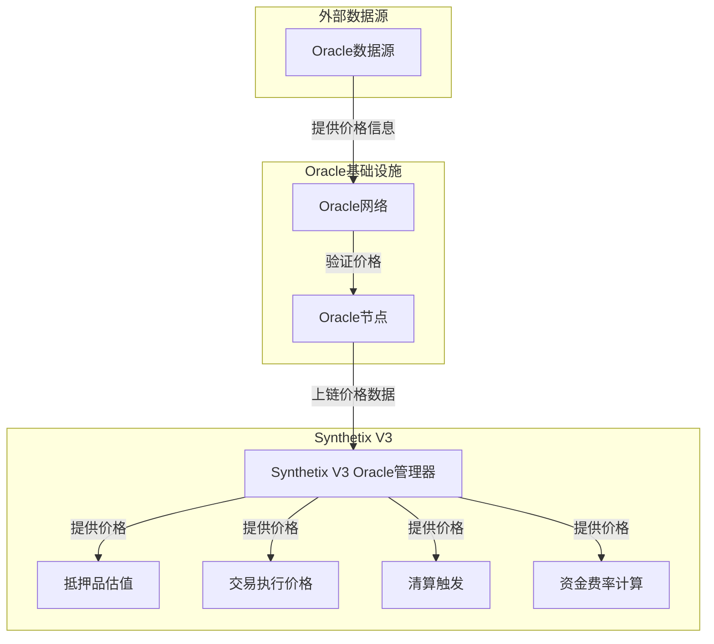
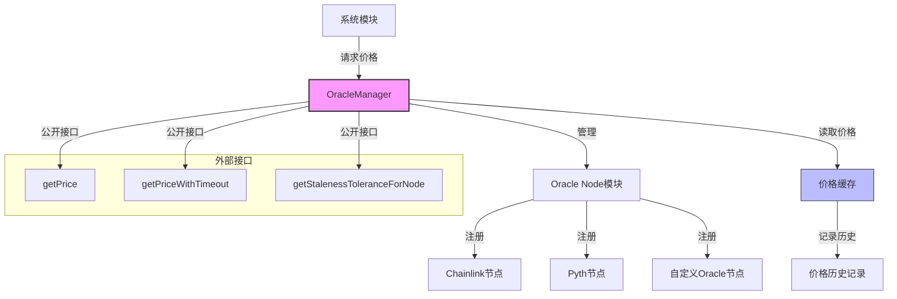
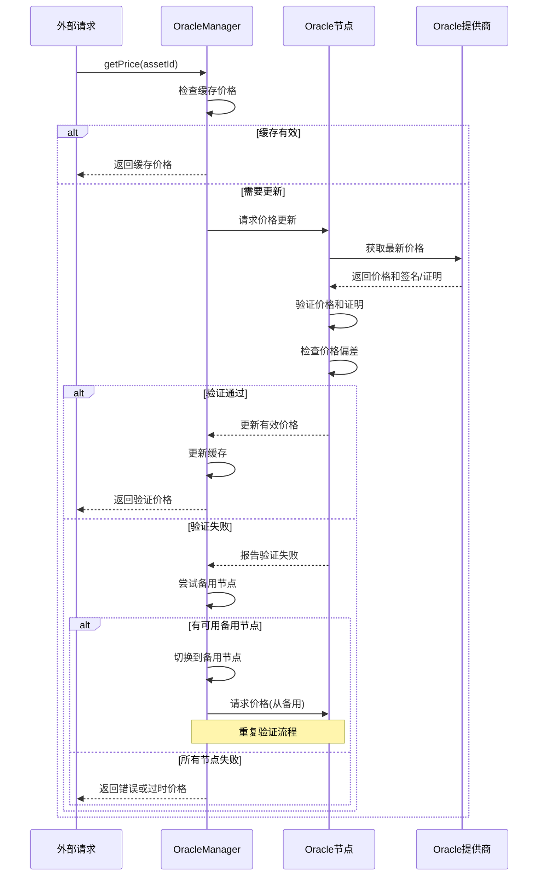
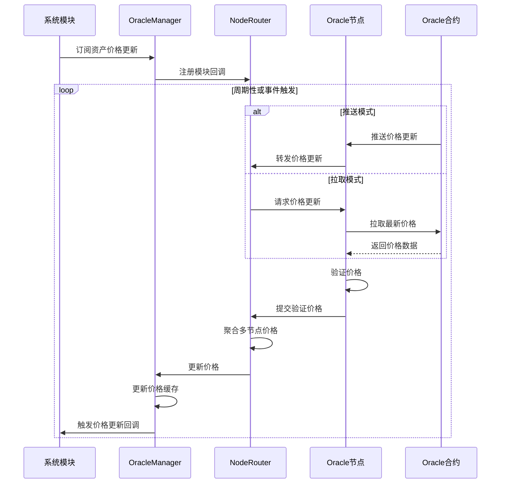
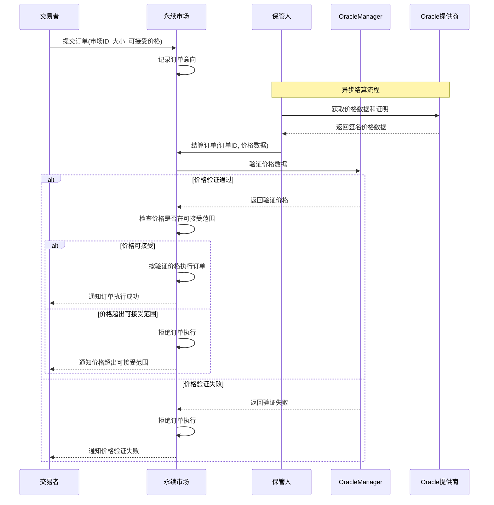
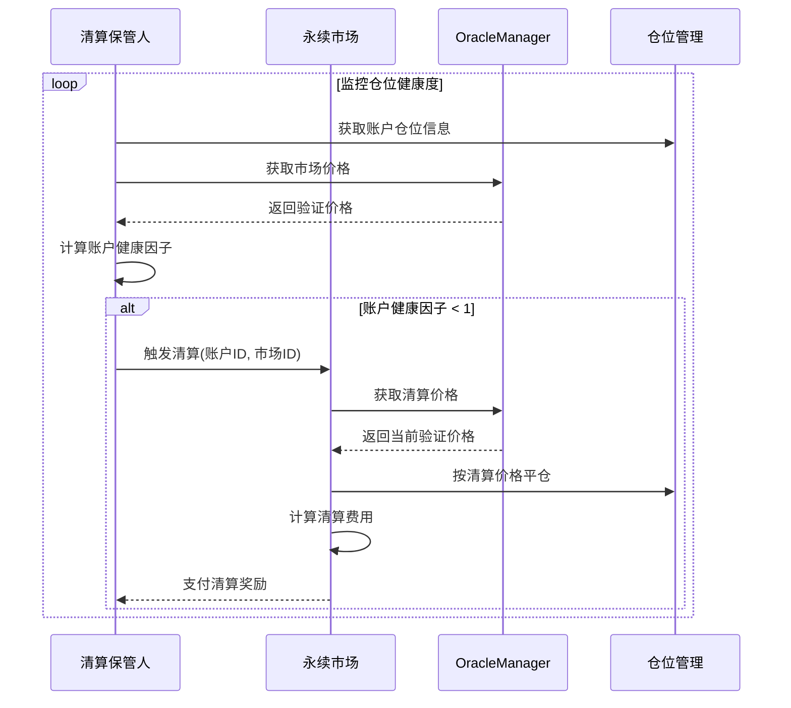
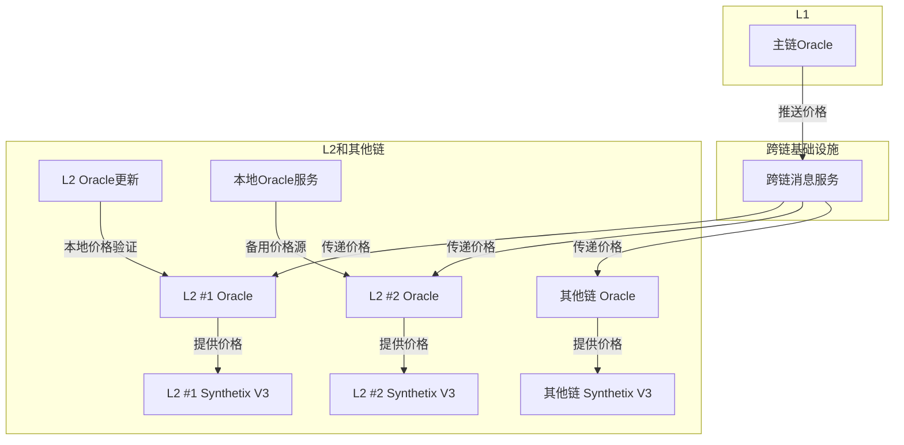
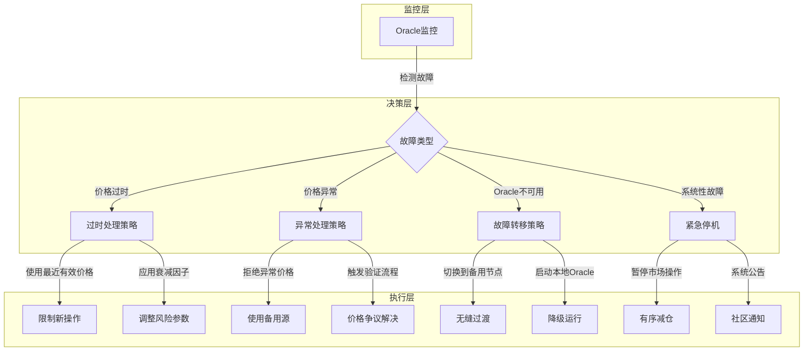

# Synthetix V3 Oracle集成分析

本文档详细分析Synthetix V3的Oracle集成机制，包括架构设计、价格验证流程及故障安全机制。

## 目录

1. [Oracle在Synthetix V3中的角色](#oracle在synthetix-v3中的角色)
2. [Oracle架构设计](#oracle架构设计)
3. [价格验证机制](#价格验证机制)
4. [Oracle集成流程](#oracle集成流程)
5. [跨链Oracle支持](#跨链oracle支持)
6. [Oracle故障安全机制](#oracle故障安全机制)

## Oracle在Synthetix V3中的角色

预言机(Oracle)在Synthetix V3中扮演着至关重要的角色，作为链下数据（主要是价格信息）的可信来源。Synthetix V3依赖这些价格数据进行多项核心操作：



### Oracle的关键功能

1. **抵押品估值**
   - 提供抵押品资产的精确价格
   - 确保抵押品价值正确计算
   - 支持多种加密资产价格发现

2. **交易执行价格**
   - 为订单执行提供公平市场价格
   - 防止价格操纵和前置交易
   - 确保交易者获得透明定价

3. **清算触发**
   - 监控仓位健康度
   - 基于实时价格触发清算流程
   - 确保系统偿付能力

4. **资金费率计算**
   - 提供指数价格用于计算资金费率
   - 确保永续合约与现货市场价格收敛

### 支持的Oracle提供商

Synthetix V3设计灵活，支持多个Oracle提供商：

1. **Chainlink**
   - 高度去中心化的预言机网络
   - 提供广泛的价格对支持
   - 通过多节点聚合提高可靠性

2. **Pyth Network**
   - 高性能预言机解决方案
   - 提供毫秒级价格更新
   - 支持跨链价格传递

3. **Optimistic Oracle**
   - 基于挑战机制的预言机模型
   - 用于某些低频率更新场景

### 多Oracle策略

Synthetix V3采用多Oracle策略，提高系统安全性与可靠性：

1. **多源验证**
   - 从多个Oracle提供商获取数据
   - 交叉验证价格以检测异常

2. **降级路径**
   - 当主要Oracle失败时的备用系统
   - 优雅降级保障系统连续性

3. **偏差阈值**
   - 设置价格偏差阈值以识别异常
   - 当价格超出阈值时触发保护机制

## Oracle架构设计

Synthetix V3实现了模块化的Oracle架构，以适应不同数据源和保持系统灵活性。



### OracleManager

OracleManager是Oracle集成的核心组件，负责：

1. **节点管理**
   - 注册和配置Oracle节点
   - 为每种资产分配主要和次要Oracle
   - 管理节点权重和优先级

2. **价格聚合**
   - 从多个节点收集价格数据
   - 应用聚合策略（如中位数或加权平均）
   - 过滤异常值并验证价格有效性

3. **接口标准化**
   - 为系统其他部分提供统一接口
   - 抽象各Oracle提供商的技术细节
   - 提供一致的价格查询方式

```solidity
// OracleManager简化接口
interface IOracleManager {
    // 获取资产价格
    function getPrice(bytes32 assetId) external view returns (uint price, uint timestamp);
    
    // 使用超时参数获取价格
    function getPriceWithTimeout(bytes32 assetId, uint timeoutSeconds) 
        external view returns (uint price, uint timestamp);
    
    // 注册节点
    function registerNode(address nodeAddress, bytes32 nodeId) external;
    
    // 配置资产的Oracle节点
    function configureAssetOracles(
        bytes32 assetId, 
        bytes32[] calldata nodeIds, 
        uint[] calldata weights
    ) external;
}
```

### NodeModule与Oracle节点

每个Oracle来源通过专用的NodeModule集成到系统中：

1. **NodeModule**
   - 实现统一的接口与OracleManager通信
   - 负责特定Oracle提供商的连接逻辑
   - 处理数据格式转换和验证

2. **节点类型**
   - **直接节点**：直接从链上Oracle合约读取价格
   - **签名节点**：验证带签名的价格更新（如Pyth）
   - **聚合节点**：组合多个节点的价格数据

3. **节点配置参数**
   - 价格过时阈值
   - 偏差容忍度
   - 节点权重
   - 最小响应要求

## 价格验证机制

Synthetix V3实现了多层价格验证机制，确保使用的价格数据准确和可信。



### 价格有效性验证

每个价格更新经过多重验证：

1. **数据格式验证**
   - 检查价格格式是否符合预期
   - 验证价格是否在合理范围内
   - 确认时间戳是否有效

2. **来源验证**
   - 验证数据来源授权
   - 对于签名型Oracle，验证签名有效性
   - 对于Pyth等，验证Merkle证明

3. **时效性验证**
   - 检查价格时间戳是否过期
   - 不同资产类有不同的时效要求
   - 高波动性资产要求更频繁更新

### 价格偏差检测

系统实现了价格偏差检测机制：

1. **同源偏差检测**
   - 比较与上次更新的价格变化
   - 触发阈值基于资产波动特性配置

2. **跨源偏差检测**
   - 比较不同Oracle源的价格
   - 大偏差触发警报或使用中位数

3. **指数价格比较**
   - 与外部指数价格比较
   - 识别局部市场异常

## Oracle集成流程

Oracle数据在Synthetix V3中的多个业务流程中发挥关键作用。

### 价格订阅与更新流程



### 交易价格应用流程

在永续合约交易中的Oracle价格应用：



### 清算中的价格应用

Oracle价格在清算过程中的应用：



## 跨链Oracle支持

Synthetix V3的跨链部署需要特殊的Oracle策略，确保不同链上的价格一致性。



### 跨链价格传播机制

Synthetix V3实现了几种跨链价格传播策略：

1. **主链价格权威模式**
   - 主链(如以太坊)作为价格权威来源
   - 通过跨链消息桥将价格传递到其他链
   - 确保所有链上使用相同的价格数据

2. **本地验证模式**
   - 每条链上都有本地Oracle验证
   - 跨链价格用于交叉验证
   - 在链间消息延迟时保持系统可用性

3. **混合模式**
   - 重要资产使用主链价格
   - 次要资产可使用本地验证价格
   - 平衡安全性和效率

### 价格一致性保障

确保跨链价格一致的措施：

1. **价格版本控制**
   - 每次价格更新分配唯一版本号
   - 在所有链上跟踪价格版本
   - 防止旧价格被重放

2. **时间窗口策略**
   - 设置价格有效时间窗口
   - 超出窗口的价格被拒绝
   - 适应不同链上的区块时间

3. **安全缓冲区**
   - 主链和其他链之间设置价格偏差容忍度
   - 考虑到消息传递延迟
   - 在极端波动时提供保护

## Oracle故障安全机制

Oracle系统设计了多层故障安全机制，确保在各种故障场景下系统的可靠性和安全性。



### 价格过时处理

当价格数据过时时的处理策略：

1. **最大价格年龄限制**
   - 为每种资产设置最大价格年龄
   - 超过限制时拒绝使用过时价格
   - 限制可执行的操作类型

2. **价格衰减模式**
   - 随着价格年龄增加应用风险调整
   - 增加抵押品要求或减少可用杠杆
   - 提供平滑降级体验

3. **流动性保护**
   - 在价格过时期间限制大额提款
   - 保护流动性提供者免受过时价格风险
   - 确保系统稳定性

### 价格异常处理

处理异常价格数据的机制：

1. **异常检测算法**
   - 使用统计方法识别价格异常
   - 基于历史波动设置动态阈值
   - 自动过滤极端偏差

2. **争议解决程序**
   - 允许价格提供者和保管人提出争议
   - 第三方验证机制
   - 通过投票或多数决策更正错误价格

3. **渐进式异常处理**
   - 小偏差：应用风险调整
   - 中等偏差：临时使用替代价格源
   - 大偏差：暂停相关市场操作

### 应急恢复程序

系统性Oracle故障的恢复流程：

1. **故障通知**
   - 自动监控系统检测故障
   - 通知系统管理员和社区
   - 提供故障类型和影响评估

2. **恢复行动**
   - 启动预定义的恢复流程
   - 在必要时执行手动干预
   - 记录所有恢复行动供审计

3. **后故障分析**
   - 分析故障根本原因
   - 改进监测和预防措施
   - 更新应急响应计划
