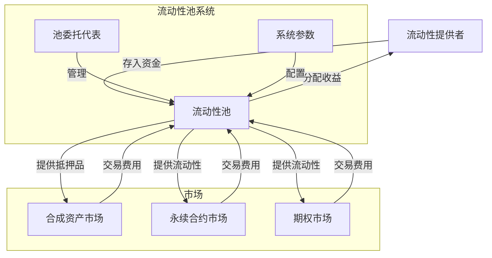
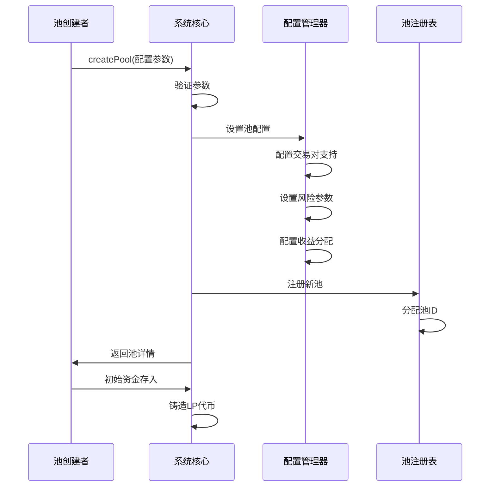
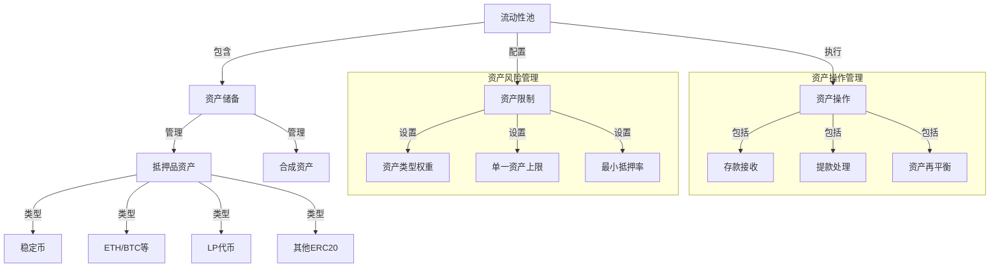
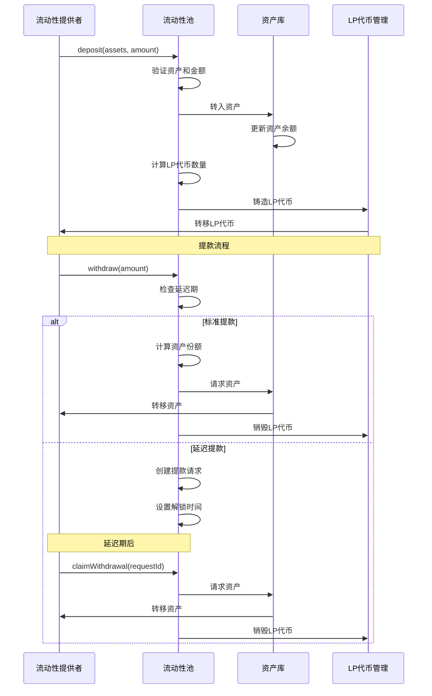
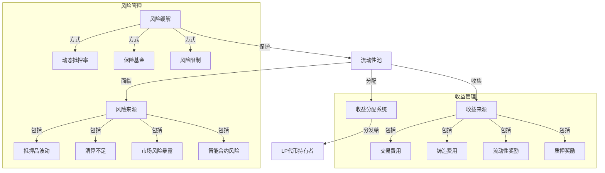
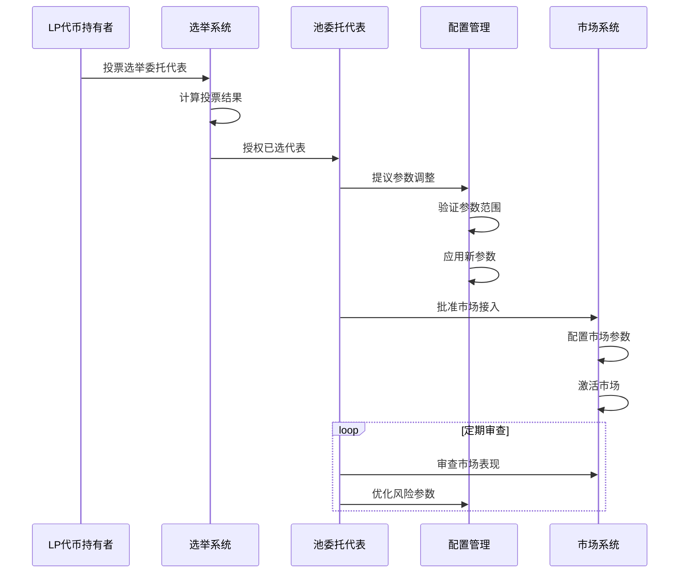
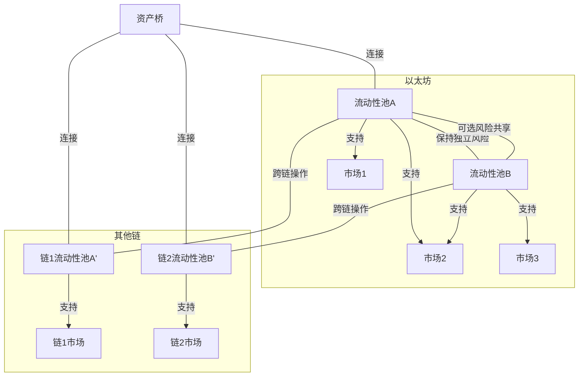
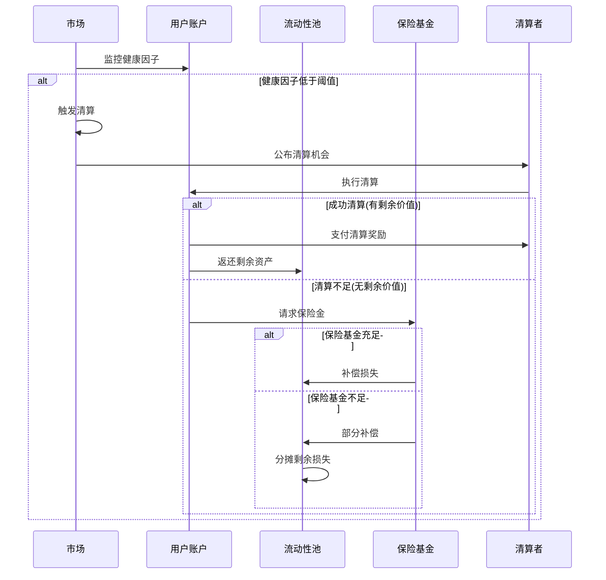

# Synthetix V3 流动性池管理机制分析

本文档详细分析Synthetix V3的流动性池管理机制，包括池结构设计、资产管理和收益分配策略。

## 目录

1. [流动性池概述](#流动性池概述)
2. [池资产管理](#池资产管理)
3. [流动性提供流程](#流动性提供流程)
4. [收益与风险机制](#收益与风险机制)
5. [池委托治理](#池委托治理)
6. [池互操作性](#池互操作性)
7. [清算与保险机制](#清算与保险机制)

## 流动性池概述

流动性池在Synthetix V3中是合成资产和衍生品市场的基础支撑，承担着提供抵押品、承担市场风险和获取交易费用收益的核心功能。

### 流动性池的角色

在Synthetix V3中，流动性池具有多重关键功能：

1. **风险资本提供者**
   - 为合成资产铸造提供抵押品
   - 为衍生品交易承担对手方风险
   - 吸收市场波动带来的系统性风险

2. **收益分配核心**
   - 收集来自各市场的费用和收益
   - 按比例分配给流动性提供者
   - 实现风险与回报的平衡

3. **系统稳定性支柱**
   - 提供系统偿付能力保障
   - 作为最后的风险承担者
   - 确保整个生态系统的财务健康

### 池类型与用途

Synthetix V3支持多种类型的流动性池，适应不同的风险偏好和市场需求：

1. **通用池(General Pool)**
   - 接受多种抵押品类型
   - 支持多种市场类型
   - 风险和收益分散

2. **专用池(Specialized Pool)**
   - 专注于特定资产类别
   - 针对特定市场提供流动性
   - 风险和收益更集中

3. **隔离池(Isolated Pool)**
   - 与其他池风险隔离
   - 用于高风险创新市场
   - 保护核心系统免受实验性功能风险

### 池创建与配置

流动性池创建流程包括以下关键步骤：

1. **初始配置**
   - 设置支持的抵押品类型
   - 配置风险参数(如杠杆限制)
   - 定义收益分配模型

2. **授权与权限**
   - 指定初始池管理者
   - 配置委托投票机制
   - 设置参数调整权限

3. **市场连接**
   - 配置支持的市场类型
   - 设置市场特定参数
   - 定义市场风险限制

## 池资产管理

流动性池的资产管理是确保系统稳定性和效率的关键环节，Synthetix V3实现了先进的多资产池管理机制。

### 多抵押品支持

Synthetix V3的流动性池支持多种抵押品类型：

1. **核心抵押品资产**
   - sUSD: 系统原生稳定币
   - ETH: 以太坊原生代币
   - wBTC: 包装比特币
   - 其他主流加密资产

2. **抵押品风险调整**
   - 根据资产波动性应用不同折扣
   - 高风险资产需要更高安全边际
   - 动态调整抵押品权重

3. **抵押品多样化策略**
   - 鼓励多元化抵押品组合
   - 设置单一资产类型上限
   - 提供抵押品多样化激励

### 资产估值与重新平衡

确保准确的资产估值和优化的资产配置：

1. **实时资产估值**
   - 通过Oracle获取最新价格
   - 考虑资产流动性折扣
   - 计算加权资产总值

2. **资产再平衡机制**
   - 定期评估资产配置
   - 当配置偏离目标时触发再平衡
   - 通过市场操作调整资产比例

3. **资产上限管理**
   - 设置各类资产接受上限
   - 防止单一资产过度集中
   - 动态调整上限以反映市场状况

## 流动性提供流程

Synthetix V3设计了安全、高效的流动性提供流程，使流动性提供者(LP)能够轻松参与系统并获取收益。

### 存款流程

流动性提供者向池中添加资金的过程：

1. **存款初始化**
   - LP选择抵押品类型和金额
   - 系统验证资产是否被接受
   - 检查是否超过资产类型上限

2. **LP代币铸造**
   - 根据存款价值计算LP代币数量
   - 考虑当前池总价值和现有LP代币供应
   - 铸造相应比例的LP代币给提供者

3. **存款确认**
   - 更新池资产余额
   - 记录LP持有份额
   - 触发存款事件通知

### 提款流程

流动性提供者从池中取回资金的过程：

1. **提款请求**
   - LP指定提款LP代币数量
   - 系统计算相应的资产份额
   - 验证池流动性是否充足

2. **延迟机制**
   - 大额提款可能需要等待延迟期
   - 延迟期基于提款规模和市场条件
   - 保护池免受突发大额提款冲击

3. **提款执行**
   - 延迟期后执行提款
   - 按当前池资产比例返还资产
   - 销毁相应数量的LP代币

### 锁定与解锁机制

Synthetix V3实现了灵活的锁定机制，平衡即时流动性和长期稳定性：

1. **可选锁定期**
   - 提供者可选择锁定LP代币以获得更高收益
   - 锁定期从短期(1个月)到长期(4年)不等
   - 锁定期越长，收益乘数越高

2. **解锁流程**
   - 锁定期满后自动解锁
   - 提供提前解锁选项，但有惩罚机制
   - 解锁后恢复标准提款流程

3. **紧急提款**
   - 特定条件下允许紧急提款
   - 收取提前提款费用
   - 限制紧急提款规模

## 收益与风险机制

Synthetix V3实现了精细的收益分配和风险管理机制，平衡流动性提供者的回报与风险。

### 收益计算方法

Synthetix V3采用多元化的收益模型：

1. **费用收益**
   - 交易费用：从市场交易中收取
   - 铸造费用：从合成资产创建中收取
   - 清算费用：从清算过程中收取
   - 其他服务费用：如提前提款费等

2. **收益计算**
   - 按LP代币持有比例分配基础收益
   - 应用锁定乘数增加长期持有者收益
   - 考虑提供抵押品类型的风险调整

3. **收益申领**
   - 实时累积收益计算
   - 支持按需申领或自动再投资
   - 提供收益历史和预测分析

### 费用分配策略

Synthetix V3实现了灵活的费用分配框架：

1. **市场费用分配**
   - 每个市场根据风险和使用情况设置不同费率
   - 费用分为协议费和LP费用
   - 支持动态费率调整

2. **利益相关者分配**
   - LP代币持有者：主要收益接收方
   - 协议国库：用于系统发展和维护
   - 保险基金：用于风险缓冲和黑天鹅事件

3. **特殊激励**
   - 流动性挖矿计划
   - 早期参与者奖励
   - 长期持有者额外收益

### 风险暴露与管理

全面的风险管理框架保护流动性提供者：

1. **风险度量标准**
   - 价值风险(VaR)计算
   - 压力测试场景
   - 历史波动分析

2. **风险限制工具**
   - 市场容量上限
   - 资产集中度限制
   - 杠杆限制和动态调整

3. **黑天鹅保护**
   - 系统性风险监控
   - 紧急干预机制
   - 市场暂停阈值

## 池委托治理

Synthetix V3实现了创新的池委托治理模型，使流动性池能够高效运作并适应市场变化。

### 池配置权限

Synthetix V3的池配置遵循分层权限模型：

1. **参数配置层级**
   - 系统级参数：由核心治理控制
   - 池级参数：由池委托代表控制
   - 市场级参数：由市场委托代表控制

2. **可配置参数**
   - 抵押品接受和权重
   - 流动性限制和条件
   - 风险参数和杠杆限制
   - 收益分配比例

3. **参数约束**
   - 设置参数变更限制
   - 实施渐进式变更要求
   - 关键参数变更延迟期

### 委托选举机制

池治理的民主化流程：

1. **委托代表选举**
   - LP代币持有者按比例投票
   - 支持直接投票和授权投票
   - 定期重新选举更新代表

2. **委托角色与责任**
   - 参数优化：调整池配置以优化性能
   - 风险管理：设置风险限制和监控
   - 市场审批：评估并批准新市场

3. **治理透明度**
   - 所有参数变更公开记录
   - 提供治理决策理由
   - 公开治理性能指标

### 市场接入控制

流动性池如何与市场互动：

1. **市场接入审批**
   - 新市场需要池委托批准才能访问池
   - 基于风险和收益评估做出决策
   - 设置市场特定的风险参数

2. **市场条件监控**
   - 持续监控已连接市场的健康状况
   - 在不利条件下调整市场参数
   - 极端情况下可暂停市场访问

3. **市场风险分散**
   - 在多个市场间分散风险
   - 设置单一市场风险上限
   - 优化市场组合以平衡风险和收益

## 池互操作性

Synthetix V3实现了创新的池互操作性功能，支持多池协作和跨链运作。

### 多池协作模型

Synthetix V3支持多种池协作模式：

1. **风险隔离模式**
   - 池之间维持完全隔离
   - 每个池独立承担风险
   - 适合风险偏好差异大的场景

2. **风险共享模式**
   - 池之间部分风险共享
   - 通过协议级保险机制连接
   - 在极端情况下提供互助

3. **专业化池协作**
   - 不同池专注于不同资产类别
   - 支持复杂产品的多池合作
   - 优化资源分配和专业化

### 跨池风险共享

实现多池环境下的风险管理：

1. **跨池风险评估**
   - 考虑池之间的相关性
   - 评估系统性风险暴露
   - 模拟多池压力场景

2. **共享保险机制**
   - 建立跨池保险基金
   - 定义风险共享条件和限制
   - 实施公平的保费结构

3. **风险信号系统**
   - 池间风险预警机制
   - 协调风险应对措施
   - 防止风险传染

### 跨链池同步

Synthetix V3的跨链池操作：

1. **跨链流动性管理**
   - 在多链上部署相关池
   - 通过消息桥协调操作
   - 维持跨链资产平衡

2. **状态同步机制**
   - 同步关键池状态信息
   - 确保跨链一致性
   - 处理跨链延迟和异常

3. **跨链风险控制**
   - 实施跨链风险限制
   - 监控跨链操作的系统风险
   - 提供跨链紧急干预能力

## 清算与保险机制

Synthetix V3实现了完善的清算和保险机制，保护流动性池免受重大损失。

### 池保险设计

Synthetix V3的多层保险机制：

1. **保险基金结构**
   - 池级保险基金：专用于特定池
   - 协议级保险基金：覆盖所有池
   - 跨链保险协议：覆盖多链部署

2. **保险基金资金来源**
   - 清算费用分成
   - 交易费用分配
   - 专用保险费
   - 协议收入分配

3. **保险触发条件**
   - 清算不足事件
   - 预言机故障导致的损失
   - 特定黑天鹅事件

### 清算与池资产变化

清算过程如何影响池资产：

1. **清算流程**
   - 市场监控用户仓位健康度
   - 健康度低于阈值时触发清算
   - 清算者平仓用户仓位

2. **池资产影响**
   - 成功清算：池收回风险暴露
   - 部分清算：池部分收回风险
   - 清算不足：池可能面临损失

3. **清算优化**
   - 早期干预机制减少完全清算
   - 分阶段清算减少市场冲击
   - 激励高效清算者参与

### 极端市场条件保障

应对极端市场的特殊机制：

1. **市场断路器**
   - 极端波动时暂停市场操作
   - 防止连锁清算和价格螺旋
   - 提供市场冷静期

2. **保证金增强**
   - 波动性增加时提高保证金要求
   - 实施动态保证金调整
   - 市场压力下强制仓位减少

3. **社会化损失分摊**
   - 当所有安全机制耗尽时的最后手段
   - 在LP之间公平分配剩余损失
   - 提供透明的损失计算和分配
