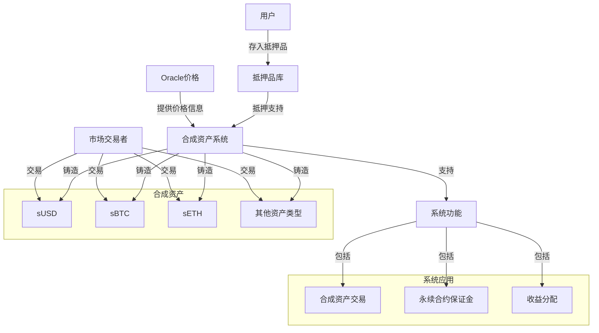
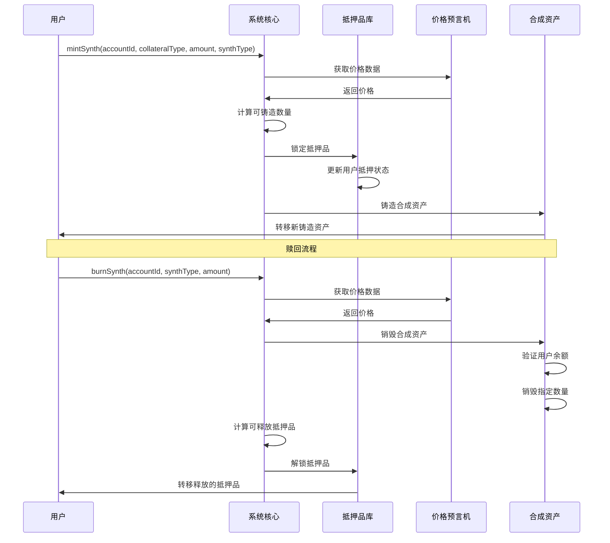
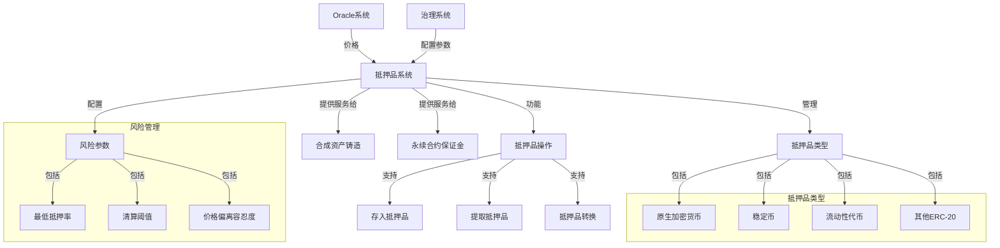
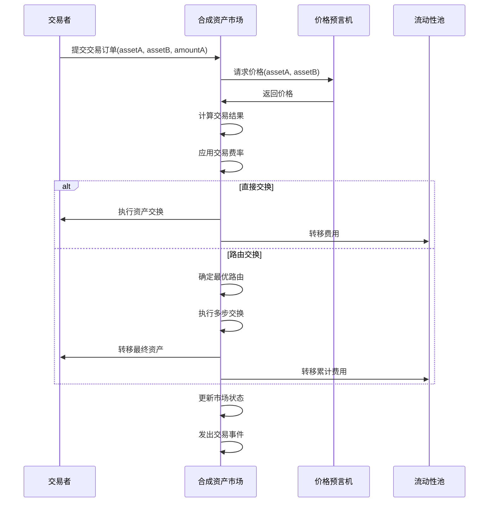
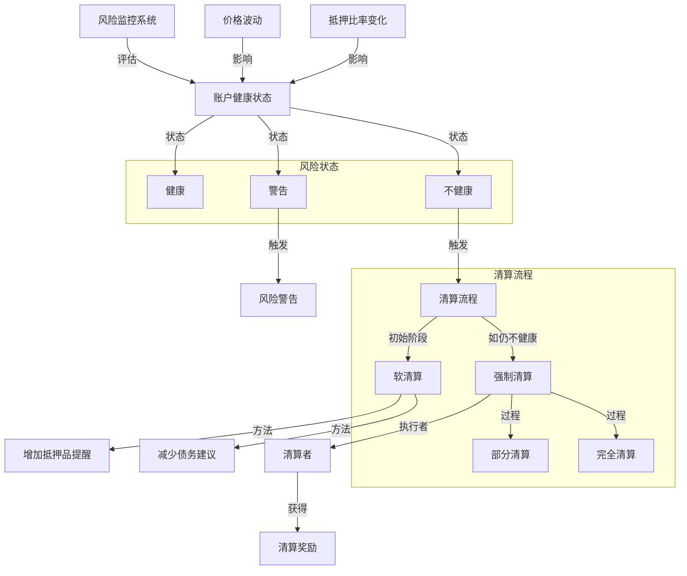
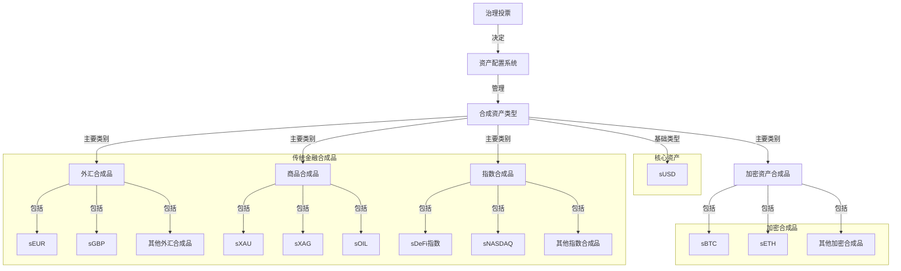

# Synthetix V3 合成资产铸造与管理分析

本文档详细分析Synthetix V3的合成资产系统，包括铸造机制、抵押品管理和市场交易流程。

## 目录

1. [合成资产概述](#合成资产概述)
2. [铸造与赎回机制](#铸造与赎回机制)
3. [抵押品管理](#抵押品管理)
4. [价格确定与市场机制](#价格确定与市场机制)
5. [风险管理与清算](#风险管理与清算)
6. [合成资产类型与配置](#合成资产类型与配置)

## 合成资产概述

Synthetix V3的合成资产(Synths)是链上代表现实世界资产价值的代币化资产，使用户能够在区块链上交易这些资产而无需实际持有它们。

### 合成资产的作用

Synthetix V3的合成资产在系统中扮演多重角色：

1. **交易媒介**
   - 提供多种资产类型的链上交易
   - 无需直接持有实际资产
   - 低滑点、高效率交易体验

2. **系统价值单位**
   - sUSD作为系统基础价值单位
   - 用于denomination所有系统价值
   - 提供稳定的计价标准

3. **衍生品基础设施**
   - 为期货和期权提供基础资产
   - 支持复杂衍生品组合
   - 无需复杂外部结算

### 合成资产系统架构

Synthetix V3合成资产系统的总体架构：

1. **模块化设计**
   - 资产核心模块：基础功能接口
   - 资产实施模块：具体资产实现
   - 市场接口模块：交易接口和机制

2. **标准化接口**
   - ERC-20兼容性
   - 价格发现接口
   - 跨模块交互接口

3. **可扩展性**
   - 自定义资产类型支持
   - 可升级实现
   - 治理控制的资产参数

## 铸造与赎回机制

Synthetix V3实现了灵活的合成资产铸造和赎回机制，支持多抵押品和多种铸造策略。

### 铸造流程

合成资产的创建过程：

1. **铸造请求**
   - 用户指定账户、抵押品类型和数量
   - 选择要铸造的合成资产类型
   - 设置可选参数（如最小接受数量）

2. **铸造计算**
   - 系统获取当前Oracle价格
   - 应用抵押率和费用
   - 计算可铸造的最大数量

3. **铸造执行**
   - 锁定用户抵押品
   - 铸造新合成资产
   - 更新用户账户状态
   - 触发铸造事件通知

### 赎回流程

销毁合成资产并释放抵押品：

1. **赎回请求**
   - 用户指定要销毁的合成资产类型和数量
   - 选择接收的抵押品类型
   - 设置可选参数（如最低接受数量）

2. **赎回计算**
   - 系统获取当前Oracle价格
   - 应用解锁费用和滑点
   - 计算可释放的抵押品数量

3. **赎回执行**
   - 销毁用户的合成资产
   - 释放对应的抵押品
   - 更新用户账户状态
   - 触发赎回事件通知

### 多抵押品铸造策略

Synthetix V3支持多种铸造策略：

1. **标准铸造**
   - 基于固定抵押率
   - 单一抵押品类型
   - 简单明确的风险模型

2. **混合抵押铸造**
   - 使用多种抵押品组合
   - 根据抵押品风险调整权重
   - 优化资本效率

3. **动态抵押率铸造**
   - 基于市场条件调整抵押率
   - 考虑资产波动性
   - 市场压力下自动增加抵押需求

## 抵押品管理

Synthetix V3实现了强大的抵押品管理系统，支持多种资产类型和风险管理策略。

### 支持的抵押品类型

Synthetix V3接受多种资产作为抵押品：

1. **核心加密资产**
   - ETH: 以太坊原生代币
   - wBTC: 包装比特币
   - 支持质押资产（如stETH）

2. **稳定币**
   - USDC、USDT: 中心化稳定币
   - DAI、LUSD: 去中心化稳定币
   - sUSD: 系统原生稳定币

3. **LP和收益资产**
   - AMM LP代币
   - 收益代币如stETH、yvTokens
   - SNX质押代币

### 抵押品风险管理

针对不同抵押品的风险控制策略：

1. **动态抵押参数**
   - 基于资产历史波动性
   - 市场压力下自动调整
   - 资产特定风险因子

2. **集中度限制**
   - 单一资产抵押上限
   - 多样化激励机制
   - 系统层面的风险分散

3. **抵押品降级策略**
   - 风险资产逐步降低接受度
   - 问题资产紧急冻结
   - 平稳过渡到新抵押品

### 抵押操作

用户管理抵押品的关键操作：

1. **抵押品存入**
   - 直接存入支持的资产
   - 批量存入多类资产
   - 指定账户和存入目的

2. **抵押品提取**
   - 基于账户健康度检查
   - 部分或全部提取
   - 紧急提取机制

3. **抵押品转换**
   - 在不同抵押品间转换
   - 优化抵押效率
   - 一站式风险调整

## 价格确定与市场机制

Synthetix V3实现了先进的价格发现和市场机制，确保合成资产准确反映其基础资产价值。

### 价格确定机制

合成资产价格的确定方式：

1. **Oracle驱动定价**
   - 使用去中心化预言机
   - 来自多个价格源的聚合
   - 防操纵机制和异常检测

2. **价格更新流程**
   - 周期性价格更新
   - 基于偏差触发的更新
   - 重要事件强制更新

3. **价格保护机制**
   - 价格有效性验证
   - 极端偏差保护
   - 价格滞后保护

### 交易执行模型

Synthetix V3的合成资产交易模型：

1. **无滑点交易**
   - 基于Oracle价格直接交换
   - 无论交易规模价格保持一致
   - 绕过传统AMM的流动性限制

2. **交易路由**
   - 支持复杂资产路径
   - 自动路由优化
   - 多步交易的原子执行

3. **费用结构**
   - 基础交易费用
   - 市场利用率动态费用
   - 特殊资产风险费用

### 流动性提供机制

流动性如何支持合成资产市场：

1. **抵押流动性支持**
   - 流动性池作为主要对手方
   - 吸收净交易敞口
   - 提供无限交易深度

2. **风险对冲机制**
   - 系统净敞口监控
   - 链上和链下对冲策略
   - 自动再平衡触发

3. **收益分配**
   - 交易费用分配给流动性提供者
   - 基于风险的收益分布
   - 去中心化收益分配算法

## 风险管理与清算

Synthetix V3实现了完善的风险管理和清算系统，确保合成资产的稳定性和可靠性。

### 风险度量与监控

合成资产风险评估与监控方法：

1. **健康因子计算**
   - 抵押品价值/合成资产债务
   - 基于资产风险调整的权重
   - 实时健康因子更新

2. **风险预警系统**
   - 多级风险阈值标记
   - 接近风险阈值时自动提醒
   - 提供风险缓解建议

3. **系统风险监控**
   - 全局债务池监控
   - 资产集中度跟踪
   - 市场异常活动监测

### 清算执行流程

不健康账户的清算步骤：

1. **清算触发**
   - 账户健康因子低于清算阈值
   - 公开清算机会
   - 清算者竞争执行清算

2. **清算流程**
   - 计算需清算的债务金额
   - 计算可清算的抵押品
   - 应用清算折扣和费用

3. **清算完成**
   - 销毁清算者提供的合成资产
   - 转移抵押品给清算者
   - 更新账户状态和系统记录

### 风险缓解策略

系统层面的风险控制措施：

1. **动态参数调整**
   - 基于市场条件调整抵押要求
   - 波动资产的特殊处理规则
   - 流动性应急调整

2. **多层次安全措施**
   - 保险基金覆盖清算不足
   - 全局清算激励调整
   - 极端情况下的市场暂停

3. **反馈机制**
   - 监控清算效率
   - 优化清算参数
   - 改进风险评估模型

## 合成资产类型与配置

Synthetix V3支持多种类型的合成资产，以满足不同的市场需求和用例。

### 核心资产类型

Synthetix V3支持的主要合成资产类型：

1. **基础稳定币**
   - sUSD: 系统核心稳定币
   - 与美元挂钩
   - 所有其他合成资产的计价基础

2. **加密资产合成品**
   - 反映主要加密货币价格
   - 支持长尾加密资产
   - 包括加密指数产品

3. **传统金融合成品**
   - 外汇合成品
   - 贵金属和商品
   - 股票和指数

### 资产配置与参数

合成资产的配置和参数管理：

1. **资产特定参数**
   - 铸造费率和限制
   - 交易费率和限制
   - 价格来源和更新频率

2. **资产精度和表示**
   - 价格精度设置
   - 最小单位定义
   - 显示格式标准

3. **资产生命周期**
   - 资产创建流程
   - 资产升级路径
   - 资产退役机制

### 扩展与自定义

Synthetix V3支持的资产扩展能力：

1. **新资产添加**
   - 治理投票新资产
   - 技术整合流程
   - 市场需求评估

2. **自定义合成资产**
   - 混合指数构建
   - 杠杆合成资产
   - 逆向(反向)合成资产

3. **资产创新**
   - 波动率合成资产
   - 收益率曲线产品
   - 自动再平衡指数
