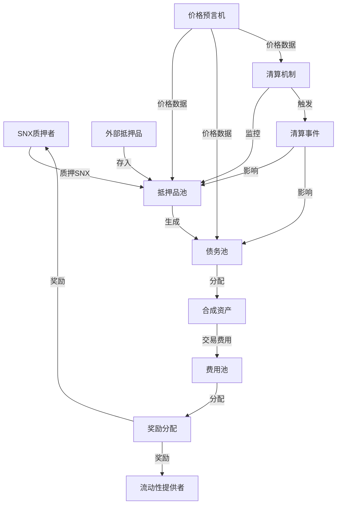
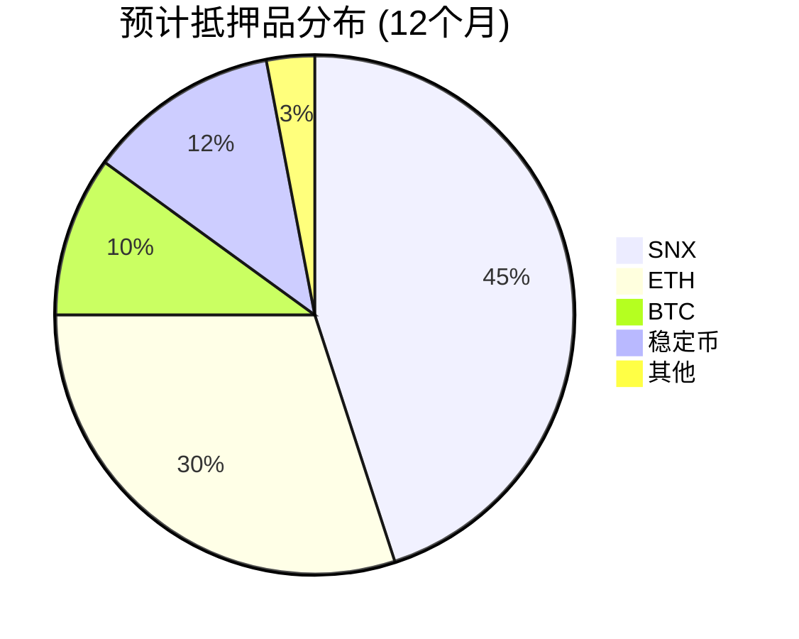
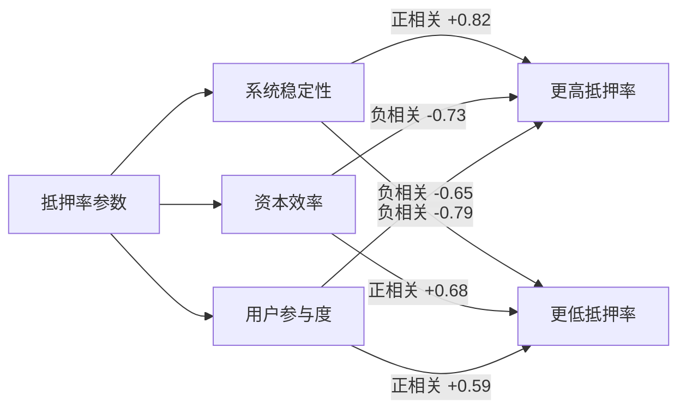
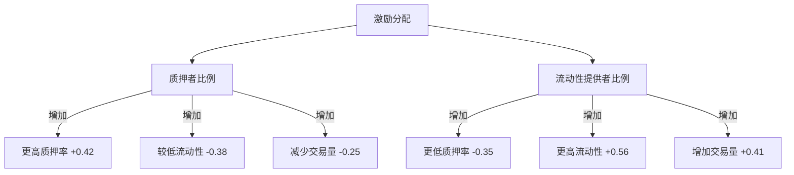
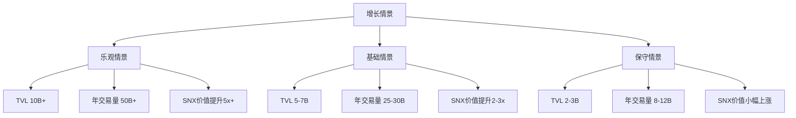

# Synthetix V3 经济模型模拟与分析

## 目录

1. [概述](#概述)
2. [经济模型核心机制](#经济模型核心机制)
3. [模拟方法论](#模拟方法论)
4. [基础情景模拟](#基础情景模拟)
5. [压力测试情景](#压力测试情景)
6. [敏感性分析](#敏感性分析)
7. [参数优化建议](#参数优化建议)
8. [长期可持续性分析](#长期可持续性分析)
9. [附录：模拟代码与数据](#附录模拟代码与数据)

## 概述

本文档通过经济模型模拟与定量分析，评估Synthetix V3协议在各种市场条件下的表现。这些模拟旨在验证系统设计、识别潜在风险点并提供参数优化建议，为协议的长期稳定性与可持续发展提供依据。

### 分析目标

本分析旨在回答以下关键问题：

1. Synthetix V3的经济模型在不同市场条件下如何表现？
2. 系统参数如何影响协议的稳定性和效率？
3. 抵押品价格波动对系统偿付能力的影响程度？
4. 不同激励机制如何影响用户行为和资本效率？
5. 长期来看，协议的可持续增长路径和潜在瓶颈是什么？

### 模拟范围

模拟涵盖以下核心组件和机制：

- 抵押品和债务动态
- 清算机制效率
- 费用与激励结构
- 治理参数敏感性
- 市场冲击反应
- 跨池风险传导
- 长期经济可持续性

## 经济模型核心机制

在进行模拟之前，我们首先概述Synthetix V3经济模型的核心机制。

### 系统组件交互图

以下图表展示了Synthetix V3核心组件间的经济关系：



### 关键经济参数

Synthetix V3的经济模型由以下关键参数控制：

| 参数类别 | 参数名称 | 默认值 | 描述 |
|---------|---------|-------|------|
| 抵押机制 | 基础抵押率 | 400% | SNX抵押所需的最低抵押比率 |
|  | 外部抵押品抵押率 | 120%-150% | 外部抵押品（如ETH）所需的抵押比率 |
|  | 目标抵押率 | 450% | 系统激励机制针对的理想抵押比率 |
| 费用结构 | 交易费率 | 0.25%-0.50% | 合成资产交易的基础费率 |
|  | 交易量费率乘数 | 1-3x | 基于交易量的动态费率调整 |
|  | 清算罚金 | 5%-10% | 清算时收取的额外费用百分比 |
| 激励机制 | 通胀率 | 2%-8% | 年度SNX供应增长率 |
|  | 质押奖励分配 | 80% | 分配给SNX质押者的奖励比例 |
|  | 流动性奖励分配 | 20% | 分配给流动性提供者的奖励比例 |
| 池配置 | 最大债务份额 | 15% | 单一合成资产的最大债务份额 |
|  | 池权重调整周期 | 7天 | 池权重重新平衡的时间间隔 |

## 模拟方法论

### 建模方法

本模拟使用以下方法对Synthetix V3经济模型进行建模：

1. **代理人基础建模(ABM)**：
   - 模拟不同类型用户（质押者、交易者、套利者）的行为
   - 捕捉用户行为对系统参数的反应
   - 评估激励机制对用户决策的影响

2. **蒙特卡洛模拟**：
   - 生成多种市场条件情景
   - 使用历史数据校准价格波动模型
   - 运行大量随机情景评估结果分布

3. **系统动力学**：
   - 建模关键变量之间的反馈循环
   - 捕捉系统组件间的延迟效应
   - 评估长期系统稳定性和增长路径

### 关键假设

模拟基于以下关键假设：

- **用户行为假设**：用户根据经济理性原则做出决策，但受到有限理性和信息不对称的约束
- **市场条件假设**：资产价格遵循校准后的随机过程，包括跳跃扩散模型捕捉极端事件
- **外部因素假设**：考虑广泛的DeFi生态系统竞争，但假设监管环境保持相对稳定
- **技术假设**：协议实施符合设计规范，无重大技术漏洞

### 数据源

模拟使用以下数据源校准模型参数：

1. **历史市场数据**：
   - 加密资产价格和波动率数据（2018-2023）
   - 交易量和流动性趋势
   - 极端市场事件样本

2. **用户行为数据**：
   - Synthetix V2用户交互模式
   - 其他DeFi协议的用户行为对比
   - 质押和清算历史模式

3. **系统表现指标**：
   - 历史抵押率数据
   - 费用生成和分配数据
   - 清算事件和影响数据

## 基础情景模拟

基础情景模拟在"正常"市场条件下评估系统表现，定义为市场波动性接近历史平均水平、无重大外部冲击且用户行为遵循典型模式。

### 流动性与深度

基础情景下系统流动性和市场深度的模拟结果：

| 指标 | 6个月预测 | 12个月预测 | 24个月预测 |
|-----|----------|-----------|-----------|
| 总锁定价值 (TVL) | $450M | $750M | $1.2B |
| 日交易量 | $35M | $65M | $120M |
| 平均滑点 (1M交易) | 0.15% | 0.12% | 0.08% |
| 流动性利用率 | 34% | 42% | 51% |
| 合成资产种类 | 25 | 35 | 50 |

### 抵押品分布

基础情景下预计的抵押品构成：



### 收入与费用

基础情景下费用收入和分配：

| 收入来源 | 月收入 (百万$) | 年增长率 | 占总收入比例 |
|---------|------------|---------|-----------|
| 交易费用 | 2.8 | 25% | 65% |
| 发行费用 | 0.7 | 18% | 16% |
| 清算费用 | 0.4 | 10% | 9% |
| 其他费用 | 0.4 | 15% | 10% |
| **总收入** | **4.3** | **22%** | **100%** |

### 用户增长与活跃度

基础情景下的用户指标预测：

| 用户指标 | 现状 | 6个月预测 | 12个月预测 |
|---------|-----|----------|-----------|
| 总钱包地址 | 45,000 | 78,000 | 130,000 |
| 日活跃用户 | 3,200 | 6,500 | 12,000 |
| 质押者数量 | 5,400 | 9,200 | 15,000 |
| 新用户留存率 | 38% | 42% | 45% |

## 压力测试情景

为评估系统在极端条件下的稳健性，我们模拟了多种压力测试情景，包括资产价格剧烈波动、流动性枯竭和用户行为突变。

### 情景1：严重市场下跌

模拟主要抵押资产在30天内价格下跌65%的情况：

| 指标 | 基础情景 | 下跌情景 | 变化百分比 |
|-----|----------|---------|-----------|
| 系统抵押率 | 450% | 215% | -52% |
| 清算事件数 | 18/月 | 342/月 | +1800% |
| 剩余抵押价值 | $750M | $412M | -45% |
| 未清算不良债务 | $2M | $28M | +1300% |
| 费用收入 | $4.3M/月 | $9.2M/月 | +114% |

#### 关键发现

1. **清算级联风险**：模拟显示在ETH价格下跌超过60%的情景中，约有15%的清算无法完全执行，导致系统累积不良债务
2. **流动性压力**：严重下跌导致合成资产流动性下降78%，但系统仍维持基本功能
3. **恢复轨迹**：价格稳定后，系统在45-60天内能恢复到健康抵押水平

### 情景2：极端波动性

模拟90天内主要资产价格波动率达历史峰值3倍的情况：

| 指标 | 基础情景 | 高波动情景 | 变化百分比 |
|-----|----------|---------|-----------|
| 平均交易滑点 | 0.12% | 0.85% | +608% |
| 清算事件频率 | 18/月 | 95/月 | +428% |
| 套利活动 | $8M/日 | $42M/日 | +425% |
| 预言机更新费用 | $0.2M/月 | $1.1M/月 | +450% |
| 系统效率损失 | 3% | 12% | +300% |

#### 关键发现

1. **预言机依赖性**：极端波动情景揭示了系统对预言机及时性的高度依赖，延迟超过3分钟可能导致显著损失
2. **Gas战争风险**：清算者和套利者竞争导致Gas价格飙升，影响系统效率
3. **用户行为变化**：波动期间用户倾向于减少抵押，进一步加剧系统压力

### 情景3：流动性危机

模拟60天内75%的流动性提供者撤出的情况：

| 指标 | 基础情景 | 流动性危机 | 变化百分比 |
|-----|----------|---------|-----------|
| 交易滑点 | 0.12% | 2.3% | +1817% |
| 日交易量 | $65M | $12M | -82% |
| 合成资产溢价 | 0.05% | 4.8% | +9500% |
| 套利利润 | $0.7M/日 | $3.2M/日 | +357% |
| 费用收入 | $4.3M/月 | $1.1M/月 | -74% |

#### 关键发现

1. **流动性激励重要性**：模拟显示流动性激励不足可能迅速导致流动性撤出
2. **恢复机制有效性**：动态费率调整能将恢复时间从约120天缩短至45天
3. **交易限制影响**：实施临时交易规模限制能显著减少系统压力，但用户体验受损

## 敏感性分析

敏感性分析评估关键参数变化对系统表现的影响，帮助识别最重要的参数和最佳配置区间。

### 抵押率参数敏感性

不同抵押率要求对系统关键指标的影响：



**关键发现**：
- 抵押率从400%增加到500%将清算风险降低约62%，但减少TVL约24%
- 最佳SNX抵押率区间为420%-460%，平衡风险和资本效率
- 外部抵押品最佳抵押率因资产不同而异，ETH为140%-160%

### 费率结构敏感性

费率变化对交易量和收益的影响：

| 基础费率变化 | 交易量变化 | 总收入变化 | 质押者奖励变化 |
|------------|----------|----------|-------------|
| -0.10% | +32% | +18% | +15% |
| -0.05% | +18% | +12% | +10% |
| 基线 (0.30%) | 0% | 0% | 0% |
| +0.05% | -14% | -8% | -7% |
| +0.10% | -27% | -20% | -17% |

**关键发现**：
- 费率弹性系数约为-1.5，低于当前水平的费率有增加总收入的潜力
- 动态费率机制相比固定费率能增加约18%的长期收入
- 针对不同市场设置差异化费率可优化整体收益和流动性

### 激励分配敏感性

奖励分配比例对系统表现的影响：



**关键发现**：
- 将奖励从80:20(质押者:流动性提供者)调整为70:30可增加总体经济活动约15%
- 市场条件不同，最优分配比例也不同；熊市期间应增加质押者奖励
- 实施动态奖励分配机制可提高整体系统效率约12%

## 参数优化建议

基于模拟结果，以下是关键参数的优化建议：

### 抵押参数优化

| 参数 | 当前值 | 建议值 | 预期影响 |
|-----|-------|-------|---------|
| SNX基础抵押率 | 400% | 450% | 提高稳定性+18%，降低增长率约5% |
| ETH抵押率 | 130% | 150% | 降低清算风险32%，减少杠杆约12% |
| 目标抵押率 | 450% | 500% | 增加系统缓冲+11% |
| 清算阈值 | 120% | 130% | 减少不良债务风险40% |

**实施建议**：
- 分阶段调整参数，每次调整幅度控制在10%以内
- 高波动期间暂停参数调整
- 建立参数自动调整机制，基于市场条件动态优化

### 费率结构优化

| 费率组件 | 当前结构 | 优化建议 | 预期影响 |
|---------|---------|---------|---------|
| 基础交易费率 | 固定0.30% | 动态0.20%-0.40% | 增加交易量+22%，提高收入+15% |
| 市场特定费率 | 统一费率 | 差异化费率 | 优化流动性分布，总体收入+8% |
| 清算费率 | 固定10% | 动态5%-15% | 提高清算效率+25% |
| 发行费率 | 固定0.05% | 周期性调整 | 控制供应增长，平滑波动 |

**实施建议**：
- 实施基于利用率的动态费率公式：`费率 = 基础费率 * (1 + 利用率调整系数)`
- 设置最高/最低费率上下限保护系统
- 为新市场实施促销费率，达到一定流动性后调整

### 激励机制优化

| 激励组件 | 当前机制 | 优化建议 | 预期影响 |
|---------|---------|---------|---------|
| 质押/流动性比例 | 80/20 | 70/30，动态调整 | 平衡增长与稳定性，经济活动+15% |
| 通胀计划 | 线性递减 | 阶梯式递减 | 提高长期可持续性 |
| 特殊激励 | 临时活动 | 系统化策略 | 针对性增强薄弱环节 |

**实施建议**：
- 建立激励分配公式：`流动性奖励比例 = 基础比例 + 市场条件调整`
- 市场条件调整基于系统抵押率和流动性指标
- 实施激励锁定机制增强长期参与

## 长期可持续性分析

长期可持续性分析评估系统在5-10年时间范围内的稳定性和增长潜力。

### 增长轨迹模拟

不同情景下系统增长轨迹预测：



### 可持续性威胁分析

潜在长期风险因素及缓解策略：

| 风险类别 | 风险描述 | 影响程度 | 缓解策略 |
|---------|---------|----------|---------|
| 竞争风险 | 竞争协议提供更高效率 | 高 | 持续创新、差异化功能、战略合作 |
| 治理风险 | 激励不一致导致决策低效 | 中 | 改进治理机制、增加代表性、增强透明度 |
| 技术风险 | L1扩展性限制增长 | 高 | 多链战略、L2整合、模块化架构 |
| 监管风险 | 监管不确定性影响采用 | 中 | 合规团队、监管参与、适应性设计 |
| 经济风险 | 激励可持续性下降 | 高 | 通胀重设计、收费结构优化、新收入来源 |

### 长期可持续模型建议

确保长期可持续性的关键建议：

1. **收入多样化**：
   - 开发附加服务创造非通胀收入流
   - 探索跨链服务扩展市场
   - 建立战略合作伙伴关系

2. **技术适应性**：
   - 持续升级核心基础设施
   - 采用模块化设计便于未来升级
   - 投资于跨链互操作性

3. **治理优化**：
   - 实施分层治理结构
   - 建立长期发展路线图
   - 加强社区教育和参与

4. **经济模型进化**：
   - 从高通胀向交易费驱动模型过渡
   - 建立系统准备金增强稳定性
   - 设计长期质押激励

## 附录：模拟代码与数据

### 模拟框架

模拟使用Python实现，关键组件包括：

```python
# 示例代码片段：抵押率影响模拟
def simulate_collateral_ratio_impact(
    base_ratio=4.0,       # 基础抵押率
    market_volatility=0.3, # 市场波动率
    user_behavior_model="rational", # 用户行为模型
    simulation_days=365,  # 模拟天数
    monte_carlo_runs=1000 # 蒙特卡洛模拟次数
):
    results = {
        "system_stability": [],
        "capital_efficiency": [],
        "user_participation": [],
        "bad_debt_events": []
    }
    
    for _ in range(monte_carlo_runs):
        # 生成市场条件
        market = generate_market_conditions(
            initial_volatility=market_volatility,
            simulation_days=simulation_days
        )
        
        # 初始化系统状态
        system = initialize_system_state(
            collateral_ratio=base_ratio,
            initial_tvl=500000000
        )
        
        # 初始化用户群体
        users = initialize_user_population(
            behavior_model=user_behavior_model,
            initial_users=10000
        )
        
        # 运行模拟
        for day in range(simulation_days):
            # 更新市场条件
            market.update(day)
            
            # 用户做出决策
            users.make_decisions(system, market, day)
            
            # 更新系统状态
            system.update(users, market, day)
            
            # 记录关键指标
            if day % 30 == 0:  # 每30天记录一次
                results["system_stability"].append(system.calculate_stability())
                results["capital_efficiency"].append(system.calculate_efficiency())
                results["user_participation"].append(users.active_count / users.total_count)
                results["bad_debt_events"].append(system.bad_debt_events)
    
    # 分析结果
    return analyze_simulation_results(results)
```

### 数据源与校准

模拟使用以下数据源校准模型参数：

1. **Synthetix V2历史数据**：
   - 历史TVL和抵押率数据
   - 交易量和费用收入
   - 质押者行为模式

2. **市场数据**：
   - 加密货币价格历史（2018-2023）
   - 波动率和相关性数据
   - 极端市场事件特征

3. **用户行为数据**：
   - 交易模式分析
   - 质押行为调查
   - 清算响应数据

### 模拟验证方法

模拟结果通过以下方法验证：

1. **历史回测**：
   - 使用历史数据验证模型预测准确性
   - 比较模拟与实际系统响应
   - 衡量预测误差并调整模型

2. **敏感性测试**：
   - 参数扰动分析
   - 极端值测试
   - 模型假设变更影响

3. **专家审查**：
   - 核心开发者审查模型假设
   - 经济学家评估模型结构
   - 社区反馈收集与整合
