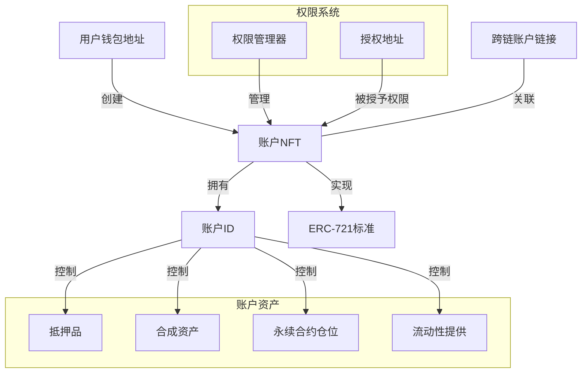
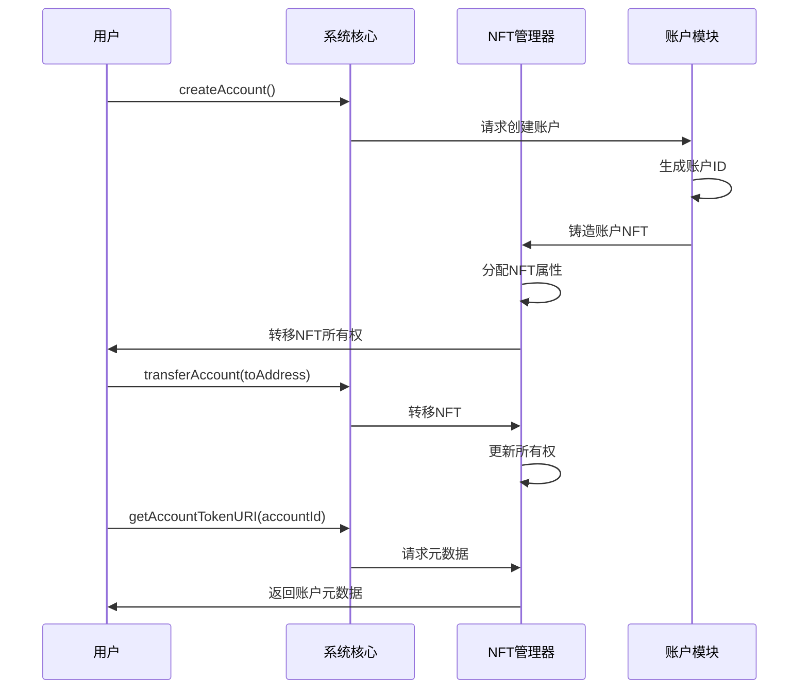
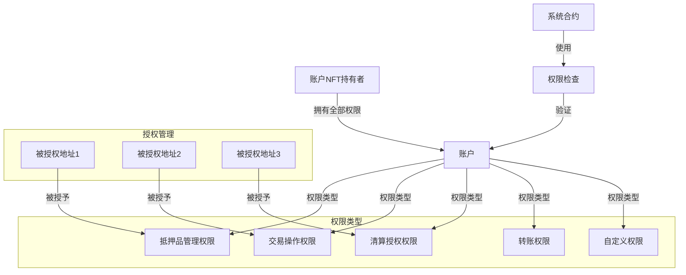
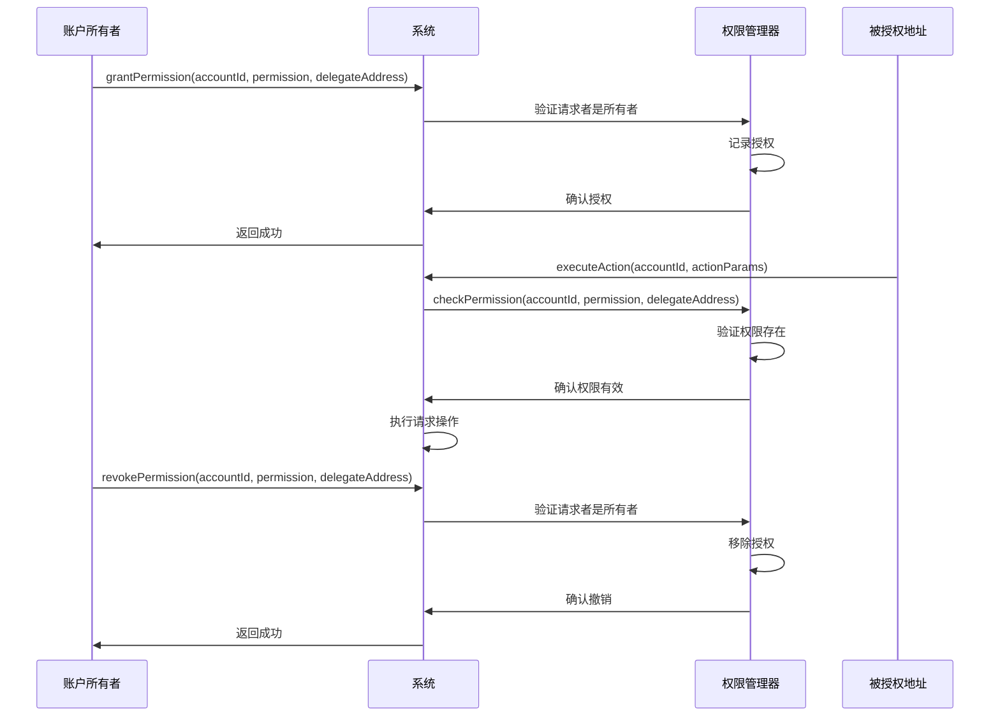
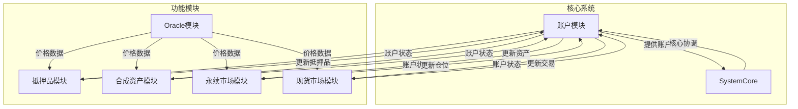
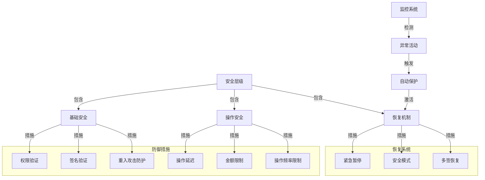

# Synthetix V3 账户系统与权限管理分析

本文档详细分析Synthetix V3的账户系统与权限管理机制,包括账户结构设计、权限控制模型和跨模块交互。

## 目录

1. [账户系统概述](#账户系统概述)
2. [NFT账户模型](#nft账户模型)
3. [权限控制系统](#权限控制系统)
4. [授权与委托机制](#授权与委托机制)
5. [跨模块账户交互](#跨模块账户交互)
6. [账户安全保障](#账户安全保障)

## 账户系统概述

Synthetix V3采用创新的NFT为基础的账户系统,与传统DeFi中常见的地址即账户模式有本质区别,提供更灵活的权限管理和更好的用户体验。

### 账户系统的核心特点

Synthetix V3账户系统具有以下关键特性:

1. **NFT为核心的账户表示**
   - 账户以NFT形式存在,遵循ERC-721标准
   - 账户所有权可通过转移NFT实现
   - 支持在NFT市场交易整个账户及其资产

2. **账户分离与隔离**
   - 用户可创建多个独立账户
   - 每个账户资产和风险隔离
   - 支持不同账户采用不同策略

3. **统一资产管理**
   - 单一账户可管理多类资产
   - 跨市场抵押品管理
   - 统一的账户健康因子计算

4. **跨链账户关联**
   - 支持跨多链关联同一账户
   - 在不同链上维护账户状态
   - 通过消息传递同步账户信息

## NFT账户模型

Synthetix V3的NFT账户模型是系统设计的重要创新,提供强大的灵活性和功能扩展性。

### 账户创建与属性

Synthetix V3的账户创建过程和关键属性:

1. **账户创建**
   - 通过`AccountModule.createAccount()`创建
   - 系统分配唯一的账户ID
   - 铸造表示账户的NFT

2. **账户标识**
   - 账户ID: 128位整数标识符
   - 账户NFT: ERC-721标准代币
   - 账户URI: 包含账户元数据

3. **账户元数据**
   - 创建时间
   - 账户类型标识
   - 自定义元数据
   - 链接到外部资源的引用

### 账户所有权管理

账户所有权控制和转移机制:

1. **所有权验证**
   - NFT持有者自动获得账户完全控制权
   - 系统操作前验证NFT所有权
   - 支持标准ERC-721所有权查询

2. **账户转移**
   - 通过转移NFT实现账户转移
   - 转移保留所有账户资产和配置
   - 支持安全转移机制

3. **多账户管理**
   - 用户可持有多个账户NFT
   - 每个账户具有独立权限配置
   - 支持批量账户操作

## 权限控制系统

Synthetix V3实现了细粒度的基于角色的访问控制(RBAC)系统,使账户权限管理更加灵活和安全。

### 权限类型与结构

Synthetix V3支持的权限类型和组织结构:

1. **核心权限类型**
   - `PERPS_MODIFY_COLLATERAL`: 修改永续合约保证金
   - `PERPS_COMMIT_ASYNC_ORDER`: 提交永续合约订单
   - `SPOT_MODIFY_COLLATERAL`: 修改现货市场保证金
   - `SPOT_EXCHANGE`: 合成资产交换
   - `ADMIN`: 账户管理操作

2. **权限标识**
   - 权限以bytes32哈希表示
   - 支持自定义权限类型
   - 系统预定义权限常量

3. **权限组织**
   - 权限可按模块分组
   - 支持权限继承关系
   - 权限冲突解决规则

### 权限验证流程

操作执行前的权限验证过程:

1. **请求验证**
   - 操作请求包含账户ID和请求者地址
   - 系统提取操作所需权限
   - 查询请求者对账户的权限

2. **验证逻辑**
   - 验证NFT所有权(所有者拥有全部权限)
   - 验证特定操作的授权权限
   - 检查权限时效性和条件

3. **验证结果**
   - 成功: 继续执行操作
   - 失败: 拒绝操作并返回错误
   - 记录权限验证事件

## 授权与委托机制

Synthetix V3实现了灵活的授权机制,允许账户所有者将特定权限委托给其他地址。

### 授权管理

账户权限的授予与撤销:

1. **授权操作**
   - `grantPermission`: 授予特定地址特定权限
   - `revokePermission`: 撤销已授予的权限
   - `hasPermission`: 查询权限状态

2. **批量授权**
   - 支持一次授予多个权限
   - 支持一次授权给多个地址
   - 批量授权事务优化

3. **授权继承**
   - 某些权限可包含子权限
   - 授予父权限自动包含子权限
   - 权限树结构简化管理

### 时效性控制

权限的时间限制和条件约束:

1. **时间绑定权限**
   - 支持设置权限有效期
   - 过期权限自动失效
   - 临时权限用于特定场景

2. **使用次数限制**
   - 可限制权限使用次数
   - 一次性权限自动失效
   - 使用计数器跟踪

3. **条件授权**
   - 基于外部条件的权限激活
   - 支持多条件组合逻辑
   - 条件验证框架

## 跨模块账户交互

账户系统与其他系统模块的交互构成了Synthetix V3的运行基础。

### 模块间账户数据访问

不同模块如何访问和更新账户数据:

1. **跨模块接口**
   - 标准化的账户数据访问接口
   - 基于权限的模块访问控制
   - 模块间调用规范

2. **数据一致性保障**
   - 原子性事务确保跨模块一致性
   - 状态锁定机制防止并发冲突
   - 版本控制机制检测更新冲突

3. **模块通信模式**
   - 直接调用: 同步模块间通信
   - 事件驱动: 异步模块通知
   - 批处理: 高效批量操作

### 账户状态聚合

整合多模块数据的账户状态视图:

1. **全局账户视图**
   - 聚合来自所有模块的账户数据
   - 计算跨模块账户健康度
   - 提供统一的账户状态查询

2. **跨市场风险评估**
   - 基于全模块数据计算风险
   - 考虑不同资产相关性
   - 提供整体风险敞口视图

3. **账户历史追踪**
   - 记录跨模块账户活动历史
   - 支持账户活动审计
   - 提供账户行为分析

## 账户安全保障

Synthetix V3实现了多层次的账户安全机制,保护用户资产和操作安全。

### 账户安全机制

保护账户免受攻击和错误操作的措施:

1. **权限隔离**
   - 最小权限原则实现
   - 敏感操作需多重验证
   - 操作权限分级控制

2. **操作保护**
   - 高风险操作需确认步骤
   - 大额交易延迟执行
   - 异常操作自动标记

3. **防篡改设计**
   - 权限变更事件公开记录
   - 授权历史不可篡改
   - 操作日志链上存储

### 账户恢复与紧急响应

应对安全事件和紧急情况的机制:

1. **紧急冻结**
   - 账户所有者可临时冻结账户
   - 可设置自动解冻条件
   - 支持模块级选择性冻结

2. **社交恢复**
   - 基于预设信任地址的恢复流程
   - 多签名恢复机制
   - 基于时间锁的渐进式恢复

3. **紧急响应协议**
   - 系统级安全事件响应
   - 可升级的安全措施
   - 硬分叉恢复选项
